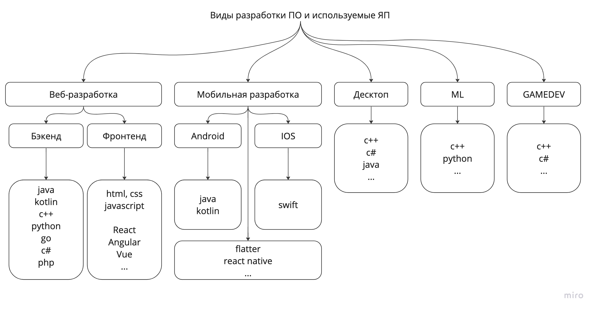
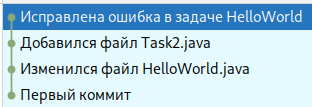

# Технологии программирования

[Назад на главную](/)

## Лекция 1. Вводная о курсе. Git. Основы Java. Codestyle

### Содержание
1. [О чем курс?](#about)
2. [Система контроля версий git](#git)
3. [SSH ключи для подключения к серверу](#ssh)
4. [Базовый синтаксис java](#java)
5. [Что такое Code Style, и почему ему стоит следовать?](#codestyle)


### О чем курс? <a name="about"></a>

- **3 семестр** - Основы java. Основы ООП. Принципы хорошего кода

- **4 семестр** - Разработка бэкенда на java

### Почему java?

Давайте попытаемся понять какое место занимает язык java в современной IT-отрасли. 
Ниже на схемке представлена попытка отразить использования языков программирования 
для тех или иных задач. Схема приблизительная, не учитывает всех существующих ЯП.



Java - активно используется для разработки бизнес-логики приложений, наиболее 
актуальное применение данного ЯП - разработка бэкенда и приложений на андроиде. 
Раньше - активно применялась для разработки десктопных приложений, но сейчас эта сфера
становится чуть менее актуальной.

### Активности в этом семестре
#### Лекции и практики

На каждом занятии проводим "опросник" - небольшая опрос по темам предыдущей лекции. Позволяет быть в тонусе.

#### Домашки
После каждой лекции (темы) выдается домашка. Некоторые домашки будут состоять из обязательной и дополнительной части.
У домашки есть два дедлайна: **мягкий** и **жесткий**

- **Мягкий дедлайн** - через 1 неделю после релиза домашки. Возможность получить комментарии к домашке и поправить ошибки.
- **Жесткий дедлайн** - через 2 недели после релиза домашки. Последняя гарантированная проверка домашки

#### Контест

В середине семестра будет контест по алгоритмам - набор алгоритмических задач, которые нужно решить и сдать в специальную систему

### Зачет

#### Как получить зачет?
- Средний балл по домашкам - 0.7 и выше
- Средний балл по опросникам - 0.5 и выше
- Контест решен на 50% и выше
- Решить задачу на зачете

#### Как получить автомат?
- Средний балл по домашкам - 0.9 и выше
- Средний балл по опросникам - 0.7 и выше
- Контест решен на 100%
- Решены дополнительные домашки


## Система контроля версий GIT <a name="git"></a>

### Что такое гит?

Git - это система контроля версий, предназначенная для хранения истории изменений и отслеживания правок в проектах.
Нужен для того, чтобы разработчики могли удобно работать над проектом, сохранять все изменения кода и совместно работать
над одним проектом в реальном времени.


### Основные термины

- **Репозиторий** — централизованное хранилище кода, где хранятся все изменения и версии проекта.

- **Commit** — коммит, фиксация. Коммит — это сохранение изменений в репозитории. Каждый коммит содержит информацию о том,
  какие файлы были изменены, а также краткое описание изменений.





### Основные термины

- **Branch** — ветка, ветвь, ветка разработки. Ветка представляет собой отдельную линию развития кода, которая позволяет
  разработчикам работать над разными функциями или улучшениями без влияния на другие ветки.
- **Pull request** — запрос на слияние, pull request. Запрос на слияние позволяет одному разработчику отправить свои
  изменения другому разработчику для проверки и возможного слияния.
- **Merge** — слияние. Слияние — это процесс объединения изменений из одной ветки в другую.
  


### Как создать репозиторий

Команда: **git init**


### Commit

Изменения в коде в репозитории “находятся” в commit-ах (фиксациях).

**Коммит хранит следующее:**

- commit message
- состояние файлов с кодом (или не только с кодом), которые попали в коммит

**Чтобы создать коммит:**

1. нужно добавить файл в репозиторий (если он еще не добавлен) - **git add** (file)
2. **git commit** + написать сообщение (commit message)


### Ветви

- Позволяют делать разные версии кода.
- Чтобы сделать новую ветвь - существует команда **checkout -b**
- Чтобы переключаться между ветвями - команда **checkout**
- Существует возможность переносить изменения из одной ветки в другую. Merge - объединение (есть еще rebase) **git merge –into-name имя ветки**


### Работа с удаленным репозиторием

- В idea - manage remotes (в идее) позволяет указать удаленные репозитории

- git push (ctrl shift k) - мы отправляем в удаленный репозиторий наши локальные коммиты


## SSH ключи для подключения к серверу <a name="ssh"></a>


### Что такое ssh-ключ?

SSH-ключ — безопасный способ соединения с сервером.

Для аутентификации используются два ключа: приватный и публичный.

Публичный ключ хранится на сервере в корневом каталоге, а приватный ключ остаётся на локальном компьютере в зашифрованном виде.

Каждый раз, когда вы обращаетесь к серверу, происходит сопоставление ключей. Поэтому для аутентификации не нужен пароль.


### Как сгенерировать?

```bash
ssh-keygen -t ed25519 -C "your_email@example.com"
> Generating public/private ALGORITHM key pair.
```

```bash
> Enter a file in which to save the key (/c/Users/YOU/.ssh/id_ALGORITHM):[Press enter]
```

```bash
> Enter passphrase (empty for no passphrase): [Type a passphrase]
> Enter same passphrase again: [Type passphrase again]
```

```bash
ssh-add ~/.ssh/id_ed25519
```


### Ссылки на инструкции

[github ssh manual](https://docs.github.com/en/authentication/connecting-to-github-with-ssh/generating-a-new-ssh-key-and-adding-it-to-the-ssh-agent?platform=windows)

[Reg Ru. Инструкция как создать ssh-ключ](https://help.reg.ru/support/servery-vps/oblachnyye-servery/rabota-s-serverom/ssh-klyuchi-dlya-oblachnykh-serverov)

## Базовый синтаксис java <a name="java"></a>

### "Точка входа" в программу

Точка запуска программы В Java, точкой запуска программы является функция public static void main(), которую необходимо создать в коде. Эта функция является точкой входа в программу, с которой начинает выполняться код.
Пример:

```java
public class Main {
    public static void main(String[] args) {
        System.out.println("Hello, World!");
    }
}
```

Здесь создается класс Main с функцией main(), которая выводит на экран строку “Hello, World!”.

### Объявление функций

Функция в Java - это блок кода, который выполняет определенную задачу и может возвращать значение. Функции могут быть 
статическими или нестатическими, с параметрами или без них, и они могут возвращать значения разных типов.

```java
class MyClass {
  public static void myMethod() {  // метод без параметров и без возврата значения
    // тело метода
  }

  public static void myOtherMethod(int a, String b) {  // метод с параметрами и возвратом значения
    return 10;
  }
}  
```

Ключевые слова в заголовке функций Java обозначают его характеристики. Вот их значения:

- **public** - метод будет доступен для вызова из любого класса. Если это слово опустить, метод будет частным и 
доступным только для других методов этого же класса.
- **static** - означает, что метод не привязан к конкретному экземпляру класса, а доступен сразу для всего класса. 
Статические методы вызываются без создания экземпляра объекта. (Об этом подробнее в лекции про ООП)
- **void** - обозначает, что метод не возвращает значения. Если нужно, чтобы метод возвращал значение, вместо void 
нужно указать тип данных, которые метод будет возвращать.
- Параметры передаются в метод через круглые скобки, где каждый параметр отделяется запятой.
Количество и порядок параметров должны совпадать в объявлении и вызове метода.
- Возврат значения осуществляется с помощью оператора return. Метод должен содержать **return**, если он возвращает значение.

### Примитивные типы данных в Java

Примитивные типы данных в Java включают:

- byte - целое число от -128 до 127
- short - короткое целое число от -32768 до 32767
- int - обычное целое число
- long - длинное целое число
- char - символ в кодировке Unicode
- float - число с плавающей запятой одинарной точности (32 бита)
- double - число с плавающей запятой двойной точности (64 бита)
- boolean - логический тип данных

Все примитивные типы являются значениями, а не ссылками на объекты.

Пример создания переменной:

```java
int a = 5; // Создаем переменную типа int и присваиваем ей значение 5
double b = 3.14; // Создаем переменную типа double и присваиваем значение 3.14
char c = 'A'; // Создаем переменную типа char и присваиваем символ 'A'
boolean d = true; // Создаем логическую переменную и присваиваем true
```

### Логическое "И" и "ИЛИ"

В Java логические операции “И” и “ИЛИ” используются для проверки нескольких условий в одном выражении.
Например, можно написать такой код:

```java
if (a == 5 && b == 10) {
   System.out.println("a == 5 и b == 10");
} else if(a == 5 || b == 10) {
   System.out.println("a == 5 или b == 10");
}
```

Здесь сначала проверяется, равны ли переменные a и b значениям 5 и 10 соответственно. Если оба условия выполняются, 
то выводится сообщение “a == 5 и b == 10”. Если хотя бы одно из условий выполняется 
(то есть если a == 5, или если b == 10), то выводится сообщение “a == 5 или b == 10”

### Условная конструкция if-else

if-else - это одна из самых простых и часто используемых условных конструкций в Java. Она позволяет выполнять разный код в зависимости от истинности или ложности некоторого условия.

Вот пример использования if-else:

```java
public class Main {
    public static void main(String[] args) {
        int a = 5;
        if (a == 42) {
            System.out.println("a равно 42");
        } else {
            System.out.println("a не равно 42");
        }
    }
}
```

В этом коде мы проверяем, равно ли значение переменной a числу 42. Если равно, то выводится соответствующее сообщение, иначе - другое сообщение.

В качестве условия можно использовать не только сравнение, но и более сложные выражения, например, вызовы методов или 
даже лямбда-выражения.
В качестве условия можно использовать любое выражение, которое возвращает boolean значение. Например, можно использовать 
результат вызова метода:

```java
if (isPrime(x)) {
    System.out.println("Число " + x + " является простым числом.");
} else {
    System.out.println("Число " + x + " не является простым числом.");
}
```

Здесь мы вызываем метод isPrime, который мы определили где-то в нашем коде, и если он возвращает true, то 
выводим сообщение о том, что число является простым, иначе выводим сообщение об обратном.

### Цикл for

Цикл for используется для повторения блока кода заданное количество раз или пока выполняется некоторое условие.
Он имеет следующий синтаксис:

```java
for (инициализация; условие; инкремент) {
    тело цикла
}
```

- Инициализация - это выражение, которое выполняется один раз перед входом в цикл.
- Условие - это логическое выражение, которое проверяется после каждой итерации цикла. Если выражение ложно, цикл завершается.
- Инкремент - это выражение, которое вычисляется после каждой итерации цикла, и определяет, как изменяется переменная цикла после каждой итерации.

```java
for (int i = 0; i < 10; i++) {
    System.out.println(i);
}
```

### Цикл foreach

В Java 8 появился цикл _forEach_, который позволяет перебирать элементы коллекции.

Цикл _forEach_ используется, когда нам нужно выполнить некоторый блок кода для каждого элемента коллекции. Он работает следующим образом:

Сначала мы указываем переменную, которая будет содержать текущий элемент коллекции. Затем мы указываем блок кода, который будет выполняться для каждого элемента.

Вот как выглядит использование цикла _forEach_:

```java
List<String> list = new ArrayList<>();
list.add("Hello");
list.add("World");

for (String s : list) {
    System.out.println(s);
}
```


## Что такое Code Style, и почему ему стоит следовать? <a name="codestyle"></a>

Code style - это набор правил, рекомендаций и соглашений, которые определяют, как должен выглядеть и быть организован 
код. Они помогают сделать код понятным, легким для чтения и поддержки.

Зачем нужен code style?

- Улучшение читаемости и понимания кода: Code style делает код более понятным и легким для чтения, так как все члены 
команды следуют одним и тем же правилам. Это снижает вероятность ошибок, связанных с непониманием кода.
- Стандартизация кода: Code style устанавливает единый стандарт написания кода, что упрощает его поддержку и изменение.
- Улучшение совместной работы: Code style помогает разработчикам работать вместе, так как они понимают, как должны 
выглядеть разные элементы кода.
- Уменьшение времени на обучение: Если в команде используется общий code style, новым членам команды проще влиться в 
процесс разработки, так как им не нужно изучать разные стили написания кода.
- Соответствие корпоративным стандартам: В некоторых компаниях есть свои корпоративные стандарты написания кода, которые
все разработчики должны соблюдать.
- Улучшение качества кода: Code style может помочь улучшить качество кода, так как он может содержать рекомендации по 
использованию более эффективных и понятных конструкций.

В нашем курсе мы будем ориентироваться на соглашение [Google Java Style Guide](https://google.github.io/styleguide/javaguide.html).
Пожалуйста, изучите его и используйте при выполнении домашек.