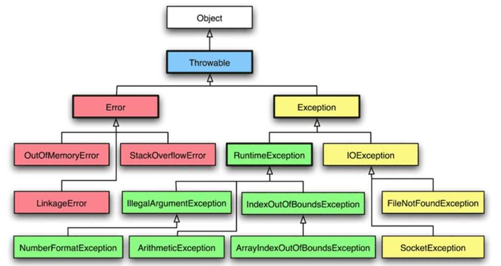

# Технологии программирования

[Назад на главную](/)

## Лекция 9. Исключения в Java. Работа с файлами.

### Исключения в Java
Исключения (Exceptions) — это механизмы обработки ошибок, которые возникают во время выполнения программы.
Исключения - это способ прерывания нормального выполнения программы.

В Java исключения делятся на два типа: проверяемые (checked) и непроверяемые (unchecked).

#### Проверяемые исключения
Проверяемые исключения требуют явного указания при использовании, и их нужно обрабатывать с помощью оператора try-catch. 
Примеры проверяемых исключений: IOException, SQLException, ClassNotFoundException и другие.

#### Непроверяемые исключения

Непроверяемые исключения не требуют явного указания, и они автоматически обрабатываются JVM. 
Примеры непроверяемых исключений: ArithmeticException, NullPointerException, ArrayIndexOutOfBoundsException и другие.

Непроверяемые исключения наследуются от класса RuntimeException.

#### Error

Error - это класс-исключение, который представляет собой критическую ошибку, приводящую к аварийному завершению приложения.
Error-исключения не обрабатываются с помощью блоков try-catch. Они используются для указания на серьезные проблемы, 
такие как сбои в памяти, нарушение безопасности и другие критические ошибки, которые не могут быть исправлены 
в рамках приложения.

- OutOfMemoryError часто появляется в тех случаях, когда программе не хватает места для создания объектов, сборщик мусора 
обработать не успевает, и как результат – OutOfMemoryError.
- StackOverflowError: выбрасывается в случаях, когда переполняется стек. Так как стек в основном хранит локальные 
переменные, параметры и вызовы методов, очень частой причиной этого является рекурсия, или рекурсивный вызов метода




Обработка исключений выполняется с помощью операторов try, catch и finally. Оператор try используется для выполнения кода, который может вызвать исключение. Оператор catch используется для обработки исключений, которые могут возникнуть в операторе try. Оператор finally выполняется независимо от того, возникло исключение или нет.

Пример использования исключений:

```
try { 
    // Блок кода, который может вызывать исключение
} catch (Exception e) { 
    System.err.println(e.getMessage()); 
} finally { 
    // Код, который должен быть выполнен независимо от того, было ли исключение
}
```

Еще пример:
```java

import java.io.IOException;
import java.util.Scanner;
import java.util.stream.Collectors;

public class ExceptionsExample {
public static void main(String[] args) {

        // Как бросить исключение:
        throw new RuntimeException("Всегда бросаю исключение, потому что могу");

        // Что делать, если после того, как бросили исключение, мы хотим продолжить работу программы?
        // Например, если мы завели какие-нибудь данные и не успели их сохранить? Или, например, мы хотим
        // получив исключения как-то осознанно об этом сообщить пользователю?
        // Для этого заиспользуем блок try-catch-finally
        
        try {
            // В блок try помещаем код, который может бросить исключение
            // Часто таким кодом может быть запрос к внешним ресурсам - файловой системе, БД, интернету
            readFile();
            // В readFile мы получаем исключение. Значит выполнение программы будет приостановлено и
            // все, что мы напишем в блоке try ниже не будет выполнено
            
        } catch (IOException e) {
            // Здесь мы можем обработать исключение - например распечатать какие-нибудь данные из него 
            // (например e.message)
        } catch (Error e) {
            System.out.println("error catched");
        }
        
        
        Scanner in = new Scanner(System.in);
        var a = in.tokens().map(String::toLowerCase).collect(Collectors.groupingBy(x -> x, Collectors.counting()));

    }

    
    // Здесь мы должны указать в заголовке функции 'throws IOException',
    // тк IOException не является RuntimeException и значит мы должны явно указывать, что метод 
    // может бросить соответствующее исключение
    private static void readFile() throws IOException {
        throw new IOException();
    }
}
```

###  Работа с файлами и каталогами
Работа с файлами и каталогами в Java осуществляется с помощью классов из пакета `java.io`.
Класс File из модуля java.nio.file используется для работы с файлами и директориями в Java. 
Он предоставляет различные методы для выполнения операций над файлами.

Основные методы класса File:

- exists(): Проверяет, существует ли файл.
- isDirectory(): Проверяет, является ли файл директорией.
- createNewFile(): Создает новый файл, если он не существует.
- delete(): Удаляет файл.
- renameTo(File dest): Переименовывает файл в другой файл.
- list(): Возвращает список файлов и директорий в директории.
- getPath(): Возвращает путь к файлу.
- getAbsolutePath(): Возвращает абсолютный путь к файлу (начинается с корня файловой системы).
- toURI(): Преобразует файл в URI.
- getParent(): Возвращает родительскую директорию для данного файла.
- mkdir(): Cоздает новый каталог и при удачном создании возвращает значение true

Пример:

```java
class Test {
    public static void main(String[] args) {
        File dir = new File("C://SomeDir");
        // если объект представляет каталог
        if (dir.isDirectory())
        {
            // получаем все вложенные объекты в каталоге
            for(File item : dir.listFiles()){

                if(item.isDirectory()){

                    System.out.println(item.getName() + "  \t folder");
                }
                else{

                    System.out.println(item.getName() + "\t file");
                }
            }
        }
    }
}
```
.
Еще несколько операций:

```java
class Test {
    public static void main(String[] args) {
        // определяем объект для каталога
        File dir = new File("C://SomeDir//NewDir");
        boolean created = dir.mkdir();
        if(created)
            System.out.println("Folder has been created");
        // переименуем каталог
        File newDir = new File("C://SomeDir//NewDirRenamed");
        dir.renameTo(newDir);
        // удалим каталог
        boolean deleted = newDir.delete();
        if(deleted)
            System.out.println("Folder has been deleted");
    }
}
```

### 

В языке программирования Java, основная функциональность работы с потоковой передачей сосредоточена в классах, 
находящихся в пакете java.io.

Поток в данном контексте - это абстракция, которая используется для считывания или записи информации. Под информацией 
подразумеваются файлы, сетевые сокеты, консоль и другие источники и приемники данных. Работа потока с физическим 
устройством осуществляется через систему ввода-вывода в Java.

Объект, из которого можно считать данные, называется потоком ввода, а объект, в который можно записывать данные,- 
потоком вывода. Например, если надо считать содержание файла, то применяется поток ввода, а если надо записать в файл - 
то поток вывода.

Основные классы:

**InputStream** - это абстрактный класс в Java, который представляет собой поток данных, предназначенный для чтения. 
Он используется для чтения данных из различных источников, таких как файлы, сети, базы данных и т.д. 
Этот класс предоставляет методы для чтения байтов из потока, а также для определения размера данных в потоке.

**OutputStream** - это другой абстрактный класс, который предназначен для записи данных в поток. 
Он также используется для различных источников вывода, таких как файлы, сеть и т.д. Он предоставляет методы для записи 
байтовых массивов в поток, а также для сброса данных в потоке.

Reader и Writer являются двумя важными абстрактными классами в Java. Они используются для чтения и записи данных 
соответственно и предоставляют общий интерфейс для работы с различными форматами и кодировками.

**Класс Reader** используется для чтения входных данных, таких как строки, байтовые массивы или символы из различных 
источников, таких как файлы, консоли или сетевые сокеты. Он предоставляет метод read(), который считывает один символ 
из входного потока и возвращает его код ASCII.

**Класс Writer** используется для записи выходных данных в различные приемники, такие как файлы, 
консоли или сети. Он предоставляет метод write(), который записывает один символ в выходной поток и принимает его 
код ASCII в качестве аргумента.


#### Класс InputStream
Класс InputStream является базовым для всех классов, управляющих байтовыми потоками ввода. 
Рассмотрим его основные методы:

- int available(): возвращает количество байтов, доступных для чтения в потоке

- void close(): закрывает поток

- int read(): возвращает целочисленное представление следующего байта в потоке. Когда в потоке не останется доступных 
для чтения байтов, данный метод возвратит число -1

- int read(byte[] buffer): считывает байты из потока в массив buffer. После чтения возвращает число считанных байтов. 
Если ни одного байта не было считано, то возвращается число -1

- int read(byte[] buffer, int offset, int length): считывает некоторое количество байтов, равное length, из потока 
в массив buffer. При этом считанные байты помещаются в массиве, начиная со смещения offset, то есть с элемента 
buffer[offset]. Метод возвращает число успешно прочитанных байтов.

- long skip(long number): пропускает в потоке при чтении некоторое количество байт, которое равно number

#### Класс OutputStream
Класс OutputStream является базовым классом для всех классов, которые работают с бинарными потоками записи. 
Свою функциональность он реализует через следующие методы:

- **void close()**: закрывает поток

- **void flush()**: очищает буфер вывода, записывая все его содержимое

- **void write(int b)**: записывает в выходной поток один байт, который представлен целочисленным параметром b

- **void write(byte[] buffer)**: записывает в выходной поток массив байтов buffer.

- **void write(byte[] buffer, int offset, int length)**: записывает в выходной поток некоторое число байтов, равное length, 
из массива buffer, начиная со смещения offset, то есть с элемента buffer[offset].

#### Абстрактный класс Reader 
Предоставляет функционал для чтения текстовой информации. Рассмотрим его основные методы:

- **absract void close()**: закрывает поток ввода

- **int read()**: возвращает целочисленное представление следующего символа в потоке. Если таких символов нет, и достигнут конец файла, то возвращается число -1

- **int read(char[] buffer)**: считывает в массив buffer из потока символы, количество которых равно длине массива buffer. Возвращает количество успешно считанных символов. При достижении конца файла возвращает -1

- **int read(CharBuffer buffer)**: считывает в объект CharBuffer из потока символы. Возвращает количество успешно считанных символов. При достижении конца файла возвращает -1

- **absract int read(char[] buffer, int offset, int count)**: считывает в массив buffer, начиная со смещения offset, из потока символы, количество которых равно count

- **long skip(long count)**: пропускает количество символов, равное count. Возвращает число успешно пропущенных символов

#### Класс Writer 
Определяет функционал для всех символьных потоков вывода. Его основные методы:

- **Writer append(char c)**: добавляет в конец выходного потока символ c. Возвращает объект Writer

- **Writer append(CharSequence chars)**: добавляет в конец выходного потока набор символов chars. Возвращает объект Writer

- **abstract void close()**: закрывает поток

- **abstract void flush()**: очищает буферы потока

- **void write(int c)**: записывает в поток один символ, который имеет целочисленное представление

- **void write(char[] buffer)**: записывает в поток массив символов

- **absract void write(char[] buffer, int off, int len)** : записывает в поток только несколько символов из массива buffer. 
Причем количество символов равно len, а отбор символов из массива начинается с индекса off

- **void write(String str)**: записывает в поток строку

- **void write(String str, int off, int len)**: записывает в поток из строки некоторое количество символов, которое равно 
len, причем отбор символов из строки начинается с индекса off


#### BufferedReader и BufferedWriter
BufferedReader и BufferedWriter используются для улучшения производительности при чтении и записи больших объемов данных. 
Они кэшируют данные в памяти, уменьшая количество обращений к диску или другому источнику данных.

```java
import java.io.BufferedWriter;
import java.io.FileWriter;
import java.io.IOException;

public class Main {
    public static void main(String[] args) throws IOException {
        String filename = "test.txt";
        try (BufferedWriter bw = new BufferedWriter(new FileWriter(filename));) {
            bw.write("Hello, World!");
        }
    }
}
```

Здесь мы создаем BufferedWriter, который использует FileWriter для записи в файл. Мы используем try-with-resources, 
чтобы обеспечить автоматическое закрытие файла, когда он больше не нужен.

Пример использования BufferedReader:

```java
import java.io.BufferedReader;
import java.io.FileReader;
import java.io.IOException;

public class Main {
    public static void main(String[] args) throws IOException {
        BufferedReader reader = new BufferedReader(new FileReader("file.txt"));
        String line;
        while ((line = reader.readLine()) != null) {
            System.out.println(line);
        }
        reader.close();
    }
}
```

#### Scanner
Класс Scanner используется для чтения входных данных, которые могут быть введены пользователем, считаны из файла или 
получены из другого источника. Он предоставляет методы для чтения различных типов данных, таких как строки, 
числа и символы. Класс Scanner также позволяет настроить формат ввода, например, указать разделитель для строк или 
точность для чисел

Scanner может использоваться для чтения ввода из различных источников, включая файлы. Вот пример использования Scanner 
для чтения данных из файла:

```java
import java.util.Scanner;
import java.io.File;
import java.io.IOException;

public class Main {
    public static void main(String[] args) throws IOException {
        File file = new File("test.txt");
        Scanner scanner = new Scanner(file);
        while (scanner.hasNextLine()) {
            String line = scanner.nextLine();
            // обработка строки line
        }
        scanner.close();
    }
}
```

Этот код открывает файл test.txt и читает каждую строку с помощью Scanner. Метод hasNextLine() проверяет, есть ли еще 
строки для чтения, а метод nextLine() считывает следующую строку. После обработки всех строк файл закрывается с помощью 
метода close().

Отличие Scanner от BufferedReader заключается в том, что Scanner предназначен для чтения различных типов входных данных 
(числа, строки, символы), а BufferedReader предназначен только для чтения текстовых данных. Кроме того, Scanner имеет 
более богатый набор методов для обработки входных данных, таких как преобразование строк в числа и наоборот.

Основные методы в Scanner:

- hasNext() - проверяет, есть ли ещё элементы для чтения.
- next() - считывает следующий элемент.
- nextInt() - считывает следующее целое число.
- nextLong() - считывает следующее длинное целое число.
- nextDouble() - считывает следующее число с плавающей точкой.
- nextLine() - считывает следующую строку.

Эти методы позволяют считывать различные типы данных, такие как целые числа, длинные целые числа, числа с плавающей 
точкой и строки.


### Работа с JSON.
JSON — это простой формат для хранения и отправки данных на веб-страницу.

JSON — это аббревиатура от “JavaScript Object Notation” (Обозначение Объектов JavaScript).
С помощью JSON можно отправлять данные с сервера на веб-страницу.
- JSON — это текстовый файл, поэтому его можно легко передавать.
- JSON не зависит от конкретного языка.

```json
{
  "name": "yandex",
  "id": 0
}

```

Особенности:
- Простой
- Имеет независимую платформу
- Легко передать
- Поддерживает расширяемость
- Наличие совместимости

Есть несколько подходов к работе с json в Java:
- Парсить json (например, используя API Json Simple)
- Сериализовать / десериализовать объекты (Jackson, gson)

### Json Simple

Конечно нам потребуется зависимость в gradle-файле (maven)
```groovy
implementation 'com.googlecode.json-simple:json-simple:1.1'
```

Мы будем работать с 2-мя основным классами:
- JSONObject
- JSONArray

```java
class Temp {
    public static String buildWeatherJson() {
        JSONObject jsonObject = new JSONObject();
        jsonObject.put("name", "Yandex");
        jsonObject.put("id", "0");

        return jsonObject.toJSONString();
    }

    public static void parseCurrentWeatherJson(String resultJson) {
        try {
            // конвертируем строку с Json в JSONObject для дальнейшего его парсинга
            JSONObject companyJsonObject = (JSONObject) JSONValue.parseWithException(resultJson);

            // получаем название города, для которого смотрим погоду
            System.out.println("Название компании: " + companyJsonObject.get("name"));

            // получаем массив элементов для поля weather
            /* ... "weather": [
            {
                "id": 500,
                    "main": "Rain",
                    "description": "light rain",
                    "icon": "10d"
            }
            ], ... */
            JSONArray weatherArray = (JSONArray) weatherJsonObject.get("weather");
            // достаем из массива первый элемент
            JSONObject weatherData = (JSONObject) weatherArray.get(0);

            // печатаем текущую погоду в консоль
            System.out.println("Погода на данный момент: " + weatherData.get("main"));
            // и описание к ней
            System.out.println("Более детальное описание погоды: " + weatherData.get("description"));

        } catch (org.json.simple.parser.ParseException e) {
            e.printStackTrace();
        }
    }
}
```

## Jackson


```groovy
implementation 'com.fasterxml.jackson.core:jackson-core:2.10.1'
implementation 'com.fasterxml.jackson.core:jackson-annotations:2.10.1'
implementation 'com.fasterxml.jackson.core:jackson-databind:2.10.1'
```


```java
@Getter
@AllArgsConstructor
@NoArgsConstructor
public class Employee {
    private String firstName;
    private String lastName;
    private int age;
}

public class JacksonExample {
    static ObjectMapper objectMapper = new ObjectMapper();

    public static void main(String[] args) {
        Employee employee = new Employee("Mark", "James", 20);

        try {
            String json = objectMapper.writeValueAsString(employee);
            System.out.println(json);
        } catch (JsonProcessingException e) {
            throw new RuntimeException();
        }

        try {
            Employee employee1 = objectMapper.readValue(employeeJson, Employee.class);
            System.out.println(employee.getFirstName());
            System.out.println(employee.getLastName());
            System.out.println(employee.getAge());
        } catch (JsonProcessingException e) {
            throw new RuntimeException(e);
        }
    }
}

```

Иногда документ JSON представляет собой не объект, а список объектов. Давайте посмотрим, как можно его прочитать.
```java
class Temp {
    public static void main(String[] args) {
        File file = new File("src/test/resources/employeeList.json");
        List<Employee> employeeList = objectMapper.readValue(file, new TypeReference<>(){});

        assertThat(employeeList).hasSize(2);
        assertThat(employeeList.get(0).getAge()).isEqualTo(33);
        assertThat(employeeList.get(0).getLastName()).isEqualTo("Simpson");
        assertThat(employeeList.get(0).getFirstName()).isEqualTo("Marge");
    }
}
```

https://habr.com/ru/company/otus/blog/687004/


У Jackson есть свои аннотации:
@JsonSetter
@JsonGetter
@JsonIgnore

@JsonAnySetter

```java
public class Car {  
    @JsonSetter("car_brand")  
    private String carBrand;  
    private Map<String, String> unrecognizedFields = new HashMap<>();  
  
    @JsonAnySetter  
    public void allSetter(String fieldName, String fieldValue) {  
        unrecognizedFields.put(fieldName, fieldValue);  
    }  
}
```

### Полезные ссылки

[Статья про потоки ввода и вывода](https://metanit.com/java/tutorial/6.1.php)
[Статья про BufferedReader и BufferedWriter](https://metanit.com/java/tutorial/6.9.php)