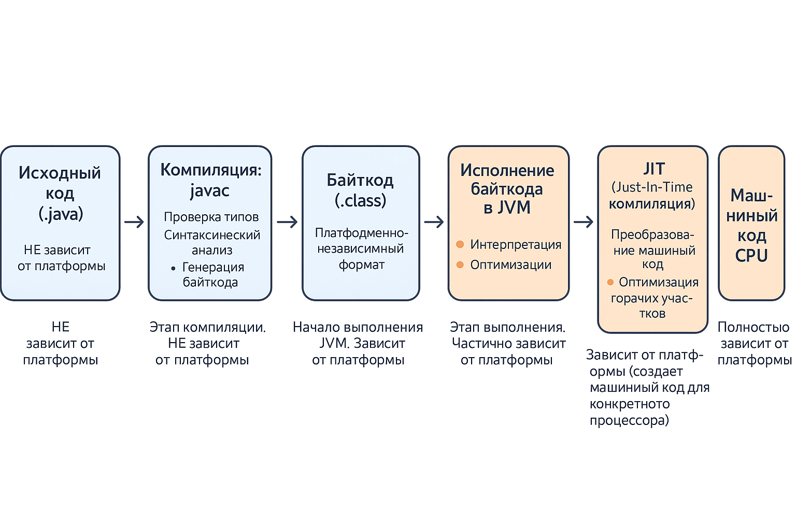
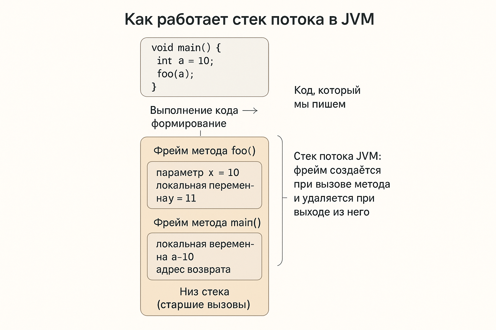
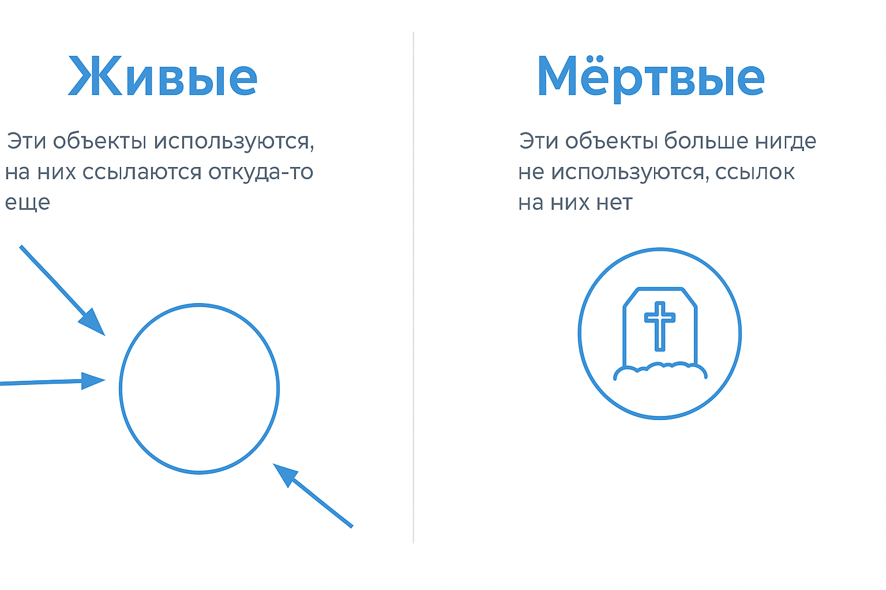
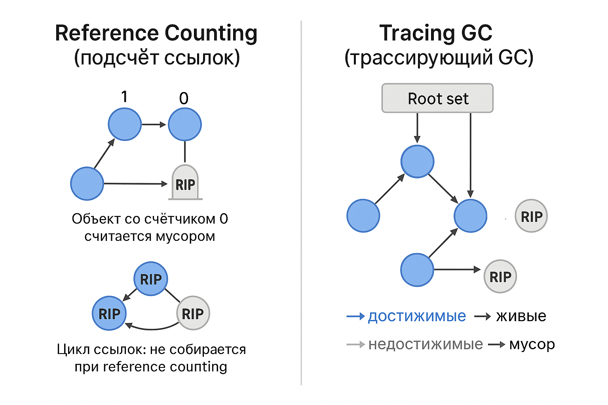
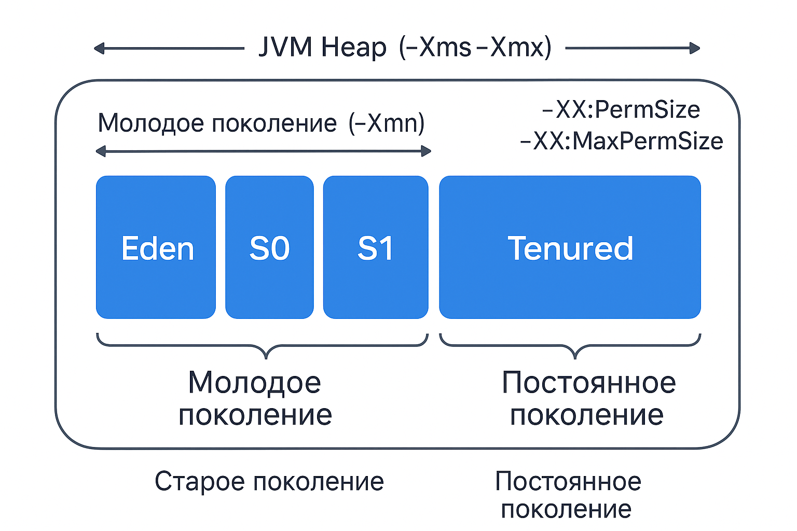
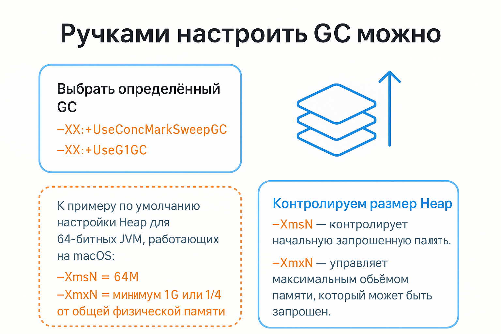

# Технологии программирования

[Назад на главную](/)

## Лекция 10. Компиляция Java-программы, устройство памяти JVM и Garbage Collector

# **1. Как Java-компилятор превращает код в программу**

## **1.1. Основной путь выполнения Java-программы**




### **Ключевые понятия**

* **javac** — компилятор, превращает Java-код в *байткод*.
* **class-файл** — бинарный файл со структурой, понятной JVM.
* **JVM** — виртуальная машина, интерпретирует и оптимизирует байткод.
* **JIT (Just-In-Time)** — компилирует часто выполняемый байткод в машинный код, ускоряя программу.

---

## **1.1. Что делает javac**

`javac` — это **компилятор Java**, он:

* анализирует синтаксис и структуры кода;
* проверяет типы и корректность обращений;
* создаёт `.class` файлы, содержащие **байткод**

Байткод — это инструкции виртуальной машины Java, независимые от платформы. Поэтому один и тот же `.class` работает и на Windows, и на Linux, и на macOS.

--- 

## **1.2. Что содержит `.class` файл (без глубоких деталей)**

`.class` содержит:

* magic number (0xCAFEBABE)
* версию байткода
* constant pool (строки, числа, ссылки на методы/классы)
* описания полей/методов
* байткод методов

Важно:
**constant pool** — причина многих ошибок типа:

* `java.lang.NoSuchMethodError`
* `java.lang.IncompatibleClassChangeError`

Эти ошибки возникают, когда байткод не совпадает с реальным классом.


---


# **2. Как устроена память JVM**

Java работает на *виртуальной машине*, у которой есть своё представление о памяти.

---

# **2.1. Организация памяти в JVM**


---

# **2.2. Thread Stack (Стек)**

Стек — это структура данных, создаваемая *для каждого потока*.




### Содержит:

* фреймы вызовов методов
* примитивы (`int`, `double`, `boolean`)
* ссылки на объекты в heap
* локальные переменные
* return адреса

### Характеристики:

* размер ограничен
* работает по принципу LIFO
* быстрый доступ

### Ошибки:

* **StackOverflowError** — бесконечная рекурсия или слишком глубокие вызовы.
* **OutOfMemoryError: unable to create new native thread** — слишком много потоков → под каждый нужен новый стек.

---

# **2.3. Heap (Куча)** — центральная область

Heap — здесь живут *все объекты*.

## Структура heap:

```
Young Generation:
+---------+---------+--------+
|  Eden   |   S0    |   S1   |
+---------+---------+--------+

Old Generation:
+----------------------------------+
|        Old Generation            |
+----------------------------------+
```

---

## **2.3.1. Young Generation**

### Eden

* сюда попадают **все новые объекты**
* быстрые аллокации через TLAB (Thread-Local Allocation Buffer)

### Survivor spaces (S0 / S1)

* объекты, пережившие одну “молодую” сборку, перемещаются между S0 ↔ S1
* когда объект живёт достаточно долго → переносится в Old Gen

---

## **2.3.2. Old Generation**

Хранятся объекты, живущие долго:

* кеши,
* singletons,
* структуры, созданные при старте приложения,
* сессии,
* крупные коллекции.


# **3. Как работает Garbage Collector**

GC — механизм автоматического освобождения памяти.

---

# **3.1. Почему GC нужен**

Java использует модель **managed memory**: разработчик НЕ освобождает память вручную.

GC делает:

* выявляет, какие объекты “живые”
* удаляет “мёртвые” объекты
* может перемещать объекты для оптимизации

---

# **3.2. Основная идея: reachability (достижимость)**

Объект считается живым, если до него можно добраться из "root-переменных":




Если нет пути — объект мёртв → удаляется.

---

# **3.3. Способы определения «живых» и «неживых» объектов**

В системах автоматического управления памятью существует два основных подхода к определению того, должен ли объект продолжать существовать в памяти: **reference counting** и **tracing (трассирующие GC)**.

### **Reference Counting (подсчёт ссылок)**

Каждый объект хранит счётчик ссылок — сколько других объектов или переменных на него указывают. Когда счётчик увеличивается, объект считается используемым; когда счётчик падает до нуля, объект объявляется мусором и может быть удалён немедленно. Метод прост и понятен, но имеет критический недостаток: он *не умеет собирать циклические структуры*. Если два объекта ссылаются друг на друга, но больше недостижимы из программы, их счётчики всё равно будут ≥1, поэтому они никогда не будут очищены.

### **Tracing GC (трассирующие сборщики мусора)**

Современные JVM используют именно трассирующие сборщики. Они не считают ссылки — вместо этого GC определяет, какие объекты **достижимы** из корневого множества (root set): локальных переменных потоков, статических полей, активных стэков вызовов и т. д. Алгоритм обходит граф объектов, помечает все достижимые как «живые», а всё остальное автоматически считается мусором. Такой подход корректно обрабатывает циклы, потому что важна не величина счётчиков, а возможность добраться до объекта из работающей программы.




### **Итог**

Reference counting подходит для простых систем, но плохо работает с реальными графами объектов. Трассирующие GC сложнее, но они надёжно определяют живые и мёртвые объекты даже при циклических зависимостях. Именно поэтому HotSpot (и большинство современных виртуальных машин) используют **только tracing-подходы**.


# **3.4. Алгоритмы сборки**

## Как объекты переходят между областями хипа

Когда программа создаёт новый объект через new, он сначала размещается в области Eden — это часть Young Generation, предназначенная для короткоживущих объектов. Молодое поколение оптимизировано под частые и быстрые сборки мусора, поэтому большая часть объектов удаляется уже при первом Minor GC.


Если объект переживает одну молодую сборку, он перемещается из Eden в один из Survivor-пространств — обычно S0. При следующем Minor GC объекты, которые остаются достижимыми, копируются из S0 в S1, затем снова обратно, чередуясь. Каждый такой “переход” увеличивает возраст объекта. Когда объект достигает заданного порога возраста (tenuring threshold), JVM считает его достаточно “долгоживущим” и принимает решение переместить его в Tenured / Old Generation.


Old Generation предназначена для объектов, живущих долго: больших коллекций, кешей, состояний приложений. Сборка мусора здесь происходит значительно реже, но и стоит дороже: это Major GC.


На схеме справа также показана область PermGen — ранее она использовалась для хранения метаданных классов и статической информации. В современных JVM (начиная с Java 8) PermGen больше не существует, и её заменяет Metaspace, который живёт вне основного хипа.




Таким образом, жизненный путь объекта выглядит так:
Eden → Survivor (S0/S1 ↔) → Tenured,
и только если объект достигаем и живёт достаточно долго. Большинство же объектов умирает уже в Eden и никогда не попадает в старшее поколение.

## **3.4.1. Minor GC**

Работает только в Young Generation.

Этапы:

1. Stop-the-world
2. Определение живых объектов
3. Копирование живых в Survivor (S0/S1)
4. Eden очищается

Происходит часто, быстро.

---

## **3.4.2. Major / Full GC**

Работает с Old Generation.

* дороже по времени
* может быть stop-the-world
* может вызвать лаги в приложении

---

## Что такое Stop-the-World

Stop-the-World (STW) — это момент, когда JVM полностью останавливает выполнение всех пользовательских потоков, чтобы выполнить работу по сборке мусора или другие внутренние операции. Во время STW-паузы приложение не может выполнять никакую бизнес-логику: оно “заморожено”, пока GC получает полный контроль над памятью.


STW необходим для корректности: сборщик мусора должен видеть память в консистентном состоянии, без изменения ссылок со стороны работающих потоков. Разные GC минимизируют паузы по-разному: 


Serial выполняет почти всю работу в STW, Parallel делает то же самое, но параллельно; 


CMS и G1 стараются переносить часть работы “впереди” и выполнять её конкурентно, оставляя только короткие фазы STW для начальной маркировки, финализации корневого множества и слияния данных.


# **4. G1 GC — современный сборщик**

G1 — дефолтный GC в большинстве конфигураций JVM (начиная с Java 9).

### Особенности:

* Heap разделён на множество маленьких **регионов**
* Есть:

    * Young GC
    * Mixed GC (частично чистит Old Gen)
* Предсказуемые паузы
* Сборка работает параллельно

Схема:

```
Heap:
+---+---+---+---+---+---+
|RG1|RG2|RG3|RG4|RG5|RG6|
+---+---+---+---+---+---+
Young GC работает в молодых регионах,
Mixed GC — частично чистит старые.
```

---

# **Как можно повлиять на работу сборщика мусора (GC)**

JVM позволяет довольно гибко настраивать поведение сборщика мусора в зависимости от задач приложения: от минимизации пауз до увеличения пропускной способности. Во-первых, мы можем явно выбрать конкретный GC. Например:

* `-XX:+UseConcMarkSweepGC` — устаревший CMS с минимизацией пауз;
* `-XX:+UseG1GC` — современный дефолтный сборщик с предсказуемыми паузами.

Во-вторых, на поведение GC существенно влияет **размер доступной памяти**, особенно размеры heap и Young Generation. Ключевые параметры:

* `-XmsN` — устанавливает *начальный* размер heap при старте JVM. Если задать `-Xms` равным `-Xmx`, вы избегаете затрат на динамическое расширение памяти.
* `-XmxN` — ограничивает *максимальный* размер heap. Если память исчерпана, GC будет срабатывать чаще, а при нехватке памяти произойдёт OOM.

Типичные значения для 64-битных JVM (например, на macOS):

* `-Xms = 64M` (по умолчанию)
* `-Xmx = минимум 1G или около ¼ от физической памяти машины`

Эти параметры позволяют контролировать, *как часто* будет запускаться GC и *какими объёмами памяти* он будет управлять. Чем больше heap, тем реже происходят сборки, но тем дольше могут длиться крупные stop-the-world паузы. Выбор конкретного сборщика, плюс корректная настройка heap, — основной способ влиять на производительность и стабильность Java-приложений.


# **5. Типичные проблемы, связанные с памятью**

## **5.1. OutOfMemoryError: Java heap space**

Причины:

* бесконтрольные коллекции
* кеши без ограничений
* загрузка слишком больших данных в память

---

## **5.2. OOM: Metaspace**

Причины:

* утечки ClassLoader’ов
* динамическая генерация классов
* использование фреймворков, генерирующих много прокси

---

## **5.3. StackOverflowError**

Обычно — рекурсия без базового случая.

---

## **5.4. Реальные утечки памяти в Java**

Несмотря на GC, утечки **реальны**, если:

* есть ссылки на объект, который уже должен быть “мертв”
* например:

    * статические коллекции
    * long-living caches
    * listener’ы, не отписанные после использования

GC НЕ удалит объект, если на него есть ссылка.

---

## **5.5. Почему длинные строки занимают много памяти**

* строки — неизменяемые
* конкатенация часто создаёт множество копий
* большие строки → большие массивы char[]/byte[]

---

## **5.6. Проблемы с финализаторами**

Использование `finalize()`:

* крайне нежелательно
* непредсказуемо
* может задерживать освобождение памяти


# ** 6.Типы ссылок в Java**

Java предоставляет четыре типа ссылок — **strong**, **soft**, **weak** и **phantom**. Они определяют, как Garbage Collector взаимодействует с объектами и когда их можно удалять из памяти. Тип ссылки влияет только на характер достижимости; сами объекты при этом одинаковы.




---

### **1. Strong Reference (сильная ссылка)**

Это обычный тип ссылок, который мы используем повсеместно.

```java
Object o = new Object();
```

Пока существует хотя бы одна сильная ссылка, объект **никогда** не может быть удалён GC.
Если программе не хватает памяти, но объект всё ещё достижим через сильные ссылки — произойдёт `OutOfMemoryError`.

---

### **2. Soft Reference (мягкая ссылка)**

Используется для кэшей. Объект с мягкой ссылкой GC удаляет *только при нехватке памяти*.

```java
SoftReference<Image> ref = new SoftReference<>(image);
```

Пока памяти достаточно — объекты считаются живыми. Если память заканчивается, GC может их очистить. Это безопасный способ построить memory-sensitive cache.

---

### **3. Weak Reference (слабая ссылка)**

Объект удаляется **при первой же сборке мусора**, если на него не осталось сильных ссылок.

```java
WeakReference<User> ref = new WeakReference<>(user);
```

Слабые ссылки используют в структурах, где важно не мешать сборке мусора:
например, `WeakHashMap`, слушатели событий, промежуточные объекты графов.

---

### **4. Phantom Reference (фантомная ссылка)**

Самый “тонкий” тип ссылок. Объект с фантомной ссылкой уже недостижим, GC его соберёт, но перед финальным освобождением памяти JVM помещает фантомную ссылку в `ReferenceQueue`.

```java
PhantomReference<Resource> ref =
    new PhantomReference<>(resource, queue);
```

Используется для отслеживания момента, когда объект **уже собран**, и нужно освободить внешний ресурс (файлы, off-heap, direct buffers). Это безопасная альтернатива `finalize()`.
