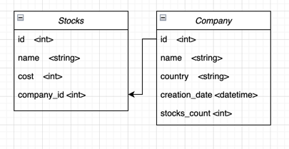

# Технологии программирования

[Назад к списку лекций](/lectures/2023-spring/)

# ДЗ 9. Работа с базами данных

## Дедлайн
- **Мягкий дедлайн** - 10 марта в 23-59
- **Жесткий дедлайн** - 17 марта в 23-59

## Как сдать?
В данный момент еще нет тестов и репозитория на данную домашку. Поэтому создайте пустой gradle-проект и выполните в нем 
задания. Когда появится репозиторий с тестами - нужно будет перенести в него свое решение.

## Работа с базой данных

1. Напишите docker-compose файл, который бы поднимал контейнер с базой postgresql. Имя БД - stocks, имя пользователя
borisoff-invest-test, пароль - qwerty123. Этот docker-compose файл нужно разместить в корне проекта.

2. Напишите класс StockRepository и CompanyRepository. В конструкторе этих классов установите подключение к БД и 
создайте соответствующие таблички:

При этом, давайте не будем хранить строку подключения прямо в коде, а зададим ее и будем получать ее по частям в следующих переменных 
окружения:
- DB_HOST - хост базы данных (в нашем случае localhost и порт для postgres)
- DB_USER - имя пользователя (в нашем случае borisoff-invest-test)
- DB_PASSWORD - пароль пользователя (qwerty123)

3. Создайте CRUD-методы для каждого репозитория. Пусть эти методы работают с классами StockEntity и CompanyEntity. Например,
функция find(int id) в репозитории StockRepository возвращает StockEntity, а функция create будет на вход принимать 
StockEntity, которую нужно создать.

Список методов, которые нужно создать в каждом репозитории:
- find(int id) - находит entity по id
- create(StockEntity или CompanyEntity) - создает в бд переданную entity
- delete(StockEntity или CompanyEntity) - удаляет из бд переданную entity
- update(StockEntity или CompanyEntity) - обновляет в бд переданную entity
