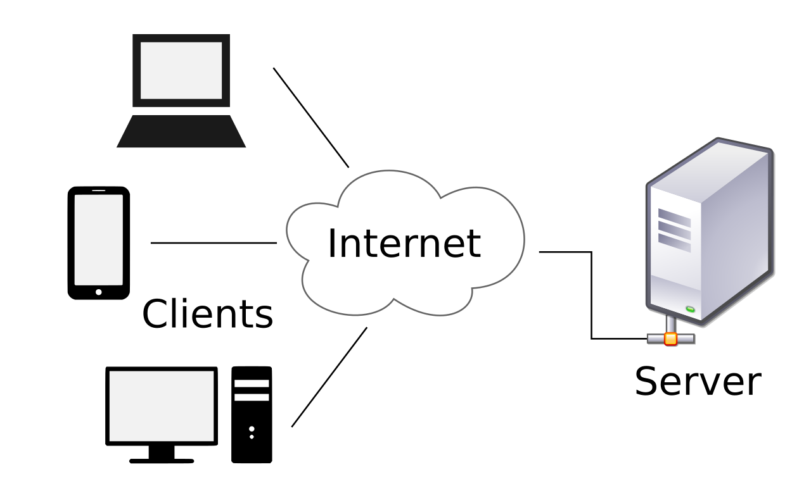
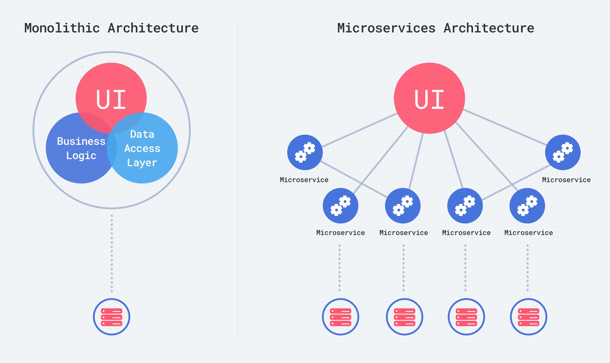
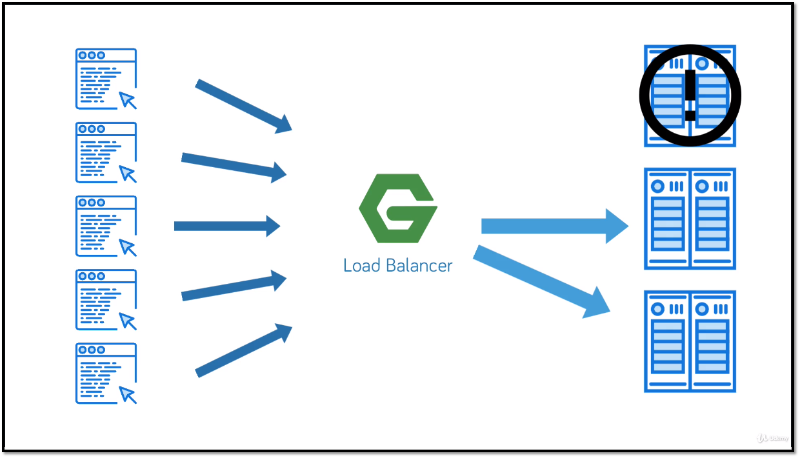

# Технологии программирования

[Назад на главную](/)

## Лекция 1. Сборка приложения Java. Клиент-серверная архитектура. Трехслойная архитектура бэкенда.

### Содержание
1. [Запуск приложения на Java: компиляция и утилита javac](#p1)
2. [Как скомпилировать приложение из нескольких классов?](#p2)
3. [Можно ли сделать один исполняемый файл? ](#p3)
4. [Системы сборок.](#p4)
5. [Структура проекта](#p5)
6. [Gradle](#p6)
7. [Task-и в системе Gradle](#p7)
8. [Клиент-серверная архитектура](#p8)
9. [Архитектура бэкенда](#p9)
10. [Балансировка нагрузки](#p10)
11. [Трехслойная архитектура бэкенда](#p11)

### Запуск приложения на Java: компиляция и утилита javac  <a name="p1"></a>

Мы привыкли собирать и запускать приложение через Idea. Но что же происходит, когда мы нажимаем на зеленую кнопку "Запустить"?
Запуск приложения на Java — это процесс, который включает компиляцию исходного кода программы и запуск скомпилированного 
файла. Этап компиляции в Java нужен для преобразования исходного текста программы в байт-код. Компиляция позволяет получить
более эффективный код за счёт оптимизации.

Байт-код в Java — это набор инструкций, выполняемых виртуальной машиной Java. Он используется для оптимизации 
производительности и безопасности, поскольку машинный код может быть разным для разных платформ.
Байт-код — это промежуточный уровень между исходным кодом Java и машинным кодом, который позволяет 
выполнять Java-приложения на разных платформах без необходимости компиляции кода каждый раз. 
Это обеспечивает переносимость и гибкость в разработке и развёртывании приложений. Больше информации про байт-код 
можно найти в статье [Основы Java Bytecode](https://habr.com/ru/post/568402/) на хабре.


Компиляция выполняется с помощью утилиты **javac** и генерирует файлы с расширением `.class`.

Таким образом, упростив, можно представить запуск программы в виде следующего порядка действий:
- Разрабатываем программу в .java файле.
- Компилируем в байт-код (превращаем `.java` файлы в `.class` файлы)
- Запускаем программу

Возьмем для примера простую программу, состоящую из одного класса:
```java

class Test {
   public static void main(String[] args) {
      System.out.println("This is our test compilation");
   }
}

```
Поместим этот код в файл `Test.java`. В этом примере есть объявление класса `Test` и объявление основного метода `main`,
который является точкой входа в программу. Чтобы скомпилировать нашу программу, воспользуемся утилитой **javac**. 
Для этого в командной строке необходимо выполнить команду:

```sh
javac Test.java
```
После этого мы получим файл Test.class и сможем его запустить при помощи команды:

```sh
java Test
```

### Как скомпилировать приложение из нескольких классов? <a name="p2"></a>
Расширим наш пример. Добавим класс `Student`, написав его в файле `Student.java`. Также добавим использование
класса `Student` в методе `main` у класса `Test`. Код нашего примера:
```java
class Test {
    public static void main(String[] args) {
        Student st = new Student();
        st.name = "Petya";
        st.sayHello();
        System.out.println("This is our test compilation");
    }
}

class Student {
    public String name;
    
    public void sayHello() {
        System.out.println("Hello, this is " + name);
    }
}
```

Создадим структуру файлов и папок в нашем проекте. Разместим все файлы с разрешением `.java` в папку `src`. Создадим 
папку bin, в которой мы в последствии разместим скомпилированный код в виде файлов `.class`. В командной строке 
перейдем в корневую папку вашего проекта и выполним команду:

```sh
javac -d bin ./src/*
```

Здесь `bin` — это папка, в которую будут сгенерированы скомпилированные классы, а `src` — путь к папке «src», содержащей
все ваши классы. Теперь у вас есть скомпилированные классы в папке «bin». Чтобы запустить программу, используйте команду:

```sh
java -classpath ./bin Test
```

Здесь «Test» — это полное имя класса, содержащего метод main(), а «bin» — путь к сгенерированным классам.

### Можно ли сделать один исполняемый файл? <a name="p3"></a>

Да, можно создать файл .jar. Создание исполняемого файла.jar при помощи командной строки позволяет быстро и легко 
упаковать вашу программу на Java в один файл, без использования специальных инструментов разработки. 
Это упрощает распространение и использование вашей программы на различных платформах и системах.

Для создания файла .jar нам потребуется создать файл манифеста. Файл манифеста (MANIFEST.MF) находится в каталоге 
META-INF в JAR-архиве. Он содержит метаданные, описывающие аспекты вашего JAR-приложения, такие как версии пакетов, 
класс приложения для выполнения, путь к классам и материал подписи. Файл манифеста обязателен при сборке JAR-файла. 
В манифесте указывается главный класс, который будет запускаться при выполнении JAR-файла, classpath, 
а также много другой информации. Без файла манифеста JAR-файл не будет корректно запускаться.

Файл манифеста для сборки JAR представляет собой список пар ключей и значений, сгруппированных в разделы, размещённый 
в каталоге META-INF. Формат файла манифеста — текстовый, каждая строка должна начинаться с символа «ключ: значение»:

```manifest
main-class: Test
class-path: bin/
```
Поместим этот файл в root папку проекта и выполним команду:

```sh
jar -cmf manifest.mf spbu.jar  -C bin .
```

Мы получили файл _spbu.jar_. Теперь мы можем легко транспортировать нашу программу, просто скопировав
наш jar файл. Чтобы запустить его нужно выполнить команду:

```sh
java -jar spbu.jar
```

Чуть подробнее этот пример разбирается в [статье](https://javarush.com/groups/posts/2318-kompiljacija-v-java)

## Системы сборок.  <a name="p4"></a>
Системы сборки используются для автоматизации процесса сборки и управления зависимостями в Java-проектах. 
Они упрощают процесс разработки, обеспечивают лучшую структуру проекта и снижают вероятность ошибок.

Отличие использования системы сборки от компиляции программы с помощью javac и запуска с помощью утилиты java 
заключается в том, что сборка представляет собой комплексный процесс, который включает тестирование, упаковку 
и другие этапы, благодаря инструментам автоматизации сборки, таким как Maven или Gradle.

Системы сборки приложения на Java:
- **Apache Ant**:
  - Система сборки, основанная на XML-файлах (build.xml), используется для создания Java-приложений с 1996 года.
  Гибкая, но требует знания XML-файлов и написания команд с нуля.
- **Apache Maven**:
  - Управление зависимостями и автоматизация сборки, используется для Java-приложений с 2004 года.
  - Предоставляет предопределённые цели и встроенную поддержку управления зависимостями.
  - Файлы конфигурации (pom.xml) и строгая структура проекта.
- **Gradle**:
  - Система сборки на основе Groovy/Kotlin, сочетает гибкость Ant и функции Maven.
  - Не использует XML-файлы, использует DSL на основе Groovy или Kotlin.
  - Инкрементные сборки, расширенный анализ и отладка.

Также существуют и другие системы сборок. Крупные компании иногда используют собственные системы сборки. Например,
Google разработала свою систему **Bazel**, а компания Facebook разработала систему **Buck**. Из российских систем, в открытом
доступе по лицензии Apache 2 доступна система сборки от Яндекса **[ya make](https://github.com/yandex/yatool)** 

Мы в нашем курсе будем работать с системой сборки gradle.

### Структура проекта  <a name="p5"></a>
Структура проекта в Gradle основана на модульной системе и управляется файлом build.gradle. В этом файле указываются 
зависимости, плагины и другие настройки проекта.

Структура папок в проекте Gradle может быть следующей:
- src/main/java — для основного кода проекта (Java-файлы).
- src/main/resources — для ресурсов проекта (файлы и папки, доступные для чтения, но не для компиляции).
- src/test/java — для тестового кода (Java-файлы для тестирования).
- src/test/resources — для тестовых ресурсов (файлы и папки для тестирования).

Файлы build.gradle располагаются в корне проекта и могут содержать настройки сборки, плагинов и зависимостей.


```xml
<project>
  <modelVersion>4.0.0</modelVersion>
  <groupId>ru.javarush.testmaven</groupId>
  <artifactId>spbu_arts</artifactId>
  <version>1.0.0</version>

  <build>
     <defaultGoal>compile</defaultGoal>
     <sourceDirectory>src</sourceDirectory>
     <outputDirectory>bin</outputDirectory>
     <finalName>${project.artifactId}-${project.version}</finalName>
  </build>
</project>
```

### Gradle <a name="p6"></a>
Файл build.gradle состоит из нескольких обязательных частей, которые определяют основные аспекты сборки проекта и 
управления зависимостями. Вот основные разделы и элементы этого файла:

**Плагины**

В начале файла укажите плагин java, который будет использоваться для компиляции и выполнения кода.

```groovy
plugins {
 id 'java'
}
```

**Репозитории**

Укажите репозитории для поиска и установки зависимостей, например, Maven Central.

```groovy
repositories {
    mavenCentral()
}
```
Репозиторий Maven Central — это центральный репозиторий для хранения и распространения артефактов (файлов с кодом, 
ресурсами и метаинформацией) проектов, использующих систему управления зависимостями Maven. Он является официальным 
репозиторием Maven и содержит миллионы предварительно упакованных артефактов, доступных для использования в проектах.

Для поиска и добавления зависимостей в ваш проект с использованием репозитория Maven Central, вам нужно указать 
идентификаторы (groupId, artifactId, version) в разделе dependencies файла build.gradle (рассмотрим это далее)

Чтобы найти нужную зависимость в репозитории Maven Central, используйте поисковую систему сайта Maven Central 
[search.maven.org](https://search.maven.org/) или на сайте [mvnrepository.com](https://mvnrepository.com/). 
Введите идентификаторы группы и артефакта в соответствующие поля поиска, 
и вы получите список доступных версий зависимости. Выберите нужную версию и добавьте её в свой проект.

**Зависимости**

Опишите зависимости вашего проекта, включая библиотеки и зависимости для тестов.

```groovy
dependencies {
    implementation group: 
      'org.springframework', name: 'spring-core', version: '4.3.5.RELEASE'
    implementation 'org.springframework:spring-core:4.3.5.RELEASE',
            'org.springframework:spring-aop:4.3.5.RELEASE'
    implementation(
        [group: 'org.springframework', name: 'spring-core', version: '4.3.5.RELEASE'],
        [group: 'org.springframework', name: 'spring-aop', version: '4.3.5.RELEASE']
    )
    testImplementation('org.hibernate:hibernate-core:5.2.12.Final') {
        transitive = true
    }
    runtimeOnly(group: 'org.hibernate', name: 'hibernate-core', version: '5.2.12.Final') {
        transitive = false
    }
}
```

Локальные зависимости:

```groovy
implementation files('libs/joda-time-2.2.jar', 'libs/junit-4.12.jar')
implementation fileTree(dir: 'libs', include: '*.jar')
```

Виды объявления зависимостей:
- api - зависимости будут транзитивно доступны потребителям библиотеки
- implementation - зависимости не будут доступны потребителям
- compile - удалена начиная с gradle 7.0
- runtime - удалена начиная с gradle 7.0
- runtimeOnly - Здесь вы объявляете зависимости, которые требуются только во время выполнения, а не во время компиляции.
- compileOnly - Здесь вы объявляете зависимости, которые требуются во время компиляции, но не во время выполнения. Обычно это включает в себя зависимости, которые затеняются при обнаружении во время выполнения.
- testImplementation
- testCompileOnly
- testRuntimeOnly

[Дока тут](https://docs.gradle.org/current/userguide/java_library_plugin.html#sec:java_library_configurations_graph)


**Основная структура проекта**
Укажите источники кода (например, src/main/java, src/main/resources, src/test/java, src/test/resources) и настройки 
сборки (например, mainClass для запуска приложения).

```groovy
sourceSets {
   main {
       java {
           srcDirs 'src'
       }
   }
}
sourceSets.main.output.classesDir = file("bin")

mainClassName = "src.BoxMachine"

defaultTasks 'compileJava', 'run'
```

### Task-и в системе Gradle <a name="p7"></a>

Task в системе Gradle — это способ декларативного описания действий, которые нужно выполнить для сборки, тестирования 
или других целей проекта. Они используются для автоматизации процессов и упрощения работы с Gradle.

Задачи могут быть зависимыми друг от друга, что позволяет создавать сложные цепочки выполнения действий. Задачи также 
могут иметь параметры, которые можно настраивать в процессе выполнения.

Для создания своей task в Gradle, используйте DSL (Domain-Specific Language) на языке Groovy. Вот пример создания задачи
для сборки проекта:


```groovy
task hello {
    doLast {
        println 'Hello!'
    }
}

task fromSpbu(dependsOn: hello) {
    doLast {
        println "I'm from spbu"
    }
}
```

Можно добавить поведение к задаче
```groovy
task helloSpbu {
    doLast {
        println 'I will be executed second!'
    }
}

helloSpbu.doFirst {
    println 'I will be executed first!'
}

helloSpbu.doLast {
    println 'I will be executed last!'
}

```

### Некоторые tasks из плагина java 
Плагин java для Gradle — это инструмент, который помогает в разработке Java-приложений. Он устанавливает конфигурацию,
необходимую для сборки Java-проектов, такую как src/main/java как директория источника и задачи, такие как compileJava, 
jar и test.


Список всех задач смотри в доке [здесь](https://docs.gradle.org/current/userguide/java_plugin.html). Основные таски, 
которые мы часто будем использовать:
- compileJava
- jar
- test
- clean
- build


## Клиент-серверная архитектура <a name="p8"></a>

### Основные особенности

Клиент-серверная разработка — это метод разделения функций между клиентом (пользователем или приложением) и сервером. 
Клиентские приложения запрашивают информацию или услуги у сервера, а сервер отвечает на запросы, предоставляя данные 
или функциональность.




Клиент-серверная архитектура состоит из следующих компонентов:
- клиенты — устройства или приложения, которые обращаются к серверу;
- серверы — компьютеры, предоставляющие информацию или услуги клиентам;
- протоколы обмена данными — правила или наборы инструкций для взаимодействия между клиентами и серверами.

В клиент-серверной разработке клиенты делятся на толстые и тонкие.

**Толстые клиенты:** работают независимо от сервера, используя свои вычислительные ресурсы. 
- Преимущества: большая функциональность, многопользовательский режим, работа в оффлайн-режиме, мгновенная скорость. 
- Недостатки: зависимость от аппаратного обеспечения, индивидуальные обновления, объём дистрибутивов, зависимость от платформы.

**Тонкие клиенты:** передают обработку информации на сервер, используя ограниченные вычислительные ресурсы. 
- Плюсы: минимальное аппаратное обслуживание, низкий риск неисправностей, минимальные требования к аппаратному обеспечению.
- Минусы: при сбое на сервере страдают все пользователи, работа только при активном подключении к сети, 
снижение производительности при обработке больших объёмов данных.


Особенности клиент-серверной архитектуры:разделение функций: 
- клиент запрашивает информацию у сервера, а сервер предоставляет ресурсы или функциональности;
- разделение функций позволяет распределить нагрузку и повысить надёжность системы;
- сервер как «чёрный ящик»: клиент не знает о внутренней работе сервера;
- масштабируемость: добавление новых клиентов и серверов для обработки растущей нагрузки.


Клиент-серверная архитектура может применяться в веб-разработке, мобильных 
приложениях, играх, базах данных и облачных вычислениях.

### Архитектура бэкенда <a name="p9"></a>

Существует несколько подходов к архитектуре бэкенда. Наиболее распространены - монолит и микросервисы. Монолит — это
единая монолитная программа, в которой все компоненты интегрированы и тесно связаны между собой.
Микросервисы — это небольшие, независимые сервисы, каждый из которых отвечает за определённую функциональность.
Монолит использует централизованные базы данных и обладает простотой
разработки и развёртывания, но страдает от сложности масштабирования и поддержки. Микросервисы же более гибкие,
масштабируемые и поддерживаемые, но требуют больше времени на разработку и внедрение.



Микросервисы — это небольшие, независимые и автономные единицы функциональности в приложении, которые работают на
бэкенде. Они представляют собой полноценные версии бэкенда, так как способны обрабатывать запросы и предоставлять данные. 
Каждый микросервис обращается к своей собственной базе данных для хранения и обработки информации. Принципы разделения 
приложения на микросервисы включают:
- Определение границ: разделение приложения на отдельные, чётко определённые микросервисы, каждый из которых отвечает за свою функциональность.
- Автономность: каждый микросервис должен быть автономным и независимым, чтобы его можно было легко разрабатывать, тестировать и развёртывать отдельно от других.
- Разделение ответственности: каждый микросервис отвечает за определённый набор функций или задач, что облегчает управление и развитие приложения.
- Разделение кода: микросервисы используют отдельные коды, которые могут быть упакованы и развёрнуты независимо друг от друга.

Микросервисы взаимодействуют друг с другом через различные механизмы и протоколы, такие как:
- HTTP API: использование стандартных HTTP-запросов и ответов для передачи данных между микросервисами.
- gRPC: протокол для передачи данных и вызовов методов между микросервисами с использованием двоичных сообщений.
- Message Queues: обмен сообщениями между микросервисами через очереди, где каждый сервис может подписаться на определённые сообщения.
- Event Sourcing: передача событий между микросервисами для сохранения истории изменений и обеспечения согласованности данных.

Пример разделения приложения на микросервисы:

Предположим, у нас есть веб-приложение, которое предоставляет услуги бронирования авиабилетов, оплаты и управления заказами. 
Мы можем разделить это приложение на три микросервиса:

- Бронирование авиабилетов: отвечает за обработку запросов на бронирование авиабилетов и передачу данных о заказе в другие микросервисы.
- Оплата: обрабатывает платежи и передаёт информацию о транзакции в микросервисы управления заказами.
- Управление заказами: обрабатывает информацию о заказах, полученных от микросервиса бронирования, и передаёт данные о 
статусе заказа в микросервисы оформления билетов и доставки.

Такое разделение позволяет легко управлять и развивать каждый микросервис, а также обеспечивает более гибкое взаимодействие между ними.

### Балансировка нагрузки <a name="p10"></a>



Балансировщик нагрузки — это сервис, который распределяет запросы между серверами кластера, чтобы равномерно 
распределить нагрузку и повысить отказоустойчивость и производительность IT-проектов. 
Балансировка может производиться по разным критериям.
Балансировщик нагрузки нужен для того, чтобы сохранить доступность ресурса при аномальной нагрузке, предотвратить 
перегрузку отдельных серверов и потерю трафика.
Устроен балансировщик нагрузки просто: он принимает запросы, распределяет их по серверам и собирает ответы обратно.

Один из популярных балансировщиков - это NGINX.
Балансировщик NGINX — это инструмент, который позволяет распределить нагрузку между несколькими серверами приложений. 
В NGINX есть несколько методов балансировки, таких как round-robin, least-connected и ip-hash. Балансировщик использует 
эти методы для распределения запросов между серверами, обеспечивая равномерную нагрузку и высокую производительность.
Балансировщик NGINX может быть использован для HTTP, HTTPS, FastCGI, uwsgi, SCGI, memcached и gRPC. Он также 
поддерживает возможность настройки сессии (sticky sessions) и контроля веса серверов.

Самый простой способ балансировки нагрузки — циклическая балансировка. Она распределяет клиентские запросы по серверам 
приложений в порядке ротации, например, при использовании трёх серверов первый запрос отправляется на первый сервер, 
второй — на следующий и так далее. Это эффективно, когда серверы имеют схожие возможности обработки и ресурсы.

### Трехслойная архитектура бэкенда <a name="p11"></a>

Трёхслойная архитектура бэкенда состоит из трёх основных слоёв:
- Транспортный слой. Отвечает за передачу данных между клиентом и слоем бизнес-логики. Включает классы контроллера и 
DTO (Data Transfer Object). Контроллеры обрабатывают запросы от клиента и передают их в бизнес-логику, а DTO 
представляют данные, передаваемые между слоями.
- Слой бизнес-логики. Содержит основную бизнес-логику приложения. Здесь выполняются сложные операции, обработка 
данных и выполнение запросов.
- Слой доступа к данным. Обеспечивает взаимодействие с данными, хранящимися в базе данных или других источниках данных. 
Предоставляет методы для чтения, записи, обновления и удаления данных.

Разделение классов по слоям помогает:
- Обеспечивать инкапсуляцию: каждый слой имеет свои собственные обязанности и функции, что облегчает разделение кода и 
его сопровождение.
- Контролировать зависимости: каждый слой зависит только от тех слоёв, которые ему необходимы для выполнения своих функций, 
что упрощает внедрение новых функций и замену компонентов.
- Улучшать масштабируемость: каждый слой может быть развёрнут и настроен независимо от других слоёв, что облегчает 
масштабирование и распределение нагрузки.
- Повышать безопасность: каждый слой отвечает за свою функциональность, что облегчает контроль доступа и защиту данных.

см доску [Miro](https://miro.com/app/board/uXjVPo9Jtww=/?share_link_id=545215110811)
