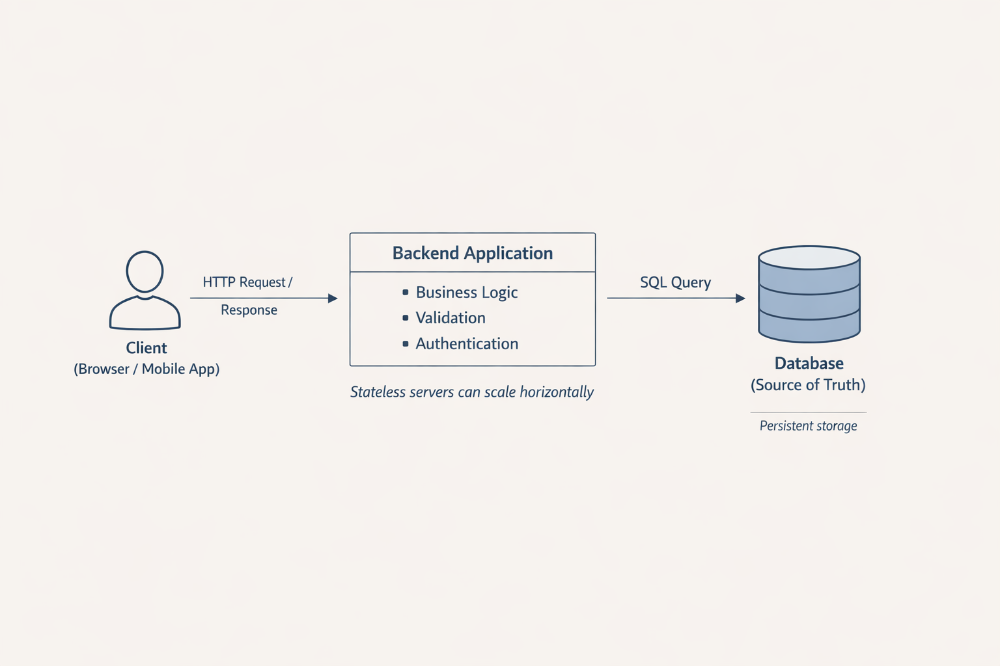

# Технологии программирования

[Главная](/) / Базы данных. Реляционные базы данных. SQL.

## Базы данных. Реляционные базы данных. SQL.

### Содержание
1. [База данных в архитектуре backend](#p1)
2. [Базы данных](#p2)
3. [Реляционная база данных](#p3)
4. [PostgreSQL](#p4)
5. [Язык запросов SQL](#p5)
6. [Транзакции в базах данных](#p6)
7. [Индексы](#p7)
8. [Практический кейс: Система блога](#p8)

## База данных в архитектуре backend <a name="p1"></a>

В современной backend-разработке база данных играет ключевую роль в хранении состояния приложения. Рассмотрим типичную архитектуру:

```
Client → HTTP → Backend → Database
```




**Основные принципы:**

1. **Backend хранит состояние** - В отличие от stateless HTTP, backend-приложение должно сохранять данные между запросами
2. **База данных — источник истины (source of truth)** - Все важные данные хранятся в БД, а не в памяти приложения
3. **Память процесса ненадёжна** - При перезапуске или масштабировании сервера данные в памяти теряются
4. **Несколько серверов должны видеть одни и те же данные** - Для горизонтального масштабирования все экземпляры приложения работают с одной БД

Этот подход обеспечивает надежность, согласованность данных и возможность масштабирования приложения.

## Базы данных <a name="p2"></a>

**База данных (БД)** – это организованная структура для хранения, управления и обработки больших объемов информации. 
Она представляет собой набор данных, которые структурированы определенным образом, чтобы обеспечить быстрый доступ, 
эффективное управление и защиту информации.

Базы данных используются во многих сферах, где необходимо обрабатывать большие объемы информации, например, в системах 
управления проектами, системах управления контентом, системах управления взаимоотношениями с клиентами и других. 
Они позволяют хранить информацию о пользователях, их действиях и предпочтениях, о проектах и задачах, о контенте 
веб-сайтов и т.д.

Базы данных играют важную роль в современном мире, поскольку они обеспечивают эффективное управление информацией, 
ее безопасность и доступность. Без баз данных было бы сложно обрабатывать большие объемы информации, анализировать 
данные и принимать обоснованные решения.

В основе работы баз данных лежат несколько принципов:

- **Логическая структура:** Данные в базе данных организованы в соответствии с определенной логической структурой, 
которая позволяет эффективно осуществлять поиск, сортировку и обработку информации.
- **Целостность данных:** Базы данных обеспечивают целостность данных, предотвращая несанкционированный доступ и 
внесение некорректных изменений.
- **Многопользовательский доступ:** Современные базы данных поддерживают одновременный доступ к данным со стороны 
нескольких пользователей, обеспечивая при этом контроль доступа и предотвращение конфликтов при изменении данных.

### Типы баз данных

#### Реляционные СУБД
- **Строгая схема** - данные организованы в таблицы с четкой структурой
- **Связи между таблицами** - через внешние ключи и JOIN операции
- **Транзакции** - поддержка ACID свойств для надежности данных
- **Примеры:** PostgreSQL, MySQL, Oracle, SQL Server

#### NoSQL базы данных
- **Документные БД** (MongoDB) - гибкая структура документов, подходит для быстрого прототипирования
- **Key-Value хранилища** (Redis) - быстрый доступ по ключу, часто используется как кэш
- **Колонночные БД** (Clickhouse) - оптимизированы для аналитики и агрегации больших данных

> **Примечание:** T-SQL — это диалект SQL, используемый в Microsoft SQL Server.

### Применение баз данных
Базы данных находят широкое применение в различных областях, включая:
- Интернет-приложения: Базы данных используются для хранения информации о пользователях, их действиях и предпочтениях.
- Системы управления проектами: Позволяют отслеживать ход выполнения проектов, задачи и ресурсы.
- Системы управления контентом (CMS): Обеспечивают хранение и управление контентом веб-сайтов.
- Системы управления взаимоотношениями с клиентами (CRM): Используются для хранения информации о клиентах, истории взаимодействия и продаж.

Базы данных являются неотъемлемой частью современной информационной инфраструктуры. Они обеспечивают эффективное 
управление и обработку больших объемов информации, что делает их незаменимыми в различных областях деятельности.

## Реляционная база данных <a name="p3"></a>

Реляционная теория баз данных - это подход к организации и управлению данными, основанный на математическом понятии 
отношения (relation). Данные в реляционной базе данных представлены в виде набора отношений, каждое из которых состоит 
из строк (кортежей) и столбцов (атрибутов). Отношения связаны между собой через общие атрибуты, что позволяет эффективно 
объединять данные из разных источников.

- Отношения в контексте реляционных баз данных представляют собой таблицы, содержащие информацию об объектах или сущностях. 
Они могут быть связаны друг с другом через общие атрибуты.
- Кортежи — это строки таблицы, представляющие собой набор значений атрибутов для одного объекта.
- Атрибуты — это столбцы таблицы, содержащие информацию об объекте.

Рассмотрим пример таблицы данных о студентах:

| StudentID | LastName | FirstName | DateOfBirth | PhoneNumber        |
|-----------|----------|-----------|-------------|--------------------|
| 1         | Иванов   | Пётр      | 22.05.1982  | 111-0000, 222-0000 |
| 2         | Сидоров  | Иван      | 01.01.1990  | 333-0000           |
| 3         | Петров   | Алексей   | 05.03.1995  | 444-0000           |

В этой таблице каждый ряд представляет отдельного студента, а столбцы содержат информацию о студенте: его уникальный 
идентификатор (StudentID), фамилию (LastName), имя (FirstName), дату рождения (DateOfBirth) и номер телефона 
(PhoneNumber).

Таким образом, таблица данных о студентах является примером отношения, где каждый кортеж представляет информацию об 
одном студенте, а атрибуты содержат конкретные данные о студенте.


> Примечание: в этом тексте используются упрощённые определения терминов, более привычные для практического
> использования в отрасли (таблицы, строки, столбцы). Точное и формальное определение этих терминов можно найти 
> в специализированной литературе и на курсе по базам данных.


### Ключи в базах данных

В реляционных базах данных ключи очень важны. Они помогают обеспечить целостность и уникальность данных. Есть разные 
виды ключей: первичный ключ уникально идентифицирует запись в таблице, а внешний ключ связывает записи в разных таблицах.

**Первичный ключ (primary key)** — это уникальный идентификатор записи в таблице базы данных. Он должен быть уникальным и 
не может быть пустым. Первичный ключ может состоять из одного или нескольких полей.

**Внешний ключ (foreign key)** — это поле или набор полей в одной таблице, которые ссылаются на первичный ключ 
другой таблицы. Внешние ключи обеспечивают ссылочную целостность данных, то есть гарантируют, что значения 
внешнего ключа соответствуют значениям первичного ключа в связанной таблице.

Допустим, у нас есть две таблицы: Студенты и Предметы. В таблице студентов должен быть уникальный номер студента 
(например, student_id). Первичный ключ гарантирует, что в таблице не будет двух записей с одинаковым значением 
первичного ключа, что обеспечивает целостность данных.


| student_id | name  | second_name | group_id |
|------------|-------|-------------|----------|
| 1          | Иван  | Иванович    | 1        |
| 2          | Пётр  | Петрович    | 2        | 
| 3          | Мария | Сергеевна   | 1        |


Внешний ключ (foreign key) связывает две таблицы, обеспечивая ссылочную целостность между ними. 
Он ссылается на первичный ключ другой таблицы. Например, в таблице студентов может быть столбец group_id, 
который является внешним ключом, ссылающимся на первичный ключ group_id в таблице групп. 


| group_id | group_name          |
|----------|---------------------|
| 1        | Группа информатиков | 
| 2        | Группа дизайнеров   | 
| 3        | Группа юристов      | 


Это позволяет связать каждого студента с определенной группой, обеспечивая целостность данных и предотвращая ситуации, 
когда студент оказывается в нескольких группах одновременно (если такое не предусмотрено нашей системой).

### Связь многие ко многим

Обычно для установления связи «многие ко многим» между таблицами используют дополнительную таблицу.

Чтобы установить связь “многие ко многим” между студентами и предметами в реляционной базе данных, нужно использовать 
дополнительную таблицу, которая будет служить связующим звеном между этими двумя сущностями. Эта дополнительная таблица 
будет содержать пары идентификаторов (ключей) студентов и предметов, устанавливая связь между ними.

Для примера введем еще одну таблицу Courses, которая будет содержать информацию о курсах, включая уникальный 
идентификатор курса (course_id) и название курса (course_name).


| course_id | course_name                |
|-----------|----------------------------|
| 1         | Технологии програмирования | 
| 2         | Базы данных                | 
| 3         | 3D моделирование           | 

Создадим дополнительную таблицу Student_Courses, которая будет служить связующим звеном между студентами и курсами.

Student_Courses будет содержать два внешних ключа: student_id и course_id, которые будут ссылаться на первичные ключи 
таблиц Students и Courses соответственно.
Также добавляем первичный ключ по двум полям(student_id, course_id), чтобы гарантировать уникальность пар 
идентификаторов студентов и курсов (тем самым исключим ситуацию, когда студент записан на курс дважды).


| course_id | student_id |
|-----------|------------|
| 1         | 1          | 
| 1         | 2          | 
| 1         | 3          | 
| 2         | 1          | 
| 2         | 2          | 

## PostgreSQL <a name="p4"></a>
PostgreSQL — это мощная объектно-реляционная система управления базами данных (СУБД) с открытым исходным кодом. 
Она помогает хранить, организовывать и управлять информацией. PostgreSQL поддерживает стандарт SQL, что делает её 
универсальной и подходящей для использования в различных программах и приложениях.

Особенности PostgreSQL:

- **Поддержка стандарта SQL**: PostgreSQL поддерживает большинство стандартов SQL
- **Гибкость**: Пользователи могут создавать функции, операторы, типы данных и индексные методы, расширяя функционал 
базы данных под свои нужды.
- **Соответствие ACID**: PostgreSQL гарантирует надёжность транзакций и целостность данных благодаря свойствам ACID
(Atomicity, Consistency, Isolation, Durability).
- **Поддержка JSON и XML**: Возможность работы с неструктурированными данными в форматах JSON и XML.
- **Масштабируемость**: Поддерживает горизонтальное и вертикальное масштабирование, позволяя работать с большими 
объёмами данных и большим числом пользователей.

Применение PostgreSQL:

- Хранение данных веб-приложений и веб-сервисов.
- Использование в аналитических приложениях и системах бизнес-аналитики.
- Поддержка геопространственных данных с помощью расширения PostGIS.
- Применение в корпоративных системах, таких как системы управления ресурсами (ERP) и системы управления взаимоотношениями с клиентами (CRM).

PostgreSQL состоит из нескольких ключевых компонентов:

- **Сервер**: Основной компонент, отвечающий за обработку запросов, управление транзакциями и доступ к данным.
- **Клиентские библиотеки**: Позволяют приложениям взаимодействовать с сервером PostgreSQL.
- **Расширения**: Дополнительные модули, добавляющие новые функции и возможности.
- **Конфигурационные файлы**: Управляют поведением сервера и клиентских приложений.

PostgreSQL использует архитектуру клиент-сервер, где клиенты отправляют запросы на сервер, который обрабатывает их и
возвращает результаты. Сервер PostgreSQL работает на отдельном компьютере или сервере, к которому подключаются клиенты
через сеть.

### Консольный клиент PostgreSQL

Клиент psql является инструментом командной строки для взаимодействия с PostgreSQL. Он предоставляет интерфейс для 
выполнения команд SQL, управления базами данных и таблицами, а также для выполнения административных задач.

psql необходим для выполнения следующих задач:
- Подключение к серверу PostgreSQL и выполнение SQL-запросов.
- Создание, удаление и изменение баз данных и таблиц.
- Управление пользователями и ролями.
- Выполнение административных задач, таких как резервное копирование и восстановление данных.

**Как установить psql?**

Для установки psql необходимо выполнить следующие шаги:
- Открыть командную строку или терминал.
- Выполнить команду `sudo apt install postgresql-client` (для Ubuntu и Debian)

**Как подключиться к базе данных?**
Чтобы подключиться к базе данных PostgreSQL с помощью клиента psql, выполните следующую команду в терминале:

```shell
psql -h <адрес сервера> -U <имя пользователя> -d <название базы данных>
```

Пример:

```shell
psql -h localhost -U postgres -d mydatabase
```

```sh
psql postgres #(для выхода из интерфейса используйте \q)
```

В этом примере предполагается, что PostgreSQL установлен на локальном компьютере, пользователь postgres имеет доступ к 
базе данных mydatabase. Если у вас другой пользователь или база данных, замените соответствующие значения.

После ввода команды вам будет предложено ввести пароль пользователя. Введите его и нажмите Enter. Если всё выполнено 
правильно, вы будете подключены к базе данных и сможете выполнять SQL-запросы.

**Основные команды для начала работы:**
- `\l` - список баз данных
- `CREATE DATABASE mydatabase;` - создание базы данных
- `\c mydatabase` - подключиться к базе данных
- `\dt` - список таблиц в текущей базе

## Язык запросов SQL <a name="p5"></a>

SQL (Structured Query Language) — это язык запросов, используемый для работы с реляционными базами данных. Он был 
разработан в начале 1970-х годов и с тех пор стал стандартом де-факто для взаимодействия с базами данных. SQL позволяет 
выполнять различные операции с данными, такие как выборка, вставка, обновление, удаление и изменение структуры 
базы данных.

Типы данных - [ссылка на доку](https://www.postgresql.org/docs/current/datatype.html)

**Создание таблицы:**
```postgresql
CREATE TABLE students (
    id integer PRIMARY KEY ,
    name text,
    group_number integer
);
```

Для создания таблицы в SQL используется команда `CREATE TABLE`. В нашем примере создается таблица students с тремя 
столбцами: _id, name_ и _group_number_.
- _id_ имеет тип integer и является первичным ключом (PRIMARY KEY), что означает, что каждое значение в этом столбце 
должно быть уникальным и не может быть NULL.
- _name_ имеет тип text, что позволяет хранить текстовые данные.
- _group_number_ также имеет тип integer.

**Добавление данных в таблицу:**
```postgresql
INSERT INTO students (id, name, group_number)
VALUES (1, 'Ivan Ivanov', 5), 
       (2, 'Dima Sidorov', 5), 
       (3, 'Sasha Ivanets', 5);
```
Для добавления данных в таблицу в SQL используется команда `INSERT INTO`. Ваш пример добавляет три записи в таблицу students:
- Первая запись с id равным 1, name “Ivan Ivanov” и group_number равным 5.
- Вторая запись с id равным 2, name “Dima Sidorov” и group_number равным 5.
- Третья запись с id равным 3, name “Sasha Ivanets” и group_number равным 5.
Обратите внимание, что значения вставляются в том порядке, в котором они указаны в команде `INSERT INTO`.


**Получить данные из таблицы:**
```postgresql
SELECT id, name FROM students WHERE group_number = 5;
```

Для получения данных из таблицы в SQL используется команда `SELECT`. Наш пример выбирает поля _id_ и _name_ из таблицы 
_students_, где _group_number_ равен 5. Это означает, что будут выбраны только те записи, где значение в столбце 
_group_number_ равно 5.

В `SQL SELECT` запросы используются для извлечения данных из одной или нескольких таблиц. 
Ключевые слова, используемые в SELECT запросах, позволяют уточнять, какие именно данные нужно извлечь, 
как их обрабатывать и как их представлять. Вот некоторые из наиболее важных ключевых слов:
- SELECT - ключевое слово, которое начинает SELECT запрос. Оно указывает, что запрос предназначен для выборки данных.
- FROM - ключевое слово, которое указывает, из какой таблицы или таблиц следует извлекать данные.
- WHERE - ключевое слово, которое позволяет фильтровать результаты запроса, выбирая только те записи, которые 
удовлетворяют определенному условию.
- GROUP BY - ключевое слово, которое используется для группировки результатов запроса по одному или нескольким столбцам.
- HAVING - ключевое слово, которое используется в сочетании с GROUP BY для фильтрации групп результатов, 
а не отдельных записей.
- ORDER BY - ключевое слово, которое используется для сортировки результатов запроса по одному или нескольким 
столбцам в определенном порядке.
- LIMIT - ключевое слово, которое ограничивает количество возвращаемых записей. Доступно не во всех СУБД.
- OFFSET - ключевое слово, которое используется в сочетании с LIMIT для пропуска определенного количества 
начальных записей перед началом выборки. Доступно не во всех СУБД.
- AS - ключевое слово, которое позволяет дать временное имя столбцу или таблице в запросе.
- DISTINCT - ключевое слово, которое используется для удаления дубликатов из результирующего набора.


**Обновление данных в таблице**

Для обновления данных в таблице в SQL используется команда `UPDATE`.

Допустим, у нас есть таблица students с полями id, name, age, и мы хотим увеличить возраст всех студентов на 1 год,
но только тех, кому уже исполнилось 18 лет. Пример запроса на обновление будет выглядеть так:

```postgresql
UPDATE students
SET age = age + 1
WHERE age >= 18;
```
Здесь ключевое слово UPDATE указывает, что запрос предназначен для обновления данных, students - это таблица, 
в которой будет производиться обновление, SET - команда, которая устанавливает новое значение для поля age, 
а выражение `age = age + 1` увеличивает значение поля age на 1. Условие `WHERE age >= 18` фильтрует строки, которые должны 
быть обновлены, чтобы избежать изменения возраста студентов младше 18 лет.

Операторы для условий:

| Оператор     | Действие                                                             |
|--------------|----------------------------------------------------------------------|
| =            | Равно                                                                |
| !=           | Не равно                                                             |
| <            | Меньше, чем                                                          |
| \>           | Больше, чем                                                          |
| <=           | Меньше или равно                                                     |
| >=           | Больше или равно                                                     |
| BETWEEN      | проверяет, находится ли значение в заданном диапазоне                |
| IN           | проверяет, содержится ли значение строки в наборе указанных значений |
| EXISTS       | проверяет, существуют ли строки при заданных условиях                |
| LIKE         | проверяет, соответствует ли значение указанной строке                |
| IS NULL      | Проверяет значения NULL                                              |
| IS NOT NULL  | Проверяет все значения, кроме NULL                                   |


**Пример управления выводом запроса**
```postgresql
SELECT COUNT(name), entree FROM dinners GROUP BY entree;
SELECT name, birthdate FROM dinners ORDER BY birthdate;
SELECT name, birthdate FROM dinners ORDER BY birthdate DESC;
```

**JOIN - соединение таблиц**

**JOIN** — это операция сопоставления строк из разных таблиц по определенному условию.

**Логика работы:**
1. Берем первую строку из левой таблицы
2. Ищем в правой таблице строки, удовлетворяющие условию ON
3. Объединяем найденные строки в результат

**Пример с пояснением:**
```postgresql
-- Получаем студентов и их группы
SELECT students.name AS student_name, groups.name AS group_name
FROM students
JOIN student_group ON students.id = student_group.student_id
JOIN groups ON groups.id = student_group.group_id;
```

**Что происходит:**
- `students` и `student_group` соединяются по совпадающим ID студентов
- Результат соединяется с `groups` по совпадающим ID групп
- В итоге получаем таблицу с именами студентов и названиями их групп

**Важно:** Без условия ON получится **декартово произведение** — каждая строка первой таблицы соединится с каждой строкой второй таблицы, что обычно нежелательно.

JOIN — это не "магия", а логическая операция на уровне данных, которая позволяет связать информацию из разных таблиц.

## Транзакции в базах данных <a name="p6"></a>

**Транзакция** — это последовательность операций с базой данных, которая выполняется как единое целое. Транзакция либо выполняется полностью, либо не выполняется вовсе.

**Пример "перевод денег":**
```sql
BEGIN; -- Начало транзакции

UPDATE accounts SET balance = balance - 100 WHERE id = 1; -- Снимаем 100 с первого счета
UPDATE accounts SET balance = balance + 100 WHERE id = 2; -- Добавляем 100 на второй счет

COMMIT; -- Подтверждаем транзакцию
```

Если произойдет ошибка между операциями UPDATE, можно выполнить `ROLLBACK` для отмены всех изменений.

**Ключевые команды:**
- `BEGIN` - начало транзакции
- `COMMIT` - подтверждение изменений
- `ROLLBACK` - отмена изменений

**ACID свойства:**
- **Atomicity (Атомарность)** - транзакция выполняется полностью или не выполняется вовсе
- **Consistency (Согласованность)** - база данных переходит из одного согласованного состояния в другое
- **Isolation (Изолированность)** - транзакции не мешают друг другу
- **Durability (Долговечность)** - после подтверждения изменения сохраняются даже при сбоях

Транзакции превращают базу данных из простого хранилища таблиц в полноценную систему управления состоянием приложения.

### Уровни изоляции транзакций (продвинутый уровень)

**Что такое аномалия в базах данных?**
Аномалия — это непредсказуемое поведение базы данных, когда несколько транзакций работают с одними и теми же данными одновременно. Это происходит из-за того, что транзакции могут "видеть" изменения друг друга в неподходящий момент, что приводит к логическим ошибкам в данных.

**Когда это важно в backend-разработке:**
- Приложения с высокой конкурентностью (много пользователей одновременно)
- Системы с финансовыми операциями (банки, платежные системы)
- Системы бронирования (билеты, отели)
- Любые приложения, где важна согласованность данных при параллельных операциях

**Уровни изоляции от самого слабого к самому сильному:**

1. **Read Uncommitted** - можно читать незафиксированные изменения других транзакций
2. **Read Committed** - читаются только зафиксированные изменения (по умолчанию в PostgreSQL)
3. **Repeatable Read** - гарантирует, что повторное чтение даст те же данные
4. **Serializable** - полная изоляция, как будто транзакции выполняются последовательно

**Типы аномалий, которые предотвращают уровни изоляции:**

**Грязное чтение (Dirty Read)** - чтение незафиксированных данных другой транзакции
```sql
-- Транзакция 1: UPDATE users SET balance = balance - 100 WHERE id = 1;
-- Транзакция 2: SELECT balance FROM users WHERE id = 1; -- видит -100
-- Транзакция 1: ROLLBACK; -- изменения отменены
-- Транзакция 2 увидела данные, которых никогда не было!
```

**Неповторяющееся чтение (Non-repeatable Read)** - разные результаты при повторном чтении
```sql
-- Транзакция 1: SELECT balance FROM users WHERE id = 1; -- 1000
-- Транзакция 2: UPDATE users SET balance = 900 WHERE id = 1; COMMIT;
-- Транзакция 1: SELECT balance FROM users WHERE id = 1; -- 900 (изменилось!)
```

**Фантомное чтение (Phantom Read)** - появление новых строк при повторном чтении
```sql
-- Транзакция 1: SELECT COUNT(*) FROM users WHERE age > 30; -- 50
-- Транзакция 2: INSERT INTO users (age) VALUES (35); COMMIT;
-- Транзакция 1: SELECT COUNT(*) FROM users WHERE age > 30; -- 51 (новые строки!)
```

**На практике:**
- **Read Committed** (по умолчанию) подходит для большинства приложений
- **Repeatable Read** нужен для финансовых операций
- **Serializable** используется редко из-за производительности

```sql
-- Установка уровня изоляции
BEGIN TRANSACTION ISOLATION LEVEL REPEATABLE READ;
-- операции...
COMMIT;
```

## Индексы <a name="p7"></a>

Индексы — это специальные структуры данных, которые ускоряют поиск в базе данных.


### Зачем нужны индексы?

**Ускоряют SELECT** - поиск по индексированным полям выполняется значительно быстрее
**Замедляют INSERT/UPDATE** - при изменении данных нужно обновлять индекс

**Аналогия:** Оглавление книги позволяет быстро найти нужную страницу, но требует дополнительного места.

### B-Tree индекс (по умолчанию)

```postgresql
CREATE INDEX users_email_idx ON users (email);
```

B-Tree — наиболее распространенный тип индекса, который используется по умолчанию.


### Практические правила создания индексов

Индексируйте поля, которые часто используются в:
- **WHERE** условиях: `WHERE email = 'user@example.com'`
- **JOIN** операциях: `JOIN users ON users.id = posts.user_id`
- **Foreign key** полях: автоматически создаются для первичных ключей

**Примеры:**
```postgresql
-- Для поиска по email
CREATE INDEX idx_users_email ON users (email);

-- Для поиска по имени и фамилии
CREATE INDEX idx_users_name ON users (first_name, last_name);

-- Для поиска по дате создания
CREATE INDEX idx_posts_created ON posts (created_at);
```
Когда использовать?
- операторы сравнения >, <, =, >=, <=, BETWEEN и IN;
- условия пустоты IS NULL и IS NOT NULL;
- операторы поиска подстроки LIKE и ~, если искомая строка закреплена
  в начале шаблона (например name LIKE 'Lisa%');

> **Важно:** Не создавайте слишком много индексов — каждый индекс занимает место и замедляет запись данных.

### Типы индексов:


## Практический кейс: Система блога <a name="p8"></a>

Разработаем базу данных для простого блога с пользователями, постами и комментариями.

### Проектирование схемы

```sql
-- Пользователи
CREATE TABLE users (
    id SERIAL PRIMARY KEY,
    email VARCHAR(255) UNIQUE NOT NULL,
    username VARCHAR(50) NOT NULL,
    created_at TIMESTAMP DEFAULT NOW()
);

-- Посты
CREATE TABLE posts (
    id SERIAL PRIMARY KEY,
    title VARCHAR(255) NOT NULL,
    content TEXT NOT NULL,
    author_id INTEGER REFERENCES users(id),
    created_at TIMESTAMP DEFAULT NOW(),
    updated_at TIMESTAMP DEFAULT NOW()
);

-- Комментарии
CREATE TABLE comments (
    id SERIAL PRIMARY KEY,
    content TEXT NOT NULL,
    post_id INTEGER REFERENCES posts(id),
    author_id INTEGER REFERENCES users(id),
    created_at TIMESTAMP DEFAULT NOW()
);
```

### Создание индексов

```sql
-- Для быстрого поиска пользователей по email
CREATE INDEX idx_users_email ON users (email);

-- Для поиска постов автора
CREATE INDEX idx_posts_author ON posts (author_id);

-- Для поиска комментариев к посту
CREATE INDEX idx_comments_post ON comments (post_id);

-- Для сортировки по дате создания
CREATE INDEX idx_posts_created ON posts (created_at);
CREATE INDEX idx_comments_created ON comments (created_at);
```

### Примеры запросов

**1. Получить все посты пользователя с комментариями:**
```sql
SELECT
    p.title,
    p.content,
    u.username AS author,
    c.content AS comment,
    c2.username AS comment_author
FROM posts p
JOIN users u ON p.author_id = u.id
LEFT JOIN comments c ON p.id = c.post_id
LEFT JOIN users c2 ON c.author_id = c2.id
WHERE u.email = 'user@example.com'
ORDER BY p.created_at DESC, c.created_at ASC;
```

**2. Найти самые популярные посты (по количеству комментариев):**
```sql
SELECT
    p.title,
    u.username,
    COUNT(c.id) AS comment_count
FROM posts p
JOIN users u ON p.author_id = u.id
LEFT JOIN comments c ON p.id = c.post_id
GROUP BY p.id, u.username
ORDER BY comment_count DESC
LIMIT 10;
```

**3. Обновить пост с проверкой авторства:**
```sql
BEGIN;

UPDATE posts
SET title = 'Новое название',
    content = 'Обновленный контент',
    updated_at = NOW()
WHERE id = 123 AND author_id = 456;

COMMIT;
```

### Ключевые выводы

1. **Проектирование**: Начинаем с определения сущностей и их связей
2. **Индексы**: Создаем для полей в WHERE, JOIN и сортировке
3. **Запросы**: Используем JOIN для объединения связанных данных
4. **Транзакции**: Защищаем важные операции от частичного выполнения

Этот подход можно применять для проектирования любых backend-приложений.

## Полезные ссылки

- [Базы данных: большой обзор типов и подходов. Доклад Яндекса](https://habr.com/ru/company/yandex/blog/522164/)
- [PostgreSQL Основы языка SQL](https://edu.postgrespro.ru/sql_primer.pdf)
- [Основы реляционных баз данных](https://www.internet-technologies.ru/articles/osnovy-relyacionnyh-baz-dannyh.html)
- [Статья](https://www.8host.com/blog/zaprosy-v-postgresql/) про то, как делать запросы к базе данных
- [Введение в индексы](https://doberbeatzblog.wordpress.com/2017/03/13/postgresql-indexes/)
- [Суперсила индексов для оптимизации SQL-запросов](https://medium.com/nuances-of-programming/супер-сила-индексов-для-оптимизации-sql-запросов-df2549431bf8)
- [Статья на хабре про индексы](https://habr.com/ru/company/postgrespro/blog/326096/)

- [Лекция про базы данных из Открытого лектория Яндекса](https://www.youtube.com/live/lknxOJseu0c?si=bNiNjJIVJgj2Qvyl)