# Технологии программирования

[Назад на главную](/)

## Проектирование backend-приложений: архитектура, рефакторинг и шаблоны проектирования

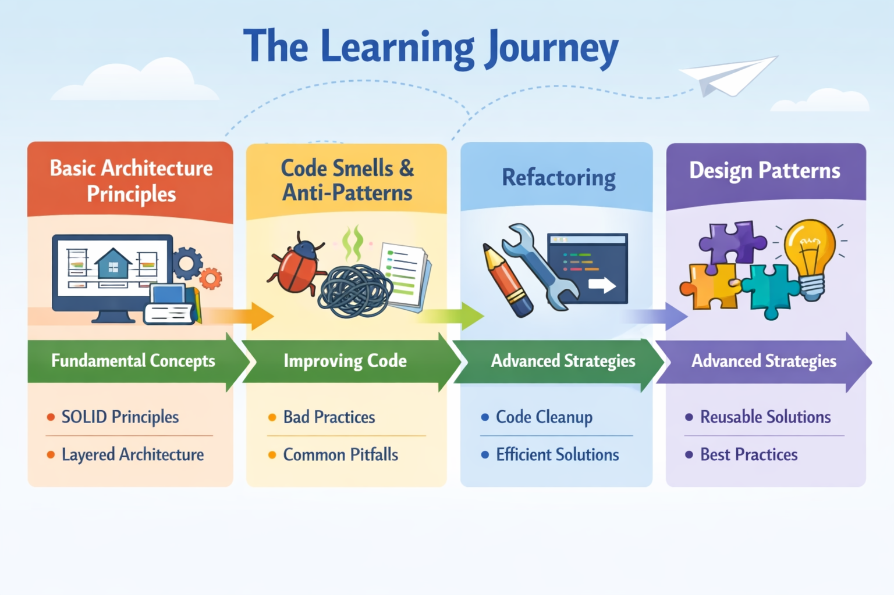

## 0. Что такое хорошая архитектура

Архитектура программного обеспечения — это фундаментальная организация системы, воплощенная в её компонентах, их отношениях друг к другу и к окружению, а также принципы, определяющие проектирование и развитие системы.

### Зачем нужна архитектура?

**Time to market** — ключевая метрика разработки, показывающая, насколько быстро команда может доставлять новые функции пользователям.

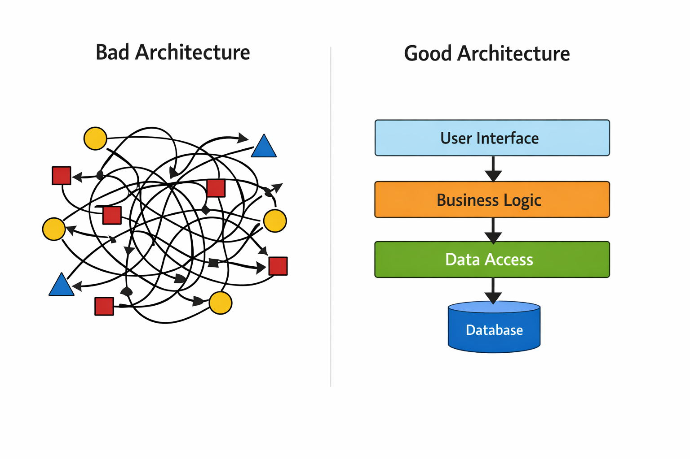

**Проблемы плохой архитектуры:**
- Изменения становятся дорогими и рискованными
- Новые функции требуют переписывания существующего кода
- Тестирование сложно и неэффективно
- Команда тратит больше времени на исправление ошибок, чем на разработку

**Преимущества хорошей архитектуры:**
- Быстрое внедрение изменений
- Легкое тестирование и отладка
- Возможность масштабирования команды
- Предсказуемое поведение системы

## 1. Принципы проектирования

### SOLID — основа объектно-ориентированного проектирования

**Напоминание из первого семестра:**
- **S** — Single Responsibility Principle (Принцип единственной ответственности)
- **O** — Open/Closed Principle (Принцип открытости/закрытости)
- **L** — Liskov Substitution Principle (Принцип подстановки Лисков)
- **I** — Interface Segregation Principle (Принцип разделения интерфейсов)
- **D** — Dependency Inversion Principle (Принцип инверсии зависимостей)

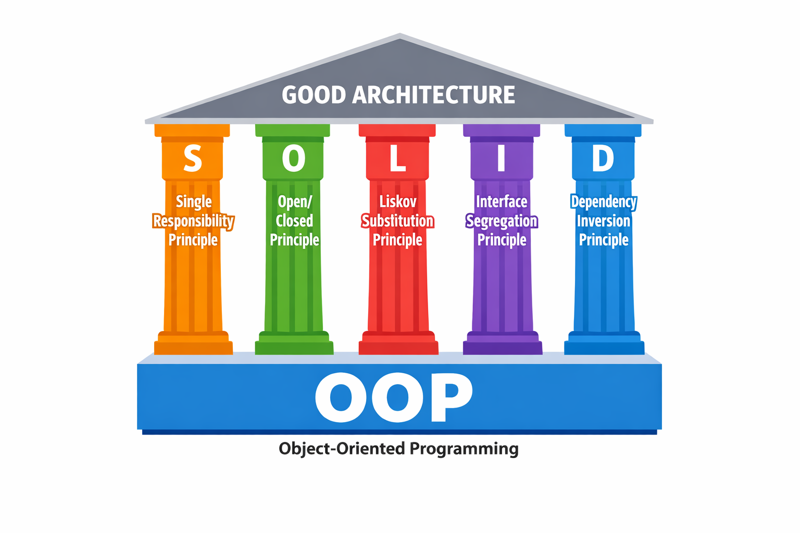

### Неформальные инженерные принципы

#### KISS (Keep It Simple, Stupid)
> Самый простой работающий вариант — лучший

```java
// Плохо: избыточная сложность
public class ComplexCalculator {
    public int calculate(int a, int b, OperationType type) {
        switch(type) {
            case ADD: return a + b;
            case SUBTRACT: return a - b;
            // ... много кейсов
        }
    }
}

// Хорошо: просто и понятно
public class Calculator {
    public int add(int a, int b) { return a + b; }
    public int subtract(int a, int b) { return a - b; }
}
```

#### DRY (Don't Repeat Yourself)
> Каждая часть знания должна иметь единственное, однозначное, авторитетное представление в системе

```java
// Плохо: дублирование кода
public class UserService {
    public void validateUser(User user) {
        if (user.getName() == null || user.getName().isEmpty()) {
            throw new ValidationException("Name is required");
        }
        if (user.getEmail() == null || user.getEmail().isEmpty()) {
            throw new ValidationException("Email is required");
        }
    }
    
    public void validateAdmin(Admin admin) {
        if (admin.getName() == null || admin.getName().isEmpty()) {
            throw new ValidationException("Name is required");
        }
        // Дублирование валидации
    }
}

// Хорошо: устранение дублирования
public class Validator {
    public static void validateName(String name) {
        if (name == null || name.isEmpty()) {
            throw new ValidationException("Name is required");
        }
    }
}
```

#### YAGNI (You Ain't Gonna Need It)
> Не реализуйте функциональность, пока она действительно не понадобится

```java
// Плохо: преждевременная оптимизация
public class UserService {
    // Сложная система кэширования для будущих потребностей
    private Map<String, User> cache = new ConcurrentHashMap<>();
    private CacheEvictionStrategy evictionStrategy;
    
    public UserService() {
        // Настройка сложной логики, которая пока не нужна
    }
}

// Хорошо: минимальная необходимая функциональность
public class UserService {
    public User getUser(String id) {
        // Простая реализация - добавим кэш, когда понадобится
        return userRepository.findById(id);
    }
}
```

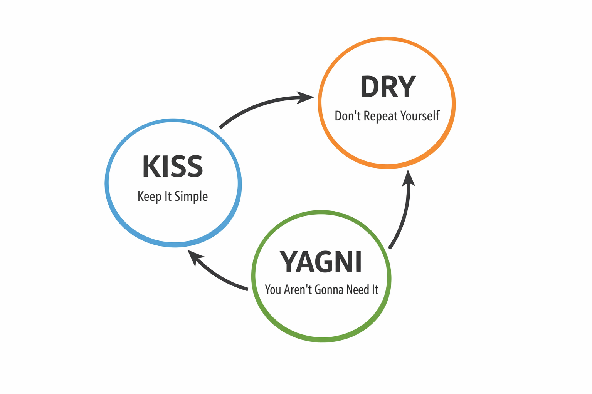

## 2. Слои backend-приложения

### Трёхслойная архитектура

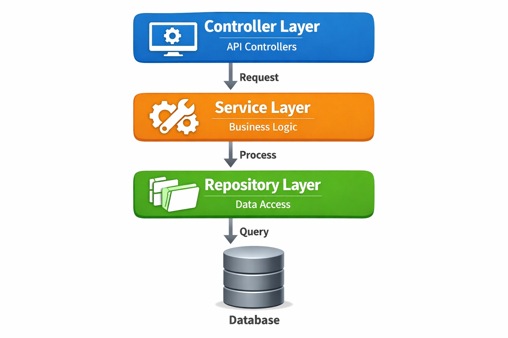

### Transport Layer (Уровень транспорта)

**Ответственность:**
- Обработка HTTP запросов и ответов
- Сериализация/десериализация данных
- Валидация входных данных
- Аутентификация и авторизация

**Типичные классы:**
- `UserController`, `OrderController`
- `UserHandler`, `OrderHandler`
- Servlets (в традиционных Java приложениях)

```java
// Псевдокод - пример типичного контроллера
public class UserController {
    
    // Обработка создания пользователя
    public Response createUser(CreateUserRequest request) {
        // Валидация входных данных
        if (request.getName() == null || request.getName().isEmpty()) {
            return Response.error("Name is required");
        }
        
        // Вызов сервисного слоя
        UserResponse response = userService.createUser(request);
        
        // Возврат ответа
        return Response.success(response);
    }
    
    // Обработка получения пользователя
    public Response getUser(String userId) {
        UserResponse response = userService.getUser(userId);
        return Response.success(response);
    }
}
```

### Service Layer (Сервисный уровень)

**Ответственность:**
- Бизнес-логика приложения
- Оркестрация операций
- Управление транзакциями
- Валидация бизнес-правил

**Типичные классы:**
- `UserService`, `OrderService`, `PaymentService`

```java
@Service
@Transactional
public class UserService {
    
    public UserResponse createUser(CreateUserRequest request) {
        // Бизнес-логика
        if (userRepository.existsByEmail(request.getEmail())) {
            throw new BusinessException("Email already exists");
        }
        
        User user = userMapper.toEntity(request);
        user = userRepository.save(user);
        
        // Оркестрация: отправка уведомления
        notificationService.sendWelcomeEmail(user);
        
        return userMapper.toResponse(user);
    }
}
```

### Data Access Layer (Уровень доступа к данным)

**Ответственность:**
- Взаимодействие с базой данных
- Выполнение SQL запросов
- Маппинг объектов БД на Java объекты
- Кэширование данных

**Типичные классы:**
- `UserRepository`, `OrderRepository`
- DAO (Data Access Object) классы

```java
public class UserRepository {
    private Connection connection;
    
    public User findById(String id) {
        // Использование JDBC для работы с базой данных
        String sql = "SELECT id, name, email, active FROM users WHERE id = ?";
        
        try (PreparedStatement stmt = connection.prepareStatement(sql)) {
            stmt.setString(1, id);
            ResultSet rs = stmt.executeQuery();
            
            if (rs.next()) {
                User user = new User();
                user.setId(rs.getString("id"));
                user.setName(rs.getString("name"));
                user.setEmail(rs.getString("email"));
                user.setActive(rs.getBoolean("active"));
                return user;
            }
        } catch (SQLException e) {
            throw new RuntimeException("Database error", e);
        }
        return null;
    }
    
    public List<User> findActiveUsers() {
        List<User> users = new ArrayList<>();
        String sql = "SELECT id, name, email FROM users WHERE active = true";
        
        try (Statement stmt = connection.createStatement();
             ResultSet rs = stmt.executeQuery(sql)) {
            
            while (rs.next()) {
                User user = new User();
                user.setId(rs.getString("id"));
                user.setName(rs.getString("name"));
                user.setEmail(rs.getString("email"));
                users.add(user);
            }
        } catch (SQLException e) {
            throw new RuntimeException("Database error", e);
        }
        return users;
    }
}
```

### Объекты между слоями

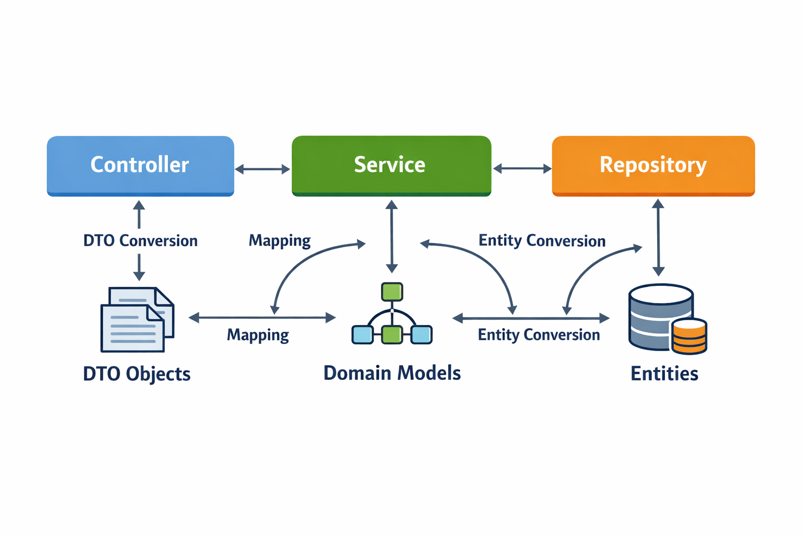

**Типы объектов:**
- **DTO (Data Transfer Object)** — для передачи данных между слоями
- **Domain Model** — бизнес-сущности с поведением
- **Entity** — объекты, отображаемые на таблицы БД

```java
// DTO для API
public class UserResponse {
    private String id;
    private String name;
    private String email;
    // Геттеры и сеттеры
}

// Domain Model
public class User {
    private String id;
    private String name;
    private String email;
    private boolean active;
    
    public void activate() {
        this.active = true;
    }
    
    public boolean canMakePurchase() {
        return active && email != null;
    }
}

// Entity (JPA)
@Entity
@Table(name = "users")
public class UserEntity {
    @Id
    private String id;
    private String name;
    private String email;
    private boolean active;
}
```

## 3. Code Smells

**Code Smell** — это поверхностный индикатор, который обычно соответствует более глубокой проблеме в системе.

*— Martin Fowler, "Refactoring"*

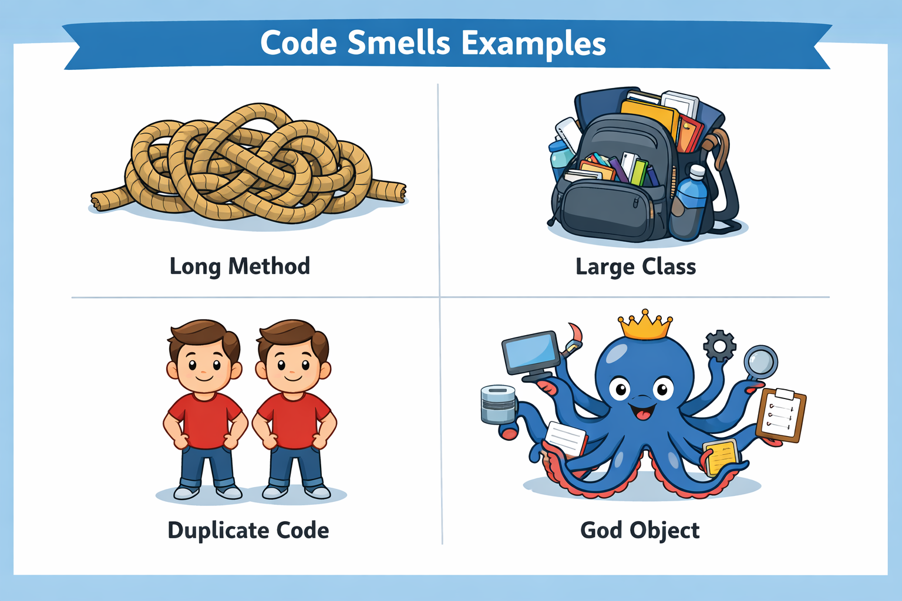

### Типичные Code Smells

#### Long Method (Длинный метод)
Метод, который делает слишком много и сложно понять.

```java
// Плохо: метод делает всё
public void processOrder(Order order) {
    // Валидация
    if (order == null) throw new IllegalArgumentException();
    if (order.getItems().isEmpty()) throw new ValidationException();
    // Проверка доступности
    for (Item item : order.getItems()) {
        if (!inventoryService.isAvailable(item)) {
            throw new OutOfStockException();
        }
    }
    // Расчет стоимости
    double total = 0;
    for (Item item : order.getItems()) {
        total += item.getPrice() * item.getQuantity();
    }
    // Применение скидки
    if (order.getCustomer().isPremium()) {
        total *= 0.9;
    }
    // Сохранение
    order.setTotal(total);
    orderRepository.save(order);
    // Отправка уведомления
    notificationService.sendOrderConfirmation(order);
}
```

#### Large Class (Большой класс)
Класс, который знает и делает слишком много.

```java
// Плохо: класс-божество
public class OrderManager {
    // Управление заказами
    public void createOrder() { /* ... */ }
    public void updateOrder() { /* ... */ }
    public void cancelOrder() { /* ... */ }
    
    // Управление платежами
    public void processPayment() { /* ... */ }
    public void refundPayment() { /* ... */ }
    
    // Управление доставкой
    public void scheduleDelivery() { /* ... */ }
    public void trackDelivery() { /* ... */ }
    
    // Отчетность
    public void generateSalesReport() { /* ... */ }
    public void calculateRevenue() { /* ... */ }
}
```

#### Duplicate Code (Дублирование кода)
Одинаковый или очень похожий код в разных местах.

```java
// Плохо: дублирование в разных сервисах
public class UserService {
    public void validateUser(User user) {
        if (user.getEmail() == null || !user.getEmail().contains("@")) {
            throw new ValidationException("Invalid email");
        }
    }
}

public class OrderService {
    public void validateCustomer(Customer customer) {
        if (customer.getEmail() == null || !customer.getEmail().contains("@")) {
            throw new ValidationException("Invalid email");
        }
    }
}
```

#### God Object (Объект-божество)
Класс, который знает слишком много или делает слишком много.

#### Feature Envy (Зависть к функциональности)
Метод, который больше интересуется данными другого класса, чем своими собственными.

```java
// Плохо: метод завидует классу Order
public class ReportGenerator {
    public String generateOrderReport(Order order) {
        // Слишком много знает о внутренней структуре Order
        return "Order: " + order.getId() + 
               ", Customer: " + order.getCustomer().getName() +
               ", Total: " + order.calculateTotalWithTax();
    }
}
```


## 4. Рефакторинг

**Рефакторинг** — это контролируемый процесс улучшения кода без изменения его внешнего поведения.

*— Martin Fowler, "Refactoring"*

### Когда нужен рефакторинг?

1. **Появление code smells** — сигнал к рефакторингу
2. **Код сложно читать** — если вы тратите время на понимание кода
3. **Код сложно расширять** — добавление новой функциональности требует больших усилий
4. **Частые баги** — в сложном коде легче допустить ошибки

### Безопасный рефакторинг

**Золотое правило:** tests → refactor → tests

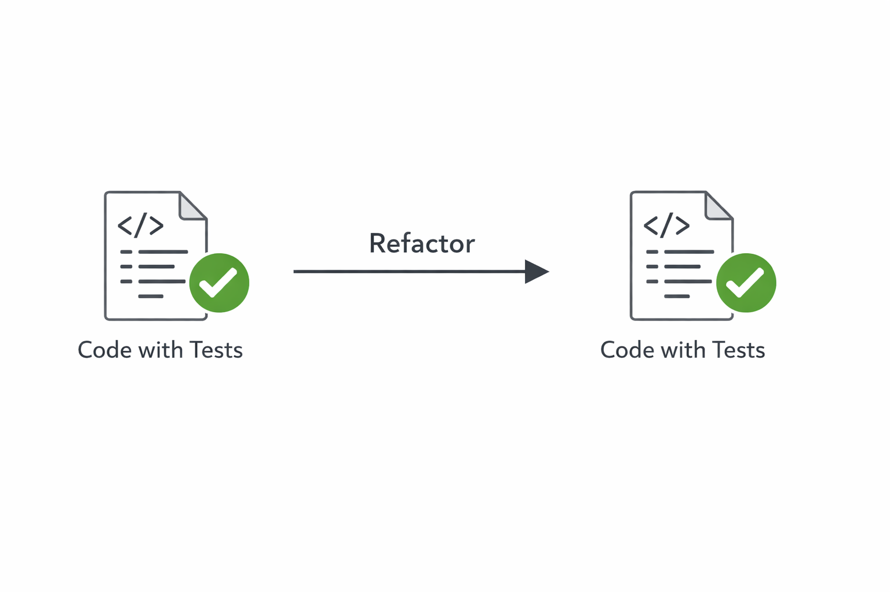

```java
// Перед рефакторингом - пишем тесты
@Test
public void testProcessOrder() {
    Order order = new Order(/* тестовые данные */);
    OrderService service = new OrderService();
    
    service.processOrder(order);
    
    assertThat(order.getStatus()).isEqualTo(OrderStatus.PROCESSED);
    // Другие assertions
}

// После рефакторинга - тесты должны проходить
public void processOrder(Order order) {
    validateOrder(order);
    checkInventory(order);
    calculateTotal(order);
    applyDiscounts(order);
    saveOrder(order);
    sendNotifications(order);
}
```

### Инструменты рефакторинга в IntelliJ IDEA

IntelliJ IDEA предоставляет мощные инструменты для безопасного рефакторинга:

#### Extract Method (Извлечение метода)
```java
// До: выделяем код для извлечения
public void processOrder(Order order) {
    // ... другой код
    double total = 0;
    for (Item item : order.getItems()) {
        total += item.getPrice() * item.getQuantity();
    }
    if (order.getCustomer().isPremium()) {
        total *= 0.9;
    }
    // ... другой код
}

// После: Ctrl+Alt+M (Extract Method)
public void processOrder(Order order) {
    // ... другой код
    double total = calculateOrderTotal(order);
    // ... другой код
}

private double calculateOrderTotal(Order order) {
    double total = 0;
    for (Item item : order.getItems()) {
        total += item.getPrice() * item.getQuantity();
    }
    if (order.getCustomer().isPremium()) {
        total *= 0.9;
    }
    return total;
}
```

#### Extract Variable (Извлечение переменной)
```java
// До
if (user.getAge() > 18 && user.getRegistrationDate().isAfter(LocalDate.now().minusYears(1))) {
    // ...
}

// После: Ctrl+Alt+V (Extract Variable)
boolean isAdult = user.getAge() > 18;
boolean isRecentlyRegistered = user.getRegistrationDate().isAfter(LocalDate.now().minusYears(1));

if (isAdult && isRecentlyRegistered) {
    // ...
}
```

#### Rename (Переименование)
```java
// До: непонятное имя
public class XYZService {
    public void proc(ABC abc) { /* ... */ }
}

// После: Shift+F6 (Rename)
public class OrderProcessingService {
    public void processOrder(Order order) { /* ... */ }
}
```

#### Другие полезные инструменты:
- **Extract Interface** — создание интерфейса из класса
- **Introduce Parameter** — добавление параметра в метод
- **Change Signature** — изменение сигнатуры метода
- **Safe Delete** — безопасное удаление с проверкой использования

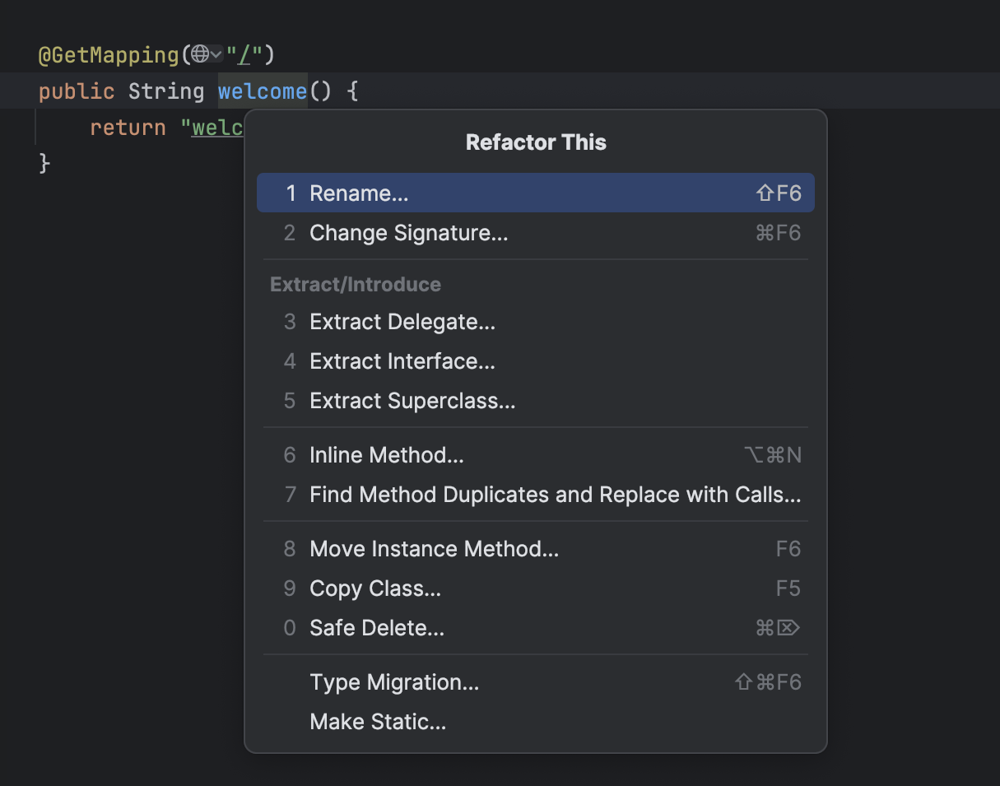

## 5. Шаблоны проектирования (Design Patterns)

> В процессе рефакторинга разработчики часто приходят к одинаковым архитектурным решениям.

**Design Pattern** — это типовое решение часто встречающейся проблемы проектирования.

*— Gamma, Helm, Johnson, Vlissides, "Design Patterns: Elements of Reusable Object-Oriented Software"*

### Что такое паттерны проектирования?

**Паттерны — это не:**
- Готовые библиотеки или фреймворки
- Конкретные реализации кода
- Строгие правила, которые нужно соблюдать

**Паттерны — это:**
- Абстрактные решения типовых задач
- Проверенные временем архитектурные подходы
- Язык общения между разработчиками
- Результат рефакторинга реальных систем

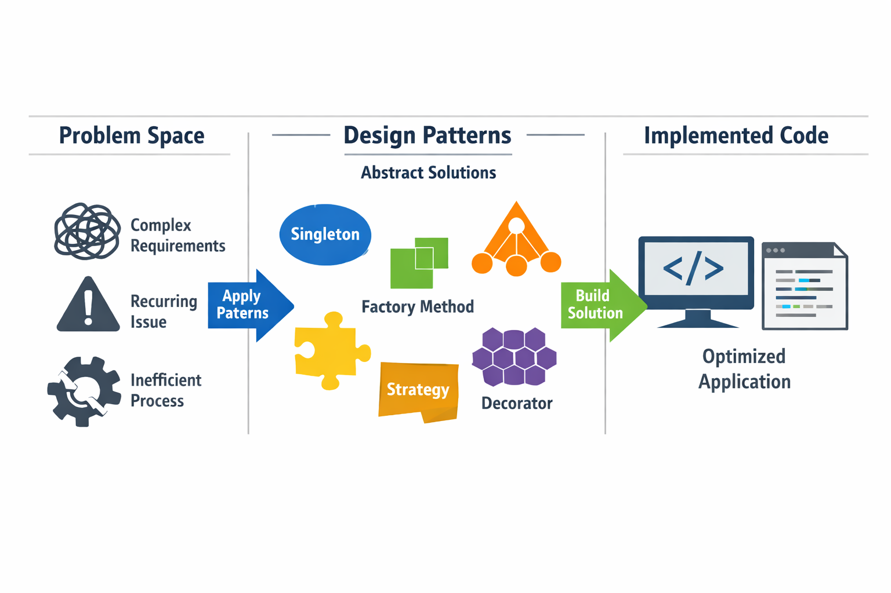

### Категории паттернов

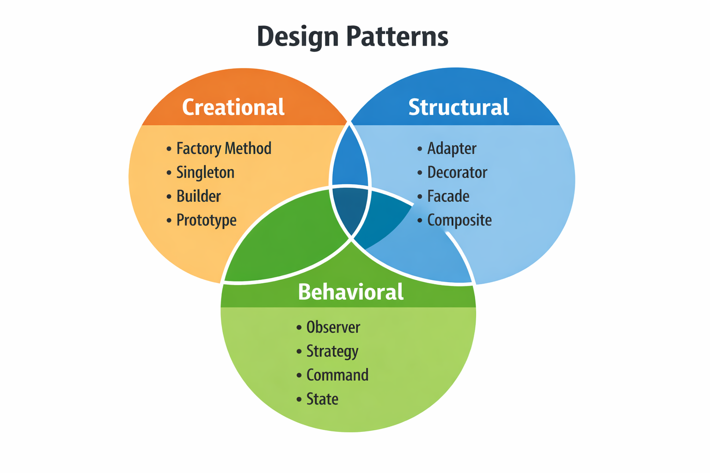

#### Creational Patterns (Порождающие паттерны)

**Проблема:** Создание объектов сложными способами

**Примеры:**
- **Factory Method** — создание объектов через подклассы
- **Abstract Factory** — создание семейств связанных объектов
- **Builder** — пошаговое создание сложных объектов
- **Singleton** — гарантия единственного экземпляра класса

```java
// Factory Method пример
// Проблема: нужно создавать разные типы платежей в зависимости от контекста
// Решение: делегировать создание подклассам
public interface PaymentProcessor {
    Payment createPayment(BigDecimal amount);
}

public class CreditCardProcessor implements PaymentProcessor {
    public Payment createPayment(BigDecimal amount) {
        return new CreditCardPayment(amount);
    }
}

public class PayPalProcessor implements PaymentProcessor {
    public Payment createPayment(BigDecimal amount) {
        return new PayPalPayment(amount);
    }
}

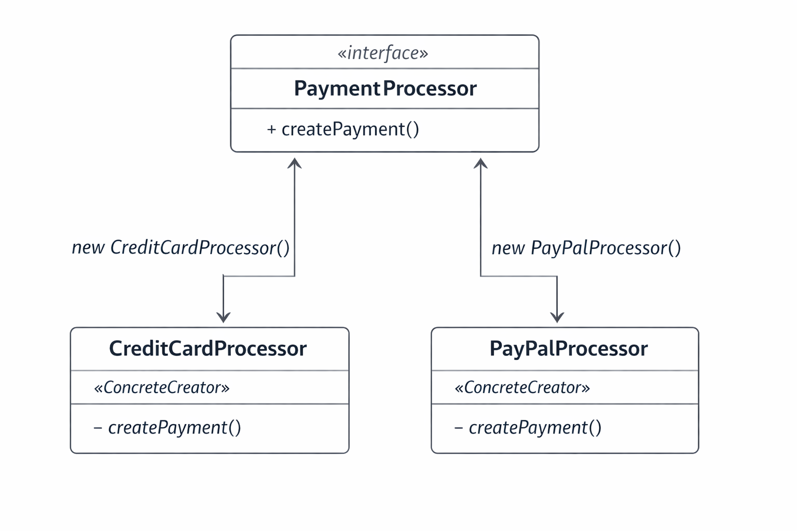

// Builder пример
// Проблема: создание объектов со многими параметрами, особенно когда некоторые необязательны
// Решение: пошаговое конструирование с ясным API
public class User {
    private final String name;
    private final String email;
    private final int age;
    private final String phone; // необязательное поле
    
    private User(Builder builder) {
        this.name = builder.name;
        this.email = builder.email;
        this.age = builder.age;
        this.phone = builder.phone;
    }
    
    public static class Builder {
        private String name;
        private String email;
        private int age;
        private String phone;
        
        // Обязательные параметры в конструкторе
        public Builder(String name, String email) {
            this.name = name;
            this.email = email;
        }
        
        public Builder age(int age) { this.age = age; return this; }
        public Builder phone(String phone) { this.phone = phone; return this; }
        
        public User build() {
            // Валидация при создании
            if (name == null || email == null) {
                throw new IllegalStateException("Name and email are required");
            }
            return new User(this);
        }
    }
}

// Использование
User user = new User.Builder("John", "john@example.com")
    .age(30)
    .phone("+1234567890")
    .build();
```

#### Structural Patterns (Структурные паттерны)

**Проблема:** Организация структуры системы и отношений между объектами

**Примеры:**
- **Adapter** — адаптация интерфейса к ожиданиям клиента
- **Decorator** — динамическое добавление ответственности объектам
- **Facade** — упрощенный интерфейс к сложной подсистеме
- **Proxy** — объект-заместитель с контролем доступа

```java
// Adapter пример
// Проблема: нужно использовать старую систему с новым интерфейсом
// Решение: создать адаптер, который преобразует интерфейсы
public interface ModernPaymentSystem {
    void pay(String cardNumber, BigDecimal amount);
}

public class LegacyPaymentSystem {
    public void processPayment(String card, String expiry, BigDecimal amount) {
        // Старая реализация с другим интерфейсом
        System.out.println("Processing payment: " + card + ", " + expiry + ", " + amount);
    }
}

public class PaymentAdapter implements ModernPaymentSystem {
    private LegacyPaymentSystem legacySystem;
    
    public PaymentAdapter(LegacyPaymentSystem legacySystem) {
        this.legacySystem = legacySystem;
    }
    
    public void pay(String cardNumber, BigDecimal amount) {
        // Адаптация интерфейса: преобразуем новый вызов в старый
        legacySystem.processPayment(cardNumber, "12/25", amount);
    }
}

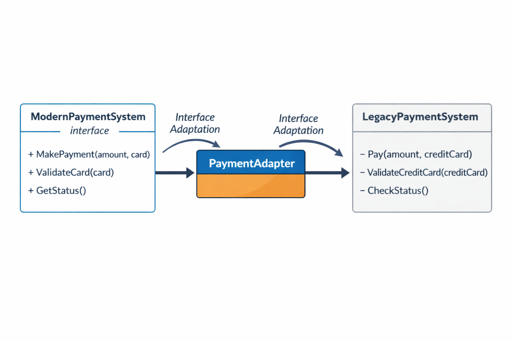

// Facade пример
// Проблема: сложная подсистема с множеством взаимодействий
// Решение: предоставить простой унифицированный интерфейс
public class OrderFacade {
    private InventoryService inventory;
    private PaymentService payment;
    private ShippingService shipping;
    private NotificationService notification;
    
    public OrderResult placeOrder(Order order) {
        // Скрываем сложность взаимодействия с несколькими сервисами
        inventory.reserveItems(order.getItems());
        PaymentResult paymentResult = payment.processPayment(order);
        
        if (paymentResult.isSuccess()) {
            shipping.scheduleDelivery(order);
            notification.sendOrderConfirmation(order);
            return new OrderResult(OrderStatus.CONFIRMED);
        } else {
            inventory.releaseItems(order.getItems());
            return new OrderResult(OrderStatus.FAILED);
        }
    }
}
```

#### Behavioral Patterns (Поведенческие паттерны)

**Проблема:** Взаимодействие и распределение ответственности между объектами

**Примеры:**
- **Strategy** — инкапсуляция алгоритмов для взаимозаменяемого использования
- **Observer** — уведомление зависимых объектов об изменениях
- **Command** — инкапсуляция запроса как объекта
- **Template Method** — определение скелета алгоритма с изменяющимися шагами

```java
// Strategy пример
// Проблема: нужно поддерживать разные алгоритмы скидок, которые могут меняться
// Решение: инкапсулировать каждый алгоритм в отдельный класс
public interface DiscountStrategy {
    BigDecimal applyDiscount(BigDecimal amount);
}

public class PercentageDiscount implements DiscountStrategy {
    private final BigDecimal percentage;
    
    public PercentageDiscount(BigDecimal percentage) {
        this.percentage = percentage;
    }
    
    public BigDecimal applyDiscount(BigDecimal amount) {
        return amount.multiply(BigDecimal.ONE.subtract(percentage));
    }
}

public class FixedAmountDiscount implements DiscountStrategy {
    private final BigDecimal fixedAmount;
    
    public FixedAmountDiscount(BigDecimal fixedAmount) {
        this.fixedAmount = fixedAmount;
    }
    
    public BigDecimal applyDiscount(BigDecimal amount) {
        return amount.subtract(fixedAmount).max(BigDecimal.ZERO);
    }
}

public class Order {
    private DiscountStrategy discountStrategy;
    
    public void setDiscountStrategy(DiscountStrategy strategy) {
        this.discountStrategy = strategy;
    }
    
    public BigDecimal calculateTotal(BigDecimal baseAmount) {
        if (discountStrategy != null) {
            return discountStrategy.applyDiscount(baseAmount);
        }
        return baseAmount;
    }
}


// Observer пример
// Проблема: нужно уведомлять несколько объектов об изменениях состояния
// Решение: механизм подписки и уведомления
public interface OrderObserver {
    void onStatusChange(Order order, OrderStatus newStatus);
}

public class EmailNotifier implements OrderObserver {
    public void onStatusChange(Order order, OrderStatus newStatus) {
        // Отправка email уведомления
        System.out.println("Sending email: Order " + order.getId() + " changed to " + newStatus);
    }
}

public class AnalyticsTracker implements OrderObserver {
    public void onStatusChange(Order order, OrderStatus newStatus) {
        // Отслеживание для аналитики
        System.out.println("Tracking analytics for order status change");
    }
}

public class OrderStatusNotifier {
    private List<OrderObserver> observers = new ArrayList<>();
    
    public void addObserver(OrderObserver observer) {
        observers.add(observer);
    }
    
    public void removeObserver(OrderObserver observer) {
        observers.remove(observer);
    }
    
    public void notifyStatusChange(Order order, OrderStatus newStatus) {
        for (OrderObserver observer : observers) {
            observer.onStatusChange(order, newStatus);
        }
    }
}
```

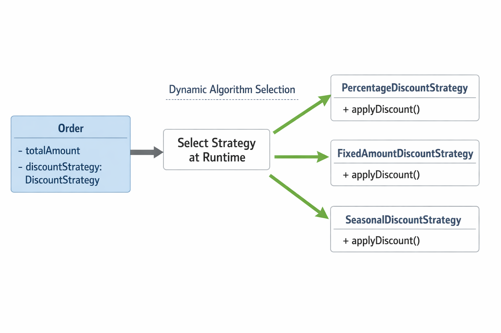

## Заключение

### Основная цепочка идей

```
Архитектура
↓
Принципы проектирования (SOLID, KISS, DRY, YAGNI)
↓
Code Smells (сигналы проблем)
↓
Refactoring (безопасное улучшение)
↓
Design Patterns (типовые решения)
```

### Ключевые выводы

1. **Архитектура определяет скорость разработки** — хорошая архитектура делает изменения быстрыми и безопасными
2. **Принципы — это ориентиры** — они помогают принимать правильные проектные решения
3. **Code smells — это сигналы** — они указывают на места, требующие внимания
4. **Рефакторинг — это процесс** — постоянное улучшение кода так же важно, как и написание нового
5. **Паттерны возникают естественно** — они являются результатом рефакторинга реальных систем

### Практические рекомендации

- **Начинайте с простого** — не пытайтесь предугадать все будущие потребности (YAGNI)
- **Рефакторите постоянно** — маленькие, безопасные изменения лучше больших переписываний
- **Изучайте паттерны на практике** — понимайте, какие проблемы они решают, а не просто запоминайте реализации
- **Пишите тесты** — они дают уверенность при рефакторинге
- **Используйте инструменты IDE** — они делают рефакторинг безопасным и эффективным

Помните: лучшая архитектура — это та, которая позволяет команде быстро и безопасно доставлять ценность пользователям.

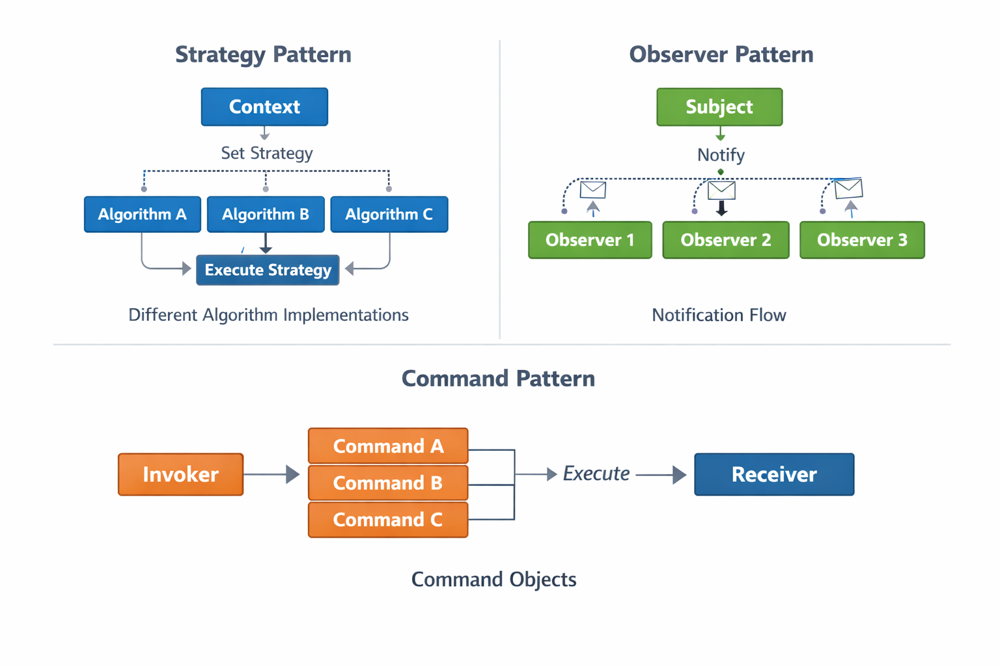


## Полезные ресурсы

- Martin Fowler — "Refactoring: Improving the Design of Existing Code"
- Gamma, Helm, Johnson, Vlissides — "Design Patterns: Elements of Reusable Object-Oriented Software"
- Robert C. Martin — "Clean Code: A Handbook of Agile Software Craftsmanship"
- IntelliJ IDEA Documentation on Refactoring