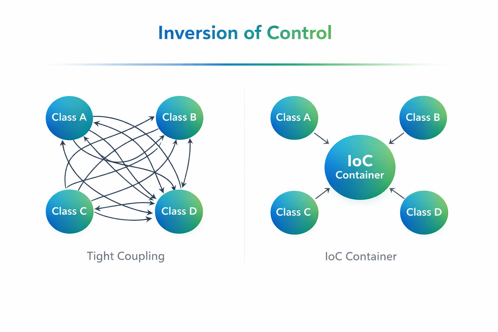
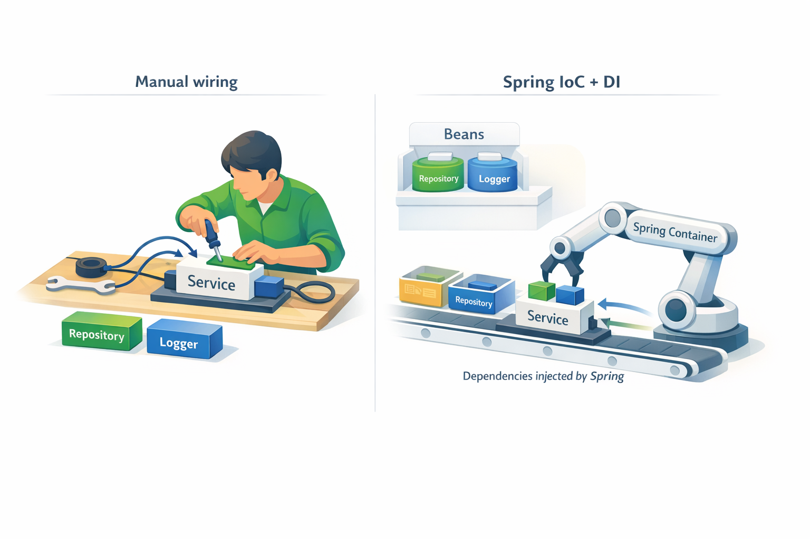
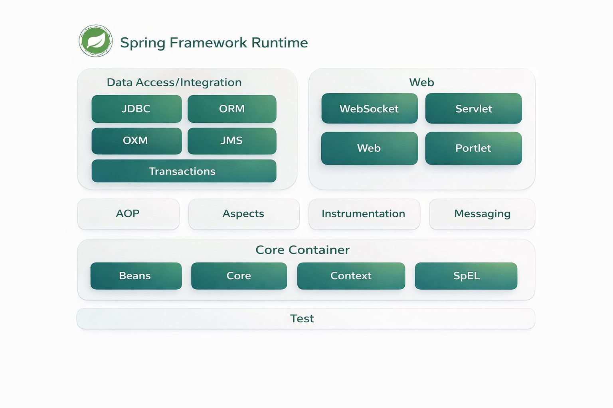
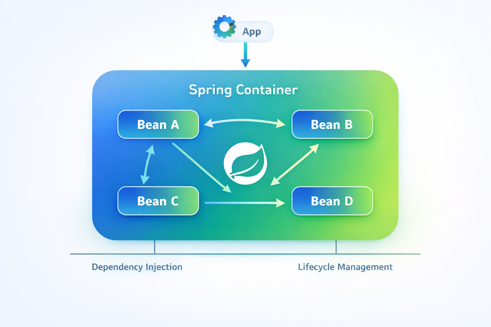
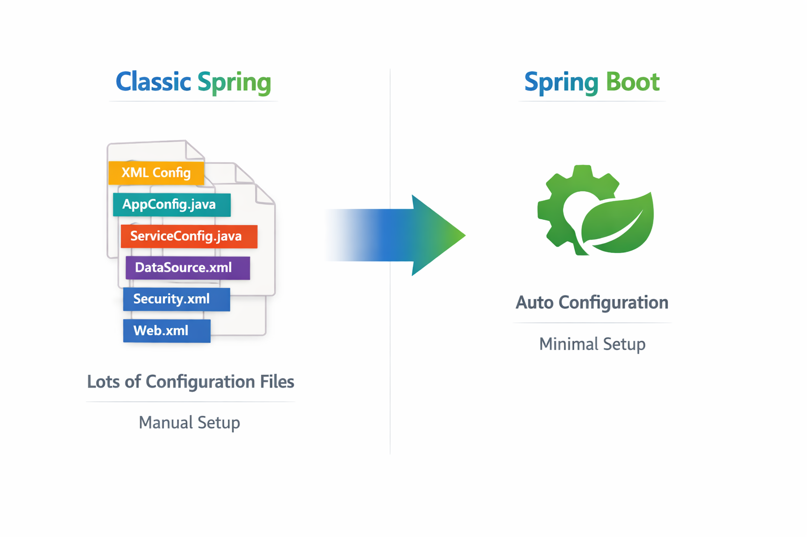
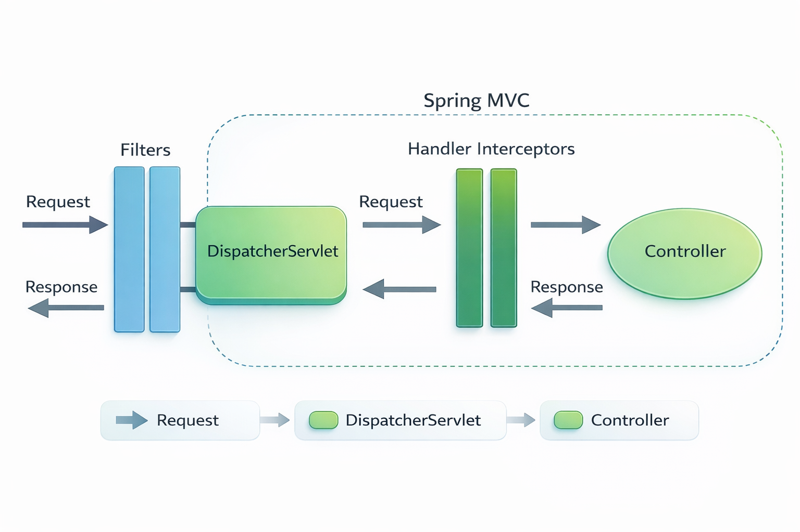

# Технологии программирования

[Главная](/) / Лекция 7. Spring Framework — от архитектурных проблем к модели исполнения

## Лекция 7. Spring Framework — от архитектурных проблем к модели исполнения

### Содержание
1. [Введение: от простого к сложному](#p1)
2. [Инверсия управления (IoC)](#p2)
3. [Dependency Injection](#p3)
4. [Ментальная модель: приложение как граф объектов](#p4)
5. [Spring Container](#p5)
6. [Бины и конфигурация](#p6)
7. [Autowiring](#p7)
8. [Конфигурация в классическом Spring](#p8)
9. [Spring Boot и автоконфигурация](#p9)
10. [Введение в Spring MVC (улучшенная версия)](#p10)
11. [Быстрый старт: Spring Initializr](#p11)
12. [Итоговая модель](#p12)

## 0. Введение: от простого к сложному <a name="p1"></a>

В начале разработки зависимости обычно выглядят просто:

```java
UserService service = new UserService(new UserRepository());
```

Но в реальном приложении ситуация быстро усложняется:

```java
class OrderService {
    private final PaymentService paymentService = new PaymentService(
        new BankClient(
            new HttpClient(),
            new RetryPolicy(),
            new MetricsCollector()
        )
    );
}
```

Здесь уже возникает несколько проблем:

- **Жесткая связанность** — невозможно заменить зависимости без изменения кода
- **Сложность тестирования** — нельзя легко подставить mock-объекты
- **Проблемы конфигурации** — разные реализации для разных окружений
- **Рост сложности** — код начинает «собирать сам себя»

👉 Важно: проблема не в количестве кода, а в том, **кто управляет зависимостями**

---
## 1. Инверсия управления (IoC) <a name="p2"></a>


### Что меняется концептуально

В классическом подходе программа сама управляет всем:

- создает объекты
- связывает их
- контролирует порядок вызовов

Инверсия управления (IoC) означает, что эти обязанности передаются внешнему компоненту — контейнеру.

---

### Что такое IoC Container

**IoC Container** — это компонент, который:
- создает объекты приложения
- знает, какие объекты от каких зависят
- автоматически связывает их между собой
- управляет их жизненным циклом

В Spring это реализовано через `ApplicationContext`.

---

### Ключевая идея

👉 Управление «инвертируется»: не код управляет системой, а инфраструктура управляет кодом

Это проявляется, например, в веб-разработке:

```java
@GetMapping("/users")
public List<User> getUsers() { ... }
```

Мы не вызываем этот метод напрямую — его вызывает фреймворк.

---




---
## 2. Dependency Injection <a name="p3"></a>


### Определение

**Dependency Injection (DI)** — это способ передачи зависимостей объекту извне, вместо их создания внутри.

---

### Связь с теорией

DI является практической реализацией принципа:

👉 **Dependency Inversion Principle (SOLID)**

Высокоуровневые модули не должны зависеть от низкоуровневых напрямую.

---

### Пример

❌ без DI:
```java
class UserService {
    private UserRepository repo = new UserRepository();
}
```

✅ с DI:
```java
class UserService {
    private final UserRepository repo;

    public UserService(UserRepository repo) {
        this.repo = repo;
    }
}
```




---

### Почему это важно

1. **Тестируемость**
```java
UserRepository mock = mock(UserRepository.class);
UserService service = new UserService(mock);
```

2. **Гибкость архитектуры**
- можно менять реализации без переписывания кода

3. **Явность зависимостей**
- зависимости видны в конструкторе

---

### Виды DI

- Constructor Injection — основной и рекомендуемый способ
- Setter Injection — для необязательных зависимостей
- Field Injection — не рекомендуется (скрытые зависимости)

---
## 3. Ментальная модель: приложение как граф объектов <a name="p4"></a>


Чтобы понять Spring, важно сменить модель мышления.

Приложение — это не просто набор классов, а **граф объектов**, где:

- вершины — объекты (сервисы, репозитории, контроллеры)
- ребра — зависимости между ними

Пример:

```text
UserController → UserService → UserRepository
```

---

### Что делает Spring

Spring:
1. анализирует зависимости между объектами
2. строит этот граф
3. создает объекты в правильном порядке
4. внедряет зависимости

Это позволяет не думать о создании объектов вручную.

---




---
## 4. Spring Container <a name="p5"></a>


### Определение

Spring Container — это реализация IoC Container в Spring.

Основной интерфейс — `ApplicationContext`.

---

### Что он делает

- создает объекты (beans)
- связывает зависимости (DI)
- управляет жизненным циклом

---

### Что такое Bean

**Bean** — это объект, который создается и управляется контейнером Spring.

Важно:
- не каждый объект в программе — bean
- только те, которые зарегистрированы в контейнере

---

### Жизненный цикл (упрощенно)

1. Создание объекта
2. Внедрение зависимостей
3. Инициализация
4. Использование
5. Уничтожение

---
## 5. Бины и конфигурация <a name="p6"></a>


### Как объявляются бины

```java
@Component
class UserRepository {}
```

```java
@Service
class UserService {}
```

```java
@Configuration
class AppConfig {
    @Bean
    UserService userService(UserRepository repo) {
        return new UserService(repo);
    }
}
```

---

### Что такое Scope

**Scope** определяет, сколько экземпляров объекта создается контейнером.

Основные варианты:

- **singleton** — один объект на всё приложение (по умолчанию)
- **prototype** — новый объект при каждом запросе

Важно понимать:
👉 scope влияет на поведение приложения и управление состоянием

---

### Ключевая мысль

👉 Мы описываем структуру приложения, а не процесс создания объектов

---




---
## 6. Autowiring <a name="p7"></a>


Autowiring — это механизм, с помощью которого Spring автоматически находит и внедряет зависимости.

---

### Как это работает

Основной принцип — поиск по типу:

```java
class UserService {
    public UserService(UserRepository repo) { ... }
}
```

Spring находит bean типа `UserRepository` и передает его.

---

### Проблема неоднозначности

Если есть несколько бинов одного типа:

```java
@Bean DataSource mysql()
@Bean DataSource postgres()
```

Spring не сможет выбрать автоматически.

---

### Решение

```java
@Qualifier("mysql")
```

или

```java
@Primary
```

---
## 7. Конфигурация в классическом Spring <a name="p8"></a>


До появления Spring Boot разработчик явно описывал конфигурацию приложения.

### XML-конфигурация (исторически основной способ)

```xml
<beans>
    <bean id="userRepository" class="com.example.UserRepository"/>

    <bean id="userService" class="com.example.UserService">
        <constructor-arg ref="userRepository"/>
    </bean>
</beans>
```

### Что здесь происходит

- мы **явно описываем бины**
- задаем зависимости между ними
- Spring использует эту конфигурацию для построения графа объектов

👉 Важно: конфигурация = описание графа зависимостей

---

### Java-конфигурация (более современный вариант)

```java
@Configuration
class AppConfig {

    @Bean
    UserRepository userRepository() {
        return new UserRepository();
    }

    @Bean
    UserService userService(UserRepository repo) {
        return new UserService(repo);
    }
}
```

### Что изменилось

- вместо XML — Java-код
- зависимости передаются через параметры методов
- Spring автоматически связывает бины

---

### Проблемы классического подхода

- много конфигурационного кода
- дублирование настроек
- сложный старт проекта
- нужно вручную подключать инфраструктуру (БД, web и т.д.)

---
## 7. Spring Boot и автоконфигурация <a name="p9"></a>


### Основная идея

👉 **Convention over Configuration**

Spring Boot:
- минимизирует конфигурацию
- автоматически настраивает приложение
- позволяет сосредоточиться на бизнес-логике

---

### Как работает автоконфигурация

Spring Boot:
1. анализирует classpath
2. определяет, какие библиотеки подключены
3. включает соответствующие конфигурации

---

### Пример: DataSource

Если в проекте есть:
- JDBC драйвер
- настройки подключения

Spring Boot автоматически:
- создаст DataSource
- подключит пул соединений

---

### Условная конфигурация

```java
@ConditionalOnClass(DataSource.class)
@ConditionalOnMissingBean(DataSource.class)
```

👉 Конфигурация включается только если:
- есть нужные классы
- бин еще не создан вручную

---

## Конфигурация через application.yml

Spring Boot выносит настройки в конфигурационные файлы:

```yaml
spring:
  datasource:
    url: jdbc:postgresql://localhost:5432/app
    username: user
    password: password
  jpa:
    hibernate:
      ddl-auto: update
```

---

### Что происходит

- Spring читает конфигурацию
- сопоставляет ее с классами настроек
- использует для создания бинов

---

## @SpringBootApplication

```java
@SpringBootApplication
public class App {
    public static void main(String[] args) {
        SpringApplication.run(App.class, args);
    }
}
```

---

### Что внутри

- @Configuration — класс конфигурации
- @ComponentScan — поиск компонентов
- @EnableAutoConfiguration — включает автоконфигурацию

---

## Как это связано с DI

Spring Boot не отменяет DI — он:
- просто автоматически создает нужные бины
- подключает их в контейнер

---

### Итог

| Подход | Что делает разработчик |
|------|----------------------|
| Классический Spring | вручную описывает все бины |
| Spring Boot | описывает только отклонения от стандартов |

---


---
## 8. Введение в Spring MVC (улучшенная версия) <a name="p10"></a>


Spring MVC — это модуль Spring, который реализует web-layer: связывает HTTP-запросы и Java-код.

---

## 8.1. Как проходит запрос




---

## 8.2. Аннотации и их смысл (с примерами)

### Контроллеры

```java
@Controller
class PageController {

    @GetMapping("/home")
    public String home() {
        return "home"; // имя HTML шаблона
    }
}
```

```java
@RestController
class UserController {

    @GetMapping("/users")
    public List<User> getUsers() {
        return List.of(new User("Alex"));
    }
}
```

👉 Разница:
- @Controller → возвращает представление (HTML)
- @RestController → возвращает данные (JSON)

---

### Mapping запросов

```java
@RequestMapping("/users")
class UserController {

    @GetMapping
    List<User> getAll() { ... }

    @PostMapping
    User create() { ... }
}
```

---

### Параметры запроса

#### PathVariable

```java
@GetMapping("/users/{id}")
User getUser(@PathVariable Long id) {
    return service.get(id);
}
```

---

#### Query параметры

```java
@GetMapping("/users")
List<User> findUsers(@RequestParam String name) {
    return service.findByName(name);
}
```

---

#### RequestBody

```java
@PostMapping("/users")
User createUser(@RequestBody User user) {
    return service.create(user);
}
```

---

### Комбинированный пример

```java
@RestController
@RequestMapping("/users")
class UserController {

    @GetMapping("/{id}")
    User get(@PathVariable Long id) {
        return service.get(id);
    }

    @GetMapping
    List<User> search(@RequestParam(required = false) String name) {
        return service.search(name);
    }

    @PostMapping
    User create(@RequestBody User user) {
        return service.create(user);
    }
}
```

---

## 8.3. Как данные проходят через систему

Когда приходит запрос:

- Spring извлекает параметры (URL, query, body)
- преобразует их в Java-объекты
- вызывает метод
- результат преобразует в JSON

👉 Все это происходит автоматически через инфраструктуру Spring

---

## 8.4. Связь с архитектурой

```text
Controller → Service → Repository
```

- Controller — HTTP слой
- Service — бизнес-логика
- Repository — доступ к данным

---

## 8.5. Итоговая модель

Spring MVC:
- принимает HTTP
- маршрутизирует запрос
- подготавливает данные
- вызывает код
- возвращает ответ

👉 Вы описываете правила обработки, а не работаете с HTTP напрямую
## 9 Быстрый старт: Spring Initializr <a name="p11"></a>


**Spring Initializr** — это официальный инструмент для генерации готового каркаса Spring Boot приложения.

👉 Его задача — убрать рутинный старт проекта и сразу дать рабочую основу.

---

### Что он делает

При генерации проекта:
- создает структуру проекта (Maven/Gradle)
- добавляет зависимости (starter’ы)
- генерирует главный класс с `@SpringBootApplication`
- настраивает базовую конфигурацию

---

### Как им пользоваться

1. Выбрать:
   - язык (Java/Kotlin)
   - сборщик (Maven/Gradle)
   - версию Spring Boot

2. Добавить зависимости (например):
   - Spring Web
   - Spring Data JPA
   - PostgreSQL Driver

3. Скачать и открыть проект

---

### Что получается на выходе

Минимальное приложение:

```java
@SpringBootApplication
public class App {
    public static void main(String[] args) {
        SpringApplication.run(App.class, args);
    }
}
```

👉 Такой проект уже можно запустить — он поднимет Spring-контекст и (при наличии web starter) встроенный сервер.

---

### Важная идея

👉 Spring Initializr не добавляет «магии» —  
он просто **генерирует правильную конфигурацию**, которую можно было бы написать вручную.

---

### Когда использовать

- всегда при старте нового проекта
- для экспериментов и прототипов
- как эталон структуры Spring Boot приложения


---
## 10. Итоговая модель <a name="p12"></a>


Spring можно рассматривать как среду выполнения для графа зависимостей.

Он:
- создает объекты
- связывает их
- управляет ими
- вызывает нужный код в нужный момент

---

### 4 ключевые идеи

1. IoC — управление передано контейнеру
2. DI — способ связывания зависимостей
3. Bean — управляемый объект
4. Boot — автоматизация конфигурации
