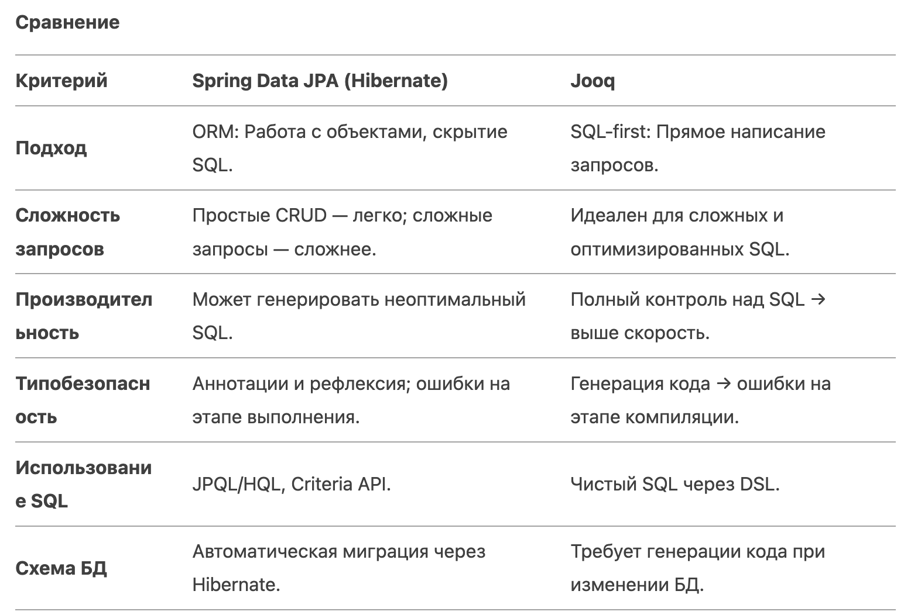

# Технологии программирования

[Назад на главную](/)

# Конспект лекции: Spring Framework. JPA. Hibernate

JPA (Java Persistence API) - это стандарт языка Java для управления реляционными данными в Java-приложениях. По сути, это набор правил и инструментов, которые позволяют работать с базами данных, используя объекты Java.

JPA (Java Persistence API) определен как официальный стандарт Java, который является частью платформы Java EE (Enterprise Edition). Он описан в спецификации JSR 338 (Java Specification Request).

## Где определен JPA:

- В спецификации Java EE: JPA является частью Enterprise Edition Java, которая содержит официальные документы и требования к реализации.
- В стандартных интерфейсах и классах: Основные классы и интерфейсы JPA находятся в пакетах:
  - javax.persistence - основной пакет с ключевыми интерфейсами и аннотациями 
  - java.lang - базовые классы 
  - java.sql - для работы с SQL 
- В документации: Спецификация JPA подробно описана в официальной документации Java, где указаны:
  - Требования к реализации
  - Описание всех API
  - Примеры использования
  - Ограничения и особенности 
  - Как используется в коде:

## Аннотации: 
Основные аннотации JPA используются для определения сущностей и их связей:
- @Entity - для определения класса как сущности
- @Id - для определения первичного ключа
- @Table - для указания имени таблицы
- @Column - для определения столбцов
- @ManyToOne, @OneToMany и другие для определения связей

## Интерфейсы: Основные интерфейсы для работы с данными:
- EntityManager - основной интерфейс для операций с данными
- EntityManagerFactory - для создания EntityManager
- CriteriaBuilder - для создания критериев запросов
- Query - для выполнения запросов
- XML-маппинг: Альтернативно можно использовать XML-файлы для описания маппинга объектов на таблицы.

```java
// Импорт пакетов JPA
import javax.persistence.*;

@Entity
@Table(name = "users")
public class User {
    @Id
    @GeneratedValue(strategy = GenerationType.IDENTITY)
    private Long id;
    
    @Column(name = "user_name")
    private String name;
    
    // геттеры и сеттеры
}
```

## 1. Spring JPA (Spring Data JPA)

Что это?
Spring Data JPA — это модуль фреймворка Spring, упрощающий интеграцию с JPA (Java Persistence API). Он предоставляет абстракцию над JPA, автоматизируя рутинные операции (CRUD) через репозитории и уменьшая объем шаблонного кода.

Особенности:

- **Репозитории:** Интерфейсы, наследуемые от JpaRepository, автоматически реализуют базовые методы (сохранение, удаление, поиск).

- **Query Methods:** Генерация запросов на основе имен методов (например, findByUsername(String name)).

- **Аннотации:** Использует JPA-аннотации (@Entity, @Id) для маппинга объектов на таблицы.


```java
// Сущность User
@Entity
@Table(name = "users")
public class User {
    @Id
    @GeneratedValue(strategy = GenerationType.IDENTITY)
    private Long id;
    private String username;
    // геттеры и сеттеры
}

// Репозиторий
public interface UserRepository extends JpaRepository<User, Long> {
    // Автоматическая реализация метода
    List<User> findByUsername(String username);

    // Кастомный запрос через JPQL
    @Query("SELECT u FROM User u WHERE u.username LIKE %:keyword%")
    List<User> searchByKeyword(@Param("keyword") String keyword);
}

// Использование в сервисе
@Service
public class UserService {
    @Autowired
    private UserRepository userRepository;

    public List<User> findUsersByName(String name) {
        return userRepository.findByUsername(name);
    }
}
```

## Hibernate

Что это?
Hibernate — самая популярная реализация JPA, предоставляющая ORM (Object-Relational Mapping). Он преобразует объекты Java в записи БД и наоборот, управляя жизненным циклом сущностей.

Особенности:

- Маппинг: Аннотации (@Entity, @OneToMany) для связи классов и таблиц.
- HQL (Hibernate Query Language): SQL-подобный язык для работы с объектами.
- Кэширование: Поддержка кэширования первого и второго уровня.


```java
// Сущность Product
@Entity
@Table(name = "products")
public class Product {
    @Id
    @GeneratedValue
    private Long id;
    private String name;
    private Double price;
    // геттеры и сеттеры
}

// Использование Hibernate через EntityManager
@Repository
public class ProductDao {
    @PersistenceContext
    private EntityManager entityManager;

    public List<Product> findExpensiveProducts(double minPrice) {
        return entityManager.createQuery(
            "SELECT p FROM Product p WHERE p.price > :price", Product.class)
            .setParameter("price", minPrice)
            .getResultList();
    }
}
```

Основные преимущества:

- Значительно ускоряет разработку
- Упрощает код благодаря автоматизации рутинных операций
- Хорошо интегрируется с другими Java-инструментами
- Обеспечивает независимость от конкретной СУБД
- Имеет большое сообщество и много документации


Основные недостатки:

- Требует времени на изучение
- Может снижать производительность при сложных моделях данных
- Иногда проявляет непредсказуемое поведение из-за особенностей JPA
- Имеет ограничения в кэшировании изменяемых данных
- Может создавать более тяжелый код по сравнению с “чистым” SQL

## Jooq (Java Object Oriented Querying)

Что это?
Jooq — библиотека для типобезопасного SQL. Вместо ORM она генерирует Java-классы по схеме БД, позволяя писать SQL-запросы через DSL (Domain-Specific Language).

Особенности:

- Генерация кода: Создает Java-классы для таблиц, полей и запросов на основе DDL.

- DSL API: Синтаксис, близкий к SQL (например, selectFrom(...).where(...)).

- Полный контроль над SQL: Подходит для сложных запросов и оптимизации.

```java
// Генерируемый класс Tables содержит метаданные БД
// Предположим, есть таблица "authors"
public class AuthorService {
    public void getAuthorsByCountry(Connection connection, String country) {
        DSLContext ctx = DSL.using(connection, SQLDialect.POSTGRES);
        
        // Типобезопасный запрос
        Result<Record> result = ctx.select()
            .from(Tables.AUTHORS)
            .where(Tables.AUTHORS.COUNTRY.eq(country))
            .fetch();

        for (Record r : result) {
            System.out.println(r.getValue(Tables.AUTHORS.NAME));
        }
    }
}
```
## Сравнение Hibernate и Jooq



---

