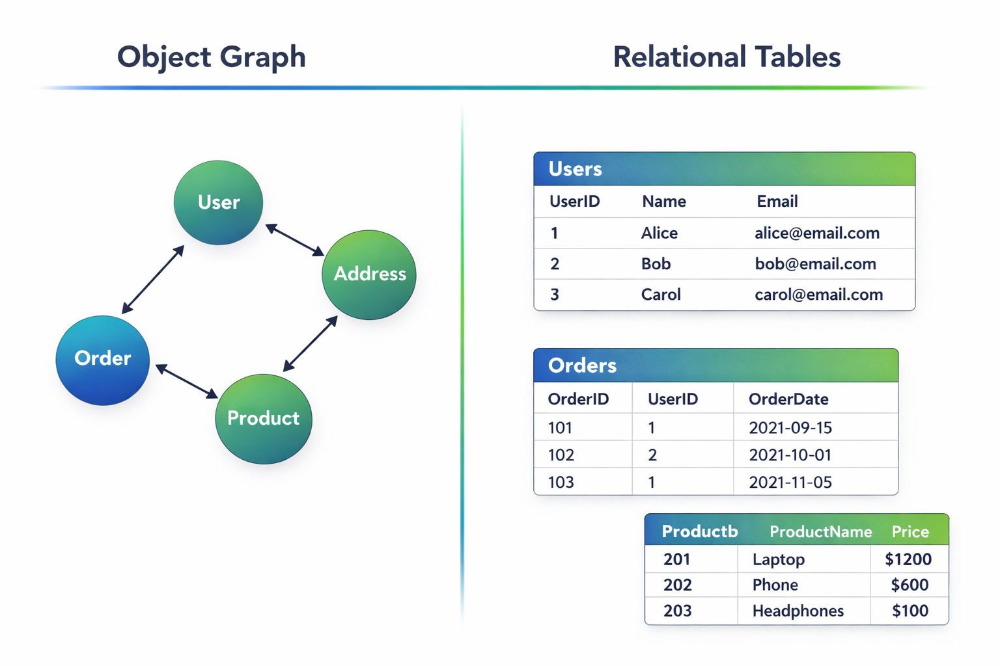
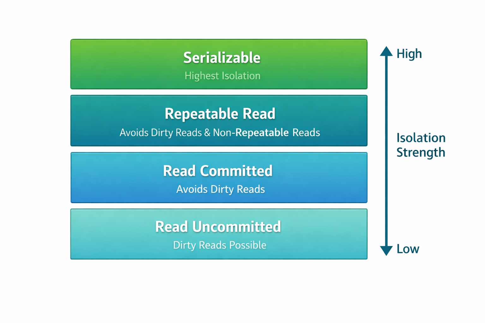
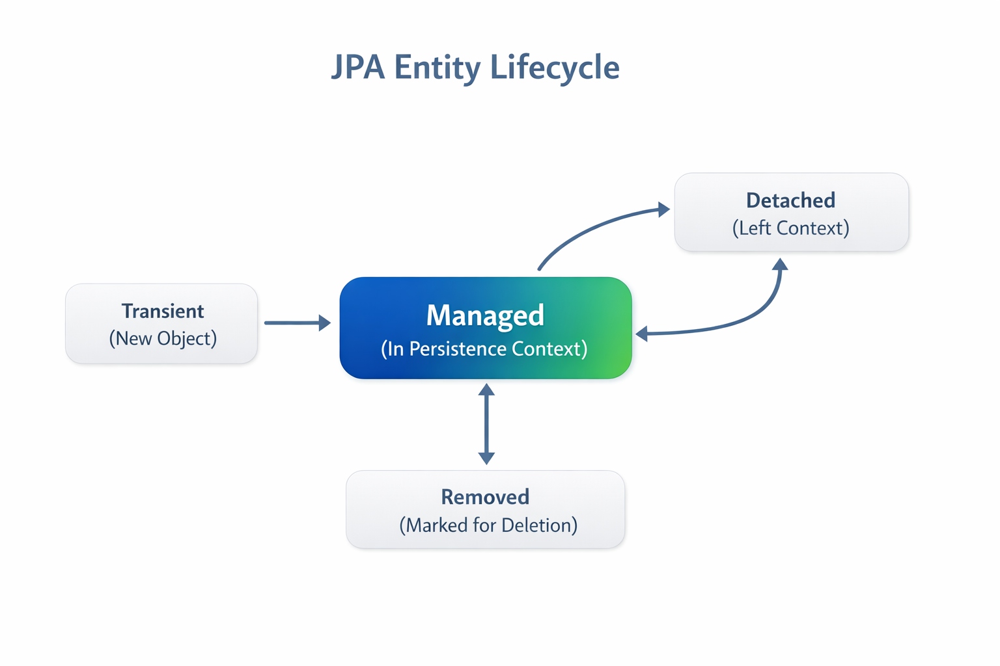
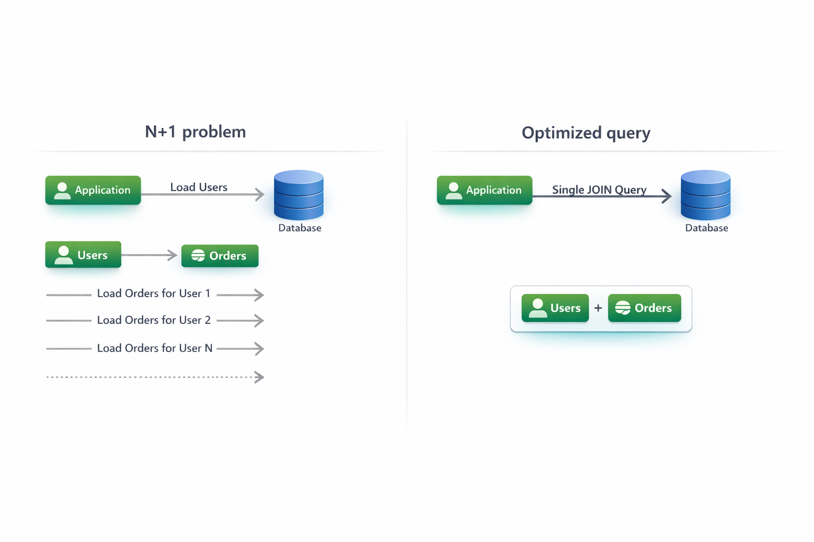
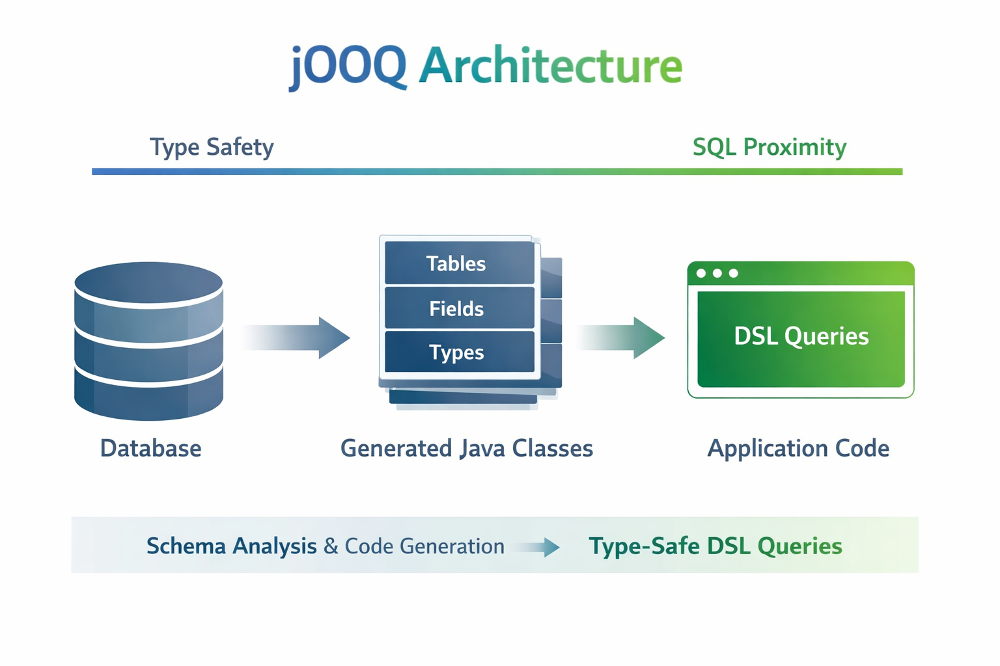
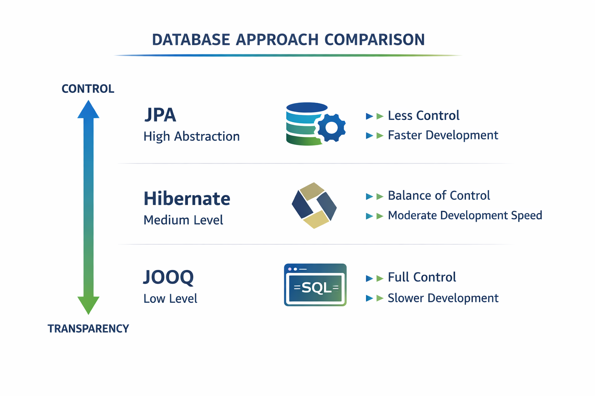

# Технологии программирования

[Главная](/) / Лекция 8. Spring Framework. JPA. Hibernate

## Лекция 8. Spring Framework. JPA. Hibernate (Advanced)

### Содержание
1. [Object-relational impedance mismatch](#p1)
2. [Модель данных и транзакции](#p2)
3. [JPA как абстракция](#p3)
4. [Hibernate: как это реально работает](#p4)
5. [Проблемы ORM](#p5)
6. [Spring Data JPA](#p6)
7. [JOOQ](#p7)
8. [Trade-offs](#p8)

---

## 1. Object-relational impedance mismatch <a name="p1"></a>

Перед тем как говорить про JPA или Hibernate, важно понять фундаментальную проблему.

В коде мы работаем с объектами:
- они связаны друг с другом через ссылки
- образуют граф
- могут быть вложенными

В базе данных данные устроены иначе:
- таблицы
- строки
- связи через внешние ключи

-> Это две разные модели представления данных.

Например:

- в коде: `User -> List<Order>`
- в базе: две таблицы + JOIN

Каждый раз, когда мы работаем с базой, нам приходится:
- превращать строки в объекты
- собирать граф объектов вручную
- следить за согласованностью

-> Этот разрыв между моделями называется **object-relational impedance mismatch**


---

## 2. Модель данных и транзакции <a name="p2"></a>

Работа с базой — это не только получение данных, но и управление состоянием системы.

### ACID

Любая транзакционная СУБД гарантирует:

- Atomicity — либо все, либо ничего
- Consistency — данные остаются корректными
- Isolation — транзакции не мешают друг другу
- Durability — изменения не теряются

-> ORM не отменяет эти свойства — он просто работает поверх них

---

### Уровни изоляции

Важно понимать, что разные уровни изоляции дают разное поведение:

- Read Committed — читаем только подтвержденные данные
- Repeatable Read — данные не меняются в рамках транзакции
- Serializable — полная изоляция

-> Эти вещи напрямую влияют на поведение приложения



---

## 3. JPA как абстракция <a name="p3"></a>


JPA (Java Persistence API) - это стандарт языка Java для управления реляционными данными в Java-приложениях. По сути, это набор правил и инструментов, которые позволяют работать с базами данных, используя объекты Java.

JPA (Java Persistence API) определен как официальный стандарт Java, который является частью платформы Java EE (Enterprise Edition). Он описан в спецификации JSR 338 (Java Specification Request).


JPA — это стандарт, который описывает, как работать с данными через объекты.
Он не реализует ничего сам — он задает правила.

### Где определен JPA:

- В спецификации Java EE: JPA является частью Enterprise Edition Java, которая содержит официальные документы и требования к реализации.
- В стандартных интерфейсах и классах: Основные классы и интерфейсы JPA находятся в пакетах:
    - javax.persistence - основной пакет с ключевыми интерфейсами и аннотациями
    - java.lang - базовые классы
    - java.sql - для работы с SQL
- В документации: Спецификация JPA подробно описана в официальной документации Java, где указаны:
    - Требования к реализации
    - Описание всех API
    - Примеры использования
    - Ограничения и особенности

---

### Основная идея

-> вместо SQL мы работаем с объектами

---

### Аннотации:
Основные аннотации JPA используются для определения сущностей и их связей:
- @Entity - для определения класса как сущности
- @Id - для определения первичного ключа
- @Table - для указания имени таблицы
- @Column - для определения столбцов
- @ManyToOne, @OneToMany и другие для определения связей

### Интерфейсы: Основные интерфейсы для работы с данными:
- EntityManager - основной интерфейс для операций с данными
- EntityManagerFactory - для создания EntityManager
- CriteriaBuilder - для создания критериев запросов
- Query - для выполнения запросов
- XML-маппинг: Альтернативно можно использовать XML-файлы для описания маппинга объектов на таблицы.


### Persistence Context

Ключевая концепция JPA — это **Persistence Context**.

-> Это не просто “хранилище объектов”, а механизм, который обеспечивает согласованность между объектами в памяти и данными в базе.

---

#### Что это такое

**Persistence Context** — это набор сущностей, которыми управляет JPA в рамках одной сессии работы с базой.

Проще:

-> это “область”, внутри которой:
- объекты считаются управляемыми (managed)
- изменения отслеживаются
- обеспечивается идентичность объектов

---

#### Основные свойства

##### 1. Identity Map

Внутри Persistence Context действует правило:

-> **одна запись в БД = один объект в памяти**

```java
User u1 = entityManager.find(User.class, 1);
User u2 = entityManager.find(User.class, 1);

u1 == u2 // true
```

---

##### 2. Управляемые сущности (Managed state)

Сущности бывают в разных состояниях:

- **Transient** — просто создан объект
- **Managed** — находится в Persistence Context
- **Detached** — был управляемым, но вышел из контекста
- **Removed** — помечен на удаление

-> Только managed-сущности отслеживаются



---

##### 3. Dirty Checking

Persistence Context отслеживает изменения объектов:

```java
user.setName("new");
```

-> при commit JPA сам сгенерирует SQL

---

#### Как он устроен внутри

Концептуально Persistence Context — это:

- Map (id → entity)
- механизм отслеживания изменений

```text
id → entity instance
```

---

#### Где он определен

##### JPA (спецификация)

JPA:
- определяет **что такое Persistence Context**
- задает правила поведения
- описывает lifecycle

-> но не говорит, как именно это реализовать

---

## 4. Hibernate: как это реально работает <a name="p4"></a>

### Что это такое

Hibernate — это полноценная ORM-библиотека (Object-Relational Mapping), которая решает задачу преобразования объектной модели приложения в реляционную модель базы данных и обратно.

Важно различать уровни:

- **JPA** — это спецификация (контракт, набор правил)
- **Hibernate** — конкретная реализация этой спецификации

В экосистеме Spring:

- Hibernate не является модулем Spring  
- но используется внутри Spring Data JPA как реализация по умолчанию

То есть, когда вы используете Spring Data JPA — под капотом почти всегда работает именно Hibernate.

---

### Что делает Hibernate

Hibernate берет на себя всю «грязную работу» взаимодействия с базой данных:

- преобразует объекты в SQL-запросы
- преобразует ResultSet обратно в объекты
- управляет жизненным циклом сущностей
- реализует Persistence Context
- отслеживает изменения (dirty checking)
- управляет загрузкой данных (lazy/eager)

-> По сути, Hibernate — это слой между вашим кодом и базой данных.

---

### Практический пример (единый через весь блок)

Будем использовать модель:

- User (пользователь)
- Order (заказ)

Это классическая one-to-many связь.

---

#### Сущности

```java
@Entity
@Table(name = "users")
public class User {

    @Id
    @GeneratedValue
    private Long id;

    private String name;

    @OneToMany(mappedBy = "user", fetch = FetchType.LAZY)
    private List<Order> orders;
}
```

```java
@Entity
@Table(name = "orders")
public class Order {

    @Id
    @GeneratedValue
    private Long id;

    private String description;

    @ManyToOne
    @JoinColumn(name = "user_id")
    private User user;
}
```

-> Здесь важно понимать:

- `mappedBy` говорит, что связь управляется другой стороной
- `@JoinColumn` определяет внешний ключ
- `LAZY` означает, что данные подгружаются по требованию

---

### Как подключить Hibernate

#### Gradle зависимости

В современном Spring-проекте напрямую Hibernate почти не подключают.

```groovy
dependencies {
    implementation 'org.springframework.boot:spring-boot-starter-data-jpa'
    implementation 'org.postgresql:postgresql'
}
```

-> starter уже содержит Hibernate

Это важный момент:

-> вы не работаете напрямую с Hibernate  
-> но он выполняет всю работу

---

### Настройка подключения к базе

```yaml
spring:
  datasource:
    url: jdbc:postgresql://localhost:5432/app
    username: user
    password: password

  jpa:
    hibernate:
      ddl-auto: update
    show-sql: true
```

Что здесь происходит:

- datasource — подключение к БД
- ddl-auto — управление схемой (создание/обновление)
- show-sql — вывод SQL в лог

-> Это минимальный набор, которого достаточно для старта

---

### Связи между сущностями

Hibernate поддерживает все основные типы связей.

---

#### One-to-Many / Many-to-One

Самая распространенная связь:

```java
@OneToMany(mappedBy = "user")
List<Order> orders;

@ManyToOne
User user;
```

-> Один пользователь — много заказов  
-> Каждый заказ — один пользователь

---

#### One-to-One

```java
@OneToOne
@JoinColumn(name = "profile_id")
Profile profile;
```

-> Один к одному — используется реже, обычно для расширения сущности

---

#### Many-to-Many

```java
@ManyToMany
@JoinTable(
    name = "user_roles",
    joinColumns = @JoinColumn(name = "user_id"),
    inverseJoinColumns = @JoinColumn(name = "role_id")
)
List<Role> roles;
```

-> Реализуется через промежуточную таблицу

---

### N+1 проблема

Это одна из самых частых проблем при использовании Hibernate.

Пример:

```java
List<User> users = userRepository.findAll();

for (User u : users) {
    u.getOrders().size();
}
```

Что происходит:

1. Hibernate делает запрос за пользователями
2. Затем для каждого пользователя делает отдельный запрос за заказами

-> В итоге:
- 1 запрос + N запросов



---

### Решение: EntityGraph

По умолчанию Hibernate управляет загрузкой связей через стратегии `LAZY` и `EAGER`.  

Если используется `LAZY`, связанные данные (например, `orders`) не загружаются сразу — и при обращении к ним возникает N+1 проблема (много отдельных запросов). Если использовать `EAGER`, Hibernate всегда будет подтягивать связи, даже если они не нужны — это приводит к over-fetching.

`EntityGraph` позволяет управлять этим поведением точечно: оставить `LAZY` по умолчанию, но в конкретном запросе явно указать, какие связи нужно загрузить сразу. В нашем примере с `User → orders` это позволяет избежать N+1, не делая загрузку заказов глобально `EAGER`.

```java
@EntityGraph(attributePaths = {"orders"})
List<User> findAll();
```

Что это дает:

- Hibernate делает JOIN
- данные загружаются одним запросом


-> Это способ явно управлять стратегией загрузки

---

## 5. Проблемы ORM <a name="p5"></a>

Hibernate часто вызывает споры в индустрии.

Причина в том, что он решает одни проблемы, но создает другие.

---

#### Плюсы

- ускоряет разработку
- уменьшает количество кода
- интегрируется со Spring
- позволяет мыслить в терминах объектов

---

#### Минусы

##### 1. Потеря прозрачности

Разработчик не всегда понимает:
- какой SQL выполняется
- сколько запросов идет в базу

---

##### 2. Скрытая сложность

Под капотом:
- lazy loading
- persistence context
- кеш
- прокси

-> Все это влияет на поведение системы

---

##### 3. Производительность

Ошибки вроде:
- N+1
- лишних JOIN
- неоптимальных запросов

-> проявляются только под нагрузкой

---

#### Главная причина холиваров

-> Hibernate поднимает уровень абстракции  
-> но скрывает детали работы базы данных

---

### Итог

Hibernate — это мощный инструмент, который:

- реализует JPA
- управляет объектами и SQL
- упрощает разработку

Но:

-> его нужно использовать осознанно

- понимать SQL
- понимать транзакции
- понимать, что происходит под капотом

-> иначе он начинает «работать против вас»

---

## 6. Spring Data JPA <a name="p6"></a>

Spring Data JPA упрощает работу с JPA.

**Spring Data JPA** — это надстройка над JPA, которая упрощает работу с базой данных на уровне приложения. Она предоставляет готовую абстракцию репозиториев, избавляя разработчика от необходимости вручную писать реализацию DAO-слоя. Под капотом она использует JPA (а чаще всего — Hibernate), но добавляет удобный API: генерацию запросов по названию методов, интеграцию со Spring, работу с транзакциями и минимизацию boilerplate-кода.

**Hibernate** — это реализация JPA, которая отвечает за реальную работу с базой данных: генерацию SQL, управление сущностями, persistence context, lazy loading и т.д. Главное отличие:  
👉 Hibernate — это **движок (engine)**,  
👉 Spring Data JPA — это **обертка/интерфейс для удобной работы с этим движком**.  
То есть Spring Data JPA не заменяет Hibernate, а использует его внутри.

---

### Пример

#### Entity

```java
@Entity
@Table(name = "users")
public class User {

  @Id
  @GeneratedValue
  private Long id;

  private String name;

  private String email;
}
```

```java
public interface UserRepository extends JpaRepository<User, Long> {

    // простой метод — генерируется автоматически
    List<User> findByName(String name);

    // кастомный запрос
    @Query("SELECT u FROM User u WHERE u.email LIKE %:email%")
    List<User> searchByEmail(@Param("email") String email);
}
```

```java
@Service
public class UserService {

    private final UserRepository userRepository;

    public UserService(UserRepository userRepository) {
        this.userRepository = userRepository;
    }

    public void example() {
        // простой запрос
        List<User> users = userRepository.findByName("Alex");

        // кастомный запрос
        List<User> emails = userRepository.searchByEmail("gmail");
    }
}
```


#### Когда использовать

- CRUD операции
- простые фильтры
- быстрый старт

---

## 7. JOOQ <a name="p7"></a>


### Что это такое

**jOOQ** — это Java-библиотека для типобезопасной работы с SQL.  
Название расшифровывается как **Java Object Oriented Querying**.

Важно понимать его место в экосистеме:

- jOOQ — это **не ORM**
- jOOQ — это **SQL DSL** (domain-specific language для написания SQL в коде)
- jOOQ не пытается скрыть реляционную модель, а наоборот — позволяет работать с ней более удобно и безопасно

Если Hibernate и JPA поднимают уровень абстракции и позволяют мыслить объектами, то jOOQ остается ближе к самой базе данных:

👉 вы по-прежнему мыслите таблицами, полями, join-ами, group by, aggregation и SQL-операциями,  
но пишете это в виде Java-кода с типовой проверкой.

---

### Принцип работы

Главная идея jOOQ состоит в том, что структура базы данных сначала **генерируется в виде Java-классов**, а затем эти классы используются для построения запросов.

Например, если в базе есть таблица `users`, то jOOQ сгенерирует для нее Java-описание:

- таблицу `USERS`
- поля `USERS.ID`, `USERS.NAME`, `USERS.EMAIL`
- типы данных этих полей

После этого запросы можно писать не строками, а через DSL:

```java
var result = dsl
    .select(USERS.ID, USERS.NAME)
    .from(USERS)
    .where(USERS.NAME.eq("Alex"))
    .fetch();
```

Это дает несколько важных эффектов:

- запросы становятся **типобезопасными**
- IDE подсказывает поля и таблицы
- меньше риска ошибиться в имени таблицы или колонки
- код ближе к SQL, чем при использовании ORM

👉 Важная особенность jOOQ: он не скрывает SQL, а делает его удобнее и безопаснее.

---

### Практический пример

Будем использовать ту же модель, что и в предыдущих блоках:

- `users`
- `orders`

Например, нам нужно получить всех пользователей по имени:

```java
var users = dsl
    .selectFrom(USERS)
    .where(USERS.NAME.eq("Alex"))
    .fetch();
```

А теперь более интересный запрос: получить пользователей и количество их заказов.

```java
var result = dsl
    .select(
        USERS.ID,
        USERS.NAME,
        count(ORDERS.ID).as("orders_count")
    )
    .from(USERS)
    .leftJoin(ORDERS).on(ORDERS.USER_ID.eq(USERS.ID))
    .groupBy(USERS.ID, USERS.NAME)
    .fetch();
```

Такой код очень близок к SQL и хорошо подходит для:

- отчетов
- аналитических запросов
- сложных join-ов
- агрегаций
- запросов, где важно точно понимать, какой SQL будет выполнен

---

### Как подключить jOOQ

Если используется Spring Boot, то обычно подключают starter:

```groovy
dependencies {
    implementation 'org.springframework.boot:spring-boot-starter-jooq'
    implementation 'org.postgresql:postgresql'
}
```

Если нужен code generation, то дополнительно подключают зависимости для генератора и плагин.

Пример `build.gradle`:

```groovy
plugins {
    id 'java'
    id 'org.springframework.boot' version '3.4.5'
    id 'io.spring.dependency-management' version '1.1.7'
    id 'nu.studer.jooq' version '9.0'
}

repositories {
    mavenCentral()
}

dependencies {
    implementation 'org.springframework.boot:spring-boot-starter-jooq'
    implementation 'org.postgresql:postgresql'

    jooqGenerator 'org.postgresql:postgresql'
}

jooq {
    version = '3.19.18'
    edition = nu.studer.gradle.jooq.JooqEdition.OSS

    configurations {
        main {
            generationTool {
                jdbc {
                    driver = 'org.postgresql.Driver'
                    url = 'jdbc:postgresql://localhost:5432/app'
                    user = 'user'
                    password = 'password'
                }
                generator {
                    name = 'org.jooq.codegen.DefaultGenerator'
                    database {
                        name = 'org.jooq.meta.postgres.PostgresDatabase'
                        inputSchema = 'public'
                    }
                    target {
                        packageName = 'com.example.jooq.generated'
                        directory = 'build/generated-src/jooq/main'
                    }
                }
            }
        }
    }
}
```

---

### Как настроить подключение к базе

Для работы самого приложения настройки обычно задаются через `application.yml`:

```yaml
spring:
  datasource:
    url: jdbc:postgresql://localhost:5432/app
    username: user
    password: password
    driver-class-name: org.postgresql.Driver
```

Если используется `spring-boot-starter-jooq`, Spring автоматически создаст `DSLContext`, который можно внедрять как bean.

Например:

```java
@Service
public class UserQueryService {

    private final DSLContext dsl;

    public UserQueryService(DSLContext dsl) {
        this.dsl = dsl;
    }

    public List<String> findNamesByEmailDomain(String domain) {
        return dsl
            .select(USERS.NAME)
            .from(USERS)
            .where(USERS.EMAIL.like("%@" + domain))
            .fetch(USERS.NAME);
    }
}
```

---

### Как автосгенерировать код по базе

Одна из ключевых возможностей jOOQ — генерация Java-кода по уже существующей схеме базы данных.

Идея такая:

1. jOOQ подключается к базе
2. читает схему
3. генерирует Java-классы для таблиц, полей, ключей и т.д.

После этого в коде можно писать:

```java
USERS.ID
USERS.NAME
ORDERS.USER_ID
```

а не строковые литералы.

Для генерации обычно используют Gradle-задачу:

```bash
./gradlew generateJooq
```

После выполнения задачи сгенерированные классы появятся в указанной директории, например:

```text
build/generated-src/jooq/main
```

Эту директорию нужно добавить в source set, если плагин не сделал этого автоматически.

---

### Как выглядит использование в коде

Пример сервиса с простым и более сложным запросом:

```java
@Service
public class UserQueryService {

    private final DSLContext dsl;

    public UserQueryService(DSLContext dsl) {
        this.dsl = dsl;
    }

    public List<UserRecord> findByName(String name) {
        return dsl
            .selectFrom(USERS)
            .where(USERS.NAME.eq(name))
            .fetchInto(UserRecord.class);
    }

    public Result<Record3<Long, String, Integer>> findUsersWithOrderCount() {
        return dsl
            .select(
                USERS.ID,
                USERS.NAME,
                count(ORDERS.ID).as("orders_count")
            )
            .from(USERS)
            .leftJoin(ORDERS).on(ORDERS.USER_ID.eq(USERS.ID))
            .groupBy(USERS.ID, USERS.NAME)
            .fetch();
    }
}
```

---

### Плюсы jOOQ

#### 1. Полный контроль над SQL

Разработчик точно понимает:

- какой запрос будет выполнен
- какие join-ы используются
- какие поля реально выбираются

Это особенно важно в сложных системах и под нагрузкой.

---

#### 2. Типобезопасность

Если таблица или поле изменились, ошибка часто проявится уже на этапе компиляции, а не в runtime.

---

#### 3. Отлично подходит для сложных запросов

jOOQ особенно хорош там, где ORM становится неудобным:

- аналитика
- отчеты
- агрегации
- сложные фильтры
- SQL-специфичные конструкции

---

#### 4. Код ближе к SQL

Это делает поведение системы более предсказуемым.

---

### Минусы jOOQ

#### 1. Нужно хорошо понимать SQL

Если ORM позволяет часть деталей скрыть, то jOOQ, наоборот, требует уверенного понимания:

- join
- group by
- aggregation
- subquery
- execution plan

---

#### 2. Больше кода для простых CRUD-сценариев

Для простого приложения с базовыми сущностями Spring Data JPA часто оказывается быстрее и удобнее.

---

#### 3. Нет ORM-абстракции

jOOQ не решает автоматически задачи:

- object graph mapping
- lifecycle сущностей
- dirty checking
- persistence context

👉 это плюс или минус в зависимости от задачи

---

### Когда jOOQ особенно уместен

jOOQ хорошо подходит, если:

- запросы сложные и SQL-доминирующие
- важен контроль над производительностью
- нужны отчеты и аналитические выборки
- ORM начинает мешать, а не помогать

Во многих реальных проектах jOOQ используется вместе с Hibernate / JPA:

- JPA — для CRUD и простых доменных сценариев
- jOOQ — для сложных запросов и аналитики

---

### Итог

jOOQ — это библиотека для типобезопасной работы с SQL, которая не скрывает реляционную природу базы данных, а помогает работать с ней более удобно и надежно.

Если Hibernate поднимает уровень абстракции и позволяет мыслить объектами, то jOOQ оставляет разработчика ближе к SQL и дает больше контроля.

-> Поэтому jOOQ особенно ценят там, где важны предсказуемость, прозрачность запросов и точный контроль над тем, что происходит в базе.


---

## 8. Trade-offs <a name="p8"></a>

Выбор инструмента — это выбор уровня абстракции.



| Подход | Контроль | Скорость | Сложность |
|--------|---------|---------|----------|
| JPA | низкий | высокая | средняя |
| Hibernate | средний | средняя | высокая |
| JOOQ | высокий | ниже | средняя |

---

### Итог

- ORM решает фундаментальную проблему несоответствия моделей
- JPA задает правила
- Hibernate реализует их
- Spring упрощает использование
- JOOQ дает контроль

-> В реальных системах часто используется комбинация подходов
