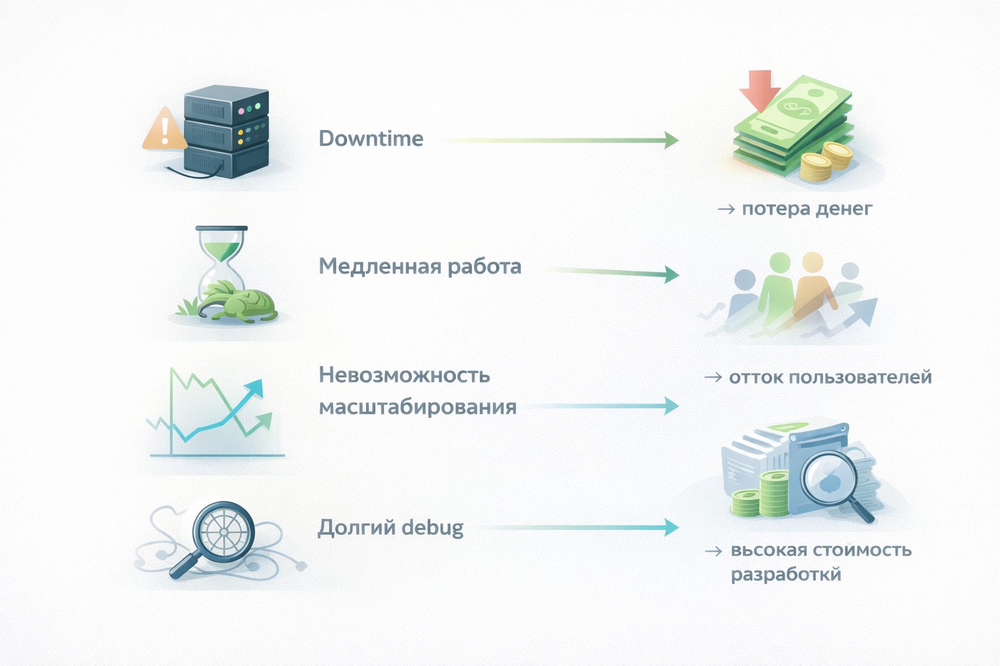
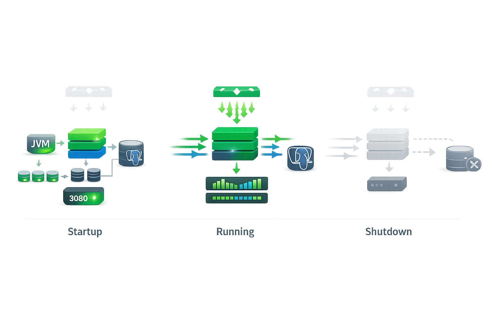
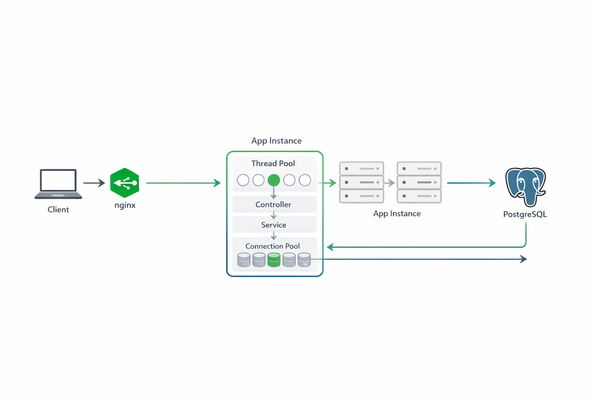
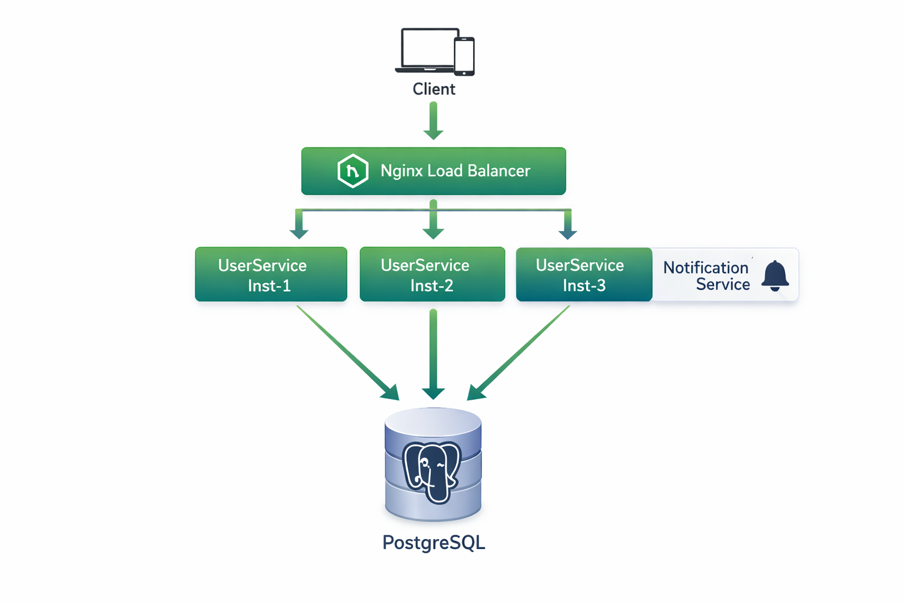
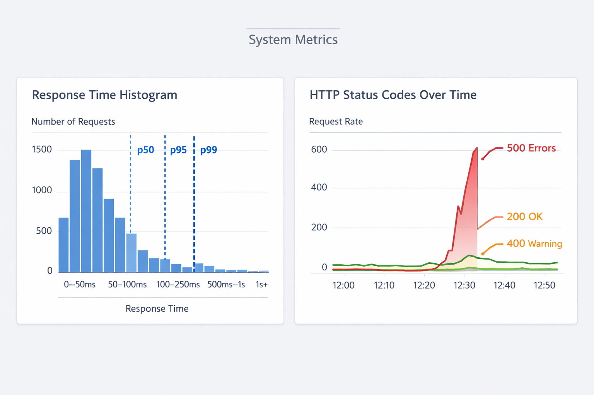
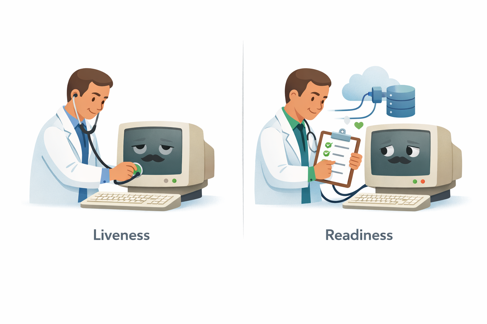
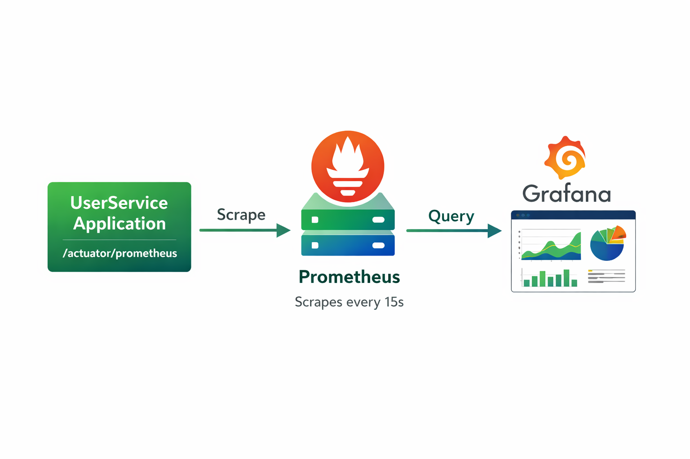
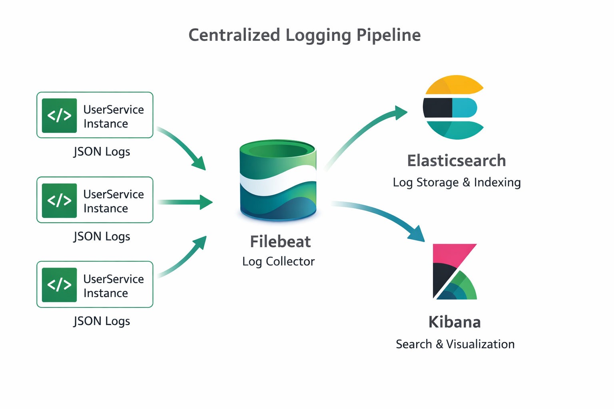
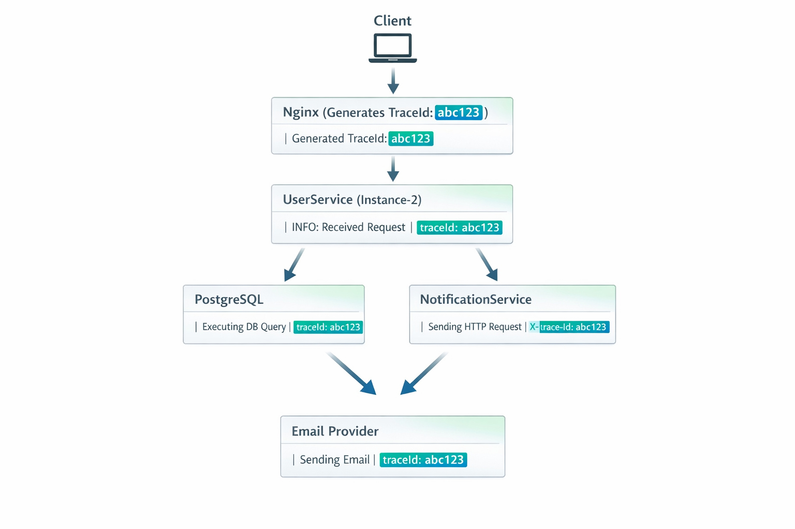
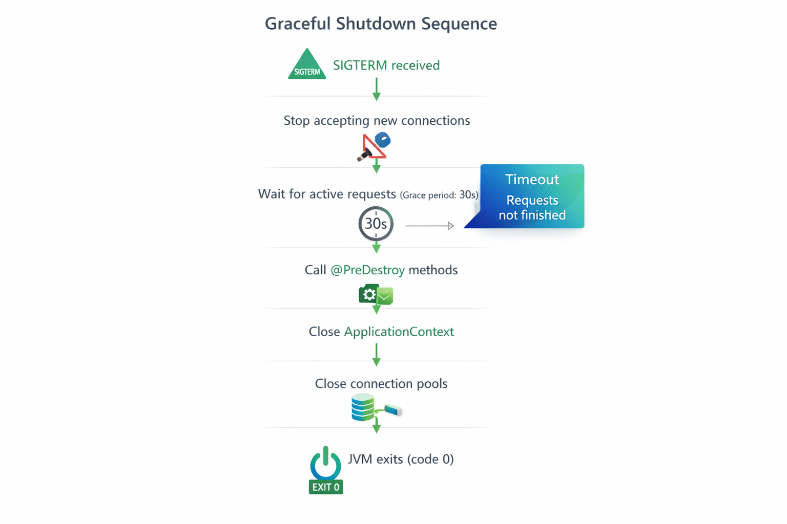

# Технологии программирования

[Главная](/) / Наблюдаемость и эксплуатация backend-сервисов

## Лекция 10. Наблюдаемость и эксплуатация backend-сервисов

### Содержание
1. [Проблема: от разработки к production](#p1)
2. [Системная модель backend-приложения](#p2)
3. [Observability: метрики и мониторинг](#p3)
4. [Logging и Trace ID](#p4)
5. [Graceful Shutdown и жизненный цикл](#p5)
6. [Profiles и конфигурация](#p6)
7. [Кэширование](#p7)
8. [Сквозной сценарий: от инцидента до исправления](#p8)

---

## 1. Проблема: от разработки к production <a name="p1"></a>

Представьте: вы написали backend-сервис для управления пользователями — **UserService**. Локально всё работает отлично. Тесты проходят. API отвечает быстро. Вы деплоите в production и... начинаются проблемы.

Пользователи жалуются на медленную работу. Некоторые запросы возвращают 500. Во время обновления сервиса пользователи получают connection errors. А самое неприятное — баг, который воспроизводится только в production, но не на вашем ноутбуке.

Знакомая ситуация? Это классическая проблема: **"работает на моей машине" ≠ "работает в production"**.

### Почему production отличается от разработки

На вашем ноутбуке:
- один инстанс приложения
- нет реальной нагрузки
- стабильная сеть
- всё под контролем

В production:
- **несколько инстансов** за load balancer (nginx)
- **реальная нагрузка** — сотни запросов в секунду
- **сетевые сбои** — внешние сервисы могут быть недоступны
- **общие ресурсы** — база данных используется всеми инстансами
- **конкуренция** — другие приложения борются за CPU и память


### Сценарий: что может пойти не так

#### Сценарий 1: Невидимая деградация

UserService работает в production. Всё вроде бы нормально. Но постепенно время ответа растёт: 50ms → 200ms → 500ms → 2 секунды. Пользователи начинают жаловаться. Вы заходите на сервер, смотрите логи — ничего подозрительного. Перезапускаете сервис — помогает на час, потом снова медленно.

**Проблема**: без метрик вы не видите, что происходит. Нет графиков latency, нет информации о нагрузке на БД, нет данных о memory usage.

#### Сценарий 2: Ночной инцидент

3:00 AM. UserService перестал отвечать. Команда узнала об этом в 5:00 AM от пользователей. Логов нет (писали в stdout, контейнер перезапустился). Метрик нет. Непонятно, что произошло. Перезапуск помог, но проблема может повториться.

**Проблема**: нет observability. Система работает как чёрный ящик.

#### Сценарий 3: Деплой с потерей данных

Вы деплоите новую версию UserService. Kubernetes убивает старые pods. В этот момент:
- активные HTTP-запросы прерываются
- транзакции в PostgreSQL откатываются
- пользователи видят ошибки 500

**Проблема**: нет graceful shutdown. Приложение не умеет корректно завершать работу.

#### Сценарий 4: Перегрузка базы данных

UserService делает запрос `SELECT * FROM users WHERE id = ?` для каждого обращения. При росте нагрузки PostgreSQL не справляется. Connection pool исчерпан. Время ответа растёт до 5 секунд.

**Проблема**: нет кэширования. Каждый запрос идёт в БД, даже если данные не изменились.

#### Сценарий 5: Хардкод конфигурации

В dev вы используете H2 in-memory базу. В production — PostgreSQL. Настройки захардкожены в коде. Для каждого окружения приходится пересобирать приложение.

**Проблема**: нет управления конфигурацией через profiles.

### Вопросы, на которые нельзя ответить без инструментов

Без правильных инструментов вы не можете ответить на базовые вопросы:

- Сколько запросов в секунду обрабатывает сервис?
- Какой endpoint самый медленный?
- Сколько памяти потребляет приложение?
- Почему упал сервис?
- Какой конкретно запрос вызвал ошибку?
- Как связать запрос, прошедший через 3 сервиса?

### Последствия для бизнеса




Это не просто технические проблемы:

- **Downtime** → потеря денег
- **Медленная работа** → отток пользователей
- **Невозможность масштабирования** → ограничение роста
- **Долгий debug** → высокая стоимость разработки

### Что нужно для production-ready приложения

Чтобы приложение работало надёжно в production, нужно решить пять ключевых задач:

1. **Observability** — видеть состояние системы (метрики, health checks)
2. **Structured logging** — понимать, что произошло (логи с trace ID)
3. **Graceful shutdown** — безопасно обновлять приложение
4. **Configuration management** — гибко управлять настройками для разных окружений
5. **Caching** — обеспечить производительность под нагрузкой

👉 **Ключевая идея**: production — это не просто "запустить код на сервере". Это управление жизненным циклом, мониторинг, отказоустойчивость и производительность.

Но прежде чем решать эти задачи, нужно понять: что такое backend-приложение с точки зрения операционной системы и runtime? Как оно живёт, работает и умирает? Об этом — следующий блок.

---

## 2. Системная модель backend-приложения <a name="p2"></a>

Когда мы пишем код, мы думаем о классах, методах, объектах. Но в production backend-приложение — это не просто код. Это **процесс операционной системы** со своими ресурсами, состоянием и жизненным циклом.

### Backend-приложение как процесс

Когда вы запускаете `java -jar user-service.jar`, операционная система создаёт процесс. Этот процесс:

- имеет **PID** (process ID)
- потребляет **CPU** и **RAM**
- открывает **сетевые соединения** (сокеты)
- держит **file descriptors** (файлы, сокеты)
- может получать **сигналы** (SIGTERM, SIGKILL)

Это не абстракция — это реальность. Ваш код работает внутри JVM, JVM работает как процесс ОС, и этот процесс конкурирует за ресурсы с другими процессами.

### Жизненный цикл приложения

Backend-приложение проходит через несколько фаз:




#### Startup (запуск)

Что происходит при старте Spring Boot приложения:

1. JVM загружается
2. Spring инициализирует контекст
3. Приложение подключается к PostgreSQL
4. Создаётся connection pool (HikariCP)
5. HTTP-сервер начинает слушать порт 8080
6. Load balancer начинает отправлять трафик

На этом этапе приложение **ещё не готово** принимать запросы. Если load balancer начнёт слать трафик слишком рано, пользователи получат ошибки.

#### Running (работа)

Приложение обрабатывает запросы:

- принимает HTTP-запросы
- выполняет бизнес-логику
- делает запросы к PostgreSQL
- вызывает внешние сервисы (NotificationService)
- отдаёт ответы

На этом этапе приложение потребляет ресурсы: CPU для обработки, память для объектов, сетевые соединения для БД и внешних сервисов.

#### Shutdown (остановка)

Когда приложение получает сигнал SIGTERM (например, при деплое):

1. Прекращает принимать новые запросы
2. Завершает активные запросы (grace period)
3. Закрывает соединения с PostgreSQL
4. Освобождает ресурсы
5. Завершает процесс

Если этот процесс не управляется правильно, активные запросы прерываются, транзакции откатываются, пользователи видят ошибки.

### Архитектура UserService

Наш сквозной пример — **UserService**. Вот как он выглядит в production:


Каждый инстанс UserService:
- это отдельный процесс (контейнер)
- имеет свой connection pool к PostgreSQL
- может вызывать NotificationService по HTTP

### Простой код, сложная реальность

Вот простой контроллер:

```java
@RestController
@RequestMapping("/api/users")
public class UserController {
    
    private final UserService userService;
    
    public UserController(UserService userService) {
        this.userService = userService;
    }
    
    @GetMapping("/{id}")
    public UserResponse getUser(@PathVariable Long id) {
        return userService.findById(id);
    }
    
    @PostMapping
    public UserResponse createUser(@RequestBody CreateUserRequest request) {
        return userService.create(request);
    }
}
```

Кажется простым. Но что происходит при вызове `GET /api/users/123`:

1. **nginx** получает запрос, выбирает один из трёх инстансов
2. **Tomcat** (embedded в Spring Boot) выделяет **thread** из thread pool
3. **Spring** маршрутизирует запрос к контроллеру
4. **UserService** берёт **connection** из HikariCP pool
5. **PostgreSQL** выполняет SELECT запрос
6. **JDBC** преобразует ResultSet в объект User
7. **Jackson** сериализует объект в JSON
8. **HTTP response** отправляется клиенту
9. **Thread** возвращается в pool
10. **Connection** возвращается в pool




Каждый из этих шагов может быть bottleneck. Каждый потребляет ресурсы. Каждый может сломаться.

### Границы системы

Важно понимать, что находится **внутри** приложения, а что **снаружи**:

**Внутри процесса UserService**:
- бизнес-логика (Controllers, Services, Repositories)
- thread pool (для обработки запросов)
- connection pool (для БД)
- in-memory кэш (если есть)

**Снаружи (внешние зависимости)**:
- PostgreSQL (сетевое соединение)
- NotificationService (HTTP)
- nginx (входящий трафик)
- файловая система (логи)

Каждая внешняя зависимость — это **точка отказа**. Если PostgreSQL недоступна, приложение не может работать. Если NotificationService медленный, запросы будут висеть.

### Состояния приложения

Приложение не просто "работает" или "не работает". У него есть состояния:

- **Starting** — запускается, но не готово принимать трафик
- **Healthy** — всё работает нормально, все зависимости доступны
- **Degraded** — работает, но есть проблемы (например, кэш недоступен, но БД работает)
- **Unhealthy** — критические проблемы (БД недоступна)
- **Shutting down** — завершает работу

Эти состояния нужно **отслеживать** и **сообщать** load balancer'у. Иначе nginx будет слать трафик на инстанс, который ещё не готов или уже завершается.



### Ресурсы и их ограничения

Каждый ресурс ограничен:

| Ресурс | Ограничение | Последствия превышения |
|--------|-------------|------------------------|
| CPU | Число ядер | Медленная обработка запросов |
| Memory | Heap size | OutOfMemoryError, GC паузы |
| DB connections | Pool size (20) | Запросы ждут свободного connection |
| Threads | Thread pool size (200) | Запросы отклоняются (503) |
| Network | Bandwidth | Медленная передача данных |

👉 **Ключевая идея**: backend-приложение — это не просто код. Это процесс с ресурсами, состоянием и зависимостями. Чтобы управлять им в production, нужно понимать эту модель.

Теперь возникает вопрос: как **наблюдать** за этим процессом? Как понять, что он здоров? Сколько ресурсов потребляет? Об этом — следующий блок.

---

## 3. Observability: метрики и мониторинг <a name="p3"></a>

Представьте: UserService работает в production. Пользователи жалуются на медленную работу. Вы заходите на сервер и... что дальше? Как понять, в чём проблема?

Без **observability** (наблюдаемости) вы слепы. Вы не знаете:
- сколько запросов в секунду обрабатывается
- какой endpoint медленный
- сколько памяти потребляет приложение
- доступна ли база данных

**Observability** — это способность понять внутреннее состояние системы по её внешним сигналам.

### Три столпа observability

Классическая модель observability включает три компонента:

1. **Metrics** (метрики) — числовые показатели: RPS, latency, memory usage
2. **Logs** (логи) — события и ошибки: "user created", "database error"
3. **Traces** (трейсы) — путь запроса через систему: User → UserService → PostgreSQL → NotificationService

В этом блоке мы сфокусируемся на **метриках** и **health checks**. Логи и трейсы разберём в следующем блоке.

### Что такое метрики

**Метрики** — это числовые показатели состояния системы, собираемые во времени.

Примеры метрик для UserService:
- `http_requests_total` — сколько всего запросов обработано
- `http_request_duration_seconds` — сколько времени занимает обработка запроса
- `jvm_memory_used_bytes` — сколько памяти использует JVM
- `hikaricp_connections_active` — сколько активных соединений с БД

### Типы метрик

#### Counter (счётчик)

Монотонно растущее значение. Никогда не уменьшается.

Примеры:
- `http_requests_total` — общее количество запросов
- `users_created_total` — количество созданных пользователей
- `errors_total` — количество ошибок

```java
Counter userCreatedCounter = Counter.builder("users.created")
    .description("Total users created")
    .register(registry);

userCreatedCounter.increment(); // +1
```

#### Gauge (датчик)

Текущее значение, которое может расти и уменьшаться.

Примеры:
- `jvm_memory_used_bytes` — текущее использование памяти
- `hikaricp_connections_active` — активные соединения
- `users_online` — количество пользователей онлайн

```java
Gauge.builder("users.online", userService, UserService::getOnlineCount)
    .register(registry);
```

#### Histogram (гистограмма)




Распределение значений. Позволяет вычислять перцентили (p50, p95, p99).

Примеры:
- `http_request_duration_seconds` — время обработки запросов
- `database_query_duration_seconds` — время выполнения SQL-запросов

```java
Timer userLookupTimer = Timer.builder("users.lookup")
    .description("User lookup duration")
    .register(registry);

userLookupTimer.record(() -> {
    return userRepository.findById(id);
});
```

### Зачем нужны метрики

Метрики позволяют:

1. **Мониторить производительность**: видеть latency, throughput
2. **Обнаруживать проблемы**: рост error rate, утечки памяти
3. **Планировать capacity**: понимать, когда нужно масштабироваться
4. **Настраивать алерты**: автоматически уведомлять команду о проблемах

👉 **Ключевая идея**: метрики — это не для отладки конкретного запроса. Это для понимания поведения системы в целом.

### Health checks




**Health check** — это endpoint, который показывает, здорово ли приложение.

Два типа health checks:

#### Liveness probe

**Вопрос**: приложение живо?

Если нет → нужно перезапустить процесс.

Проверяет:
- процесс не завис
- нет deadlock
- JVM отвечает

#### Readiness probe

**Вопрос**: приложение готово принимать трафик?

Если нет → не слать запросы, но не перезапускать.

Проверяет:
- БД доступна
- внешние сервисы доступны
- warmup завершён

### Spring Boot Actuator

Spring Boot предоставляет встроенный модуль для production-ready features — **Actuator**.

#### Подключение

```xml
<!-- pom.xml -->
<dependency>
    <groupId>org.springframework.boot</groupId>
    <artifactId>spring-boot-starter-actuator</artifactId>
</dependency>
<dependency>
    <groupId>io.micrometer</groupId>
    <artifactId>micrometer-registry-prometheus</artifactId>
</dependency>
```

#### Конфигурация

```yaml
# application.yml
management:
  endpoints:
    web:
      exposure:
        include: health, prometheus, info
  endpoint:
    health:
      show-details: when-authorized
      probes:
        enabled: true
  health:
    db:
      enabled: true
```

#### Endpoints

После подключения Actuator доступны endpoints:

- `GET /actuator/health` — состояние приложения
- `GET /actuator/health/liveness` — liveness probe
- `GET /actuator/health/readiness` — readiness probe
- `GET /actuator/prometheus` — метрики в формате Prometheus

Пример ответа `/actuator/health`:

```json
{
  "status": "UP",
  "components": {
    "db": {
      "status": "UP",
      "details": {
        "database": "PostgreSQL",
        "validationQuery": "isValid()"
      }
    },
    "diskSpace": {
      "status": "UP",
      "details": {
        "total": 500000000000,
        "free": 250000000000
      }
    }
  }
}
```

### Custom метрики с Micrometer

**Micrometer** — это фасад для метрик (как SLF4J для логов). Он позволяет писать метрики один раз, а экспортировать в разные системы: Prometheus, Graphite, Datadog.

#### Пример: метрики для UserService

```java
@Service
public class UserService {
    
    private final UserRepository userRepository;
    private final Counter userCreatedCounter;
    private final Timer userLookupTimer;
    
    public UserService(UserRepository userRepository, MeterRegistry registry) {
        this.userRepository = userRepository;
        
        this.userCreatedCounter = Counter.builder("users.created")
            .description("Total users created")
            .register(registry);
        
        this.userLookupTimer = Timer.builder("users.lookup")
            .description("User lookup duration")
            .register(registry);
    }
    
    public UserResponse findById(Long id) {
        return userLookupTimer.record(() -> {
            User user = userRepository.findById(id)
                .orElseThrow(() -> new UserNotFoundException(id));
            return toResponse(user);
        });
    }
    
    public UserResponse create(CreateUserRequest request) {
        User user = new User();
        user.setName(request.getName());
        user.setEmail(request.getEmail());
        
        User saved = userRepository.save(user);
        userCreatedCounter.increment();
        
        return toResponse(saved);
    }
}
```

### Prometheus + Grafana

Метрики нужно не только собирать, но и **визуализировать**.

**Prometheus** — система сбора и хранения метрик.  
**Grafana** — система визуализации метрик.

#### Как это работает

1. UserService экспортирует метрики на `/actuator/prometheus`
2. Prometheus каждые 15 секунд опрашивает (scraping) этот endpoint
3. Prometheus сохраняет метрики в time-series базу
4. Grafana читает данные из Prometheus и строит графики



#### Docker Compose для observability

```yaml
# docker-compose.observability.yml
version: '3.8'

services:
  prometheus:
    image: prom/prometheus:v2.48.0
    ports:
      - "9090:9090"
    volumes:
      - ./prometheus.yml:/etc/prometheus/prometheus.yml
    command:
      - '--config.file=/etc/prometheus/prometheus.yml'
  
  grafana:
    image: grafana/grafana:10.2.0
    ports:
      - "3000:3000"
    environment:
      - GF_SECURITY_ADMIN_PASSWORD=admin
    depends_on:
      - prometheus
```

#### Конфигурация Prometheus

```yaml
# prometheus.yml
global:
  scrape_interval: 15s

scrape_configs:
  - job_name: 'user-service'
    metrics_path: '/actuator/prometheus'
    static_configs:
      - targets: ['host.docker.internal:8080']
```

#### Что показывает Prometheus endpoint

```text
# HELP users_created_total Total users created
# TYPE users_created_total counter
users_created_total 42.0

# HELP users_lookup_seconds User lookup duration
# TYPE users_lookup_seconds histogram
users_lookup_seconds_bucket{le="0.001"} 10
users_lookup_seconds_bucket{le="0.01"} 95
users_lookup_seconds_bucket{le="0.1"} 100
users_lookup_seconds_sum 2.5
users_lookup_seconds_count 100

# HELP jvm_memory_used_bytes Memory used
# TYPE jvm_memory_used_bytes gauge
jvm_memory_used_bytes{area="heap"} 268435456
```

### Ключевые метрики для UserService

Какие метрики важно отслеживать:

#### HTTP метрики

- `http.server.requests` — количество запросов (по endpoint, status code)
- `http.server.requests.duration` — время обработки (p50, p95, p99)

#### JVM метрики

- `jvm.memory.used` — используемая память (heap, non-heap)
- `jvm.gc.pause` — паузы garbage collector
- `jvm.threads.live` — количество потоков

#### Database метрики

- `hikaricp.connections.active` — активные соединения
- `hikaricp.connections.idle` — свободные соединения
- `hikaricp.connections.pending` — запросы, ожидающие соединения

### Anti-patterns

❌ **Логировать метрики вместо экспорта**

Плохо:
```java
log.info("Request processed in {}ms", duration);
```

Хорошо:
```java
timer.record(duration, TimeUnit.MILLISECONDS);
```

❌ **Проверять health вручную в production**

Плохо: `curl http://server/actuator/health` каждый раз

Хорошо: автоматический мониторинг через Prometheus + алерты

❌ **Не отслеживать перцентили**

Среднее время (average) скрывает проблемы. Важны p95, p99 — время для самых медленных запросов.

### Запуск всего стека

```bash
# Запустить UserService
./gradlew bootRun

# Запустить Prometheus + Grafana
docker-compose -f docker-compose.observability.yml up -d

# Открыть Grafana
open http://localhost:3000
# Login: admin / admin

# Добавить Prometheus data source
# URL: http://prometheus:9090

# Создать dashboard с графиками:
# - rate(http_server_requests_total[5m]) — RPS
# - histogram_quantile(0.95, http_server_requests_duration_seconds) — p95 latency
# - jvm_memory_used_bytes — memory usage
```

👉 **Ключевая идея**: метрики показывают **ЧТО** происходит с системой. Но чтобы понять **ПОЧЕМУ** произошла конкретная ошибка, нужны логи.

---

## 4. Logging и Trace ID <a name="p4"></a>

Метрики показали, что error rate вырос с 0.1% до 5%. Но **какие** запросы падают? **Почему**? **На каком инстансе**?

Для ответа на эти вопросы нужны **логи**.

### Проблема: найти иголку в стоге сена


UserService работает в 3 инстансах. Каждый обрабатывает сотни запросов в секунду. Пользователь жалуется: "Мой запрос упал".

Вопросы:
- На каком инстансе обрабатывался запрос?
- Какой конкретно запрос?
- Что пошло не так?
- Если запрос прошёл через NotificationService, что там произошло?

Без **структурированных логов** и **trace ID** ответить невозможно.

### Unstructured vs Structured логи

#### ❌ Плохо: неструктурированные логи

```text
2024-01-15 10:23:45 INFO Processing user request for john@example.com
2024-01-15 10:23:45 ERROR Something went wrong
2024-01-15 10:23:46 INFO User created successfully
```

Проблемы:
- невозможно парсить автоматически
- нельзя фильтровать по полям
- нельзя связать логи одного запроса
- нет контекста (какой инстанс, какой запрос)

#### ✅ Хорошо: структурированные логи (JSON)

```json
{
  "timestamp": "2024-01-15T10:23:45.123Z",
  "level": "ERROR",
  "logger": "com.example.userservice.UserService",
  "message": "Failed to create user",
  "traceId": "abc123def456",
  "userId": "john@example.com",
  "error": "ConnectionRefusedException",
  "errorMessage": "Connection to NotificationService refused",
  "instance": "user-service-2"
}
```

Преимущества:
- машиночитаемый формат
- можно фильтровать: `level=ERROR AND traceId=abc123`
- можно агрегировать: "сколько ошибок ConnectionRefusedException за последний час"
- есть контекст: instance, traceId, userId

### Trace ID: нить Ариадны в распределённой системе

**Trace ID** — это уникальный идентификатор, который следует за запросом через все сервисы и инстансы.

#### Проблема без trace ID

Запрос проходит путь:
1. Client → nginx
2. nginx → UserService (instance-2)
3. UserService → PostgreSQL
4. UserService → NotificationService
5. NotificationService → Email provider

Где-то произошла ошибка. Но где? На каком этапе? Как связать логи из разных сервисов?

#### Решение: trace ID

Каждому запросу присваивается уникальный ID (например, `abc123def456`). Этот ID:
- передаётся через HTTP headers (`X-Trace-Id`)
- добавляется во все логи
- позволяет найти все логи одного запроса

```
Client request → traceId=abc123

UserService logs:
{"traceId": "abc123", "message": "Processing user request"}
{"traceId": "abc123", "message": "Calling NotificationService"}

NotificationService logs:
{"traceId": "abc123", "message": "Received notification request"}
{"traceId": "abc123", "level": "ERROR", "message": "Email provider timeout"}
```

Теперь можно найти все логи: `traceId=abc123` → видим весь путь запроса.

### MDC (Mapped Diagnostic Context)

**MDC** — это механизм в Logback/SLF4J для добавления контекстной информации в логи.

MDC работает как thread-local Map: вы кладёте туда данные (например, traceId), и они автоматически добавляются во все логи в рамках этого потока.

#### Реализация trace ID через MDC

```java
@Component
public class TraceIdFilter implements Filter {
    
    private static final String TRACE_ID_HEADER = "X-Trace-Id";
    private static final String TRACE_ID_MDC_KEY = "traceId";
    
    @Override
    public void doFilter(ServletRequest request, ServletResponse response,
                         FilterChain chain) throws IOException, ServletException {
        
        HttpServletRequest httpRequest = (HttpServletRequest) request;
        
        // Получаем trace ID из header или генерируем новый
        String traceId = httpRequest.getHeader(TRACE_ID_HEADER);
        if (traceId == null || traceId.isEmpty()) {
            traceId = UUID.randomUUID().toString().substring(0, 8);
        }
        
        // Кладём в MDC
        MDC.put(TRACE_ID_MDC_KEY, traceId);
        
        try {
            // Обрабатываем запрос
            chain.doFilter(request, response);
        } finally {
            // Очищаем MDC (важно!)
            MDC.clear();
        }
    }
}
```

Теперь все логи в рамках этого запроса будут содержать traceId.

### Logback конфигурация для JSON логов

```xml
<!-- logback-spring.xml -->
<configuration>
    <appender name="JSON" class="ch.qos.logback.core.ConsoleAppender">
        <encoder class="net.logstash.logback.encoder.LogstashEncoder">
            <!-- Включаем trace ID из MDC -->
            <includeMdcKeyName>traceId</includeMdcKeyName>
            
            <!-- Добавляем имя инстанса -->
            <customFields>{"instance":"${HOSTNAME:-unknown}"}</customFields>
        </encoder>
    </appender>
    
    <root level="INFO">
        <appender-ref ref="JSON"/>
    </root>
</configuration>
```

Зависимость:

```xml
<dependency>
    <groupId>net.logstash.logback</groupId>
    <artifactId>logstash-logback-encoder</artifactId>
    <version>7.4</version>
</dependency>
```

### Propagation: передача trace ID в другие сервисы

Когда UserService вызывает NotificationService, нужно передать trace ID дальше.

```java
@Service
public class NotificationClient {
    
    private final RestTemplate restTemplate;
    
    public NotificationClient(RestTemplate restTemplate) {
        this.restTemplate = restTemplate;
    }
    
    public void sendNotification(String userId, String message) {
        // Получаем trace ID из MDC
        String traceId = MDC.get("traceId");
        
        // Создаём headers с trace ID
        HttpHeaders headers = new HttpHeaders();
        headers.set("X-Trace-Id", traceId);
        headers.setContentType(MediaType.APPLICATION_JSON);
        
        // Создаём request
        NotificationRequest request = new NotificationRequest(userId, message);
        HttpEntity<NotificationRequest> entity = new HttpEntity<>(request, headers);
        
        // Отправляем запрос
        restTemplate.postForEntity(
            "http://notification-service/api/notify",
            entity,
            Void.class
        );
    }
}
```

Теперь NotificationService получит тот же trace ID и сможет добавить его в свои логи.

### ELK Stack для централизованных логов

**ELK** = Elasticsearch + Logstash + Kibana

- **Elasticsearch** — хранит и индексирует логи
- **Logstash** — собирает логи из разных источников
- **Kibana** — визуализирует и позволяет искать логи

#### Docker Compose для ELK

```yaml
# docker-compose.logging.yml
version: '3.8'

services:
  elasticsearch:
    image: elasticsearch:8.11.0
    environment:
      - discovery.type=single-node
      - xpack.security.enabled=false
      - "ES_JAVA_OPTS=-Xms512m -Xmx512m"
    ports:
      - "9200:9200"
    volumes:
      - elasticsearch-data:/usr/share/elasticsearch/data
  
  kibana:
    image: kibana:8.11.0
    ports:
      - "5601:5601"
    environment:
      - ELASTICSEARCH_HOSTS=http://elasticsearch:9200
    depends_on:
      - elasticsearch

volumes:
  elasticsearch-data:
```

#### Как логи попадают в Elasticsearch

Есть несколько способов:

1. **Filebeat** — читает файлы логов и отправляет в Elasticsearch
2. **Logstash** — принимает логи по сети и отправляет в Elasticsearch
3. **Прямая отправка** — приложение пишет напрямую в Elasticsearch (не рекомендуется)



Для простоты можно использовать Filebeat:

```yaml
# filebeat.yml
filebeat.inputs:
  - type: container
    paths:
      - '/var/lib/docker/containers/*/*.log'

output.elasticsearch:
  hosts: ["elasticsearch:9200"]
```

#### Поиск в Kibana

После того как логи попали в Elasticsearch, их можно искать в Kibana:

```
# Найти все ошибки с конкретным trace ID
level:ERROR AND traceId:"abc123def456"

# Найти все логи за последний час с ошибками
level:ERROR AND @timestamp:[now-1h TO now]

# Найти логи конкретного инстанса
instance:"user-service-2"

# Найти логи с конкретным пользователем
userId:"john@example.com"
```

### Log levels: когда что использовать

| Level | Когда использовать | Пример |
|-------|-------------------|--------|
| ERROR | Что-то сломалось, требует внимания | "Failed to connect to database" |
| WARN | Что-то подозрительное, но обработано | "Retry attempt 3/5" |
| INFO | Значимые бизнес-события | "User created", "Order placed" |
| DEBUG | Детальная техническая информация | "SQL query: SELECT ..." |
| TRACE | Очень детальная информация | "Entering method X" |

В production обычно используют INFO и выше. DEBUG и TRACE — только для отладки.

### Anti-patterns

❌ **Логировать чувствительные данные**

Плохо:
```java
log.info("User login: {} with password: {}", username, password);
```

Никогда не логируйте: пароли, токены, номера карт, персональные данные.

❌ **Логировать в tight loops**

Плохо:
```java
for (int i = 0; i < 1000000; i++) {
    log.debug("Processing item {}", i);
}
```

Это убьёт производительность и заполнит диск.

❌ **Использовать System.out.println**

Плохо:
```java
System.out.println("User created");
```

Хорошо:
```java
log.info("User created");
```

System.out.println не даёт:
- уровней логирования
- структурированного формата
- контекста (timestamp, thread, class)

### Пример: полный flow с trace ID

1. **Client** отправляет запрос без trace ID
2. **nginx** генерирует trace ID и добавляет header `X-Trace-Id: abc123`
3. **UserService** (instance-2):
   - получает trace ID из header
   - кладёт в MDC
   - логирует: `{"traceId": "abc123", "message": "Creating user"}`
   - вызывает NotificationService с header `X-Trace-Id: abc123`
4. **NotificationService**:
   - получает trace ID из header
   - кладёт в MDC
   - логирует: `{"traceId": "abc123", "message": "Sending email"}`
   - ошибка: `{"traceId": "abc123", "level": "ERROR", "message": "SMTP timeout"}`
5. **Kibana**: ищем `traceId:abc123` → видим весь путь запроса и ошибку



👉 **Ключевая идея**: Trace ID — это нить Ариадны в лабиринте распределённой системы. Без него невозможно отследить путь запроса через множество сервисов.

Мы научились наблюдать за приложением через метрики и логи. Но что происходит, когда мы обновляем приложение? Как не потерять запросы при деплое? Об этом — в следующих блоках.

---

## 5. Graceful Shutdown и жизненный цикл <a name="p5"></a>

Мы научились наблюдать за приложением через метрики и логи. Но что происходит, когда мы обновляем приложение? Представьте: вы исправили баг в UserService и хотите задеплоить новую версию. Что происходит со старыми инстансами?

### Проблема: потеря запросов при деплое

Сценарий:
1. UserService обрабатывает 15 активных запросов
2. Вы деплоите новую версию
3. Docker отправляет SIGTERM старому контейнеру
4. Что происходит с этими 15 запросами?

**Наивный подход** (без graceful shutdown):
- SIGTERM → JVM завершается немедленно
- Активные HTTP-запросы прерываются → connection reset
- Транзакции в PostgreSQL откатываются на середине
- Пользователи видят 502 Bad Gateway от nginx
- Данные могут быть потеряны

Это не просто неудобство — это потеря данных и плохой user experience.

### Что такое graceful shutdown

**Graceful shutdown** — это безопасная остановка приложения с завершением активных операций.

Правильная последовательность:
1. **Прекратить принимать новые запросы** (HTTP server stops accepting connections)
2. **Завершить активные запросы** (дать им время на выполнение)
3. **Закрыть ресурсы** (DB connections, HTTP clients, file handles)
4. **Завершить процесс** (exit code 0)

Это как корректное выключение компьютера vs выдёргивание шнура из розетки.

### SIGTERM vs SIGKILL

Операционная система может отправить процессу разные сигналы:

#### SIGTERM (signal 15)

**Мягкий сигнал остановки**. Процесс может его обработать:
- Приложение получает уведомление
- Может выполнить cleanup
- Может завершить активные операции
- Может сохранить состояние

```bash
# Отправить SIGTERM
docker-compose stop user-service
# или
kill -15 <PID>
```

#### SIGKILL (signal 9)

**Жёсткий сигнал остановки**. Процесс убивается мгновенно:
- Нет возможности cleanup
- Нет возможности завершить операции
- Используется если SIGTERM не сработал

```bash
# Отправить SIGKILL (не делайте так в production!)
kill -9 <PID>
```

👉 **Правило**: всегда используйте SIGTERM. SIGKILL — только в крайнем случае.

### Spring Boot graceful shutdown

Spring Boot 2.3+ поддерживает graceful shutdown из коробки.

#### Конфигурация

```yaml
# application.yml
server:
  shutdown: graceful  # Включаем graceful shutdown

spring:
  lifecycle:
    timeout-per-shutdown-phase: 30s  # Grace period — 30 секунд
```

#### Что происходит внутри

Когда Spring Boot получает SIGTERM:

1. **Останавливает прием новых запросов**
   - Embedded Tomcat перестаёт принимать новые connections
   - Новые запросы получат connection refused

2. **Ждёт завершения активных запросов**
   - Максимум 30 секунд (timeout-per-shutdown-phase)
   - Если запросы завершились раньше — отлично
   - Если не завершились за 30 секунд → принудительная остановка

3. **Вызывает @PreDestroy методы**
   - В обратном порядке создания beans
   - Позволяет сделать cleanup

4. **Закрывает ApplicationContext**
   - Уничтожает все beans
   - Закрывает connection pools (HikariCP)
   - Закрывает HTTP clients

5. **JVM завершается**
   - Exit code 0 (успешное завершение)



### Custom cleanup с @PreDestroy

Вы можете добавить свою логику cleanup:

```java
@Service
public class NotificationClient implements DisposableBean {
    
    private static final Logger log = LoggerFactory.getLogger(NotificationClient.class);
    
    private final HttpClient httpClient;
    
    public NotificationClient() {
        this.httpClient = HttpClient.newBuilder()
            .connectTimeout(Duration.ofSeconds(5))
            .build();
    }
    
    @Override
    public void destroy() {
        log.info("Closing HTTP client connections...");
        // HttpClient не имеет явного close(), но мы можем логировать
        log.info("HTTP client cleanup completed");
    }
}
```

Более сложный пример — cleanup для ExecutorService:

```java
@Service
public class AsyncTaskService {
    
    private static final Logger log = LoggerFactory.getLogger(AsyncTaskService.class);
    
    private final ExecutorService executorService;
    
    public AsyncTaskService() {
        this.executorService = Executors.newFixedThreadPool(10);
    }
    
    @PreDestroy
    public void shutdown() {
        log.info("Shutting down executor service...");
        
        // Останавливаем прием новых задач
        executorService.shutdown();
        
        try {
            // Ждём завершения активных задач (максимум 30 секунд)
            if (!executorService.awaitTermination(30, TimeUnit.SECONDS)) {
                log.warn("Executor service did not terminate in time, forcing shutdown");
                executorService.shutdownNow();
            } else {
                log.info("Executor service shut down gracefully");
            }
        } catch (InterruptedException e) {
            log.error("Interrupted while waiting for executor shutdown", e);
            executorService.shutdownNow();
            Thread.currentThread().interrupt();
        }
    }
}
```

### Проблема load balancer

Даже с graceful shutdown есть проблема: nginx может продолжать слать запросы на умирающий инстанс.

**Сценарий**:
1. UserService получает SIGTERM
2. Начинает graceful shutdown
3. nginx ещё не знает об этом
4. nginx отправляет новый запрос → connection refused → 502 для пользователя

**Решение**: health check должен стать "not ready" ДО начала shutdown.

```java
@Component
public class GracefulShutdownHealthIndicator implements HealthIndicator {
    
    private volatile boolean shuttingDown = false;
    
    @EventListener(ContextClosedEvent.class)
    public void onShutdown() {
        log.info("Application shutdown initiated, marking as not ready");
        this.shuttingDown = true;
        
        // Даём nginx время заметить что мы not ready (5 секунд)
        try {
            Thread.sleep(5000);
        } catch (InterruptedException e) {
            Thread.currentThread().interrupt();
        }
    }
    
    @Override
    public Health health() {
        if (shuttingDown) {
            return Health.down()
                .withDetail("reason", "Shutting down")
                .build();
        }
        return Health.up().build();
    }
}
```

### Deployment sequence с docker-compose

Правильная последовательность для zero-downtime deployment:

```bash
#!/bin/bash
# rolling-update.sh

# Обновляем instance-1
echo "Updating user-service-1..."
docker-compose stop user-service-1  # SIGTERM, graceful shutdown
docker-compose rm -f user-service-1
docker-compose up -d user-service-1

# Ждём пока health check пройдёт
echo "Waiting for user-service-1 to be healthy..."
until curl -f http://localhost:8081/actuator/health/readiness; do
    sleep 2
done

# Обновляем instance-2
echo "Updating user-service-2..."
docker-compose stop user-service-2
docker-compose rm -f user-service-2
docker-compose up -d user-service-2

until curl -f http://localhost:8082/actuator/health/readiness; do
    sleep 2
done

# Обновляем instance-3
echo "Updating user-service-3..."
docker-compose stop user-service-3
docker-compose rm -f user-service-3
docker-compose up -d user-service-3

until curl -f http://localhost:8083/actuator/health/readiness; do
    sleep 2
done

echo "Rolling update completed successfully!"
```

### Docker Compose конфигурация

```yaml
# docker-compose.yml
version: '3.8'

services:
  user-service-1:
    build: .
    ports:
      - "8081:8080"
    environment:
      - SPRING_PROFILES_ACTIVE=production
    healthcheck:
      test: ["CMD", "curl", "-f", "http://localhost:8080/actuator/health"]
      interval: 10s
      timeout: 5s
      retries: 3
      start_period: 40s
    stop_grace_period: 60s  # Даём 60 секунд на graceful shutdown
    depends_on:
      - postgres
```

### Shutdown hooks и порядок

Важно: порядок cleanup имеет значение.

❌ **Плохо**: закрываем DB pool до завершения запросов
```java
@PreDestroy
public void cleanup() {
    dataSource.close();  // Закрыли БД
    // Активные запросы ещё работают → ошибки!
}
```

✅ **Хорошо**: Spring сам управляет порядком
- Сначала завершаются активные запросы
- Потом вызываются @PreDestroy методы
- Потом закрываются connection pools

### Anti-patterns

❌ **kill -9 (SIGKILL)** — нет cleanup вообще
```bash
# Никогда не делайте так в production!
kill -9 <PID>
```

❌ **Нет timeout на shutdown** — приложение может висеть вечно
```yaml
# Плохо: нет timeout
spring:
  lifecycle:
    timeout-per-shutdown-phase: 0  # Ждём бесконечно
```

❌ **Закрытие DB pool до завершения запросов**
```java
@PreDestroy
public void cleanup() {
    hikariDataSource.close();  // Слишком рано!
}
```

❌ **Игнорирование активных background tasks**
```java
@Scheduled(fixedDelay = 60000)
public void longRunningTask() {
    // Задача может выполняться 5 минут
    // При shutdown она прервётся на середине
}
```

### Мониторинг shutdown

Логируйте события shutdown для debugging:

```java
@Component
public class ShutdownMonitor {
    
    private static final Logger log = LoggerFactory.getLogger(ShutdownMonitor.class);
    
    @EventListener(ContextClosedEvent.class)
    public void onShutdown() {
        log.info("=== Application shutdown initiated ===");
        log.info("Active requests will be completed");
        log.info("Grace period: 30 seconds");
    }
}
```

В логах вы увидите:
```json
{
  "timestamp": "2024-01-15T10:30:00.000Z",
  "level": "INFO",
  "message": "=== Application shutdown initiated ===",
  "instance": "user-service-2"
}
```

👉 **Ключевая идея**: Graceful shutdown — это не просто "подождать". Это протокол взаимодействия между приложением, балансировщиком и оркестратором. Без него каждый деплой — это потенциальная потеря данных и ошибки для пользователей.

Мы научились безопасно останавливать приложение. Но у нас есть ещё одна проблема: конфигурация. Как сделать так, чтобы одно и то же приложение работало по-разному в dev, staging и production?

---


### Финальная мысль

Production-ready приложение — это не просто "работающий код". Это:
- **Observability**: видеть что происходит
- **Reliability**: работать стабильно под нагрузкой
- **Operability**: легко деплоить и управлять
- **Performance**: быстро отвечать пользователям

Каждый из этих аспектов требует инструментов и практик, которые мы изучили в этой лекции.

👉 **Главный вывод**: Хороший код — это только 50% работы. Остальные 50% — это observability, операционная готовность и production practices.


