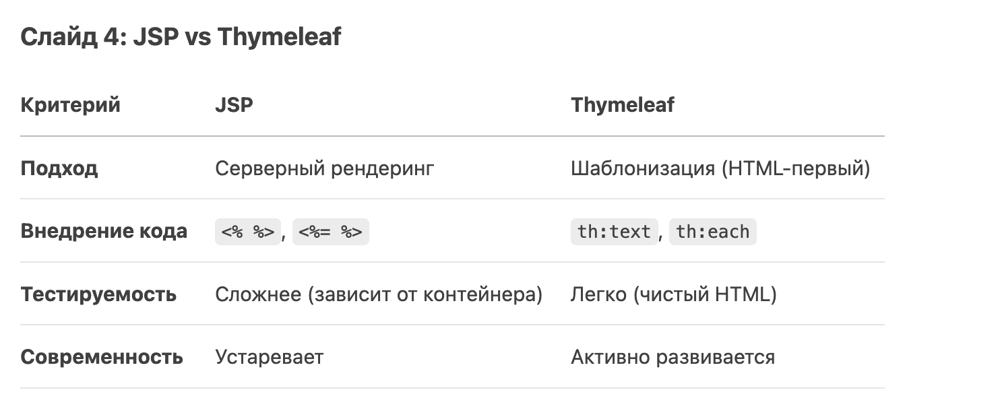

# Лекция 29.04
## Попытки посмотреть на фронтенд. JSP. Thymeleaf. 

## Что такое JSP?
Java Server Pages — это технология Java, которая позволяет создавать динамические веб-страницы для Java приложений.


JSP позволяет разработчику:
- получать данные из веб-страницы в Java-код;
- отправлять данные из Java кода на веб-страницу;
- писать Java-код, прямо внутри html (однако злоупотреблять этим не стоит).

Необходимость знания JSP можно оценить довольно высоко по нескольким причинам:
- JSP — одна из основных Java web-технологий;
- JSP широко используется в большинстве компаний и проектов;
- JSP бесшовно интегрируется с сервлетами Java внутри контейнера сервлетов.

### Жизненный цикл JSP:

- Трансляция (JSP → Servlet).
- Компиляция (Servlet → .class).
- Выполнение (обработка запросов).

### Плюсы:

- Простота вставки Java-кода.
- Поддержка JSTL и EL.

### Минусы:

- Смешивание логики и представления.
- Устаревание (Thymeleaf, JSF – современные альтернативы).

Важно: JSP-файлы компилируются в сервлеты при первом запросе, а затем работают как обычные Java-классы."*


### Пример кода

1. Добавление зависимости
```groovy
	implementation 'javax.servlet:jstl'
	implementation 'org.apache.tomcat.embed:tomcat-embed-jasper'
```

2. Модель данных

```java
public record Person(String firstName, String lastName) {}
```

3. Контроллер

```java
import java.util.ArrayList;
import java.util.List;

import org.o7planning.sbjsp.model.Person;
import org.springframework.stereotype.Controller;
import org.springframework.ui.Model;
import org.springframework.web.bind.annotation.RequestMapping;
import org.springframework.web.bind.annotation.RequestMethod;

@Controller
public class MainController {

    private static List<Person> persons = new ArrayList<Person>();

    static {
        persons.add(new Person("Bill", "Gates"));
        persons.add(new Person("Steve", "Jobs"));
    }

    @RequestMapping(value = { "/", "/index" }, method = RequestMethod.GET)
    public String index(Model model) {

        String message = "Hello Spring Boot + JSP";

        model.addAttribute("message", message);

        return "index";
    }

    @RequestMapping(value = { "/personList" }, method = RequestMethod.GET)
    public String viewPersonList(Model model) {

        model.addAttribute("persons", persons);

        return "personList";
    }

}
```


4. Страничка jsp

```html
<%@ taglib uri="http://java.sun.com/jsp/jstl/core" prefix="c"%>

<!DOCTYPE HTML>
<html>
  <head>
    <meta charset="UTF-8" />
    <title>Person List</title>
    <link rel="stylesheet" type="text/css" href="${pageContext.request.contextPath}/css/style.css"/>
  </head>
  <body>
    <h1>Person List</h1>
   
    <br/><br/>
    <div>
      <table border="1">
        <tr>
          <th>First Name</th>
          <th>Last Name</th>
        </tr>
        <c:forEach  items="${persons}" var ="person">
        <tr>
          <td>${person.firstName}</td>
          <td>${person.lastName}</td>
        </tr>
        </c:forEach>
      </table>
    </div>
  </body>
 
</html>
```

## Thymeleaf

Thymeleaf – современный шаблонизатор для Java (Spring-приложений).

Преимущества:
- Работает с HTML, XML, JavaScript
- Натуральные шаблоны (отображаются даже в браузере)
- Интеграция с Spring

```html
<html xmlns:th="http://www.thymeleaf.org">
  <body>
    <p th:text="${message}">Hello, Thymeleaf!</p>
  </body>
</html>
```

### Основные директивы Thymeleaf

- th:text – замена текста.
- th:each – циклы (аналог JSTL <c:forEach>).
- th:if / th:unless – условные блоки.
- th:href – динамические ссылки.

Пример
```html
<ul>
  <li th:each="item : ${items}" th:text="${item.name}"></li>
</ul>
```

### Пример
Зависимости

```groovy
plugins {
    id 'java'
    id 'org.springframework.boot' version '3.2.0' // или новее
    id 'io.spring.dependency-management' version '1.1.4'
}

dependencies {
    implementation 'org.springframework.boot:spring-boot-starter-thymeleaf'
    implementation 'org.springframework.boot:spring-boot-starter-web'
}
```

Контроллер
```java
@Controller
public class PersonController {
    @GetMapping("/people-thymeleaf")
    public String getPeople(Model model) {
        List<Person> people = List.of(
            new Person("Иван", "Иванов"),
            new Person("Петр", "Петров")
        );
        model.addAttribute("people", people);
        return "people-thymeleaf"; // Будет искать people-thymeleaf.html
    }
}
```
Страница people-thymeleaf.html
```html
<!DOCTYPE html>
<html xmlns:th="http://www.thymeleaf.org">
<head>
    <meta charset="UTF-8">
    <title>Список людей (Thymeleaf)</title>
</head>
<body>
    <h1>Список людей</h1>
    <table border="1">
        <tr>
            <th>Имя</th>
            <th>Фамилия</th>
        </tr>
        <tr th:each="person : ${people}">
            <td th:text="${person.firstName}"></td>
            <td th:text="${person.lastName}"></td>
        </tr>
    </table>
</body>
</html>
```


Если нужно изменить параметры Thymeleaf (например, кодировку), добавьте в application.properties:
```yaml
# Отключение кэша шаблонов (для разработки)
spring.thymeleaf.cache=false
# Указание префикса/суффикса (по умолчанию и так /templates/ и .html)
spring.thymeleaf.prefix=classpath:/templates/
spring.thymeleaf.suffix=.html
# Кодировка
spring.thymeleaf.encoding=UTF-8
```




## Ссылки:
[Статья на javarush](https://javarush.com/groups/posts/2655-chto-takoe-jsp-razbiraemsja-s-vozmozhnostjami-na-praktike)

[Статья на Baeldung](https://www.baeldung.com/spring-boot-jsp)
