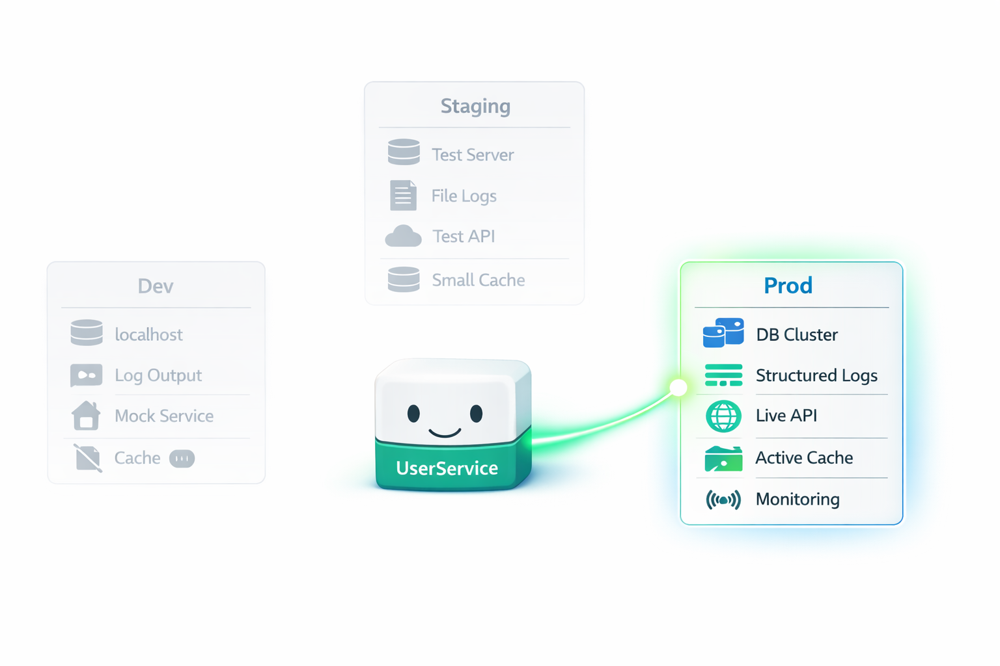
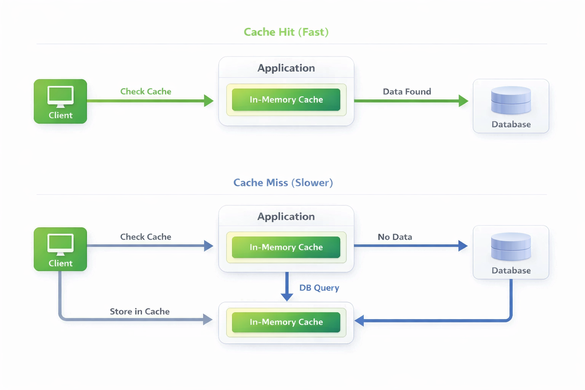
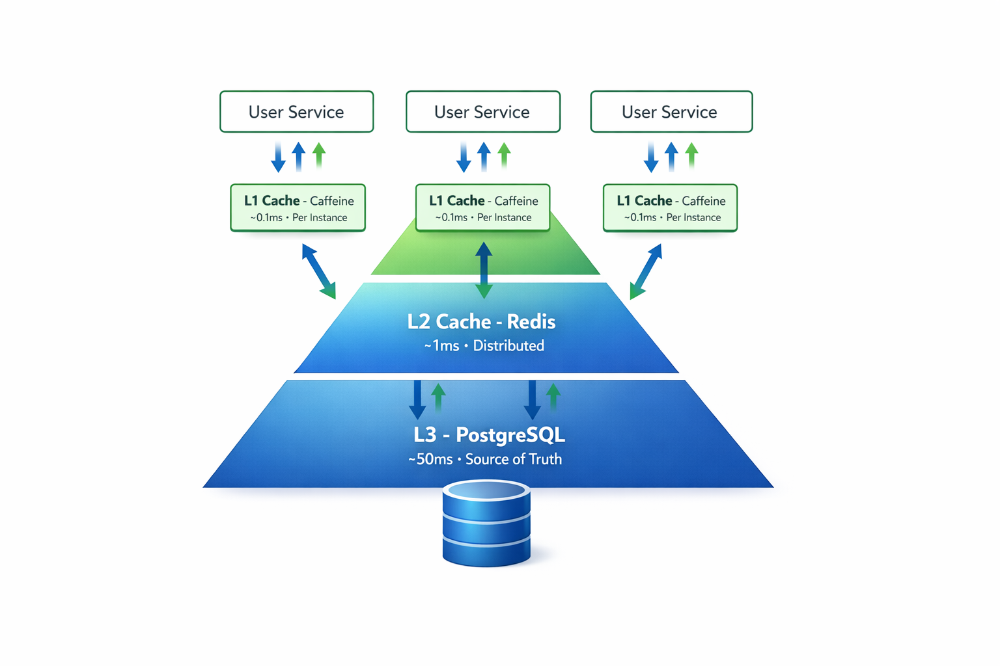
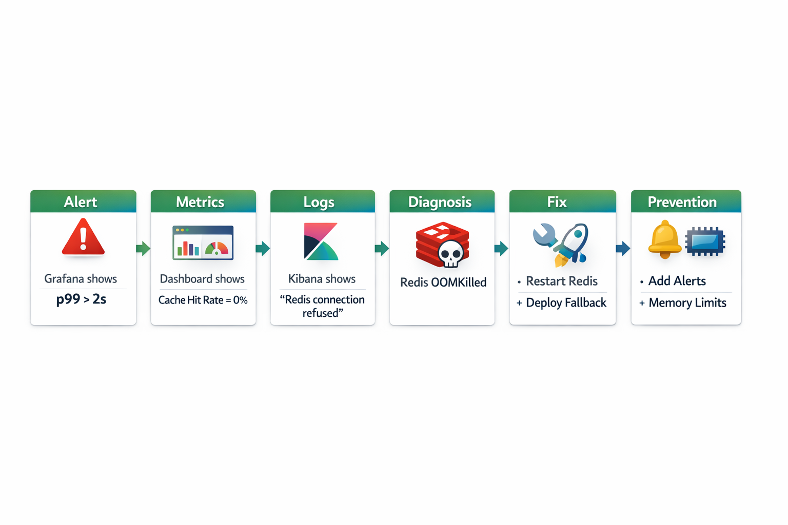

# Технологии программирования

[Главная](/) / Конфигурация и производительность backend-приложений

## Лекция 11. Конфигурация и производительность backend-приложений

### Содержание


## 1. Profiles и конфигурация <a name="p6"></a>

UserService подключается к `localhost:5432` в development, но к `db-cluster.prod.internal:5432` в production. Log level — DEBUG локально, но INFO в production. Cache TTL — 10 секунд в dev, но 5 минут в prod.

Как управлять этими различиями?

### Проблема: разные окружения, разные настройки

Типичное приложение работает в нескольких окружениях:




**Development (локально на ноутбуке)**:
- База данных: H2 in-memory или PostgreSQL на localhost
- Логи: DEBUG уровень, в консоль
- Внешние сервисы: mock'и (не шлём реальные email)
- Кэш: отключен (чтобы видеть изменения сразу)

**Staging (тестовое окружение)**:
- База данных: PostgreSQL на тестовом сервере
- Логи: INFO уровень, в файлы
- Внешние сервисы: реальные, но тестовые аккаунты
- Кэш: включен, короткий TTL

**Production (боевое окружение)**:
- База данных: PostgreSQL кластер с репликацией
- Логи: WARN уровень, в Elasticsearch
- Внешние сервисы: реальные
- Кэш: включен, длинный TTL
- Мониторинг: Prometheus, алерты

Как управлять этими различиями без пересборки приложения?

### Наивные подходы (плохо)

❌ **Хардкод в коде**
```java
public class DatabaseConfig {
    public DataSource dataSource() {
        String url = "jdbc:postgresql://localhost:5432/users";  // Захардкожено!
        // Для production нужно пересобирать
    }
}
```

❌ **if/else в коде**
```java
public DataSource dataSource() {
    if (System.getenv("ENV").equals("production")) {
        return createProductionDataSource();
    } else {
        return createDevDataSource();
    }
    // Месиво, сложно поддерживать
}
```

❌ **Несколько копий application.yml**
```
application-dev.yml
application-staging.yml
application-production.yml
```
Но все в одной папке, легко перепутать, забыть обновить.

### 12-Factor App принцип

**The Twelve-Factor App** — методология для построения SaaS приложений.

**Принцип III: Config**
> Конфигурация должна храниться в окружении (environment), а не в коде.

Что это значит:
- Код одинаковый для всех окружений
- Различия — только в конфигурации
- Конфигурация приходит из environment variables или config files
- Можно задеплоить один и тот же JAR в dev, staging, production

### Spring Profiles — механизм

**Spring Profile** — это именованный набор конфигурации.

Как активировать:
```yaml
# В application.yml
spring:
  profiles:
    active: production
```

Или через environment variable:
```bash
export SPRING_PROFILES_ACTIVE=production
java -jar user-service.jar
```

Или через command line argument:
```bash
java -jar user-service.jar --spring.profiles.active=production
```

Можно активировать несколько профилей:
```bash
export SPRING_PROFILES_ACTIVE=production,monitoring
```

### Profile-specific конфигурационные файлы

Spring автоматически загружает файлы по паттерну `application-{profile}.yml`.

#### application.yml (defaults для всех окружений)

```yaml
spring:
  application:
    name: user-service

server:
  port: 8080

app:
  cache:
    ttl: 60s  # Default TTL
```

#### application-dev.yml

```yaml
spring:
  datasource:
    url: jdbc:postgresql://localhost:5432/users
    username: dev_user
    password: dev_pass

logging:
  level:
    com.example: DEBUG
    org.springframework.web: DEBUG

app:
  cache:
    ttl: 10s  # Короткий TTL для dev
  notification-service:
    url: http://localhost:8081
    enabled: false  # Mock в dev
```

#### application-prod.yml

```yaml
spring:
  datasource:
    url: jdbc:postgresql://db-cluster.prod.internal:5432/users
    username: ${DB_USERNAME}  # Из environment variable
    password: ${DB_PASSWORD}  # Из environment variable
    hikari:
      maximum-pool-size: 20
      minimum-idle: 5

logging:
  level:
    com.example: INFO
    org.springframework.web: WARN

app:
  cache:
    ttl: 300s  # 5 минут для production
  notification-service:
    url: http://notification-service.internal:8080
    enabled: true
```

### Environment variables — production way

**Правило**: пароли и секреты НИКОГДА не должны быть в config файлах.

Используйте `${ENV_VAR}` синтаксис:

```yaml
spring:
  datasource:
    url: ${DATABASE_URL}
    username: ${DATABASE_USERNAME}
    password: ${DATABASE_PASSWORD}
```

Docker Compose пример:

```yaml
# docker-compose.yml
version: '3.8'

services:
  user-service:
    image: user-service:latest
    environment:
      - SPRING_PROFILES_ACTIVE=prod
      - DATABASE_URL=jdbc:postgresql://postgres:5432/users
      - DATABASE_USERNAME=admin
      - DATABASE_PASSWORD=${DB_PASSWORD_FROM_VAULT}  # Из .env файла
    depends_on:
      - postgres

  postgres:
    image: postgres:15
    environment:
      POSTGRES_DB: users
      POSTGRES_USER: admin
      POSTGRES_PASSWORD: ${DB_PASSWORD_FROM_VAULT}
```

`.env` файл (НЕ коммитим в git!):
```bash
DB_PASSWORD_FROM_VAULT=super_secret_password
```

### @ConfigurationProperties — type-safe конфигурация

Вместо `@Value` используйте `@ConfigurationProperties` для группы настроек:

```java
@ConfigurationProperties(prefix = "app.cache")
public record CacheProperties(
    Duration ttl,
    int maxSize,
    boolean enabled
) {}
```

```java
@Configuration
@EnableConfigurationProperties(CacheProperties.class)
public class CacheConfig {
    
    @Bean
    public CacheManager cacheManager(CacheProperties props) {
        if (!props.enabled()) {
            return new NoOpCacheManager();  // Кэш отключен
        }
        
        // Используем props.ttl() и props.maxSize()
        // ...
    }
}
```

```yaml
# application.yml
app:
  cache:
    ttl: 3600s
    max-size: 10000
    enabled: true
```

Преимущества:
- Type-safe (Duration вместо String)
- Валидация на старте приложения
- IDE autocomplete
- Группировка связанных настроек

### Configuration hierarchy (приоритет)

От **низшего** к **высшему** приоритету:

1. **application.yml** (defaults)
2. **application-{profile}.yml** (profile-specific)
3. **Environment variables** (OS environment)
4. **Command-line arguments** (--server.port=9090)

Пример:
```yaml
# application.yml
server:
  port: 8080

# application-prod.yml
server:
  port: 8081

# Environment variable
SERVER_PORT=8082

# Command line
--server.port=8083
```

Результат: `8083` (command line wins).

### Conditional beans с @Profile

Разные beans для разных окружений:

```java
@Configuration
public class NotificationConfig {
    
    @Bean
    @Profile("prod")
    public NotificationClient realNotificationClient(
            @Value("${app.notification-service.url}") String url) {
        return new HttpNotificationClient(url);
    }
    
    @Bean
    @Profile("dev")
    public NotificationClient fakeNotificationClient() {
        return new LoggingNotificationClient();  // Просто логирует, не шлёт
    }
}
```

```java
public class LoggingNotificationClient implements NotificationClient {
    
    private static final Logger log = LoggerFactory.getLogger(LoggingNotificationClient.class);
    
    @Override
    public void sendNotification(String email, String message) {
        log.info("MOCK: Would send notification to {} with message: {}", email, message);
        // Не шлём реальное уведомление в dev
    }
}
```

### Validation конфигурации

Используйте `@Validated` для проверки на старте:

```java
@ConfigurationProperties(prefix = "app")
@Validated
public record AppProperties(
    @NotBlank String name,
    @Min(1) @Max(100) int maxUsers,
    DatabaseProperties database
) {
    public record DatabaseProperties(
        @NotBlank String url,
        @Min(1) @Max(100) int poolSize
    ) {}
}
```

Если конфигурация невалидна → приложение не запустится (fail-fast).

### Практический пример

Запуск с разными профилями:

```bash
# Development
export SPRING_PROFILES_ACTIVE=dev
./gradlew bootRun

# Production
export SPRING_PROFILES_ACTIVE=prod
export DATABASE_URL=jdbc:postgresql://prod-db:5432/users
export DATABASE_USERNAME=admin
export DATABASE_PASSWORD=secret
java -jar build/libs/user-service.jar
```

Проверка активного профиля:

```bash
curl http://localhost:8080/actuator/env | jq '.activeProfiles'
# ["prod"]
```

### Anti-patterns

❌ **Коммитить пароли в git**
```yaml
# application-prod.yml
spring:
  datasource:
    password: super_secret_password  # НИКОГДА!
```

❌ **Использовать @Profile для бизнес-логики**
```java
@Service
@Profile("prod")
public class PremiumFeatureService {
    // Плохо: бизнес-логика не должна зависеть от профиля
}
```
Profiles — для инфраструктуры, не для бизнес-логики.

❌ **Полностью разные конфигурации**
```yaml
# application-dev.yml — 200 строк
# application-prod.yml — 300 строк, совсем другие
```
Должно быть 90% одинаково, 10% отличий.

❌ **Не использовать environment variables для secrets**
```yaml
spring:
  datasource:
    password: ${DB_PASSWORD:default_password}  # default — плохая идея
```

👉 **Ключевая идея**: Хороший конфиг — это когда 90% одинаково везде, и только 10% отличается между окружениями. Код не должен знать про окружения — только конфигурация.

Мы настроили приложение для разных окружений. Последний аспект, который мы рассмотрим — производительность. Как не ходить в базу данных за одними и теми же данными каждый раз?

---
## 2. Кэширование <a name="p7"></a>

UserService endpoint `GET /users/{id}` вызывается 1000 раз в секунду. Каждый вызов делает запрос в PostgreSQL. Но данные пользователя меняются редко — может быть раз в час. Мы делаем 999 избыточных запросов в БД.

Как оптимизировать?

### Проблема: производительность при росте нагрузки

**Сценарий**:
- RPS (requests per second): 100
- Каждый запрос: SELECT в PostgreSQL (~50ms)
- Database load: 100 queries/sec
- Всё работает нормально

**Рост нагрузки**:
- RPS: 1000 (10x рост)
- Database load: 1000 queries/sec
- PostgreSQL не справляется
- Latency растёт: 50ms → 200ms → 500ms
- Пользователи недовольны

**Проблема**: большинство запросов возвращают одни и те же данные. Зачем каждый раз ходить в БД?

### Что такое кэш?

**Кэш (cache)** — это временное хранилище для часто используемых данных, расположенное ближе к потребителю.

**Mental model**:
- **Источник данных** (PostgreSQL) — медленный, но надёжный
- **Кэш** (in-memory) — быстрый, но временный
- **Trade-off**: скорость vs свежесть данных

**Как работает**:
1. Проверяем кэш
2. Если данные есть (cache hit) → возвращаем из кэша (быстро)
3. Если данных нет (cache miss) → запрос в БД → сохраняем в кэш → возвращаем (медленно, но следующий раз будет быстро)




### Cache hit vs Cache miss

**Cache hit** — данные найдены в кэше:
```
User → UserService: GET /users/123
UserService → Cache: get("user:123")
Cache → UserService: User{id=123, name="John"}  ✅
UserService → User: 200 OK (1ms)
```

**Cache miss** — данных нет в кэше:
```
User → UserService: GET /users/456
UserService → Cache: get("user:456")
Cache → UserService: null  ❌
UserService → PostgreSQL: SELECT * FROM users WHERE id=456
PostgreSQL → UserService: User{id=456, name="Jane"}
UserService → Cache: set("user:456", User, TTL=1h)
UserService → User: 200 OK (52ms)
```

**Hit rate** — процент попаданий в кэш:
```
hit_rate = cache_hits / (cache_hits + cache_misses)
```
Цель: hit rate > 80%.

### Простое кэширование: HashMap

Начнём с самого простого подхода:

```java
@Service
public class UserService {
    
    private final Map<Long, UserResponse> cache = new ConcurrentHashMap<>();
    private final UserRepository userRepository;
    
    public UserResponse findById(Long id) {
        // Проверяем кэш
        UserResponse cached = cache.get(id);
        if (cached != null) {
            log.debug("Cache HIT for user {}", id);
            return cached;  // Cache hit
        }
        
        // Cache miss — запрос в БД
        log.debug("Cache MISS for user {}", id);
        User user = userRepository.findById(id)
            .orElseThrow(() -> new UserNotFoundException(id));
        
        UserResponse response = toResponse(user);
        
        // Сохраняем в кэш
        cache.put(id, response);
        
        return response;
    }
}
```

Работает! Но есть проблемы:

❌ **Нет TTL** — данные устаревают, но остаются в кэше вечно  
❌ **Нет size limit** — кэш растёт бесконечно → OutOfMemoryError  
❌ **Нет eviction policy** — какую запись удалить когда кэш полон?  
❌ **Нет статистики** — как узнать hit rate?

### Caffeine — production-ready in-memory cache

**Caffeine** — это библиотека для in-memory кэширования с поддержкой TTL, eviction, статистики.

#### Подключение

```xml
<!-- pom.xml -->
<dependency>
    <groupId>org.springframework.boot</groupId>
    <artifactId>spring-boot-starter-cache</artifactId>
</dependency>
<dependency>
    <groupId>com.github.ben-manes.caffeine</groupId>
    <artifactId>caffeine</artifactId>
</dependency>
```

#### Конфигурация

```java
@Configuration
@EnableCaching
public class CacheConfig {
    
    @Bean
    public CacheManager cacheManager(CacheProperties props) {
        CaffeineCacheManager manager = new CaffeineCacheManager("users");
        manager.setCaffeine(Caffeine.newBuilder()
            .maximumSize(10_000)  // Максимум 10k записей
            .expireAfterWrite(props.ttl())  // TTL из конфигурации
            .recordStats());  // Включаем статистику
        return manager;
    }
}
```

```yaml
# application.yml
app:
  cache:
    ttl: 3600s  # 1 час
```

#### Использование с аннотациями

```java
@Service
public class UserService {
    
    private final UserRepository userRepository;
    
    @Cacheable(value = "users", key = "#id")
    public UserResponse findById(Long id) {
        // Этот метод вызывается только при cache miss
        log.info("Cache MISS: fetching user {} from database", id);
        
        User user = userRepository.findById(id)
            .orElseThrow(() -> new UserNotFoundException(id));
        return toResponse(user);
    }
    
    @CacheEvict(value = "users", key = "#id")
    public UserResponse updateUser(Long id, UpdateUserRequest request) {
        // Запись удаляется из кэша при обновлении
        User user = userRepository.findById(id)
            .orElseThrow(() -> new UserNotFoundException(id));
        
        user.setName(request.getName());
        user.setEmail(request.getEmail());
        
        User updated = userRepository.save(user);
        return toResponse(updated);
        // Следующий findById(id) будет cache miss
    }
    
    @CacheEvict(value = "users", allEntries = true)
    public void clearCache() {
        // Для admin/emergency use
        log.warn("Clearing all user cache");
    }
}
```

### Spring Cache аннотации

**@Cacheable** — проверить кэш перед выполнением метода:
- Если данные в кэше → метод не вызывается, возвращается из кэша
- Если данных нет → метод вызывается, результат сохраняется в кэш

**@CacheEvict** — удалить запись из кэша:
- `key = "#id"` — удалить конкретную запись
- `allEntries = true` — очистить весь кэш

**@CachePut** — обновить кэш (метод всегда вызывается):
```java
@CachePut(value = "users", key = "#result.id")
public UserResponse createUser(CreateUserRequest request) {
    // Метод всегда выполняется
    // Результат сохраняется в кэш
}
```

### Eviction strategies (стратегии вытеснения)

Когда кэш заполнен, нужно удалить старые записи. Какие?

**LRU (Least Recently Used)** — удаляем то, к чему давно не обращались:
- Хорошо для данных с temporal locality
- Caffeine использует улучшенную версию (W-TinyLFU)

**LFU (Least Frequently Used)** — удаляем то, к чему обращаются реже всего:
- Хорошо для популярных данных

**TTL (Time To Live)** — удаляем по времени:
- Простая стратегия
- Гарантирует свежесть данных

**Size-based** — удаляем когда достигнут лимит размера:
- Защита от OutOfMemoryError

Caffeine использует **W-TinyLFU** — комбинацию LRU и LFU с оптимизациями.

### Проблема: несколько инстансов

У нас 3 инстанса UserService за load balancer. Каждый имеет свой Caffeine кэш.

**Проблема**:
1. Request 1 → Instance 1 → cache miss → БД → сохранили в кэш Instance 1
2. Request 2 (тот же user) → Instance 2 → cache miss (!) → БД → сохранили в кэш Instance 2
3. Дублирование работы, низкий hit rate

**Решение**: нужен distributed cache, разделяемый между всеми инстансами.

### Redis — distributed cache

**Redis (REmote DIctionary Server)** — это in-memory key-value хранилище, которое работает как отдельный сервис.

**Что такое Redis?**
- In-memory database (все данные в RAM)
- Очень быстрый (sub-millisecond latency)
- Key-value модель: `"user:123"` → `{"id": 123, "name": "John"}`
- Поддержка TTL, persistence, pub/sub

**Зачем нужен?**
- **Кэширование** (наш use case)
- Session storage
- Rate limiting
- Pub/Sub messaging

**Как запустить?**
```bash
# Через Docker (самый простой способ)
docker run -d -p 6379:6379 redis:7-alpine

# Проверка
docker exec -it <container-id> redis-cli ping
# Ответ: PONG
```

**Базовые команды**:
```bash
# Сохранить
SET mykey "Hello"

# Получить
GET mykey
# Ответ: "Hello"

# Удалить
DEL mykey

# С TTL (автоматическое удаление через 60 секунд)
SETEX mykey 60 "Hello"
```

### Spring Boot + Redis

#### Подключение

```xml
<!-- pom.xml -->
<dependency>
    <groupId>org.springframework.boot</groupId>
    <artifactId>spring-boot-starter-data-redis</artifactId>
</dependency>
```

#### Конфигурация

```yaml
# application.yml
spring:
  cache:
    type: redis
    redis:
      time-to-live: 3600s  # 1 час
  
  data:
    redis:
      host: localhost
      port: 6379
```

#### Код остаётся тот же!

```java
@Service
public class UserService {
    
    // Код не меняется! Spring Cache Abstraction
    @Cacheable(value = "users", key = "#id")
    public UserResponse findById(Long id) {
        // Теперь кэш в Redis, а не в памяти приложения
        User user = userRepository.findById(id)
            .orElseThrow(() -> new UserNotFoundException(id));
        return toResponse(user);
    }
}
```

### Caffeine vs Redis

| Аспект | Caffeine (in-memory) | Redis (distributed) |
|--------|---------------------|---------------------|
| Deployment | В процессе приложения | Отдельный сервис |
| Sharing | Каждый инстанс свой кэш | Общий для всех инстансов |
| Latency | ~0.1ms | ~1ms |
| Setup | Простой | Требует Redis сервер |
| Use case | Single instance | Multiple instances |
| Production | ❌ Не подходит для scale | ✅ Production-ready |



### Docker Compose с Redis

```yaml
# docker-compose.yml
version: '3.8'

services:
  user-service:
    build: .
    ports:
      - "8080:8080"
    environment:
      - SPRING_PROFILES_ACTIVE=prod
      - SPRING_DATA_REDIS_HOST=redis
    depends_on:
      - postgres
      - redis

  postgres:
    image: postgres:15
    environment:
      POSTGRES_DB: users
      POSTGRES_USER: admin
      POSTGRES_PASSWORD: password

  redis:
    image: redis:7-alpine
    ports:
      - "6379:6379"
    command: redis-server --maxmemory 256mb --maxmemory-policy allkeys-lru
```

### Cache invalidation — "the hardest problem"

> "There are only two hard things in Computer Science: cache invalidation and naming things." — Phil Karlton

**Проблема**: когда удалять данные из кэша?

**Стратегии**:

1. **TTL-based** (по времени):
    - Автоматическое удаление через N секунд
    - Просто, но данные могут устареть до истечения TTL
    - ✅ Используем для большинства случаев

2. **Event-based** (по событиям):
    - При UPDATE user → @CachePut или @CacheEvict
    - При DELETE user → @CacheEvict
    - Всегда свежие данные, но сложнее

3. **Hybrid** (комбинация):
    - TTL для автоматической очистки
    - Event-based для критичных изменений
    - 👉 Лучший подход

### Что кэшировать в UserService?

✅ **Кэшировать**:
- User profiles (меняются редко, читаются часто)
- Configuration/reference data
- Результаты дорогих вычислений

❌ **Не кэшировать**:
- User session data (меняется каждый запрос)
- Real-time counters
- Sensitive data (пароли, токены)
- Уникальные запросы (нет повторений)

### Мониторинг кэша

Caffeine автоматически экспортирует метрики через Micrometer:

```
# Метрики в Prometheus
cache_gets_total{result="hit"} 950
cache_gets_total{result="miss"} 50
cache_evictions_total 10
cache_size 1000

# Hit rate
hit_rate = 950 / (950 + 50) = 95%  ✅
```

Grafana dashboard:
```
# Hit rate
rate(cache_gets_total{result="hit"}[5m]) / 
rate(cache_gets_total[5m])

# Cache size
cache_size

# Eviction rate
rate(cache_evictions_total[5m])
```

### Anti-patterns

❌ **Кэшировать всё**
```java
@Cacheable("everything")  // Плохо!
public Object doAnything() { ... }
```
Memory overhead, сложность, stale data.

❌ **Нет TTL**
```java
Caffeine.newBuilder()
    .maximumSize(10_000)
    // Нет expireAfterWrite → данные устаревают
```

❌ **Не мониторить hit rate**
- Не знаем эффективность кэша
- Может быть hit rate = 10% → кэш бесполезен

❌ **In-memory кэш для multiple instances**
```yaml
# Плохо для production с несколькими инстансами
spring:
  cache:
    type: caffeine  # Каждый инстанс свой кэш
```

❌ **Не обрабатывать Redis failures**
```java
// Если Redis упал → приложение падает
@Cacheable("users")
public User getUser(Long id) { ... }
```

Нужен fallback:
```java
try {
    return cacheManager.getCache("users").get(id);
} catch (Exception e) {
    log.warn("Cache unavailable, falling back to database");
    return userRepository.findById(id).orElseThrow();
}
```

### Performance improvement с кэшем

**До кэша**:
- RPS: 100
- Latency p50: 50ms
- Latency p95: 100ms
- Database load: 100 queries/sec

**После кэша (hit rate 90%)**:
- RPS: 100
- Latency p50: 2ms (25x faster!)
- Latency p95: 10ms (10x faster!)
- Database load: 10 queries/sec (10x меньше!)

👉 **Ключевая идея**: Кэш — это не бесплатное ускорение. Это trade-off между скоростью и актуальностью данных. Всегда спрашивайте: "что произойдёт, если пользователь увидит данные 5-минутной давности?"

Мы рассмотрели все ключевые аспекты эксплуатации. Давайте соберём всё вместе и пройдём полный сценарий — от инцидента до исправления.

---

## 3. Сквозной сценарий: от инцидента до исправления <a name="p8"></a>

Мы изучили метрики, логи, graceful shutdown, profiles и кэширование. Теперь посмотрим, как всё это работает вместе в реальном production сценарии.



### Сценарий: Monday morning incident

**Понедельник, 10:00**. Вы пьёте кофе. Grafana alert: **"UserService p99 latency > 2s"**.

Что делать? Давайте пройдём весь путь — от обнаружения до исправления.

### Шаг 1: Обнаружение проблемы (Блок 3 — Метрики)

Открываем Grafana dashboard:

**Что видим**:
- ✅ RPS: стабильно 150 req/sec (норма)
- ❌ Latency p99: выросла с 50ms до 2500ms в 09:45
- ❌ DB connection pool usage: 100% (было 30%)
- ❌ Cache hit rate: упала с 95% до 0% в 09:44

**Гипотеза**: кэш перестал работать → все запросы идут в БД → БД перегружена.

### Шаг 2: Анализ логов (Блок 4 — Logging)

Открываем Kibana, фильтруем по времени 09:40-09:50.

**Фильтр по уровню ERROR**:
```
level:ERROR AND @timestamp:[2024-01-15T09:40 TO 2024-01-15T09:50]
```

**Находим**:
```json
{
  "timestamp": "2024-01-15T09:44:23.456Z",
  "level": "ERROR",
  "logger": "org.springframework.data.redis.RedisConnectionFailureException",
  "message": "Unable to connect to Redis at localhost:6379",
  "traceId": "abc123def456",
  "instance": "user-service-2"
}
```

**Ещё логи**:
```json
{
  "timestamp": "2024-01-15T09:44:25.123Z",
  "level": "WARN",
  "message": "Cache unavailable, falling back to database",
  "traceId": "xyz789",
  "instance": "user-service-1"
}
```

```json
{
  "timestamp": "2024-01-15T09:45:10.789Z",
  "level": "ERROR",
  "message": "HikariPool - Connection is not available",
  "instance": "user-service-3"
}
```

**Root cause**: Redis недоступен → все запросы идут в БД → connection pool исчерпан.

### Шаг 3: Проверка Redis

```bash
# Проверяем статус Redis
docker ps | grep redis
# Redis контейнер не запущен!

# Проверяем логи Docker
docker logs redis
# OOMKilled - Redis был убит из-за нехватки памяти
```

**Причина**: Redis потребил всю доступную память и был убит системой.

### Шаг 4: Немедленное исправление (mitigation)

```bash
# Перезапускаем Redis
docker-compose up -d redis

# Проверяем что Redis работает
docker exec -it redis redis-cli ping
# PONG ✅

# Ждём 1-2 минуты
```

**Результат**:
- Cache hit rate восстанавливается: 0% → 50% → 80% → 95%
- Latency падает: 2500ms → 500ms → 100ms → 50ms
- DB connection pool usage: 100% → 30%
- Инцидент решён за 5 минут

### Шаг 5: Post-mortem анализ

**Что произошло**:
1. Redis накопил слишком много данных в памяти
2. Система убила Redis (OOMKilled)
3. UserService потерял кэш
4. Все запросы пошли в PostgreSQL
5. PostgreSQL не справился с нагрузкой
6. Latency выросла

**Что помогло**:
- **Метрики** (Блок 3): обнаружили проблему через Grafana alert
- **Логи** (Блок 4): нашли root cause через Kibana
- **Trace ID** (Блок 4): проследили путь запросов
- **Graceful degradation** (Блок 7): приложение продолжило работать без Redis

### Шаг 6: Долгосрочное исправление

**Проблема**: Redis не имел memory limit.

**Решение 1**: Добавить memory limit в docker-compose

```yaml
# docker-compose.yml
services:
  redis:
    image: redis:7-alpine
    command: redis-server --maxmemory 512mb --maxmemory-policy allkeys-lru
    deploy:
      resources:
        limits:
          memory: 512M
```

**Решение 2**: Добавить мониторинг Redis

```yaml
# prometheus.yml
scrape_configs:
  - job_name: 'redis'
    static_configs:
      - targets: ['redis:6379']
```

**Решение 3**: Добавить alert для Redis memory

```yaml
# alerts.yml
groups:
  - name: redis
    rules:
      - alert: RedisMemoryHigh
        expr: redis_memory_used_bytes / redis_memory_max_bytes > 0.9
        for: 5m
        annotations:
          summary: "Redis memory usage > 90%"
```

**Решение 4**: Уменьшить TTL для некритичных данных

```yaml
# application.yml
app:
  cache:
    ttl: 1800s  # Было 3600s, стало 30 минут
```

### Шаг 7: Деплой исправления (Блок 5 — Graceful Shutdown)

```bash
# Обновляем docker-compose.yml с новыми настройками Redis
# Деплоим через rolling update

./rolling-update.sh

# Лог:
# Updating user-service-1...
# Waiting for user-service-1 to be healthy...
# ✅ user-service-1 is healthy
# Updating user-service-2...
# ✅ user-service-2 is healthy
# Updating user-service-3...
# ✅ user-service-3 is healthy
# Rolling update completed successfully!
```

**Результат**: zero downtime, пользователи не заметили обновление.

### Итоговая таблица: как каждый блок помог

| Проблема | Инструмент | Блок лекции |
|----------|-----------|-------------|
| Обнаружили проблему | Grafana alert (метрики) | Блок 3: Observability |
| Нашли причину | Kibana + traceId (логи) | Блок 4: Logging |
| Починили без даунтайма | Graceful shutdown | Блок 5: Graceful Shutdown |
| Настроили для разных окружений | Profiles + конфигурация | Блок 6: Profiles |
| Оптимизировали производительность | Многоуровневый кэш | Блок 7: Кэширование |

### Что мы узнали из этого инцидента

1. **Observability критична**: без метрик и логов мы бы не нашли проблему быстро
2. **Graceful degradation работает**: приложение продолжило работать без Redis (медленнее, но работало)
3. **Мониторинг всех компонентов**: нужно мониторить не только приложение, но и Redis, PostgreSQL
4. **Limits важны**: Redis без memory limit — это бомба замедленного действия
5. **Graceful shutdown позволяет деплоить без страха**: обновление прошло без ошибок для пользователей

### Итоги лекции

Мы прошли путь от "работает на моей машине" до production-ready приложения.

**Что мы изучили**:

1. **Проблема** (Блок 1): Production ≠ development. Нужны инструменты для наблюдения и управления.

2. **Системная модель** (Блок 2): Backend-приложение — это процесс ОС с ресурсами, состоянием и зависимостями.

3. **Observability** (Блок 3): Метрики + health checks позволяют понять, что происходит с системой.
    - Prometheus для сбора метрик
    - Grafana для визуализации
    - Spring Boot Actuator для экспорта метрик

4. **Logging + Trace ID** (Блок 4): Структурированные логи + trace ID позволяют найти причину проблемы в распределённой системе.
    - JSON логи для машинной обработки
    - Trace ID для связи логов одного запроса
    - ELK stack для централизованного хранения

5. **Graceful Shutdown** (Блок 5): Безопасная остановка приложения без потери запросов.
    - SIGTERM vs SIGKILL
    - Spring Boot graceful shutdown
    - Rolling update для zero downtime

6. **Profiles** (Блок 6): Управление конфигурацией для разных окружений без пересборки.
    - Spring Profiles для разных окружений
    - Environment variables для secrets
    - 12-Factor App принципы

7. **Caching** (Блок 7): Оптимизация производительности через кэширование.
    - От простого HashMap к Caffeine
    - От Caffeine к Redis для distributed cache
    - Cache invalidation strategies

8. **End-to-End** (Блок 8): Всё работает вместе в реальном production сценарии.

### Что дальше?

Следующие темы для изучения:

**Контейнеризация и оркестрация**:
- Docker (вы уже немного знаете)
- Kubernetes для управления контейнерами
- Helm для деплоя

**CI/CD**:
- Автоматическое тестирование
- Автоматический деплой
- GitOps подход

**Distributed Tracing**:
- OpenTelemetry
- Jaeger/Zipkin
- Связь метрик, логов и трейсов

**Advanced Topics**:
- Service mesh (Istio, Linkerd)
- Chaos engineering
- SRE practices