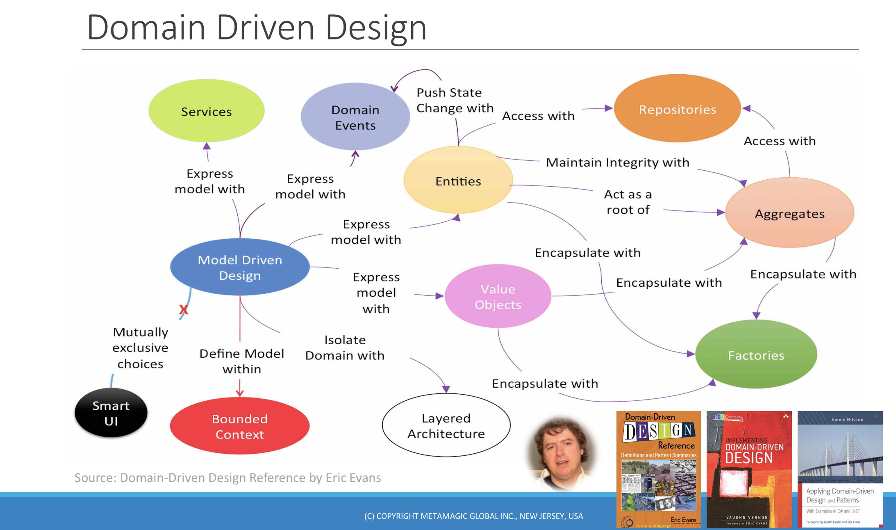
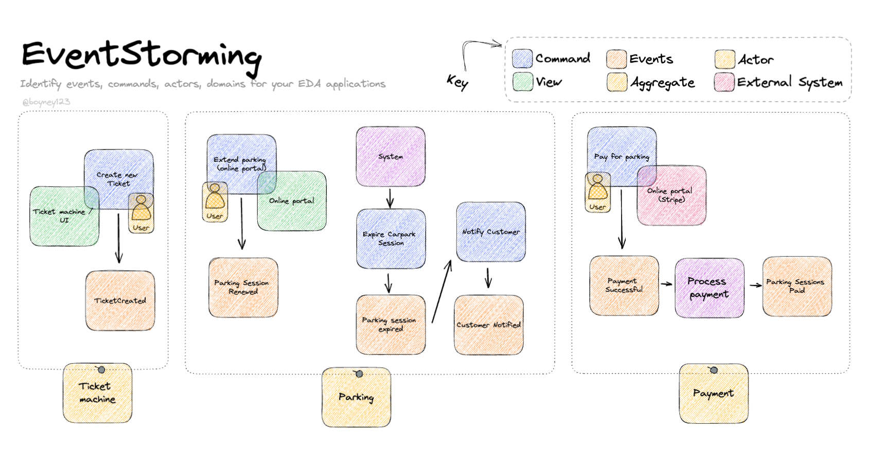
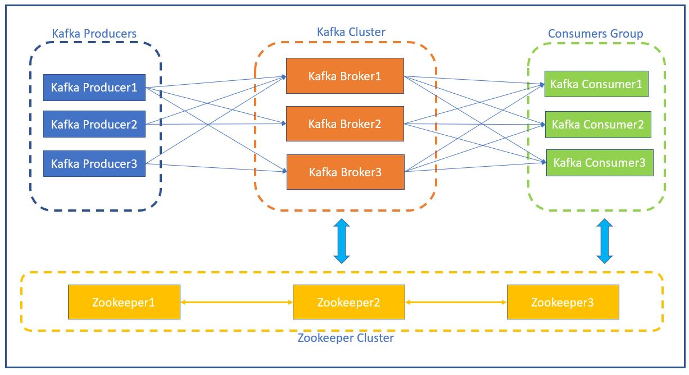

## Введение: эволюция проектирования систем

Современная разработка ПО — это не только про код, но и про понимание бизнеса. Когда проекты растут, становится всё сложнее ориентироваться в бизнес-логике. Именно здесь появляются Domain-Driven Development (DDD) и Event-Driven Development (EDD) — два мощных подхода, помогающих создавать гибкие, масштабируемые и понятные приложения.


## 1. Domain-Driven Development (DDD)

### 1.1 Что это такое?

**DDD** — методология проектирования, ориентированная на бизнес-логику. Главная идея — строить архитектуру вокруг предметной области.


**Ключевые принципы:**

- **Ubiquitous Language** — единый язык между бизнесом и разработкой.
- **Bounded Context** — изолированные контексты в модели.
- **Entities / Value Objects** — сущности с идентичностью и объекты-значения.
- **Aggregates** — логически связанные группы сущностей.
- **Repositories** — доступ к агрегатам.




### 1.2 Пример:

```java
public class Order {
    private final OrderId id;
    private final List<OrderItem> items;
    private OrderStatus status;

    public void complete() {
        if (this.status != OrderStatus.PAID) {
            throw new IllegalStateException("Order must be paid before completing.");
        }
        this.status = OrderStatus.COMPLETED;
        DomainEvents.raise(new OrderCompletedEvent(this.id));
    }
}
```

### 📌 Ubiquitous Language

- Используй термины бизнеса в названиях классов, методов, полей.
- Пример:
```java
public class Order {
    private OrderStatus status;
    public void complete() { ... }
}
```

### 📌 Entities / Value Objects / Aggregates

| Тип           | Идентичность | Пример         |
|---------------|--------------|----------------|
| Entity        | Да           | Order          |
| Value Object  | Нет          | Money, Address |
| Aggregate     | Да           | Order + Items  |

### 📌 Bounded Context

- Выделяй модули по бизнес-направлениям.
- Пример структуры:

```
src/
├── payments/
├── orders/
```


## 2. Event-Driven Development (EDD)




### Что это такое?

**EDD** — это архитектурный подход, при котором взаимодействие между компонентами системы осуществляется через события. 
В EDD события представляют собой изменения в системе, на которые компоненты или микросервисы могут реагировать 
асинхронно. Это позволяет построить гибкие, масштабируемые и отказоустойчивые системы.

**Компоненты:**
- **Event** — событие.
- **Producer** — генерирует событие.
- **Consumer** — обрабатывает событие.
- **Event Bus / Broker** — доставка (Kafka, RabbitMQ).

### Зачем использовать EDD?

EDD имеет множество преимуществ, которые делают его привлекательным для современной разработки:

- **Асинхронность**

Все взаимодействия между компонентами происходят через события, что позволяет системе работать асинхронно. Это важное преимущество для построения высоконагруженных систем, где необходимость блокировать выполнение может существенно замедлить работу.

- **Масштабируемость**

Поскольку взаимодействие между компонентами происходит через события, каждый компонент может быть масштабирован независимо. В случае микросервисной архитектуры каждый сервис может потреблять события, не блокируя другие сервисы.

- **Отказоустойчивость**

Система может продолжить работать даже в случае отказа одного из компонентов, потому что компоненты могут работать независимо друг от друга. В случае отказа потребителя события, оно может быть обработано позже.

- **Реактивность**

Система может мгновенно реагировать на изменения в данных, что делает её идеальной для приложений, требующих реального времени, например, для аналитики или онлайн-игр.

- **Гибкость**

Системы, построенные на событиях, проще модифицировать, поскольку компоненты могут быть добавлены или удалены без нарушения работы других частей системы.

### Принципы Event-Driven архитектуры

### Пример:

```java
public class OrderPaidEvent {
    private final UUID orderId;
    public OrderPaidEvent(UUID orderId) { this.orderId = orderId; }
    public UUID getOrderId() { return orderId; }
}

@Component
public class OrderPaidEventHandler {
    @EventListener
    public void handle(OrderPaidEvent event) {
        // обработка события
    }
}
```

1. **События**:
Событие (Event) — это факт или изменение состояния в системе, которое имеет значение для других компонентов. Обычно события являются необратимыми. Пример: заказ был оплачен.

2. **Производитель событий (Event Producer):**
Это компонент, генерирующий событие. Например, микросервис обработки платежей, который генерирует событие OrderPaid.

3. **Потребитель событий (Event Consumer):**
Это компоненты, которые обрабатывают события. Например, микросервис управления заказами может слушать событие OrderPaid и обновлять статус заказа.

4. **Шина событий (Event Bus):**
Это механизм доставки событий от производителя к потребителю. Шина может использоваться для масштабируемой и асинхронной доставки событий между компонентами системы. Пример: Kafka, RabbitMQ.

5. **Асинхронность:**
В отличие от синхронных взаимодействий, где один компонент зависит от другого, в EDD взаимодействие происходит через события, что позволяет повысить производительность и ускорить отклик.

## 3. Связь DDD и EDD

| DDD                                 | EDD                              |
|------------------------------------|----------------------------------|
| Моделирует бизнес-логику           | Моделирует взаимодействие        |
| Domain Events                      | Реакция на события               |
| Внутри сервисов                    | Между сервисами                  |
| Bounded Context                    | Асинхронная интеграция           |


## 4. Практические рекомендации

### Что применять:

#### В DDD:
- Использовать **Ubiquitous Language**.
- Выделять **Entities**, **Value Objects**, **Aggregates**.
- Делить проект на **Bounded Contexts**.

#### В EDD:
- Осваивать Spring Events, Kafka.
- Строить модули вокруг реакций на события.


## Apache Kafka

**Apache Kafka** — это распределенная система для управления потоками данных в реальном времени. Kafka предоставляет 
платформу для обработки, передачи и хранения потоковых данных в крупных распределенных системах. Она стала популярной 
в мире микросервисных архитектур и систем реального времени, благодаря своей высокой пропускной способности, 
масштабируемости и отказоустойчивости.

### Основные компоненты Kafka
- **Producer**: Компоненты, которые отправляют сообщения в Kafka. Они отправляют данные в одну или несколько тем.

- **Consumer**: Компоненты, которые читают сообщения из Kafka. Каждый потребитель подписывается на одну или несколько тем.

- **Topic**: Канал, по которому отправляются сообщения. Kafka поддерживает разделение данных на топики, что позволяет организовать потоковую обработку сообщений.

- **Partition**: Каждый топик может быть разбит на несколько разделов (партиций), что увеличивает масштабируемость и распределение нагрузки.

- **Broker**: Серверы Kafka, которые принимают сообщения от продюсеров и доставляют их потребителям. Kafka может работать в кластере брокеров для обеспечения отказоустойчивости и масштабируемости.

### Принципы работы Kafka

**2.1. Публикация сообщений**

Продюсеры отправляют данные в Kafka. Каждое сообщение помещается в топик. Сообщения внутри топика хранятся в 
определенном порядке, основанном на времени поступления.

**2.2. Хранение данных**

Kafka сохраняет сообщения на диске, что позволяет повторно читать их, если это необходимо. По умолчанию данные 
сохраняются в течение 7 дней, но этот срок можно настроить.

**2.3. Подписка и потребление**

Потребители получают сообщения из Kafka по запросу. Они могут читать сообщения с любого смещения (offset), что позволяет повторно обрабатывать сообщения или начать чтение с определенной точки.

**2.4. Репликация и отказоустойчивость**

Kafka обеспечивает репликацию партиций. Каждая партиция имеет один лидер и несколько фолловеров. Лидер принимает все записи и реплицирует их на фолловеров. В случае сбоя лидера один из фолловеров становится новым лидером.

**2.5. Масштабируемость**

Kafka легко масштабируется за счет добавления новых брокеров. Каждый новый брокер может обслуживать дополнительные партиции и топики.



### Интеграция Kafka с Spring

#### Зависимости для Spring
Для интеграции Apache Kafka с Spring необходимы следующие зависимости:

```groovy
dependencies {
    implementation 'org.springframework.boot:spring-boot-starter'
    implementation 'org.springframework.kafka:spring-kafka'

    testImplementation 'org.springframework.kafka:spring-kafka-test'
    testImplementation 'org.springframework.boot:spring-boot-starter-test'
}
```

### Конфигурация Kafka в Spring
В Spring необходимо настроить KafkaTemplate для отправки сообщений и @KafkaListener для получения сообщений.

**Конфигурация продюсера:**
```java
@Configuration
public class KafkaConfig {

    @Bean
    public ProducerFactory<String, String> producerFactory() {
        Map<String, Object> producerProps = new HashMap<>();
        producerProps.put(ProducerConfig.BOOTSTRAP_SERVERS_CONFIG, "localhost:9092");
        producerProps.put(ProducerConfig.KEY_SERIALIZER_CLASS_CONFIG, StringSerializer.class);
        producerProps.put(ProducerConfig.VALUE_SERIALIZER_CLASS_CONFIG, StringSerializer.class);
        return new DefaultKafkaProducerFactory<>(producerProps);
    }

    @Bean
    public KafkaTemplate<String, String> kafkaTemplate() {
        return new KafkaTemplate<>(producerFactory());
    }
}
```

**Конфигурация потребителя:**

```java
@Configuration
@EnableKafka
public class KafkaConsumerConfig {

    @Bean
    public ConsumerFactory<String, String> consumerFactory() {
        Map<String, Object> consumerProps = new HashMap<>();
        consumerProps.put(ConsumerConfig.BOOTSTRAP_SERVERS_CONFIG, "localhost:9092");
        consumerProps.put(ConsumerConfig.GROUP_ID_CONFIG, "test-group");
        consumerProps.put(ConsumerConfig.KEY_DESERIALIZER_CLASS_CONFIG, StringDeserializer.class);
        consumerProps.put(ConsumerConfig.VALUE_DESERIALIZER_CLASS_CONFIG, StringDeserializer.class);
        return new DefaultKafkaConsumerFactory<>(consumerProps);
    }

    @Bean
    public ConcurrentMessageListenerContainer<String, String> messageListenerContainer() {
        return new ConcurrentMessageListenerContainer<>(consumerFactory(), "test-topic");
    }
}
```

#### Создание продюсера для отправки сообщений
```java
@Service
public class KafkaProducer {

    private final KafkaTemplate<String, String> kafkaTemplate;

    @Autowired
    public KafkaProducer(KafkaTemplate<String, String> kafkaTemplate) {
        this.kafkaTemplate = kafkaTemplate;
    }

    public void sendMessage(String message) {
        kafkaTemplate.send("test-topic", message);
    }
}
```

#### Создание потребителя для получения сообщений
```java
@Service
public class KafkaConsumer {

    @KafkaListener(topics = "test-topic", groupId = "test-group")
    public void listen(String message) {
        System.out.println("Received message: " + message);
    }
}
```

#### Пример использования
В контроллере можно создать эндпоинт для отправки сообщений в Kafka:

```java
@RestController
public class KafkaController {

    private final KafkaProducer kafkaProducer;

    @Autowired
    public KafkaController(KafkaProducer kafkaProducer) {
        this.kafkaProducer = kafkaProducer;
    }

    @PostMapping("/send")
    public ResponseEntity<String> sendMessage(@RequestBody String message) {
        kafkaProducer.sendMessage(message);
        return ResponseEntity.ok("Message sent to Kafka");
    }
}

```

Для того, чтобы поднять кафку локально, можно использовать следующий docker-compose файл:
```yml
version: '3'

services:
  zookeeper:
    image: wurstmeister/zookeeper:3.4.6
    container_name: zookeeper
    ports:
      - "2181:2181"
    environment:
      - ZOOKEEPER_CLIENT_PORT=2181
      - ZOOKEEPER_TICK_TIME=2000
    networks:
      - kafka-net

  kafka:
    image: wurstmeister/kafka:latest
    container_name: kafka
    ports:
      - "9093:9093"
    environment:
      - KAFKA_ZOOKEEPER_CONNECT=zookeeper:2181
      - KAFKA_ADVERTISED_LISTENER_NAME=PLAINTEXT
      - KAFKA_LISTENER_SECURITY_PROTOCOL=PLAINTEXT
      - KAFKA_LISTENER_NAME_PLAINTEXT_PORT=9093
      - KAFKA_LISTENER_NAME_PLAINTEXT_LISTENER_SECURITY_PROTOCOL=PLAINTEXT
      - KAFKA_LISTENER_NAME_PLAINTEXT_LISTENER_TCP_PORT=9093
      - KAFKA_LISTENER_NAME_PLAINTEXT_LISTENER_PORT=9093
      - KAFKA_LISTENER_NAME_PLAINTEXT_LISTENER_PROTOCOL=PLAINTEXT
      - KAFKA_LISTENER_PORT=9093
      - KAFKA_LISTENER_NAME_PLAINTEXT_LISTENER_TYPE=TCP
      - KAFKA_LISTENER_PLAINTEXT=PLAIN
      - KAFKA_LISTENER_PORT=9093
    networks:
      - kafka-net
    depends_on:
      - zookeeper

  kafdrop:
    image: obsidiandynamics/kafdrop:latest
    container_name: kafdrop
    ports:
      - "9000:9000"
    environment:
      - KAFKA_BROKERCONNECT=kafka:9093
    networks:
      - kafka-net

networks:
  kafka-net:
    driver: bridge

```


## Ресурсы

- Eric Evans — *Domain-Driven Design*.
- Vaughn Vernon — *Implementing DDD*.
- https://kafka.apache.org/
- https://docs.spring.io/
- Spring Kafka — документация по интеграции Kafka с Spring: https://docs.spring.io/spring-kafka/docs/current/reference/html/
- Apache Kafka — официальный сайт: https://kafka.apache.org/
- Reactive Programming — изучение реактивного программирования с использованием событий: https://www.reactivemanifesto.org/
- Designing Event-Driven Systems — книга Ben Stopford: https://www.oreilly.com/library/view/designing-event-driven-systems/9781492038254/

