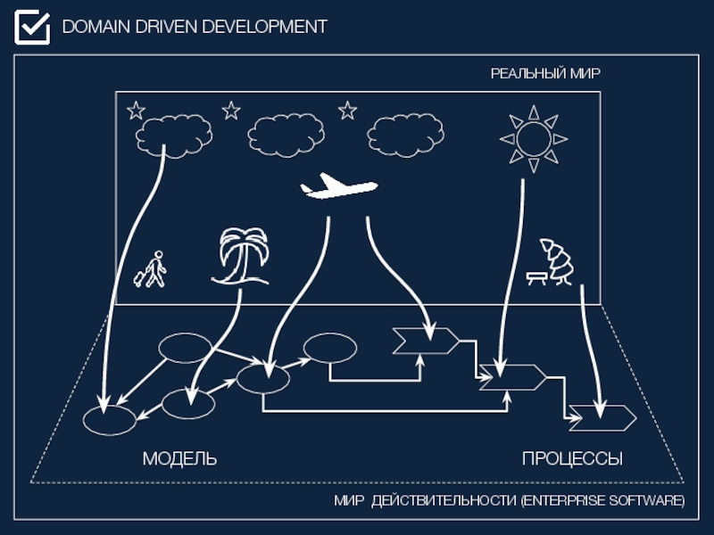
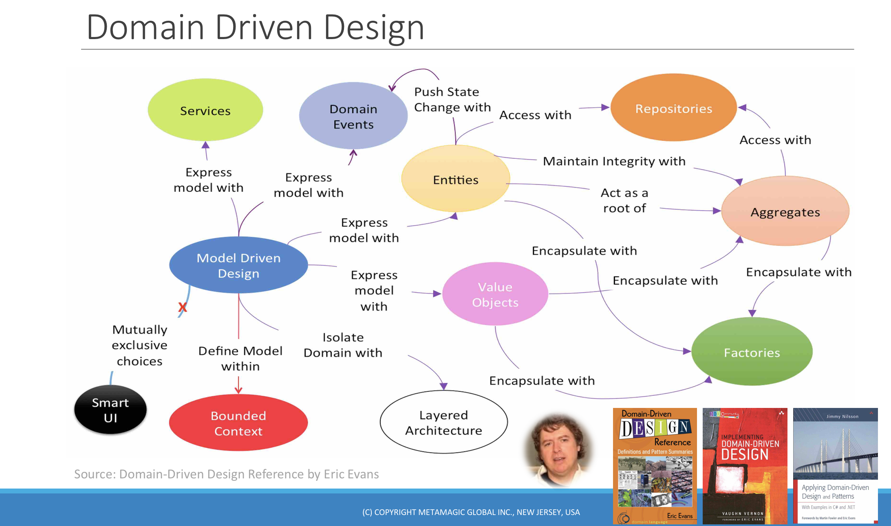
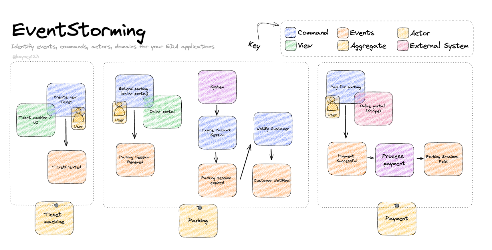
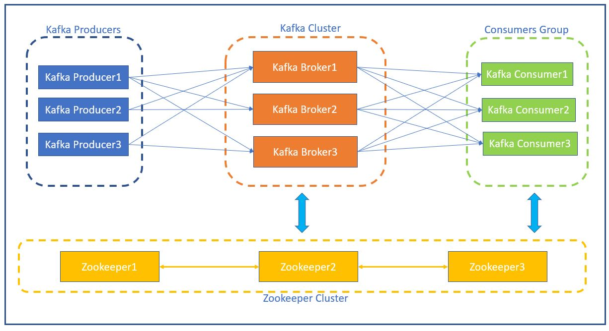

# Distributed systems basics: как сервисы взаимодействуют

[Главная](/) / Kafka

## Введение: эволюция проектирования систем <a name="p1"></a>

Современная разработка ПО — это не только про код, но и про понимание бизнеса. Когда проекты растут, становится всё сложнее ориентироваться в бизнес-логике. Именно здесь появляются Domain-Driven Development (DDD) и Event-Driven Development (EDD) — два мощных подхода, помогающих создавать гибкие, масштабируемые и понятные приложения. В распределенных системах важно также понимать, как сервисы взаимодействуют друг с другом: синхронно через HTTP или асинхронно через события. В этой лекции мы рассмотрим оба подхода и их практическую реализацию.

### Содержание
1. [Введение: эволюция проектирования систем](#p1)
2. [Domain-Driven Development (DDD)](#p2)
3. [Event-Driven Development (EDD)](#p3)
4. [Модели взаимодействия сервисов](#p4)
5. [Связь DDD и способов взаимодействия](#p5)
6. [Практические рекомендации](#p6)
7. [Apache Kafka](#p7)
8. [Ресурсы](#p8)


## 1. Domain-Driven Development (DDD) <a name="p2"></a>

### 1.1 Что это такое?

**DDD** — методология проектирования, ориентированная на бизнес-логику. Главная идея — строить архитектуру вокруг предметной области.



**Ключевые принципы:**

- **Ubiquitous Language** — единый язык между бизнесом и разработкой.
- **Bounded Context** — изолированные контексты в модели.
- **Entities / Value Objects** — сущности с идентичностью и объекты-значения.
- **Aggregates** — логически связанные группы сущностей.
- **Repositories** — доступ к агрегатам.




### 1.2 Пример:

```java
public class Order {
    private final OrderId id;
    private final List<OrderItem> items;
    private OrderStatus status;

    public void complete() {
        if (this.status != OrderStatus.PAID) {
            throw new IllegalStateException("Order must be paid before completing.");
        }
        this.status = OrderStatus.COMPLETED;
        DomainEvents.raise(new OrderCompletedEvent(this.id));
    }
}
```

### 📌 Ubiquitous Language

- Используй термины бизнеса в названиях классов, методов, полей.
- Пример:
```java
public class Order {
    private OrderStatus status;
    public void complete() { ... }
}
```

### 📌 Entities / Value Objects / Aggregates

| Тип           | Идентичность | Пример         |
|---------------|--------------|----------------|
| Entity        | Да           | Order          |
| Value Object  | Нет          | Money, Address |
| Aggregate     | Да           | Order + Items  |

### 📌 Bounded Context

- Выделяй модули по бизнес-направлениям.
- Пример структуры:

```
src/
├── payments/
├── orders/
```


## 2. Event-Driven Development (EDD) <a name="p3"></a>




### Что это такое?

**EDD** — это архитектурный подход, при котором взаимодействие между компонентами системы может осуществляться через события.
В EDD события представляют собой изменения в системе, на которые компоненты или микросервисы могут реагировать
асинхронно. Это один из подходов к построению гибких, масштабируемых и отказоустойчивых систем.

**Компоненты:**
- **Event** — событие.
- **Producer** — генерирует событие.
- **Consumer** — обрабатывает событие.
- **Event Bus / Broker** — доставка (Kafka, RabbitMQ).

### Зачем использовать EDD?

EDD имеет множество преимуществ, которые делают его привлекательным для современной разработки:

- **Асинхронность**

Все взаимодействия между компонентами происходят через события, что позволяет системе работать асинхронно. Это важное преимущество для построения высоконагруженных систем, где необходимость блокировать выполнение может существенно замедлить работу.

- **Масштабируемость**

Поскольку взаимодействие между компонентами происходит через события, каждый компонент может быть масштабирован независимо. В случае микросервисной архитектуры каждый сервис может потреблять события, не блокируя другие сервисы.

- **Отказоустойчивость**

Система может продолжить работать даже в случае отказа одного из компонентов, потому что компоненты могут работать независимо друг от друга. В случае отказа потребителя события, оно может быть обработано позже.

- **Реактивность**

Система может мгновенно реагировать на изменения в данных, что делает её идеальной для приложений, требующих реального времени, например, для аналитики или онлайн-игр.

- **Гибкость**

Системы, построенные на событиях, проще модифицировать, поскольку компоненты могут быть добавлены или удалены без нарушения работы других частей системы.

### Принципы Event-Driven архитектуры

### Пример:

```java
public class OrderPaidEvent {
    private final UUID orderId;
    public OrderPaidEvent(UUID orderId) { this.orderId = orderId; }
    public UUID getOrderId() { return orderId; }
}

@Component
public class OrderPaidEventHandler {
    @EventListener
    public void handle(OrderPaidEvent event) {
        // обработка события
    }
}
```

1. **События**:
Событие (Event) — это факт или изменение состояния в системе, которое имеет значение для других компонентов. Обычно события являются необратимыми. Пример: заказ был оплачен.

2. **Производитель событий (Event Producer):**
Это компонент, генерирующий событие. Например, микросервис обработки платежей, который генерирует событие OrderPaid.

3. **Потребитель событий (Event Consumer):**
Это компоненты, которые обрабатывают события. Например, микросервис управления заказами может слушать событие OrderPaid и обновлять статус заказа.

4. **Шина событий (Event Bus):**
Это механизм доставки событий от производителя к потребителю. Шина может использоваться для масштабируемой и асинхронной доставки событий между компонентами системы. Пример: Kafka, RabbitMQ.

5. **Асинхронность:**
В отличие от синхронных взаимодействий, где один компонент зависит от другого, в EDD взаимодействие происходит через события, что позволяет повысить производительность и ускорить отклик.

## 3. Модели взаимодействия сервисов <a name="p4"></a>

В распределенных системах сервисы могут взаимодействовать двумя основными способами: синхронно (через HTTP/REST) и асинхронно (через события). Понимание различий между этими подходами помогает выбрать правильный инструмент для каждой задачи.

### 3.1 Синхронное взаимодействие (HTTP / REST)

Синхронное взаимодействие строится по модели «запрос‑ответ» (request → response). Клиент отправляет запрос и ожидает ответа от сервера, прежде чем продолжить работу. Это создает сильную связанность (coupling) между сервисами и зависимость по времени (temporal coupling).

**Пример:**

```
OrderService → HTTP → PaymentService
```

В этом примере OrderService вызывает PaymentService через HTTP и ждет ответа, чтобы обновить статус заказа. Если PaymentService недоступен, OrderService не может завершить операцию.

### 3.2 Асинхронное взаимодействие (Events)

Асинхронное взаимодействие основано на событиях, как описано в разделе про EDD. Сервисы обмениваются сообщениями через брокер (например, Kafka), не блокируя друг друга. Потребитель может обработать событие позже, когда будет готов.

Этот подход обеспечивает слабую связанность и повышает отказоустойчивость системы.

### 3.3 Сравнение подходов

| Характеристика | Синхронное (HTTP) | Асинхронное (Events) |
|----------------|-------------------|-----------------------|
| Связность      | высокая           | низкая                |
| Ожидание ответа| да                | нет                   |
| Latency        | сразу             | eventual              |
| Надежность     | ниже              | выше                  |
| Debug          | проще             | сложнее               |

### 3.4 Когда что использовать

**Используем HTTP, когда:**
- нужен мгновенный ответ пользователю
- выполняются CRUD операции
- flow простой и линейный
- требуется строгая консистентность данных

**Используем события, когда:**
- нужно реагировать на изменения в системе
- интегрируются независимые сервисы
- требуется масштабировать обработку
- важна слабая связанность компонентов
- допустима eventual consistency

### 3.5 Реализация HTTP-клиента в Spring

Когда мы говорим о синхронном взаимодействии между сервисами, на практике это означает, что один сервис отправляет HTTP-запрос к другому и ждёт ответа, прежде чем продолжить выполнение. В Spring есть несколько способов сделать это, но мы сосредоточимся на двух основных: классический `RestTemplate` и современный `WebClient`.

#### Общая идея

Сервис-клиент вызывает другой сервис по HTTP, поток выполнения блокируется и ждёт ответа. Это синхронное взаимодействие, которое просто понять и отладить, но оно создаёт сильную зависимость между сервисами.

Пример:
```
OrderService → HTTP → PaymentService
```

#### Классический способ: RestTemplate

`RestTemplate` — это традиционный синхронный клиент, который существует в Spring много лет. Он прост в использовании, но имеет ограничения по производительности в высоконагруженных системах.

##### Базовый вызов через RestTemplate

Простейший пример вызова другого сервиса выглядит так:

```java
@Service
public class PaymentClient {

    private final RestTemplate restTemplate = new RestTemplate();

    public String pay(String orderId) {
        String url = "http://payment-service/payments/pay";
        PaymentRequest request = new PaymentRequest(orderId);

        return restTemplate.postForObject(url, request, String.class);
    }
}
```

**Что происходит в этом коде:**
1. Создаётся HTTP POST запрос к `payment-service` по указанному URL
2. Тело запроса — объект `PaymentRequest` (сериализуется в JSON автоматически)
3. Метод `postForObject` отправляет запрос и **блокирует текущий поток**, пока не получит ответ
4. Ответ десериализуется в `String` и возвращается

**Почему это блокирующий вызов?**
Метод `postForObject` не возвращает управление, пока не будет получен полный HTTP-ответ или не произойдёт ошибка (например, таймаут). Текущий поток остаётся занятым всё это время — он не может выполнять другую работу.

**Где здесь сетевой вызов?**
Сетевой вызов скрыт внутри `restTemplate.postForObject`. На нижнем уровне:
- Устанавливается TCP-соединение с `payment-service`
- Формируется HTTP-пакет и отправляется по сети
- Поток блокируется, ожидая ответные пакеты
- Как только ответ полностью получен, поток разблокируется и возвращает результат

**Недостатки RestTemplate:**
- Блокирует поток на всё время запроса
- Нет встроенной поддержки таймаутов и retry (нужно настраивать вручную)
- Менее гибкий, чем современные клиенты

#### Современный способ: WebClient

`WebClient` — это реактивный HTTP-клиент, появившийся в Spring 5. Он поддерживает асинхронные и синхронные сценарии. Даже если мы используем его синхронно (через `.block()`), он даёт больше контроля над запросом.

```java
@Service
public class PaymentClient {

    private final WebClient webClient = WebClient.create("http://payment-service");

    public String pay(String orderId) {
        return webClient.post()
                .uri("/payments/pay")
                .bodyValue(new PaymentRequest(orderId))
                .retrieve()
                .bodyToMono(String.class)
                .block();
    }
}
```

**Объяснение:**
- `WebClient.create()` создаёт клиента с базовым URL
- Цепочка вызовов описывает запрос: метод, URI, тело
- `.retrieve()` отправляет запрос и получает ответ
- `.bodyToMono(String.class)` преобразует ответ в реактивный `Mono`
- `.block()` блокирует выполнение, пока не придёт ответ (делает вызов синхронным)

**Зачем использовать WebClient, если мы всё равно блокируем?**
- Единый API для синхронных и асинхронных вызовов
- Лучшая настраиваемость (таймауты, обработка ошибок, логирование)
- Поддержка современных протоколов (HTTP/2, WebSocket)
- Легко перейти на асинхронную модель, убрав `.block()`

#### Важные практические моменты

##### Таймауты

Без таймаутов запрос может ждать ответа бесконечно. Это приводит к исчерпанию потоков и падению сервиса.

```java
// Для WebClient
HttpClient httpClient = HttpClient.create()
        .responseTimeout(Duration.ofSeconds(5));

WebClient webClient = WebClient.builder()
        .clientConnector(new ReactorClientHttpConnector(httpClient))
        .build();
```

##### Обработка ошибок (4xx / 5xx)

Сервис может вернуть ошибку, и клиент должен её корректно обработать.

```java
public String pay(String orderId) {
    return webClient.post()
            .uri("/payments/pay")
            .bodyValue(new PaymentRequest(orderId))
            .retrieve()
            .onStatus(status -> status.is4xxClientError() || status.is5xxServerError(),
                      response -> Mono.error(new PaymentServiceException("Payment failed")))
            .bodyToMono(String.class)
            .block();
}
```

##### Retry (кратко)

Иногда временный сбой можно перезапросить.

```java
public String pay(String orderId) {
    return webClient.post()
            .uri("/payments/pay")
            .bodyValue(new PaymentRequest(orderId))
            .retrieve()
            .bodyToMono(String.class)
            .retryWhen(Retry.fixedDelay(3, Duration.ofSeconds(1)))
            .block();
}
```

##### Логирование

Всегда логируйте вызовы внешних сервисов — это поможет при отладке.

```java
private static final Logger log = LoggerFactory.getLogger(PaymentClient.class);

public String pay(String orderId) {
    log.info("Calling payment service for order {}", orderId);
    // вызов
}
```

#### Что происходит под капотом

1. **HTTP запрос** — формируется HTTP-сообщение с методом, заголовками, телом
2. **TCP соединение** — устанавливается соединение с сервером (или используется пул)
3. **Поток ждёт ответа** — текущий поток блокируется до получения ответа или таймаута
4. **Обработка ответа** — ответ парсится, проверяются статусы, преобразуется в объект

#### Основные проблемы синхронного HTTP

- **Зависимость от другого сервиса** — если PaymentService недоступен, OrderService не сможет выполнить операцию
- **Задержки** — время ответа складывается из сетевой задержки + обработки на стороне сервиса
- **Падения по цепочке** — сбой одного сервиса может привести к каскадным отказам

#### Вывод

HTTP-вызовы между сервисами — это простой и понятный способ интеграции, который отлично подходит для многих сценариев. Однако важно помнить о его ограничениях: сильная связанность, блокирование потоков, зависимость от доступности сервисов. Эти ограничения подводят нас к другим подходам — асинхронному взаимодействию через события, которое мы рассмотрели ранее.

## 4. Связь DDD и способов взаимодействия <a name="p5"></a>

DDD помогает моделировать бизнес-логику внутри bounded context, а выбор способа взаимодействия между контекстами определяет, как система будет масштабироваться и адаптироваться к изменениям.

**Ключевые идеи:**

- **Внутри bounded context** часто используется синхронное взаимодействие (например, вызов методов внутри одного сервиса), потому что компоненты тесно связаны и требуют немедленной реакции.
- **Между bounded context** предпочтительнее асинхронное взаимодействие через события, чтобы уменьшить связанность и повысить отказоустойчивость.
- **Domain Events** служат мостом между DDD и интеграцией: они представляют факты из предметной области и могут быть опубликованы для других контекстов.

| DDD                                 | Способы взаимодействия           |
|------------------------------------|----------------------------------|
| Моделирует бизнес-логику           | Реализует интеграцию контекстов  |
| Domain Events                      | События для асинхронной коммуникации |
| Внутри сервисов                    | Синхронные вызовы (HTTP/RPC)     |
| Bounded Context                    | Асинхронная интеграция (Events)  |


## 4. Практические рекомендации <a name="p6"></a>

### Что применять:

#### В DDD:
- Использовать **Ubiquitous Language**.
- Выделять **Entities**, **Value Objects**, **Aggregates**.
- Делить проект на **Bounded Contexts**.

#### В EDD:
- Осваивать Spring Events, Kafka.
- Строить модули вокруг реакций на события.


## Apache Kafka <a name="p7"></a>

Kafka — это инструмент для реализации асинхронного взаимодействия между сервисами. Он используется как event broker в event-driven архитектуре, позволяя надежно передавать сообщения между производителями и потребителями.

**Apache Kafka** — это распределенная система для управления потоками данных в реальном времени. Kafka предоставляет
платформу для обработки, передачи и хранения потоковых данных в крупных распределенных системах. Она стала популярной
в мире микросервисных архитектур и систем реального времени, благодаря своей высокой пропускной способности,
масштабируемости и отказоустойчивости.

### Основные компоненты Kafka
- **Producer**: Компоненты, которые отправляют сообщения в Kafka. Они отправляют данные в одну или несколько тем.

- **Consumer**: Компоненты, которые читают сообщения из Kafka. Каждый потребитель подписывается на одну или несколько тем.

- **Topic**: Канал, по которому отправляются сообщения. Kafka поддерживает разделение данных на топики, что позволяет организовать потоковую обработку сообщений.

- **Partition**: Каждый топик может быть разбит на несколько разделов (партиций), что увеличивает масштабируемость и распределение нагрузки.

- **Broker**: Серверы Kafka, которые принимают сообщения от продюсеров и доставляют их потребителям. Kafka может работать в кластере брокеров для обеспечения отказоустойчивости и масштабируемости.

### Принципы работы Kafka

**2.1. Публикация сообщений**

Продюсеры отправляют данные в Kafka. Каждое сообщение помещается в топик. Сообщения внутри топика хранятся в 
определенном порядке, основанном на времени поступления.

**2.2. Хранение данных**

Kafka сохраняет сообщения на диске, что позволяет повторно читать их, если это необходимо. По умолчанию данные 
сохраняются в течение 7 дней, но этот срок можно настроить.

**2.3. Подписка и потребление**

Потребители получают сообщения из Kafka по запросу. Они могут читать сообщения с любого смещения (offset), что позволяет повторно обрабатывать сообщения или начать чтение с определенной точки.

**2.4. Репликация и отказоустойчивость**

Kafka обеспечивает репликацию партиций. Каждая партиция имеет один лидер и несколько фолловеров. Лидер принимает все записи и реплицирует их на фолловеров. В случае сбоя лидера один из фолловеров становится новым лидером.

**2.5. Масштабируемость**

Kafka легко масштабируется за счет добавления новых брокеров. Каждый новый брокер может обслуживать дополнительные партиции и топики.



### Интеграция Kafka с Spring

#### Зависимости для Spring
Для интеграции Apache Kafka с Spring необходимы следующие зависимости:

```groovy
dependencies {
    implementation 'org.springframework.boot:spring-boot-starter'
    implementation 'org.springframework.kafka:spring-kafka'

    testImplementation 'org.springframework.kafka:spring-kafka-test'
    testImplementation 'org.springframework.boot:spring-boot-starter-test'
}
```

### Конфигурация Kafka в Spring
В Spring необходимо настроить KafkaTemplate для отправки сообщений и @KafkaListener для получения сообщений.

**Конфигурация продюсера:**
```java
@Configuration
public class KafkaConfig {

    @Bean
    public ProducerFactory<String, String> producerFactory() {
        Map<String, Object> producerProps = new HashMap<>();
        producerProps.put(ProducerConfig.BOOTSTRAP_SERVERS_CONFIG, "localhost:9092");
        producerProps.put(ProducerConfig.KEY_SERIALIZER_CLASS_CONFIG, StringSerializer.class);
        producerProps.put(ProducerConfig.VALUE_SERIALIZER_CLASS_CONFIG, StringSerializer.class);
        return new DefaultKafkaProducerFactory<>(producerProps);
    }

    @Bean
    public KafkaTemplate<String, String> kafkaTemplate() {
        return new KafkaTemplate<>(producerFactory());
    }
}
```

**Конфигурация потребителя:**

```java
@Configuration
@EnableKafka
public class KafkaConsumerConfig {

    @Bean
    public ConsumerFactory<String, String> consumerFactory() {
        Map<String, Object> consumerProps = new HashMap<>();
        consumerProps.put(ConsumerConfig.BOOTSTRAP_SERVERS_CONFIG, "localhost:9092");
        consumerProps.put(ConsumerConfig.GROUP_ID_CONFIG, "test-group");
        consumerProps.put(ConsumerConfig.KEY_DESERIALIZER_CLASS_CONFIG, StringDeserializer.class);
        consumerProps.put(ConsumerConfig.VALUE_DESERIALIZER_CLASS_CONFIG, StringDeserializer.class);
        return new DefaultKafkaConsumerFactory<>(consumerProps);
    }

    @Bean
    public ConcurrentMessageListenerContainer<String, String> messageListenerContainer() {
        return new ConcurrentMessageListenerContainer<>(consumerFactory(), "test-topic");
    }
}
```

#### Создание продюсера для отправки сообщений
```java
@Service
public class KafkaProducer {

    private final KafkaTemplate<String, String> kafkaTemplate;

    @Autowired
    public KafkaProducer(KafkaTemplate<String, String> kafkaTemplate) {
        this.kafkaTemplate = kafkaTemplate;
    }

    public void sendMessage(String message) {
        kafkaTemplate.send("test-topic", message);
    }
}
```

#### Создание потребителя для получения сообщений
```java
@Service
public class KafkaConsumer {

    @KafkaListener(topics = "test-topic", groupId = "test-group")
    public void listen(String message) {
        System.out.println("Received message: " + message);
    }
}
```

#### Пример использования
В контроллере можно создать эндпоинт для отправки сообщений в Kafka:

```java
@RestController
public class KafkaController {

    private final KafkaProducer kafkaProducer;

    @Autowired
    public KafkaController(KafkaProducer kafkaProducer) {
        this.kafkaProducer = kafkaProducer;
    }

    @PostMapping("/send")
    public ResponseEntity<String> sendMessage(@RequestBody String message) {
        kafkaProducer.sendMessage(message);
        return ResponseEntity.ok("Message sent to Kafka");
    }
}

```

Для того, чтобы поднять кафку локально, можно использовать следующий docker-compose файл:
```yml
version: "3.9"
services:
  zookeeper:
    image: confluentinc/cp-zookeeper:latest
    container_name: spbu-kafka-zookeeper
    environment:
      ZOOKEEPER_CLIENT_PORT: 2181
      ZOOKEEPER_TICK_TIME: 2000
    ports: [ "22181:2181" ]
    restart: unless-stopped
  kafka:
    image: confluentinc/cp-kafka:latest
    container_name: spbu-kafka-kafka
    environment:
      KAFKA_BROKER_ID: 1
      KAFKA_ZOOKEEPER_CONNECT: zookeeper:2181
      KAFKA_ADVERTISED_LISTENERS: PLAINTEXT://kafka:9092,PLAINTEXT_HOST://localhost:29092
      KAFKA_LISTENER_SECURITY_PROTOCOL_MAP: PLAINTEXT:PLAINTEXT,PLAINTEXT_HOST:PLAINTEXT
      KAFKA_INTER_BROKER_LISTENER_NAME: PLAINTEXT
      KAFKA_OFFSETS_TOPIC_REPLICATION_FACTOR: 1
    depends_on: [ zookeeper ]
    ports: [ "29092:29092" ]
    restart: unless-stopped
  kafka-ui:
    image: provectuslabs/kafka-ui:latest
    container_name: spbu-kafka-ui
    environment:
      - KAFKA_CLUSTERS_0_NAME=local
      - KAFKA_CLUSTERS_0_BOOTSTRAPSERVERS=kafka:9092
      - KAFKA_CLUSTERS_0_ZOOKEEPER=zookeeper:2181
    depends_on: [ zookeeper, kafka ]
    ports: [ "29093:8080" ]
    restart: unless-stopped
```


## Ресурсы <a name="p8"></a>

- Eric Evans — *Domain-Driven Design*.
- Vaughn Vernon — *Implementing DDD*.
- https://kafka.apache.org/
- https://docs.spring.io/
- Spring Kafka — документация по интеграции Kafka с Spring: https://docs.spring.io/spring-kafka/docs/current/reference/html/
- Apache Kafka — официальный сайт: https://kafka.apache.org/
- Reactive Programming — изучение реактивного программирования с использованием событий: https://www.reactivemanifesto.org/
- Designing Event-Driven Systems — книга Ben Stopford: https://www.oreilly.com/library/view/designing-event-driven-systems/9781492038254/

