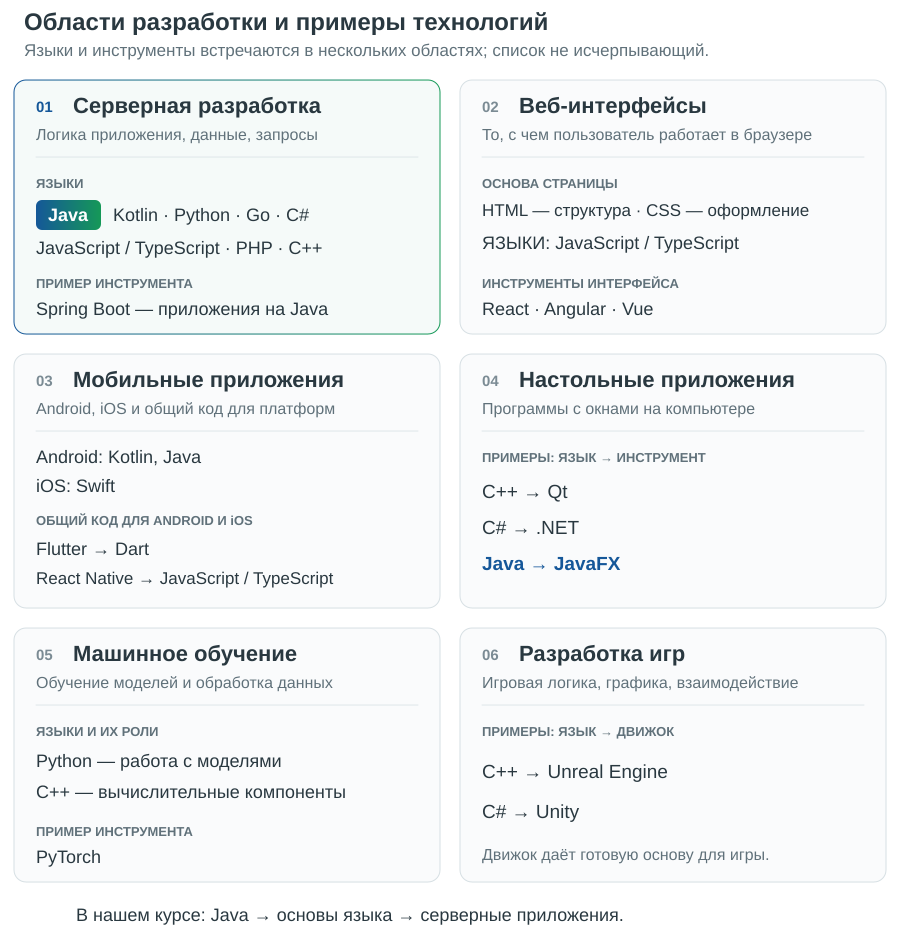
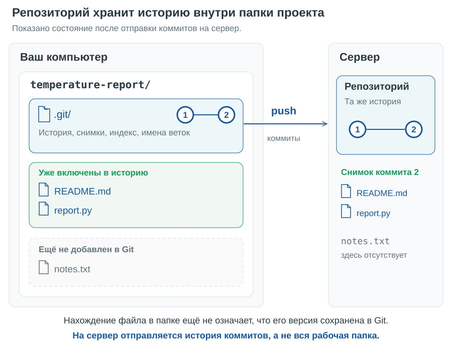
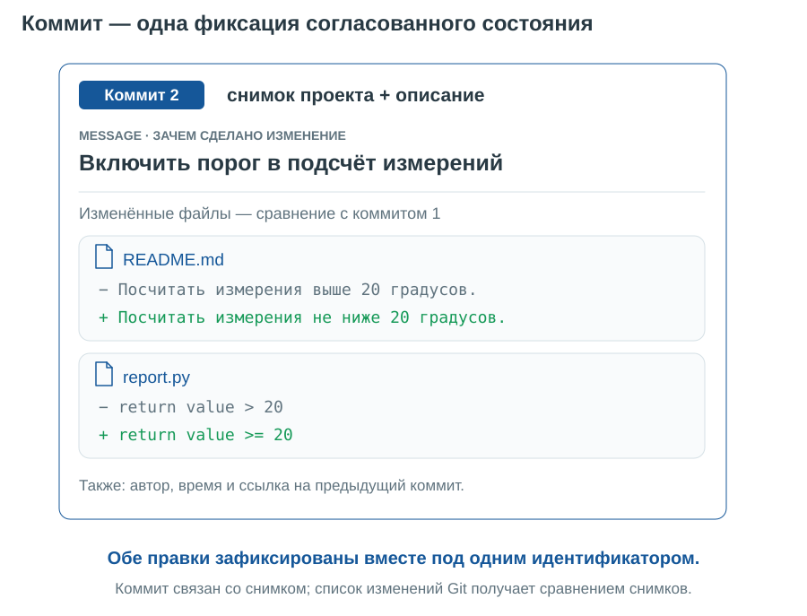
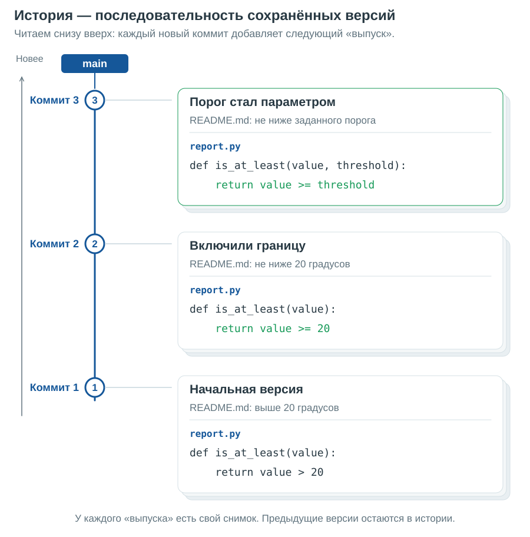
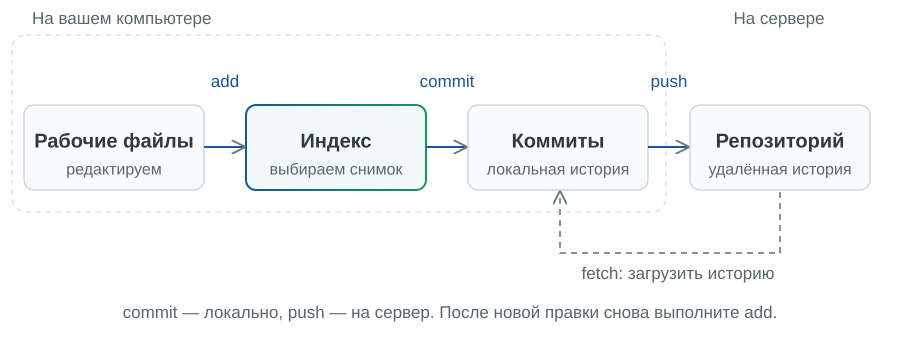
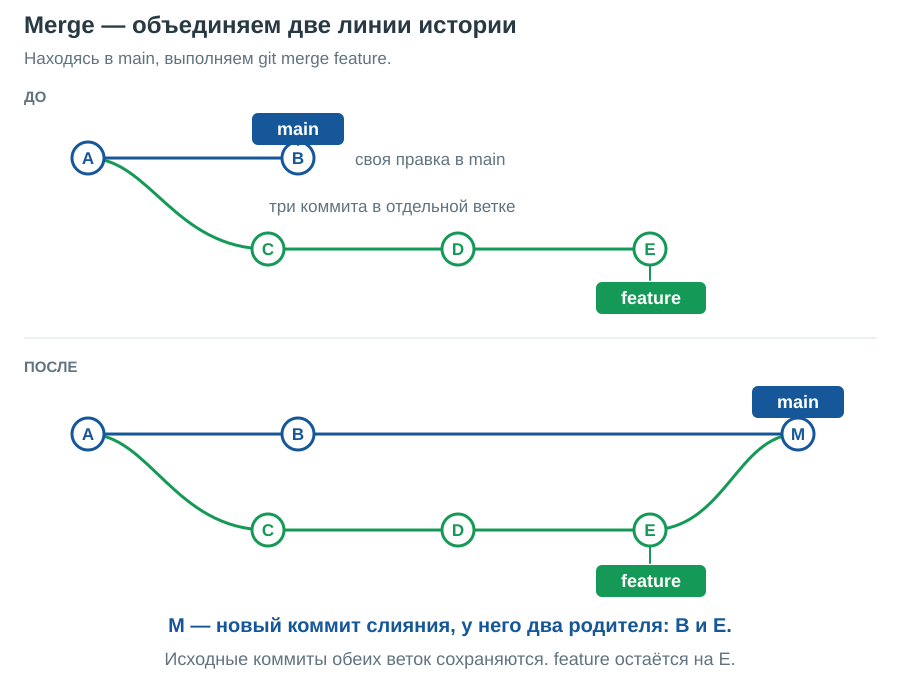
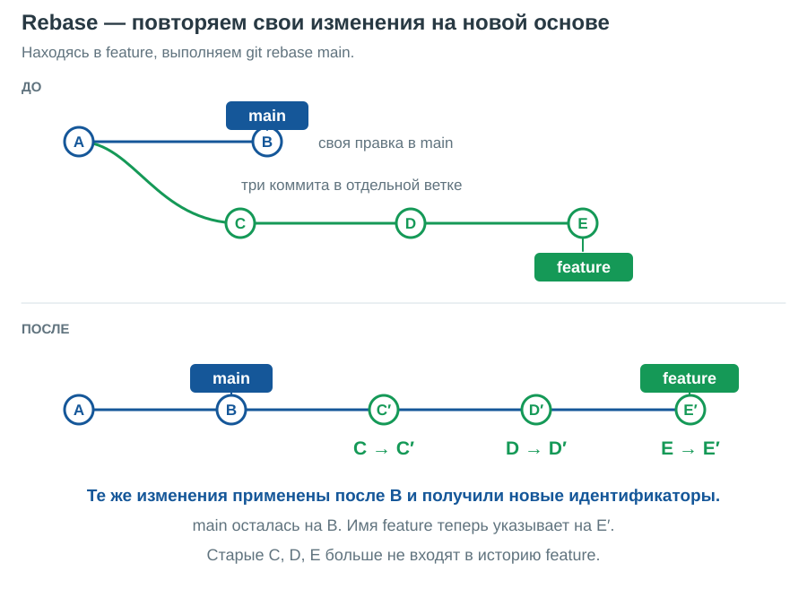
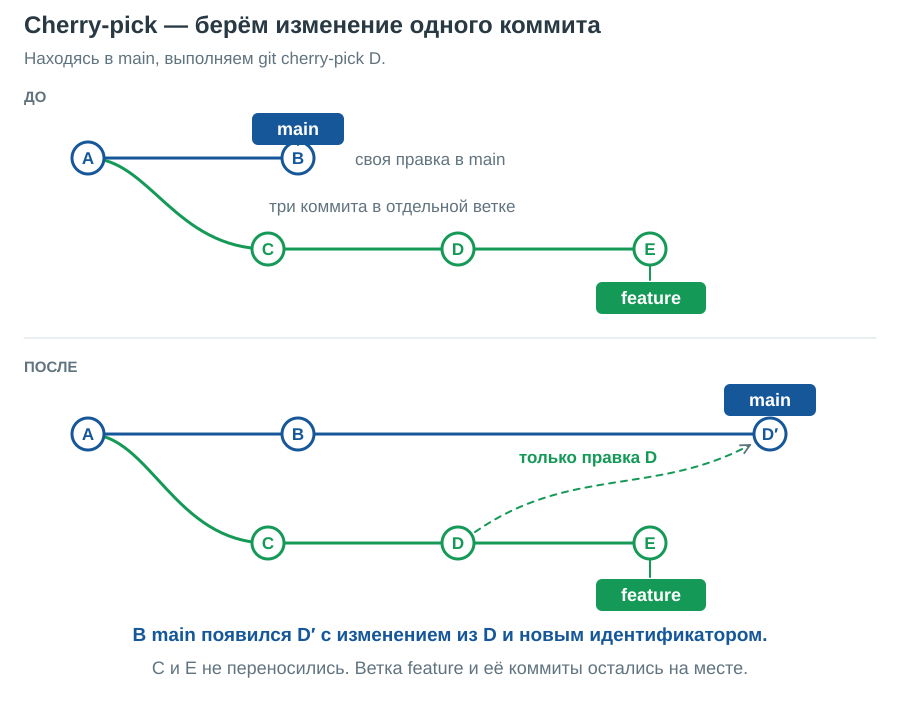
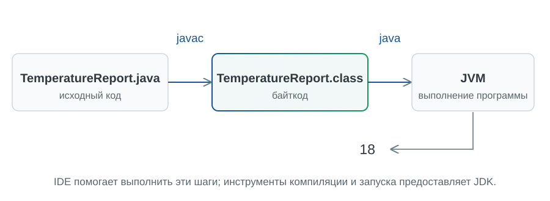
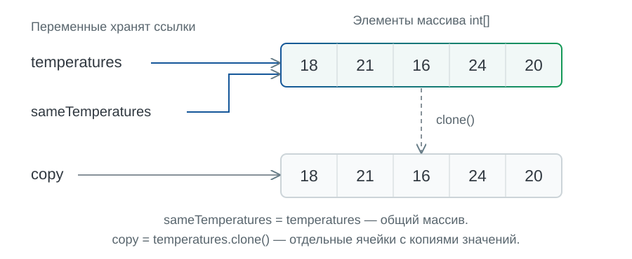

# Лекция 1. Технологии разработки, Git и основы Java

[Главная](/)

### Содержание

1. [От программы к совместной работе](#p1)
2. [Где нужна Java и что именно мы изучаем](#p2)
3. [Git: как сохранять изменения и работать вместе](#p3)
4. [Первая Java-программа и запуск](#p4)
5. [Данные, типы и выражения](#p5)
6. [Условия и блоки](#p6)
7. [Методы: даём вычислению имя](#p7)
8. [Массивы и циклы](#p8)
9. [Собираем результат](#p9)

[Памятка Git и SSH](#git-reference) · [Справка Java и настройка среды](#java-reference) · [Правила курса](#course-rules) · [Дополнительное чтение](#reading)

<a id="p1"></a>

## 1. От программы к совместной работе

После года Python вы уже умеете писать программы с условиями, циклами и функциями. Теперь представьте, что над одной программой работают двое. Один изменил правило вычисления, другой — вывод результата. Как сохранить обе правки, понять, зачем они сделаны, и при необходимости вернуться к предыдущей версии?

Разберём это на небольшой задаче, которую затем решим на Java:

> Даны целочисленные измерения температуры и порог в градусах Цельсия. Нужно посчитать измерения не ниже порога. Для 18, 21, 16, 24, 20 и порога 20 ответ равен 3: подходят 21, 24 и 20.

Слова «не ниже» важны: значение ровно на границе тоже учитывается. Сохраним эту договорённость в `README.md` рядом с будущим кодом. Если правило изменится, описание и программа должны остаться согласованными.

Чтобы сохранять историю правок и объединять работу участников, воспользуемся **Git — системой контроля версий**. А саму программу напишем на Java. Сначала разберёмся, зачем изучать этот язык и какие инструменты понадобятся, затем проследим изменение задачи в Git и перейдём к коду.

<a id="p2"></a>

## 2. Где нужна Java и что именно мы изучаем

### От программы с числами к прикладному сервису

Нашу задачу можно решить на Python. Зачем тогда ещё один язык? Чтобы освоить другую модель записи и проверки программ, а также инструменты и библиотеки, с которыми строят приложения в экосистеме Java.

Посмотрим, где используются разные технологии. На схеме собраны примеры языков и инструментов для нескольких областей разработки.



Один язык может встречаться в нескольких областях, а одну задачу можно решать разными наборами инструментов. Сейчас важно увидеть место Java на этой карте; запоминать все названия не нужно. Например, приложения на Java можно писать и для сервера, и для рабочего стола с [JavaFX](https://openjfx.io/).

Один из важных сценариев для Java — **серверная часть приложения**, или backend. Например, браузер отправляет запрос с измерениями, сервер вычисляет результат и возвращает ответ. Пользователь видит страницу, а вычисление, работа с хранилищем и взаимодействие с другими сервисами происходят за её пределами. Программа анализа температуры может стать небольшой частью такой системы.

Конкретный пример инструментов этой области — Spring и Spring Boot. Spring Boot помогает собирать самостоятельные приложения на основе Spring, упрощает настройку и позволяет включить веб-сервер прямо в приложение. Сейчас достаточно понимать его место: это средство построения приложения поверх языка и платформы. [Официальная страница Spring Boot](https://spring.io/projects/spring-boot/).

Область применения языка не закреплена за ним навсегда, и одну прикладную задачу часто можно решить несколькими способами. При выборе учитывают существующий код, доступные библиотеки, требования к запуску и опыт команды. Поэтому из изучения Java не следует, что Python был неправильным выбором. Знакомые алгоритмы и привычка разбивать задачу на функции остаются полезны.

Отдельная оговорка касается Android, который часто упоминают рядом с Java: официальная разработка Android придерживается подхода Kotlin-first, при этом поддержка Java сохраняется. Называть Java безусловным первым выбором для любого нового Android-приложения было бы неточно. [Позиция команды Android](https://developer.android.com/kotlin/first).

### Что означают Java, JVM и JDK

Словом «Java» могут обозначать язык или целую платформу. Когда обсуждаем условие и тип переменной, речь о языке. Когда устанавливаем средства разработки и запуска, нужно различать ещё несколько названий.

**JVM — Java Virtual Machine**, виртуальная машина Java, выполняет код в формате байткода. В привычном для нашего занятия процессе компилятор сначала переводит исходный текст Java в class-файлы с байткодом, затем JVM выполняет программу. Подробно пройдём этот путь, когда создадим первый файл.

**JDK — Java Development Kit**, комплект средств разработки, содержит инструменты компиляции и запуска, а также необходимые компоненты платформы. В частности, `javac` компилирует Java-код, а `java` запускает приложение. Именно JDK понадобится нам для работы. **IDE — интегрированная среда разработки** — объединяет редактор кода, навигацию и средства запуска. Она помогает пользоваться инструментами JDK, но установка IDE и выбор JDK для проекта — разные действия. [Введение в запуск Java-программ на dev.java](https://dev.java/learn/getting-started/).

Байткод позволяет отделить программу от машинных инструкций конкретного процессора. Однако для переноса приложения всё равно нужна совместимая среда: подходящая версия Java, библиотеки и доступные приложению ресурсы. Например, путь к файлу, существующий только на компьютере автора, на другом компьютере сам собой не появится. Переносимость требует учитывать такие зависимости.

В этом конспекте ориентируемся на **Java 26** — последний стабильный выпуск на 4 сентября 2026 года. Последний выпуск и LTS, выпуск с длительной поддержкой, — разные понятия: на эту дату последним LTS является Java 25. Мы используем стандартные возможности языка, без экспериментальных preview-возможностей. [Страница выпусков Oracle](https://www.oracle.com/java/technologies/downloads/).

Теперь у нашей работы есть задача, ожидаемый результат и выбранная платформа. Прежде чем писать Java-код, научимся сохранять изменения так, чтобы можно было восстановить предыдущую версию и работать вместе. Для этого начнём с файла с описанием задачи и Git.

<a id="p3"></a>

## 3. Git: как сохранять изменения и работать вместе

Представьте, что мы уже написали программу обработки температур. Вчера она считала значения выше порога, сегодня решили включать и сам порог. Затем коллега поменял формат вывода. Как узнать, что именно изменилось? Как восстановить вчерашнее решение, не потеряв сегодняшнее?

Можно делать папки `project`, `project-final`, `project-final-2`. Но имя папки плохо объясняет причину изменения, а объединять две такие папки придётся вручную. **Система контроля версий** позволяет сохранять осмысленные состояния проекта и видеть переходы между ними. Мы будем пользоваться Git.

### Репозиторий и история

**Репозиторий** хранит историю проекта. В обычном локальном проекте служебные данные Git лежат в каталоге `.git`, а рядом находятся доступные редактору рабочие файлы. Сохранённое состояние называется **коммитом**. Коммит связан со снимком содержимого проекта, содержит сведения об авторе, сообщение и ссылки на предшествующие коммиты. Это позволяет спросить: «Что изменилось между двумя состояниями и зачем?» [Документация `git init`](https://git-scm.com/docs/git-init), [документация `git commit`](https://git-scm.com/docs/git-commit).

Git работает локально: чтобы создать коммит или посмотреть историю, интернет не нужен. **GitHub** — один из сервисов, на котором можно разместить репозиторий и обсуждать изменения. Git и GitHub решают связанные, но разные задачи. Удалённый сервер появится в нашем примере позже.



На рисунке — уже существующий учебный проект: `report.py` написан на знакомом нам Python, два файла сохранены в коммитах, а `notes.txt` ещё не добавлен. Цветные рамки группируют файлы по состоянию, это не дополнительные папки. На сервере показаны история и содержимое снимка; рабочая папка с незакоммиченными файлами туда не копируется.

### Коммит как одна фиксация

Пусть мы уточнили правило: нужно включать значение ровно на границе. Для этого исправили и описание задачи, и сравнение в программе. Эти согласованные правки удобно сохранить **одним коммитом**: у него одно сообщение, один идентификатор и один снимок состояния проекта.



Коммит — единая запись в истории: обе подготовленные правки входят в эту фиксацию вместе. Однако Git не проверяет, что они логически согласованы — это ответственность автора. Список изменённых файлов на картинке получается сравнением со снимком предыдущего коммита. Сам коммит связан со снимком всего сохранённого состояния, включая файлы, которые в этот раз не менялись. [Как Git представляет снимки](https://git-scm.com/book/en/v2/Getting-Started-What-is-Git%3F).

### История как последовательность версий

Представим три выпуска одной программы. Сначала сравниваем с 20, затем включаем границу, затем разрешаем передавать порог параметром. На следующем рисунке **старые коммиты внизу, новые сверху**. Рядом с каждым показана своя версия описания и кода.



Такую историю можно представить как стопку выпусков журнала: новый выпуск добавился, а прежние остались доступны. Это модель версий, а не способ физического хранения полных копий каждой папки. `main` указывает на последний коммит нашей пока единственной линии. Дальше разберём, как добавлять новые коммиты и создавать отдельные линии работы.


Теперь воспроизведём работу с историей командами. Для этого достаточно `README.md` — обычного текстового файла с описанием задачи. Для демонстрации истории вернёмся к ранней формулировке «выше 20», затем уточним её и придём к уже согласованному правилу «не ниже 20», то есть `>=`. Так мы сможем отдельно разобраться с историей изменений, а затем применить те же действия к программе.

### Рабочие файлы, индекс, коммит

Следующие команды образуют один последовательный локальный сценарий. Они рассчитаны на POSIX-совместимую оболочку, например Bash в Linux или Git Bash в Windows; в терминале macOS с zsh эти команды тоже работают. Выберите каталог для учебных проектов **вне существующего репозитория** и создайте в нём новую папку. Если `temperature-report` уже существует, возьмите другое имя и используйте его в обеих первых командах.

```sh
mkdir temperature-report
cd temperature-report
git init -b main
```

Мы создали репозиторий и выбрали имя начальной ветки `main`. До первого коммита истории ещё нет. Если Git на этом компьютере не настроен, задайте автора для учебного репозитория. Значения ниже — образцы: замените их своим именем и выбранным адресом для авторства коммитов.

```sh
git config --local user.name "Ваше имя"
git config --local user.email "your-address@example.com"
```

Это подпись автора в истории, а не логин и пароль к GitHub. `--local` ограничивает настройку текущим репозиторием.

Создадим начальное описание. `printf` записывает строку, а `>` направляет её в файл, заменяя прежнее содержимое:

```sh
printf '%s\n' 'Посчитать измерения выше 20 градусов.' > README.md
git status
```

`status` сообщает, что файл не отслеживается: `untracked`. Файл уже существует на диске, но мы ещё не включили его в будущий коммит. Подготовим это изменение:

```sh
git add README.md
git diff --staged
```

Между рабочими файлами и коммитом есть **индекс**, или *staging area*: подготовленное содержимое следующего снимка. `add` записывает в индекс текущую версию указанного файла. `diff --staged` показывает отличие индекса от последнего коммита; перед первым коммитом мы увидим добавление файла целиком. Строка с `+` — добавляемая строка. [Документация `git add`](https://git-scm.com/docs/git-add), [документация `git diff`](https://git-scm.com/docs/git-diff).



Сейчас используем первые три блока схемы. Удалённый репозиторий подключим позже.

Теперь сохраним подготовленное состояние:

```sh
git commit -m "Описать задачу обработки температур"
git status
git log --oneline
```

`-m` задаёт сообщение коммита. В истории появилась одна запись с коротким идентификатором и нашим сообщением. Конкретный идентификатор у каждого получится свой. `status` теперь сообщает, что рабочие файлы согласованы с сохранённым состоянием: незакоммиченных изменений нет.

Осмысленное сообщение помогает будущему читателю. «Описать задачу обработки температур» говорит о намерении; «правки» заставит открывать содержимое коммита, чтобы понять даже его тему. Один коммит удобно посвящать одному понятному шагу работы.

Получили уточнение: нужно считать температуры **не ниже** порога, то есть включать ровно 20. Исправим требование:

```sh
printf '%s\n' 'Посчитать измерения не ниже 20 градусов.' > README.md
git diff
```

В сравнении видны удалённая строка с «выше» и добавленная строка с «не ниже». Обычный `diff` сравнивает рабочие файлы с индексом; `diff --staged` — подготовленное содержимое с последним коммитом. Это два разных вопроса: «Что я ещё не подготовил?» и «Что войдёт в коммит?» Новые неотслеживаемые файлы смотрите через `git status`: обычный `git diff` их не показывает.

```sh
git add README.md
git diff --staged
git commit -m "Включить порог в подсчёт измерений"
```

Почему снова `add`, хотя файл уже отслеживается? Потому что в индекс нужно поместить **новую версию**. Если после `add` ещё раз отредактировать файл, это последнее редактирование само в индекс не попадёт. Поэтому перед коммитом полезно посмотреть и `status`, и `diff --staged`. [Повторное добавление изменённого содержимого](https://git-scm.com/docs/git-add).

Сейчас у нас два коммита. Они показывают, что включение границы было осознанным уточнением задачи. Когда дойдём до Java, именно это требование превратится в сравнение `>=`.

### Ветка: отдельная линия изменения

Допустим, хотим уточнить формулировку: порог должен задаваться параметром, а 20 будет значением в примере. Обсудим это отдельно от основной версии. Создадим ветку и сразу переключимся в неё:

```sh
git switch -c clarify-threshold
printf '%s\n' 'Посчитать измерения не ниже заданного порога; в примере порог равен 20.' > README.md
git add README.md
git commit -m "Сделать порог параметром задачи"
```

**Ветка** — имя, указывающее на вершину линии коммитов. При новом коммите в этой ветке её указатель передвигается. Создавать вторую папку проекта не потребовалось. Переключимся обратно:

```sh
git switch main
```

Откройте `README.md`: снова видна формулировка «не ниже 20 градусов». При переключении Git обновил рабочие файлы под выбранную ветку. В нашем сценарии перед переключением всё сохранено в коммитах; начинающему удобно придерживаться этого порядка.

Теперь примем уточнение:

```sh
git merge clarify-threshold
git log --oneline --graph --all
```

`merge` объединяет указанную ветку с **текущей**. Поэтому мы сначала перешли в `main`. Здесь `main` не менялась после ответвления: Git просто передвинул её вперёд к уже существующему коммиту. Это называется *fast-forward*. Отдельный коммит слияния в этом случае не нужен. [Ветвление и слияние в Pro Git](https://git-scm.com/book/en/v2/Git-Branching-Basic-Branching-and-Merging).

### Слияние разошедшихся веток

Fast-forward возможен, пока `main` не ушла своим путём. Теперь рассмотрим **отдельный пример**: от общего коммита A в `main` появился B, а в ветке `feature` — три коммита C, D и E. Буквы здесь — условные обозначения идентификаторов. На следующих схемах старые коммиты расположены слева, новые — справа; сплошные линии показывают связи с предшествующими коммитами.

Находясь в `main`, выполним `git merge feature`. Git объединит изменения обеих линий в новый коммит M. У него два родителя — B и E. Имя `main` переместится на M, а `feature` останется на E.



На рисунке предполагается, что изменения удалось объединить. Если Git не может сделать это автоматически, он просит разрешить конфликт; коммит слияния появится после его разрешения.

Что будет, если обе ветки изменили одну строку по-разному? Например, одна версия включает границу, другая исключает. Git может остановить слияние и сообщить о **конфликте**: решение должен принять человек. В текстовом файле появятся маркеры наподобие этих; это отдельная иллюстрация, не результат выполненного выше сценария:

```text
<<<<<<< HEAD
Посчитать измерения не ниже заданного порога.
=======
Посчитать измерения строго выше заданного порога.
>>>>>>> alternative-rule
```

Нужно выяснить правильное требование, оставить согласованный текст без маркеров, затем выполнить `git add README.md` и `git commit`, завершая слияние. Для нашей задачи правильна первая формулировка: граница включена. Отсутствие конфликта тоже не гарантирует, что программа осмысленна: Git объединяет текст, а согласованность требований проверяют люди.

### Rebase: другая основа для своих изменений

Вернёмся к **исходному состоянию до merge**. Теперь мы находимся в `feature` и выполняем `git rebase main`. Git последовательно применяет изменения C, D и E поверх B. Получаются новые коммиты C′, D′ и E′ с новыми идентификаторами, а имя `feature` перемещается на E′.



Обратите внимание: `main` осталась на B — rebase сам по себе не включил нашу работу в `main`. Он изменил историю ветки `feature`. Поэтому переписывание уже общей истории нужно согласовывать с теми, кто на неё опирается. Здесь сравниваем результат операций; команды на схемах не нужно выполнять подряд. [Объяснение rebase в Pro Git](https://git-scm.com/book/en/v2/Git-Branching-Rebasing).

### Cherry-pick: взять одно изменение

Снова начнём с той же исходной истории. Допустим, в `main` нужна только правка из D, например исправление подписи. Находясь в `main`, выполняем `git cherry-pick D`, подставив настоящий идентификатор вместо D. Возникает новый коммит D′: он применяет изменение из D к текущему состоянию `main`. Ветка `feature` остаётся прежней.



Пунктир означает перенос изменения, а не связь с родителем. Коммиты C и E не копируются. Если правка D зависит от них, одного cherry-pick может оказаться недостаточно; возможен и конфликт. На схеме выбрана самостоятельная правка. [Документация cherry-pick](https://git-scm.com/docs/git-cherry-pick).

### Удалённый репозиторий и совместная работа

До сих пор все изменения остались на одном компьютере. **Remote** — именованная настройка адреса другого репозитория. По соглашению основной удалённый репозиторий часто называют `origin`; это имя не делает его особенным сервером.

Для публикации созданного проекта сначала нужен **пустой** репозиторий на хостинге, без автоматически созданного README. Ниже — отдельный сетевой этап после настройки доступа. `OWNER` и `REPOSITORY` заменяются владельцем и именем вашего репозитория; это не готовый адрес:

```sh
git remote add origin git@github.com:OWNER/REPOSITORY.git
git remote -v
git push -u origin main
```

`push` передаёт необходимые объекты и предлагает обновить ветку на сервере. `-u` запоминает связь локальной ветки с удалённой. **Коммит сохраняет изменение локально; push отправляет его в другой репозиторий.** Несохранённые в коммите правки редактора команда `push` не отправит. [Документация `git push`](https://git-scm.com/docs/git-push).

Другому участнику не нужно повторять `init` и вручную копировать файлы. Он выполняет из своей папки для проектов:

```sh
git clone git@github.com:OWNER/REPOSITORY.git temperature-report-copy
cd temperature-report-copy
```

Это альтернативный способ начать работу: `clone` создаёт локальный репозиторий с историей и рабочими файлами, а также настройкой `origin`. Поэтому внутри клонированного проекта повторять `remote add origin` не нужно. Обычное клонирование позволяет затем изучать историю и создавать коммиты без постоянного соединения. [Документация `git clone`](https://git-scm.com/docs/git-clone).

Получение чужих изменений можно разобрать на два действия. В исходной рабочей папке, после сохранения своих правок и переключения в `main`:

```sh
git fetch origin
git log --oneline --graph --all
git merge --ff-only origin/main
```

`fetch` загружает изменения и обновляет локальное представление удалённых веток, в частности `origin/main`. Рабочие файлы пока не меняются. Последняя команда передвигает `main` вперёд, если это возможно без объединения разошедшихся линий. Если у нас и на сервере появились независимые коммиты, `--ff-only` остановится: нужно сначала разобраться в расхождении. [Документация `git fetch`](https://git-scm.com/docs/git-fetch).

Для такого получения и обновления одной командой можно использовать `git pull --ff-only origin main`, находясь в `main`. Это **альтернатива** предыдущей последовательности. `pull` не просто скачивает файлы: он получает изменения, затем пытается включить их в текущую ветку. Явный `--ff-only` делает выбранное поведение понятным. [Документация `git pull`](https://git-scm.com/docs/git-pull).

В командной работе изменение обычно обсуждают перед включением в основную ветку. Автор создаёт ветку, делает коммиты, отправляет её через `git push -u origin ИМЯ-ВЕТКИ`, а на GitHub открывает **pull request**: предложение включить изменения этой ветки в выбранную целевую ветку. Коллега смотрит разницу, задаёт вопросы и оставляет комментарии. Автор исправляет замечания новыми коммитами и отправляет их в ту же ветку; обсуждение обновляется. После согласования изменение объединяют. Pull request — возможность хостинга для обсуждения изменений, а не другое название `git pull`. [Pull requests в GitHub](https://docs.github.com/en/pull-requests/reference/pull-requests).

Адреса с `git@github.com` используют SSH. Ключи позволяют подтвердить право доступа; подготовку оставим в памятке. Для понимания сегодняшнего маршрута достаточно различать рабочий файл, подготовленное изменение, локальный коммит и отправленную ветку. Теперь у нашей задачи есть история, и можно переходить к первой программе.

<a id="p4"></a>

## 4. Первая Java-программа и запуск

В репозитории уже есть описание задачи: получаем измерения температуры и считаем, сколько из них не ниже заданного порога. Теперь добавим исполняемую программу. Начнём с одного значения: сначала убедимся, что умеем пройти путь от текста до результата.

Создайте файл `TemperatureReport.java`. Это **первая полная версия файла**:

```java
public class TemperatureReport {
  public static void main(String[] args) {
    System.out.println(18);
  }
}
```

В Python для того же вывода хватило бы `print(18)`. Здесь вокруг вывода появились две пары фигурных скобок. Внешняя ограничивает тело класса `TemperatureReport`, внутренняя — тело метода `main`. Пока класс нужен как место, где мы размещаем связанные методы. Как создавать собственные объекты и моделировать ими предметную область, обсудим на следующих занятиях.

`main` — точка входа этой программы: с его тела начинается выполнение нашего прикладного кода. `System.out.println(18)` печатает значение и переводит строку. После вызова стоит `;`, завершающая инструкцию. Имена чувствительны к регистру: `Main` и `main` различаются. Имя публичного класса в этом примере совпадает с именем файла без расширения.

Откройте терминал в каталоге с файлом и выполните две команды по очереди:

```shell
javac TemperatureReport.java
java TemperatureReport
```

Первая команда запускает компилятор. Если ошибок нет, рядом появляется `TemperatureReport.class` с байткодом. Вторая запускает программу через JVM; здесь пишем имя класса **без `.class`**. Результат — строка `18`. При таком способе запуска после изменения исходника надо снова выполнить `javac`, иначе запустится ранее полученный байткод. Этот цикл описан в [руководстве dev.java по первой программе](https://dev.java/learn/getting-started/).



Компиляция и запуск отвечают на разные вопросы. Компилятор выясняет, корректно ли записана программа по правилам языка, и создаёт байткод. Во время запуска выполняются записанные действия. Например, пропущенную точку с запятой обычно обнаружит компилятор. А если вместо нужного числа написать другое допустимое число, компиляция пройдёт: смысл задачи компилятор за нас не знает.

В IDE кнопка запуска объединяет несколько действий: сохраняет или использует сохранённый текст, собирает программу в соответствии с настройками проекта и запускает её. Поэтому важна выбранная версия JDK. Если терминал и IDE показывают разные результаты, сначала сравните настройки JDK и убедитесь, что запускается нужный файл. Памятка подготовки среды есть в справочной части.

Разберём заголовок `main` ровно настолько, чтобы читать следующие примеры. `public` — модификатор доступа. `static` позволяет вызвать этот метод без предварительного создания объекта `TemperatureReport`. `void` означает, что метод не возвращает вызывающей стороне значение. `String[] args` — параметр для аргументов командной строки; сегодня он нам не понадобится. Запомнить всю модель классов сейчас не требуется, но полезно различать эти роли.

Это классическая форма точки входа. Java 26 также поддерживает компактные исходные файлы и `void main()` без явно написанного класса. Возможности запуска расширены начиная с Java 25; они описаны в [JLS, §12.1.4](https://docs.oracle.com/javase/specs/jls/se26/html/jls-12.html#jls-12.1.4). Мы сохраняем одну форму во всех версиях основного примера, а короткую альтернативу посмотрим в справке.

К перерыву у нас уже есть управляемый результат: текст можно сохранить в Git, скомпилировать и запустить. Во второй половине занятия наполним программу обработкой данных.

<a id="p5"></a>

## 5. Данные, типы и выражения

### Объявление и присваивание

Для задачи нужны измерение и порог. Следующий фрагмент **заменяет содержимое `main`** первой версии; внешние объявления класса и метода сохраняются:

```java
int value = 18;
int threshold = 20;
System.out.println(value >= threshold);
```

Программа напечатает `false`: 18 меньше 20. В `int value = 18` указаны тип `int`, имя переменной и начальное значение. Объявлением мы вводим переменную, присваиванием записываем значение. Позднее можно написать `value = 21;`, и результат сравнения при новом выполнении выражения станет `true`. Повторять `int` при обычном присваивании не нужно: переменная уже объявлена.

В Python имя можно сначала связать с числом, затем со строкой. Для локальной переменной Java тип определён при компиляции и ограничивает допустимые значения. **Следующий фрагмент намеренно не компилируется**:

```java
int value = 18;
value = "тепло";
```

Строка не подходит переменной `int`. Это одно из проявлений статической типизации: часть несогласованностей обнаруживается до запуска. Однако статическая типизация не доказывает правильность алгоритма. Если перепутать порог 20 с порогом 200, оба значения имеют подходящий тип.

Объявление можно отделить от первого присваивания, но локальная переменная должна получить значение до чтения. Намеренно ошибочный фрагмент для `main`:

```java
int threshold;
System.out.println(threshold);
```

Компилятор не подставляет сюда ноль. Позже мы увидим, что элементы нового массива, напротив, имеют начальные значения. Эти два правила нельзя переносить друг на друга.

Имена `value` и `threshold` короткие, но говорят о роли данных. Для составных имён используем `lowerCamelCase`, например `measurementCount`. Класс называем `TemperatureReport`, с заглавных букв в начале слов. Пробелы вокруг `=` и `>=`, отступы и понятные имена помогают видеть структуру ещё до чтения каждой операции.

### Какие типы понадобятся

В нашем вычислении достаточно `int` и `boolean`. Для дробных измерений пригодился бы `double`, для подписи — `String`. Эти строки можно выполнить как самостоятельный фрагмент тела `main`:

```java
int value = 18;
double preciseValue = 18.5;
boolean atLeastThreshold = value >= 20;
String label = "Температура";
System.out.println(label + ": " + preciseValue);
```

Вывод — `Температура: 18.5`. У `String` заглавная буква: это ссылочный тип, а не один из примитивов. Строковые литералы записываются в двойных кавычках. При сложении со строкой `+` соединяет текстовые представления, поэтому отдельное преобразование числа для этой печати не нужно.

В Java восемь примитивных типов. Сейчас достаточно узнавать их назначение; размеры и числовые границы собраны в справке.

| Типы | Для каких значений |
| --- | --- |
| `byte`, `short`, `int`, `long` | Целые числа с фиксированным диапазоном |
| `float`, `double` | Числа с плавающей точкой |
| `char` | Одна 16-битная кодовая единица UTF-16 |
| `boolean` | `true` или `false` |

У `int` ограничен диапазон, тогда как целые числа Python могут расти по мере необходимости. Для `char` тоже нужна осторожность: один видимый символ не всегда помещается в один `char`. Оба ограничения следуют из [описания типов Java 26](https://docs.oracle.com/javase/specs/jls/se26/html/jls-4.html#jls-4.2); подробности не требуются для температур.

### Тип выражения влияет на результат

Операторы `+`, `-`, `*`, `/`, `%` выглядят знакомо. Но одинаковая запись в двух языках не гарантирует одинаковый результат. Самостоятельный фрагмент для `main`:

```java
System.out.println(5 / 2);
System.out.println(5 / 2.0);
double result = 5 / 2;
System.out.println(result);
```

Получим `2`, `2.5`, `2.0`. В первом выражении оба операнда целые, поэтому деление целочисленное. Во втором есть `double`, и деление выполняется с плавающей точкой. В третьем сначала вычисляется целое `2`, и уже оно преобразуется в `double` при присваивании. Тип переменной слева не меняет задним числом операцию справа.

Есть отличие и от Python `//`: Java отбрасывает дробную часть целочисленного частного к нулю. Поэтому `-5 / 2` даёт `-2`, а Python `-5 // 2` даёт `-3`. Правило деления определено в [JLS, §15.17.2](https://docs.oracle.com/javase/specs/jls/se26/html/jls-15.html#jls-15.17.2). Для дробного результата надо изменить тип хотя бы одного операнда до деления; пример явного преобразования есть в справке.

Сравнения чисел `==`, `!=`, `<`, `<=`, `>`, `>=` возвращают `boolean`. Не путайте `=` и `==`: первое присваивает, второе сравнивает. Наша формулировка «не ниже порога» переводится именно в `>=`, поскольку включает равенство.

Для сравнения содержания строк используем `equals`. Независимый фрагмент тела `main`:

```java
String label = "Температура";
System.out.println(label.equals("Температура"));
```

Вывод — `true`. Выражение `label == otherLabel` для двух строк проверяло бы, обозначают ли ссылки один объект, а не совпадает ли текст. Иногда сравнение литералов через `==` случайно даёт ожидаемое значение и маскирует ошибку. Поэтому привычку сравнивать текст через `equals` вводим сразу; его назначение зафиксировано в [документации String](https://docs.oracle.com/en/java/javase/26/docs/api/java.base/java/lang/String.html#equals(java.lang.Object)).

<a id="p6"></a>

## 6. Условия и блоки

Теперь вместо `false` выведем понятное сообщение. Это **новое содержимое `main`**:

```java
int value = 18;
int threshold = 20;
if (value >= threshold) {
  System.out.println("Порог достигнут");
} else {
  System.out.println("Ниже порога");
}
```

Результат — `Ниже порога`. Смысл ветвления такой же, как в Python. Отличается запись: условие находится в круглых скобках, ветви ограничены фигурными. Двоеточия нет. Отступ помогает человеку читать программу, а границы блока задаются скобками. Пишем их даже для одной инструкции: это делает структуру явной и упрощает добавление следующего действия.

В условии Java требуется логическое значение; число не заменяет `boolean`. Например, `if (value)` — намеренно неправильная замена условия выше. Чтобы спросить, не равно ли число нулю, надо написать `if (value != 0)`. Для нескольких вариантов можно продолжить цепочку через `else if`.

Составные условия записываются с `&&` («и»), `||` («или») и `!` («не»). Например, `value >= 20 && value <= 25` проверяет попадание в закрытый интервал. Математическая запись `20 <= value <= 25` в Java не работает: результат первого сравнения — `boolean`, его нельзя так сравнить с числом.

У `&&` и `||` есть короткое замыкание. Правый операнд `&&` вычисляется только при истинном левом, а правый операнд `||` — только при ложном левом. Это позволяет предварительно проверить условие допустимости следующей операции. Самостоятельный фрагмент для `main`:

```java
int count = 0;
int total = 0;
if (count != 0 && total / count >= 20) {
  System.out.println("Среднее не ниже 20");
}
```

Здесь деление не выполняется, поскольку `count != 0` ложно. Программа ничего не печатает и не делит на ноль. Это иллюстрация порядка вычисления, а не развитие нашей задачи подсчёта; целочисленное деление здесь сохраняет уже разобранный смысл.

Фигурные скобки также задают область видимости локальных переменных. Переменная, объявленная внутри ветви, доступна в этой ветви после объявления, но не снаружи. Для общего результата объявите её перед `if` и присвойте значение в обеих ветвях. В отличие от Python, блок `if` здесь создаёт границу видимости локальных объявлений. Вложенные блоки не дают права заново объявлять локальную переменную с тем же именем, пока действует внешнее объявление.

<a id="p7"></a>

## 7. Методы: даём вычислению имя

Сравнение порога — самостоятельная операция. Отделим её от печати, чтобы вызывать для разных значений. **Следующая полная версия заменяет весь `TemperatureReport.java`**:

```java
public class TemperatureReport {
  static boolean isAtLeast(int value, int threshold) {
    return value >= threshold;
  }

  public static void main(String[] args) {
    int value = 18;
    int threshold = 20;
    if (isAtLeast(value, threshold)) {
      System.out.println("Порог достигнут");
    } else {
      System.out.println("Ниже порога");
    }
  }
}
```

Программа по-прежнему печатает `Ниже порога`. Знакомая по Python функция здесь оформлена методом класса. Аналог вычисления на Python выглядел бы так:

```python
def is_at_least(value, threshold):
    return value >= threshold
```

В объявлении Java перед именем стоит тип результата `boolean`, у каждого параметра указан `int`. Параметры задают входы метода, `return` передаёт результат вызывающему коду и завершает текущий вызов. Метод с результатом должен возвращать значение подходящего типа на каждом пути, который нормально заканчивает его выполнение. Если значение возвращать не требуется, используется `void`, как у нашего `main`.

Проследим вызов `isAtLeast(value, threshold)`. Сначала вычисляются аргументы: здесь это 18 и 20. Эти значения передаются параметрам метода. Выполняется сравнение `18 >= 20`, возвращается `false`, после чего `if` выбирает `else`. Названия аргументов и параметров могут совпадать, но это разные локальные переменные. Имена не связывают их магически: соответствие определяется порядком аргументов.

У этого есть практическое следствие: `isAtLeast(threshold, value)` — допустимый вызов, но вопрос в нём перевёрнут. Компилятор не заметит перестановку двух `int`. Когда читаете вызов, полезно произнести его словами: «значение не ниже порога». Хорошее имя помогает сверить порядок с намерением. Сам параметр `value` принадлежит конкретному вызову: следующий вызов получает собственные входные значения. Если внутри метода изменить целый параметр, переменная вызывающего кода от этого не изменится — передаётся значение, а не имя переменной. Обсуждение того, как это правило сочетается со ссылками на объекты, продолжим после знакомства с массивами.

Например, вызов `isAtLeast(24, 20)` вернёт `true`. Метод не печатает сообщение и не знает, где появился порог. Благодаря этому один и тот же ответ можно использовать в ветвлении, сохранить в переменную или, как мы скоро сделаем, увеличить счётчик.

`static` у `isAtLeast` выбран потому, что операция использует переданные данные и вызывается из статического `main` без создания объекта. Из этого не следует, что каждый метод Java должен быть статическим: методы объектов появятся в следующей теме. Отсутствие `public` тоже не означает `private`; у нашего вспомогательного метода доступ в пределах пакета. Полную модель доступа сейчас не разворачиваем.

Методы в этой форме записываются в теле класса, а не внутри `main`. Можно поместить `isAtLeast` ниже `main`: компилятор видит объявления членов класса и не требует расположить вспомогательный метод перед местом вызова. Для читаемости мы пока оставим вычисление перед точкой входа.

<a id="p8"></a>

## 8. Массивы и циклы

### От одного измерения к нескольким

Задача относится к набору значений. Не будем заводить `temperature1`, `temperature2` и так далее: используем массив. Самостоятельный фрагмент тела `main`:

```java
int[] temperatures = {18, 21, 16, 24, 20};
System.out.println(temperatures[0]);
System.out.println(temperatures.length);
```

Получим `18` и `5`. Тип `int[]` означает массив элементов `int`. Индексы начинаются с нуля, поэтому последний индекс здесь 4. `length` — длина массива; после неё нет круглых скобок. Обращение `temperatures[5]` скомпилировалось бы, но при выполнении привело бы к ошибке выхода за границы. Java не трактует отрицательный индекс как отсчёт от конца.

Длина созданного массива фиксирована. Можно заменить значение элемента, например `temperatures[0] = 19;`, но нельзя добавить шестую ячейку к этому же массиву. По этой причине массив не является полным аналогом изменяемого списка Python. Переменной можно присвоить другой массив, однако первый от этого не увеличится.

Запись `new int[5]` создаёт массив из пяти нулей. Напротив, `{18, 21, 16, 24, 20}` в объявлении задаёт конкретные начальные элементы. Правила длины, индексации и инициализации описаны в [JLS, глава 10](https://docs.oracle.com/javase/specs/jls/se26/html/jls-10.html).

### Проход по значениям

Чтобы посчитать подходящие измерения, заведём счётчик и обойдём массив. Этот фрагмент **заменяет содержимое тела `main`** версии с `isAtLeast`; объявление `main` и вспомогательный метод остаются в классе:

```java
int[] temperatures = {18, 21, 16, 24, 20};
int threshold = 20;
int count = 0;
for (int value : temperatures) {
  if (isAtLeast(value, threshold)) {
    count++;
  }
}
System.out.println("Измерений не ниже порога: " + count);
```

Такой `for` часто называют enhanced for или for-each. Переменная `value` последовательно получает значения элементов, как переменная цикла в Python `for value in temperatures`. Двоеточие здесь отделяет объявление переменной от перебираемого массива. `count++` увеличивает целый счётчик на единицу; в отдельной инструкции его можно заменить на `count = count + 1`.

После 18 счётчик остаётся нулём, после 21 становится 1, после 16 сохраняется, после 24 становится 2, после 20 — 3. Последнее измерение учитывается именно благодаря `>=`. Начальное значение счётчика ставится перед циклом: внутри тела оно обнулялось бы на каждом шаге.

У прохода по значениям есть полезное ограничение: присваивание `value = 0` меняет локальную переменную цикла, а не соответствующую ячейку массива. Когда нужны индексы или изменение ячеек, удобен другой вариант.

### Проход по индексам и `while`

Следующий независимый фрагмент для `main` печатает каждое значение вместе с индексом:

```java
int[] temperatures = {18, 21, 16, 24, 20};
for (int index = 0; index < temperatures.length; index++) {
  System.out.println(index + ": " + temperatures[index]);
}
```

В заголовке три части: один раз объявляем `index`, перед каждым шагом проверяем условие, после тела увеличиваем индекс. Условие строгое: `index < temperatures.length`. При `<=` программа попыталась бы обратиться к несуществующему элементу с индексом 5. Последняя напечатанная строка корректной версии — `4: 20`.

Цикл `while` сохраняет знакомый смысл «пока условие истинно». Та же печать может быть записана так; это отдельная замена предыдущего фрагмента:

```java
int[] temperatures = {18, 21, 16, 24, 20};
int index = 0;
while (index < temperatures.length) {
  System.out.println(index + ": " + temperatures[index]);
  index++;
}
```

Здесь обновление индекса стало нашей явной обязанностью в теле. Если его забыть, для непустого массива условие будет оставаться истинным и первая строка станет печататься снова и снова. Для обычного обхода значений выбираем enhanced for: он короче и не требует ручного управления индексом.

### Присваивание массива не копирует элементы

Самостоятельный фрагмент тела `main`:

```java
int[] temperatures = {18, 21, 16, 24, 20};
int[] sameTemperatures = temperatures;
sameTemperatures[0] = 99;
System.out.println(temperatures[0]);
```

Результат — `99`. В обеих переменных находятся ссылки на один массив. Присваивание скопировало ссылку, поэтому изменение ячейки видно через обе переменные. Это похоже на присваивание списка в Python. Копирование элементов требует отдельного действия, которое приведено в справке. Эта демонстрация самостоятельная: данные итоговой программы остаются исходными.

<a id="p9"></a>

## 9. Собираем результат

Теперь выделим подсчёт в `countAtLeast`. Ему передаём массив и порог, обратно получаем число. Сам метод не меняет элементы. Пустой массив допустим: цикл не сделает ни одного шага, и результатом будет 0. Предполагаем, что передан существующий массив; отсутствие массива (`null`) в сегодняшнюю задачу не входит.

В вызове `countAtLeast(temperatures, threshold)` параметр `values` получает копию значения ссылки из `temperatures`. Обе ссылки указывают на один массив: метод мог бы изменить его ячейки, но наша реализация только читает их. Если же присвоить параметру `values` ссылку на другой массив, переменная `temperatures` у вызывающего кода от этого не изменится. Поэтому и числа, и ссылки в Java передаются по значению.

**Финальная полная версия `TemperatureReport.java`:**

```java
public class TemperatureReport {
  static boolean isAtLeast(int value, int threshold) {
    return value >= threshold;
  }

  static int countAtLeast(int[] values, int threshold) {
    int count = 0;
    for (int value : values) {
      if (isAtLeast(value, threshold)) {
        count++;
      }
    }
    return count;
  }

  public static void main(String[] args) {
    int[] temperatures = {18, 21, 16, 24, 20};
    int threshold = 20;
    int count = countAtLeast(temperatures, threshold);
    System.out.println("Измерений не ниже порога: " + count);
  }
}
```

После компиляции и запуска получим:

```text
Измерений не ниже порога: 3
```

В `main` виден сценарий: подготовить данные, получить результат, вывести. В `countAtLeast` — алгоритм обхода и накопления ответа. В `isAtLeast` — точное правило включения измерения. Имена позволяют читать программу на двух уровнях: сначала понять шаги, затем открыть нужную деталь.

Обратите внимание на оформление: два пробела на каждый уровень вложенности, фигурные скобки у всех ветвей и циклов, пустые строки между методами. Комментарий «увеличиваем count» возле `count++` ничего не добавил бы. Если требуется пояснение, полезнее объяснить причину решения или обещание метода, например включение границы. Для этого подходит и Javadoc из справки.

В курсе ориентируемся на [Google Java Style Guide](https://google.github.io/styleguide/javaguide.html): используйте его при оформлении домашних работ.

Обсудите два вопроса. Почему присваивание `int count = isAtLeast(18, 20);` не компилируется? Метод возвращает `boolean`, а переменной нужен `int`. Что получится при замене `>=` на `>` в `isAtLeast`? Программа скомпилируется, но напечатает 2: значение 20 больше не учитывается. Так различаются нарушение правил языка и изменение смысла решения.

Сохранить законченное изменение можно коммитом с сообщением `Count temperatures at or above threshold`. Перед коммитом посмотрите разницу: в историю должны попасть исходники, а не полученные `.class`-файлы. Теперь запись задачи в README, история её изменений и работающая Java-программа описывают одно и то же поведение.

<a id="git-reference"></a>

## Практическая памятка: Git и SSH

Этот раздел нужен при самостоятельной настройке и работе после занятия. Для локального сценария из лекции достаточно установленного Git; GitHub и SSH понадобятся при обращении к удалённому репозиторию.

### Установка и первые настройки

Установите Git по [официальной инструкции для своей системы](https://git-scm.com/install/). В Windows для команд оболочки из конспекта используйте Git Bash из [Git for Windows](https://git-scm.com/install/windows), а не копируйте их без изменений в PowerShell. Убедитесь, что `git --version` выводит версию. Команды лекции предполагают современный Git с `switch` и `init -b`.

В созданном или клонированном учебном репозитории укажите своё имя и адрес авторства:

```sh
git config --local user.name "Ваше имя"
git config --local user.email "your-address@example.com"
```

Замените обе строки своими данными. Эти параметры сохраняются в коммитах и не предоставляют доступ к серверу. Для GitHub можно использовать адрес `noreply`, указанный в настройках своего аккаунта, если не хотите публиковать личный email. [Настройка адреса коммитов в GitHub](https://docs.github.com/en/account-and-profile/how-tos/email-preferences/setting-your-commit-email-address).

### Подключение по SSH

SSH использует пару ключей: открытый ключ добавляют в аккаунт сервиса, закрытый остаётся на вашем компьютере. Закрытый ключ не отправляют на GitHub и не включают в репозиторий. Это не «шифрование файла одним ключом для расшифровки другим»: при аутентификации клиент доказывает владение закрытым ключом.

Пройдите [официальную инструкцию GitHub по SSH](https://docs.github.com/en/authentication/connecting-to-github-with-ssh), выбрав свою операционную систему: проверка существующих ключей → создание нового при необходимости → настройка SSH agent → добавление **открытого** ключа в аккаунт. При генерации не перезаписывайте уже используемый ключ. Затем проверьте соединение:

```sh
ssh -T git@github.com
```

При первом соединении сверьте показанный отпечаток сервера с [опубликованными отпечатками GitHub](https://docs.github.com/en/authentication/keeping-your-account-and-data-secure/githubs-ssh-key-fingerprints). Успешная проверка сообщает об аутентификации и об отсутствии shell-доступа: для GitHub это ожидаемый ответ. Подробности — в [инструкции проверки подключения](https://docs.github.com/en/authentication/connecting-to-github-with-ssh/testing-your-ssh-connection).

Если используется другой хостинг, нужны его адрес, настройки ключей и опубликованные отпечатки. SSH — один из способов доступа: выбранный сервис может также поддерживать HTTPS.

### Команды по ситуации

| Что нужно узнать или сделать | Команда |
| --- | --- |
| Что происходит с файлами и индексом? | `git status` |
| Какие правки отслеживаемых файлов ещё не подготовлены? | `git diff` |
| Что войдёт в следующий коммит? | `git diff --staged` |
| Подготовить текущую версию конкретного файла | `git add README.md` |
| Сохранить подготовленные изменения | `git commit -m "Объяснение изменения"` |
| Посмотреть историю и ветки | `git log --oneline --graph --all` |
| Создать ветку и перейти в неё | `git switch -c имя-ветки` |
| Перейти в основную ветку | `git switch main` |
| Включить выбранную ветку в текущую | `git merge имя-ветки` |
| Посмотреть адреса удалённых репозиториев | `git remote -v` |
| Получить информацию и объекты с сервера | `git fetch origin` |
| В `main` получить изменения без объединения разошедшихся линий | `git pull --ff-only origin main` |
| Первый раз отправить свою ветку | `git push -u origin имя-ветки` |

`имя-ветки` и текст сообщения заменяются вашими значениями. Таблица — справочник, а не последовательность для выполнения целиком. Если команда сообщила об ошибке или конфликте, сначала прочитайте сообщение и `git status`; повторение следующих команд вслепую не продолжает прежний сценарий.

<a id="java-reference"></a>

## Справка: среда разработки и синтаксис Java

Этот раздел предназначен для обращения после занятия. Он расширяет основной пример, но не добавляет обязательные темы к 140 минутам лекции. Если перед кодом не сказано иначе, Java-фрагмент надо поместить в тело `main` отдельной программы; примеры независимы друг от друга.

### Подготовка JDK и IDE

Для материала нужен **JDK 26**, без включения preview-возможностей. Установите JDK для своей операционной системы и архитектуры процессора по [официальной инструкции dev.java](https://dev.java/learn/getting-started/). Важно установить комплект разработки с компилятором, а не только среду исполнения.

Откройте новый терминал и проверьте доступность инструментов:

```shell
java --version
javac --version
```

Обе команды должны показывать основную версию 26. Если одна не найдена или показывает другую версию, проверьте каталог `bin` выбранного JDK в `PATH`. После изменения переменных окружения уже открытый терминал может сохранять старые настройки. Переменная `JAVA_HOME`, если её использует инструмент, должна указывать на каталог JDK, а не на его `bin`.

В IDE создайте простой Java-проект и выберите установленный JDK 26 как SDK проекта; уровень языка также должен соответствовать 26 без preview. Поместите `TemperatureReport.java` в каталог исходников и запустите его `main`. Названия пунктов меню зависят от IDE и версии. Признак готовности среды — совпадающий результат запуска финального примера из IDE и терминала, а не просто наличие установленной программы.

При запуске через `javac` переходите в каталог с исходником. Ошибка «файл не найден» часто означает неверный текущий каталог. После успешной компиляции запускайте `java TemperatureReport`. Если исходник изменился, повторите компиляцию. Если запуск сообщает о неподдерживаемой версии class-файла, сравните версии компилятора и запускающей Java: более старый runtime не обязан принимать байткод более нового JDK.

### Короткая форма первой программы

Java 26 допускает такой **полный отдельный файл `Hello.java`**:

```java
void main() {
  System.out.println("Привет!");
}
```

Можно выполнить `java Hello.java`: исходник будет подготовлен к запуску инструментом `java`. Или использовать привычные две команды `javac Hello.java` и `java Hello`. В компактном исходном файле класс объявляется неявно. Это стандартная возможность, не preview; расширение форм `main` вошло в Java 25. Подробности — в [правилах запуска Java 26](https://docs.oracle.com/javase/specs/jls/se26/html/jls-12.html#jls-12.1.4).

В основном конспекте используется явный класс и классический `main`, чтобы все этапы сквозного примера имели одинаковую оболочку. Не следует просто удалять отдельные слова из его заголовка без понимания выбранной формы.

### Соответствия знакомым конструкциям Python

| Намерение | Python | Java в наших примерах |
| --- | --- | --- |
| Объявить целую переменную | `value = 18` | `int value = 18;` |
| Логические значения | `True`, `False` | `true`, `false` |
| И, или, не | `and`, `or`, `not` | `&&`, `\|\|`, `!` |
| Ветка | `if condition:` и отступ | `if (condition) { ... }` |
| Обойти значения | `for value in values:` | `for (int value : values) { ... }` |
| Длина последовательности | `len(values)` | `values.length` для массива |
| Сравнить текст | `a == b` | `a.equals(b)` для существующей строки `a` |
| Отсутствие объекта | `None` | `null` для ссылочного типа |
| Вывести значение | `print(value)` | `System.out.println(value);` |

Таблица показывает назначение конструкций, а не полную эквивалентность типов. Например, Java-массив не расширяется как Python-список; примитивному `int` нельзя присвоить `null`. Вызов `a.equals(b)` предполагает, что `a` не равна `null`.

### Числовые типы, диапазоны и преобразования

| Тип | Значения или представление |
| --- | --- |
| `byte` | От −128 до 127 |
| `short` | От −32 768 до 32 767 |
| `int` | От −2³¹ до 2³¹ − 1 |
| `long` | От −2⁶³ до 2⁶³ − 1 |
| `char` | От 0 до 65 535; кодовая единица UTF-16 |
| `float` | 32-битный формат IEEE 754 binary32 |
| `double` | 64-битный формат IEEE 754 binary64 |
| `boolean` | Только `true` и `false`; размер хранения здесь не задаём |

Нормативное описание — [JLS, §4.2](https://docs.oracle.com/javase/specs/jls/se26/html/jls-4.html#jls-4.2). `float` и `double` имеют конечную точность; многие десятичные дроби представляются приближённо. Не стоит ожидать от них точной десятичной арифметики. Обычные целочисленные операции при переполнении не расширяют тип и не сообщают об ошибке автоматически.

Суффикс `L` задаёт литерал `long`, `F` — литерал `float`:

```java
long population = 8_000_000_000L;
float approximate = 18.5F;
double precise = 18.5;
```

Подчёркивания между цифрами помогают читать число. Название `precise` здесь не обещает математически точного представления любой дроби: у `double` просто больше точности, чем у `float`.

Явное приведение записывается перед выражением:

```java
int total = 99;
int count = 5;
double average = (double) total / count;
System.out.println(average);
int whole = (int) 18.9;
System.out.println(whole);
```

Вывод — `19.8` и `18`. Приведение первого операнда изменило вид деления до его выполнения. Приведение `18.9` к `int` отбросило дробную часть. Запись `(double) (total / count)` дала бы `19.0`, поскольку целочисленное деление уже произошло.

Приведение не гарантирует сохранение значения. Например, `(byte) 130` даёт `-126`: результат не помещался в диапазон `byte`. Переход от большого `long` к `double` тоже может терять точность, хотя разрешён без явного приведения. Подробные правила числовых преобразований — в [JLS, §5.1.2–5.1.3](https://docs.oracle.com/javase/specs/jls/se26/html/jls-5.html#jls-5.1.2). Строка `"18"` не превращается в число приведением `(int)`; разбор текстовых данных — отдельная операция.

### `char` и Unicode

Одинарные кавычки задают литерал `char`, двойные — строку:

```java
char letter = 'Ж';
String text = "Ж";
String emoji = "😀";
System.out.println(text.length());
System.out.println(emoji.length());
```

Вывод — `1` и `2`: `String.length()` считает кодовые единицы UTF-16. Для этого emoji требуется пара `char`, поэтому утверждение «один `char` — любой символ» неверно. И кодовая точка Unicode, и видимый пользователю знак — более сложные понятия, чем одна кодовая единица. Определение представления и длины приведено в [String API](https://docs.oracle.com/en/java/javase/26/docs/api/java.base/java/lang/String.html).

### `switch` со стрелками

Когда выбор зависит от нескольких конкретных значений, удобно выражение `switch`:

```java
int day = 2;
String label = switch (day) {
  case 1 -> "Первый день";
  case 2 -> "Второй день";
  default -> "Другой день";
};
System.out.println(label);
```

Результат — `Второй день`. `switch` здесь вычисляет строку для присваивания, поэтому после закрывающей скобки стоит `;`. Правила со стрелками не продолжают выполнение в следующем `case`, `break` им не нужен. `default` обеспечивает результат для остальных значений. Для начала используйте такой вариант с `int` или `String`; варианты с шаблонами и `null` выходят за границы этой лекции. Синтаксис и поведение описаны в [JLS, §14.11](https://docs.oracle.com/javase/specs/jls/se26/html/jls-14.html#jls-14.11) и [§15.28](https://docs.oracle.com/javase/specs/jls/se26/html/jls-15.html#jls-15.28).

### Копирование и массивы массивов

Для независимой копии одномерного `int[]` подходит `clone()`:

```java
int[] temperatures = {18, 21, 16, 24, 20};
int[] copy = temperatures.clone();
copy[0] = 99;
System.out.println(temperatures[0]);
System.out.println(copy[0]);
```

Вывод — `18` и `99`. Элементы скопированы в новый массив. В отличие от присваивания ссылки теперь изменение одной ячейки не видно через другой массив.



На схеме показано состояние сразу после присваивания ссылки и создания копии, до изменения какой-либо ячейки. `sameTemperatures` — переменная из примера основного раздела.

`int[][]` — массив, элементами которого являются ссылки на массивы `int`. Строки могут иметь разную длину:

```java
int[][] measurements = {
  {18, 21},
  {16, 24, 20}
};
System.out.println(measurements.length);
System.out.println(measurements[1].length);
System.out.println(measurements[1][2]);
```

Вывод — `2`, `3`, `20`. Внешняя длина равна числу строк, следующая — длине конкретной строки. Вызов `measurements.clone()` копирует только внешний массив; ссылки на строки остаются общими. Это поверхностная копия, а не независимая копия всех вложенных элементов. Свойства массивов и `clone` описаны в [JLS, §10.7](https://docs.oracle.com/javase/specs/jls/se26/html/jls-10.html#jls-10.7).

### Несколько операций `Arrays`

Для этого фрагмента добавьте **перед объявлением класса** строку `import java.util.Arrays;`, а сам код поместите в `main`:

```java
int[] temperatures = {18, 21, 16, 24, 20};
System.out.println(Arrays.toString(temperatures));
int[] sorted = temperatures.clone();
Arrays.sort(sorted);
System.out.println(Arrays.toString(sorted));
System.out.println(Arrays.equals(temperatures, sorted));
int index = Arrays.binarySearch(sorted, 20);
System.out.println(index);
```

Вывод:

```text
[18, 21, 16, 24, 20]
[16, 18, 20, 21, 24]
false
2
```

`Arrays.toString` возвращает строку с перечисленными элементами, а `println` печатает её; собственный `toString()` массива такую строку не создаёт. `sort` меняет переданный массив, поэтому здесь сначала сделана копия. `equals` сравнивает длины и соответствующие элементы одномерных массивов. `binarySearch` требует предварительной сортировки в том же порядке; неотрицательный результат — индекс найденного элемента, отрицательный означает отсутствие. Конкретное отрицательное значение кодирует позицию вставки, а не обязательно равно `-1`. Для получения текстового представления вложенных массивов есть `Arrays.deepToString`. Контракты операций — в [Arrays API Java 26](https://docs.oracle.com/en/java/javase/26/docs/api/java.base/java/util/Arrays.html).

### Комментарии и минимальный Javadoc

`//` начинает комментарий до конца строки, `/* ... */` — блочный комментарий. Комментарии полезны для причины решения и ограничений. Повторять обычную инструкцию словами необязательно.

Javadoc описывает назначение объявления и может использоваться для генерации документации. Следующий фрагмент **заменяет объявление `isAtLeast` в классе**, а не вставляется в `main`:

```java
/**
 * Проверяет, не ниже ли значение заданного порога.
 *
 * @param value проверяемое измерение
 * @param threshold включённая нижняя граница
 * @return true, если value больше или равно threshold
 */
static boolean isAtLeast(int value, int threshold) {
  return value >= threshold;
}
```

`@param` связан с именем параметра, `@return` объясняет возвращаемое значение. Для `void` описание результата через `@return` не требуется. Здесь полезная деталь — включённая граница, а не пересказ каждой строки реализации. Другие возможности описаны в [спецификации комментариев Javadoc 26](https://docs.oracle.com/en/java/javase/26/docs/specs/javadoc/doc-comment-spec.html).

<a id="course-rules"></a>

## Правила курса

В третьем семестре изучаем основы Java, ООП и принципы хорошего кода, в четвёртом — разработку backend-компонентов на Java.

На каждом занятии проводим небольшой опрос по темам предыдущей лекции. После каждой лекции или темы выдаётся домашняя работа; у некоторых заданий есть обязательная и дополнительная части.

У домашней работы два срока:

- **Мягкий дедлайн — через одну неделю после выдачи.** Можно получить комментарии и исправить ошибки.
- **Жёсткий дедлайн — через две недели после выдачи.** Последняя гарантированная проверка домашней работы.

Итоговая оценка определяется формулой `MARK = 0.4 × HW + 0.3 × TESTS + 0.3 × EXAM`, где `HW` — средний балл по домашним работам, `TESTS` — средний балл по опросникам, `EXAM` — средний балл по задаче на экзамене.

| Оценка | Итоговый балл |
| --- | --- |
| Отлично | От 0,87 |
| Хорошо | От 0,70 до 0,87, не включая 0,87 |
| Удовлетворительно | От 0,58 до 0,70, не включая 0,70 |

<a id="reading"></a>

## Дополнительное чтение

- [MIT: Static Checking](https://web.mit.edu/6.031/www/sp21/classes/01-static-checking/) — переход от Python к Java и различие ошибок, обнаруживаемых до запуска и во время работы. В материале есть темы за пределами первой лекции.
- [Cornell: Transition to Java](https://courses.cis.cornell.edu/courses/cs2110/2023fa/transition_to_java.html) — сопоставление знакомых конструкций. Это более ранняя редакция курса; современные формы запуска сверяйте с этим конспектом и документацией Java 26.
- [Berkeley: Java Syntax](https://sp25.datastructur.es/homeworks/hw0/hw0a/) — краткие сопоставления с Python и упражнения.
- [Pro Git: основы Git](https://git-scm.com/book/ru/v2) — подробное объяснение истории, веток и совместной работы.
