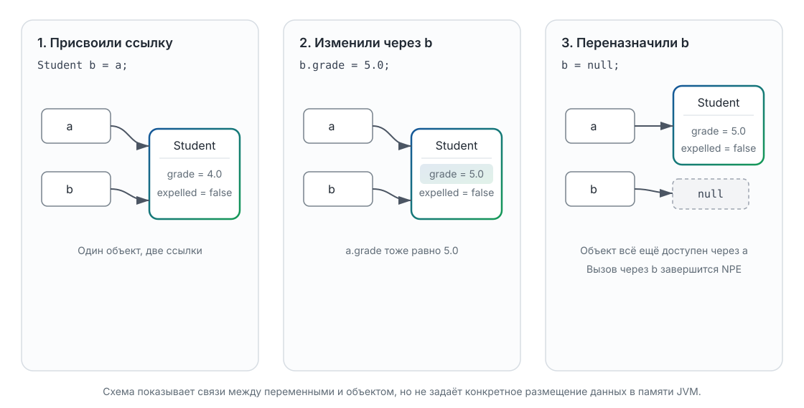
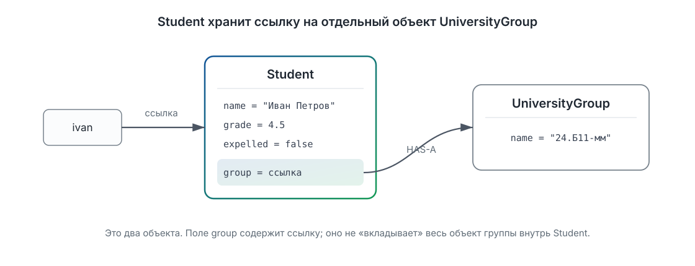

# Лекция 2. Классы, объекты и инкапсуляция

[Главная](/)

От разрозненных данных и функций — к объектам, которые управляют собственным состоянием и сотрудничают через понятный публичный API.

### Содержание

1. [От разрозненных данных к объекту](#p1)
2. [Объект отдельно, ссылка отдельно](#p2)
3. [Объект отвечает за своё состояние](#p3)
4. [Публичный API и внутреннее представление](#p4)
5. [Объекты сотрудничают](#p5)
6. [Что относится к объекту, а что — к классу](#p6)
7. [Контракт в исполняемом примере](#p7)
8. [Что у нас теперь есть и чего пока не хватает](#p8)

[Дополнительное чтение](#reading) · [Краткий справочник по синтаксису](#syntax-reference)

<a id="p1"></a>

## 1. От разрозненных данных к объекту

Представим, что программа хранит сведения об одном студенте: имя, текущую оценку и признак отчисления. Знакомых нам средств уже достаточно:

```java
String studentName = "Иван Петров";
double studentGrade = 4.5;
boolean studentExpelled = false;
```

Это три самостоятельные переменные, но для нас они описывают одну сущность. Связь существует пока только в именах и в голове программиста. Чтобы напечатать сведения о студенте, передадим все три значения отдельному `static`-методу, который пока играет роль знакомой нам функции:

```java
static void printStudent(
    String name,
    double grade,
    boolean expelled) {
  System.out.println(name + ": " + grade + ", отчислен: " + expelled);
}
```

Вызов тоже должен собрать тот же набор:

```java
printStudent(studentName, studentGrade, studentExpelled);
```

Для одного студента такой код работает. Но теперь в программе появляется второй:

```java
String studentName = "Иван Петров";
double studentGrade = 4.5;
boolean studentExpelled = false;

String anotherStudentName = "Пётр Сидоров";
double anotherStudentGrade = 4.0;
boolean anotherStudentExpelled = false;
```

Какую оценку напечатает следующий вызов и почему результат будет выглядеть правдоподобно, хотя данные перепутаны?

```java
printStudent(studentName, anotherStudentGrade, studentExpelled);
```

Получится строка про Ивана с оценкой Петра. Компилятор не видит ошибки: оба аргумента с оценками имеют тип `double`. Чем больше связанных значений и функций, тем больше мест, где нужно заново и безошибочно собрать один и тот же набор параметров.

Проблема не в том, что переменные и функции вдруг стали «плохими». Они по-прежнему нужны. Но конструкции языка пока не выражают важный факт предметной области: имя, оценка и статус принадлежат **одному студенту**. Опишем эту связь явно.

Следующая версия `Student` намеренно проста и **временна**. Она нужна, чтобы разделить понятия класса, объекта и ссылки. Клиентский код в том же пакете пока может обращаться к полям напрямую. Это не итоговый дизайн: позже объект получит операции и начнёт сам контролировать своё состояние.

```java
class Student {
  String name;
  double grade;
  boolean expelled;
}
```

**Класс** `Student` описывает общее устройство студентов в нашей программе: у каждого будут поля `name`, `grade` и `expelled`. Само объявление класса не создаёт ни Ивана, ни Петра. **Объект** — отдельный конкретный экземпляр этого класса со своим состоянием.

Создадим первый объект и заполним его поля:

```java
Student ivan = new Student();
ivan.name = "Иван Петров";
ivan.grade = 4.5;
ivan.expelled = false;
```

Теперь связь между значениями выражена в программе: `name`, `grade` и `expelled` принадлежат одному объекту. Через точку мы обращаемся к полю конкретного студента. Второй вызов `new` создаёт другой объект с собственным набором полей:

```java
Student petr = new Student();
petr.name = "Пётр Сидоров";
petr.grade = 4.0;
petr.expelled = false;
```

Что напечатает этот фрагмент после присваивания `petr.grade = 5.0`?

```java
System.out.println(ivan.grade);
System.out.println(petr.grade);
```

Результат — `4.5`, затем `5.0`: было создано два объекта, и изменение состояния одного из них не меняет другой. Класс у них общий, а объекты и их состояния разные. Класс можно сравнить не с уже заполненной анкетой, а с описанием того, какие сведения содержит каждая анкета; конкретных заполненных анкет может быть много.

Пока мы лишь собрали относящиеся к студенту данные. Чтобы понимать, что именно хранится в переменных `ivan` и `petr`, нужно внимательнее разобрать одну строку с `new`.

<a id="p2"></a>

## 2. Объект отдельно, ссылка отдельно

В первой лекции мы уже видели, что переменная типа массива хранит ссылку: после `int[] b = a` обе переменные могут указывать на один массив. С объектами `Student` действует та же модель. Разберём строку слева направо:

```java
Student ivan = new Student();
```

- `Student` слева — тип переменной;
- `ivan` — имя переменной;
- `new Student()` создаёт новый объект класса `Student` и даёт ссылку на него;
- `=` записывает это ссылочное значение в переменную `ivan`.

В скобках после имени класса сейчас нет аргументов. Это возможно потому, что во временной версии мы не объявили ни одного конструктора: компилятор неявно объявляет конструктор без параметров. Механизм и ограничения конструкторов разберём дальше. Сейчас важно не смешивать две сущности: объект существует отдельно, а переменная содержит значение, позволяющее обратиться к нему. Спецификация Java так и разделяет объекты, значения ссылочных типов и создание экземпляра выражением `new`: [JLS §4.3.1, §4.12.2](https://docs.oracle.com/javase/specs/jls/se26/html/jls-4.html#jls-4.3.1), [JLS §15.9](https://docs.oracle.com/javase/specs/jls/se26/html/jls-15.html#jls-15.9).

Каждое вычисленное выражение `new Student()` создаёт новый объект. Поэтому здесь два объекта:

```java
Student ivan = new Student();
Student petr = new Student();
```

А сколько объектов появится здесь?

```java
Student a = new Student();
Student b = a;
```

Только один. `new` встретился один раз. Присваивание `Student b = a` не копирует объект: оно копирует ссылочное значение. В итоге две переменные позволяют обратиться к одному `Student`.

Проверим следствие:

```java
Student a = new Student();
a.name = "Иван Петров";
a.grade = 4.5;
Student b = a;

b.grade = 5.0;
System.out.println(a.grade);
System.out.println(b.grade);
```

Обе строки содержат `5.0`. Выражение `b.grade = 5.0` изменило поле объекта, а не переменную `b`. Поскольку `a` и `b` указывают на тот же объект, новое состояние наблюдается через обе ссылки. Ситуация, когда несколько ссылок ведут к одному объекту, называется **aliasing**: у одного объекта появляется несколько имён, или псевдонимов.



Теперь важно различить изменение объекта и переназначение переменной:

```java
Student a = new Student();
a.name = "Иван Петров";

Student b = a;
b = new Student();
b.name = "Пётр Сидоров";
```

После `Student b = a` обе переменные указывали на объект Ивана. Но следующая строка вычислила ещё один `new Student()` и записала новую ссылку только в `b`. Переменная `a` по-прежнему указывает на Ивана, а `b` — уже на Петра. Переназначение одной переменной не «перемещает» объект и не меняет значение другой переменной.

Есть ещё одно допустимое значение ссылочной переменной — `null`:

```java
Student a = new Student();
Student b = a;
b = null;
```

`null` означает, что сейчас в `b` нет ссылки на объект. Сам `null` не является специальным пустым `Student` и вообще не является объектом. Присваивание не уничтожило созданного студента: он всё ещё доступен через `a`. Что произойдёт в следующей строке?

```java
System.out.println(b.name);
```

У программы нет объекта, поле `name` которого можно прочитать через `b`, поэтому при выполнении возникнет `NullPointerException`. При этом само хранение, передача или сравнение ссылки с `null` допустимы:

```java
if (b == null) {
  System.out.println("Ссылка на студента отсутствует");
}
```

Неверно говорить, что любое использование `null` немедленно вызывает исключение. Оно возникает, когда программа пытается обратиться через `null` к экземпляру — например, прочитать поле или вызвать метод. Точное описание таких ситуаций приведено в [Java API для `NullPointerException`](https://docs.oracle.com/en/java/javase/26/docs/api/java.base/java/lang/NullPointerException.html).

Итак, в модели нужно удерживать три разных действия:

1. `new Student()` создаёт новый объект;
2. присваивание ссылочной переменной копирует ссылку, но не объект;
3. запись в поле через любую из ссылок меняет общий объект.

Именно поэтому прямой доступ к полям требует осторожности: любой код, получивший ссылку, пока может записать в объект любое подходящее по типу значение. Следующий шаг — перенести допустимые операции к самому `Student` и определить, за какое состояние он отвечает.

<a id="p3"></a>

## 3. Объект отвечает за своё состояние

До сих пор `Student` был удобной упаковкой для трёх значений. Клиентский код мог читать и менять его поля напрямую:

```java
ivan.grade = 5.0;
ivan.expelled = true;
```

Но объект — не только группа данных. У него есть **состояние** и **поведение**. Состояние студента сейчас задают имя, оценка и статус отчисления. Поведение — операции, которые разрешено выполнять с этим состоянием.

Начнём со статуса. В предметной области мы не «записываем `true` в поле», а отчисляем студента. Перенесём это действие в класс:

```java
class Student {
  String name;
  double grade;
  boolean expelled;

  void expel() {
    expelled = true;
  }
}
```

Теперь клиент выражает намерение вызовом метода:

```java
ivan.expel();
```

Метод вызывается для конкретного объекта, поэтому внутри `expel` поле `expelled` означает поле именно этого студента. Если вызвать `petr.expel()`, изменится состояние объекта, на который ссылается `petr`. Другая ссылка на того же студента увидит это изменение — объект по-прежнему один.

Название `expel` важнее, чем кажется. Оно задаёт разрешённую предметную операцию и оставляет классу возможность позже добавить проверку или другое внутреннее действие. Вызов `setExpelled(true)` рассказал бы лишь о технической записи значения. Более того, `setExpelled(false)` разрешил бы обратный переход, которого в нашей упрощённой модели нет.

### Конструктор задаёт начало жизни объекта

Есть ещё одна проблема. Временная версия класса позволяла написать:

```java
Student ivan = new Student();
System.out.println(ivan.name);
```

Такой объект существует, но мы не сообщили ему ни имя, ни оценку. Поле `name` получит `null`, `grade` — `0.0`, `expelled` — `false`. Эти начальные значения полей назначаются Java автоматически, но из этого не следует, что получившийся студент осмыслен для нашей задачи.

Потребуем нужные данные при создании. Следующая версия **заменяет прежнее объявление `Student`**:

```java
class Student {
  String name;
  double grade;
  boolean expelled;

  Student(String name, double grade) {
    this.name = name;
    this.grade = grade;
    this.expelled = false;
  }

  void expel() {
    this.expelled = true;
  }
}
```

**Конструктор** выполняется при создании объекта через `new`. Его имя совпадает с именем класса, а тип возвращаемого значения не записывается. Теперь студент создаётся так:

```java
Student ivan = new Student("Иван Петров", 4.5);
Student petr = new Student("Пётр Сидоров", 4.0);
```

В конструкторе параметр `name` и поле `name` имеют одинаковые имена. `this` — ссылка на текущий объект; поэтому `this.name` означает его поле, а `name` без `this` здесь означает параметр. В строке `this.name = name` значение параметра записывается в поле создаваемого объекта. Там, где неоднозначности нет, как в методе `expel`, `this` можно не писать; выше он добавлен для единообразия.

После объявления конструктора с параметрами вызов `new Student()` больше не компилируется. Java не добавляет неявный конструктор без параметров, если в классе уже объявлен хотя бы один конструктор. Термин **default constructor** в спецификации обозначает именно неявно добавляемый конструктор, а явно написанный `Student()` был бы конструктором без параметров. [Правило о default constructor в JLS, §8.8.9](https://docs.oracle.com/javase/specs/jls/se26/html/jls-8.html#jls-8.8.9).

Параметр конструктора делает имя обязательным на уровне формы вызова, но пока не проверяет его содержание: `null` или строка из пробелов всё ещё прошли бы. Чуть ниже мы закроем и этот путь к бессмысленному состоянию. Конструктор также пока не защищает объект после создания. Что произойдёт с такой строкой?

```java
ivan.grade = -100.0;
```

Код скомпилируется. Для `double` число `-100.0` допустимо, но для оценки в нашей модели — нет. Значит, одного подходящего типа недостаточно: у состояния есть дополнительное правило.

### Инвариант и единая проверка

Договоримся, что имя не равно `null` и не состоит только из пробелов, а текущая оценка всегда лежит в диапазоне от `0.0` до `5.0` включительно:

```text
0.0 <= grade && grade <= 5.0
```

Такое условие, которое должно оставаться истинным для каждого корректного объекта, называется **инвариантом**. Правило имени надо обеспечить при создании, а правило оценки — ещё и при каждом дальнейшем изменении. Если оставить поле доступным клиенту, класс не сможет проконтролировать все записи. Закроем поля и предоставим только проверяемые операции.

Следующая версия снова **целиком заменяет объявление `Student`**:

```java
class Student {
  private String name;
  private double grade;
  private boolean expelled;

  public Student(String name, double grade) {
    requireValidName(name);
    requireValidGrade(grade);
    this.name = name;
    this.grade = grade;
    this.expelled = false;
  }

  public String getName() {
    return name;
  }

  public double getGrade() {
    return grade;
  }

  public boolean isExpelled() {
    return expelled;
  }

  public void changeGrade(double newGrade) {
    requireValidGrade(newGrade);
    this.grade = newGrade;
  }

  public void expel() {
    this.expelled = true;
  }

  private void requireValidGrade(double value) {
    if (!(value >= 0.0 && value <= 5.0)) {
      throw new IllegalArgumentException("Оценка должна быть от 0 до 5");
    }
  }

  private void requireValidName(String value) {
    if (value == null || value.isBlank()) {
      throw new IllegalArgumentException("Имя не должно быть пустым");
    }
  }
}
```

`private` запрещает обращаться к члену класса из клиентского кода. Поэтому прежняя строка `ivan.grade = -100.0` теперь намеренно не компилируется. `public` отмечает операции, которыми клиенту разрешено пользоваться.

Конструктор и `changeGrade` вызывают одно правило проверки. Условие записано как отрицание допустимого диапазона, поэтому оно отклоняет в том числе специальное значение `NaN`, которое может храниться в `double` и не удовлетворяет ни одному обычному сравнению диапазона. При недопустимом значении создаётся исключение `IllegalArgumentException`, и обычное выполнение метода прекращается. В `changeGrade` проверка расположена **до** присваивания, поэтому неудачный вызов не портит прежнюю оценку:

```java
ivan.changeGrade(5.0);
ivan.changeGrade(-100.0); // IllegalArgumentException
```

После первого вызова оценка равна `5.0`. Второй вызов отклоняется, а поле не успевает измениться. Сам вспомогательный метод `requireValidGrade` тоже закрыт: это деталь того, как класс поддерживает своё правило, а не отдельная операция над студентом.

Обратите внимание: `private` само по себе не гарантирует правильность. Если бы `changeGrade` без проверки присваивал любое значение, инвариант всё ещё можно было бы нарушить. Защита возникает из сочетания закрытого представления и контролируемых публичных операций. Это и есть центральная идея **инкапсуляции**: объект управляет своим состоянием через выбранную границу, а не просто прячет поля ради оформления.

<a id="p4"></a>

## 4. Публичный API и внутреннее представление

Посмотрим на `Student` с двух сторон. Автор класса знает поля и проверку. Клиенту достаточно доступных операций:

```java
Student ivan = new Student("Иван Петров", 4.5);
ivan.changeGrade(5.0);
ivan.expel();

System.out.println(ivan.getName());
System.out.println(ivan.getGrade());
System.out.println(ivan.isExpelled());
```

Этот набор доступных конструкторов и методов образует **публичный API** класса. Имена методов, параметры, результаты и наблюдаемое поведение составляют договорённость с клиентом. Поля и вспомогательные методы — **внутреннее представление**, которым класс может распоряжаться сам.

В текущем API есть запросы `getName`, `getGrade`, `isExpelled`: они позволяют наблюдать состояние. Но из этого не следует, что каждому полю нужен setter. Для статуса предусмотрена команда `expel()`, потому что модель разрешает только переход от «учится» к «отчислен». Для оценки есть `changeGrade`, которое сохраняет инвариант. Метода `setExpelled(boolean)` нет намеренно, а безусловный `setGrade(double)` был бы слишком широким обещанием.

Getter тоже не обязан появляться автоматически. Его добавляют, если клиенту действительно нужно наблюдать значение. Иначе расширяется публичная договорённость, которую затем сложнее менять. Поэтому инкапсуляция — не рецепт «сделать все поля `private`, затем сгенерировать к каждому getter и setter».

### Реализация меняется, клиент — нет

Сейчас статус хранится в поле `expelled`, где `true` означает отчисление. Представим, что автор класса решил хранить противоположный признак — продолжает ли студент учиться. Ниже показан **сокращённый фрагмент замены внутри класса**, а не самостоятельная программа:

```java
private boolean studying = true;

public boolean isExpelled() {
  return !studying;
}

public void expel() {
  studying = false;
}
```

Это не предложение непременно хранить противоположный признак: прежнее имя поля проще читать. Фрагмент показывает границу. Клиентский код по-прежнему вызывает `ivan.expel()` и `ivan.isExpelled()` и не зависит от того, есть внутри поле `expelled` или `studying`. Если бы поле было открытым, изменение представления потребовало бы исправлять всех клиентов.

Публичный API не скрывает смысл операции — наоборот, делает его явным. Он скрывает решение о хранении и не позволяет обойти правила объекта. Для нашего `Student` существенная часть контракта звучит так:

- после успешного создания имя непусто, студент не отчислен, а его оценка находится в диапазоне от `0.0` до `5.0`;
- `changeGrade` принимает значение только из этого диапазона, иначе сообщает об ошибке и сохраняет прежнюю оценку;
- `expel` переводит статус в «отчислен»; повторный вызов безопасно оставляет тот же статус;
- методы наблюдения возвращают текущее состояние, но не дают записать в поля произвольные значения.

Контракт описывает то, что можно проверить снаружи. Он не обещает конкретное имя private-поля или текст, которым хранится статус. Благодаря этой границе мы сможем дальше связать студента с другим объектом и развивать реализацию, не заставляя клиентский код знать все её детали.

<a id="p5"></a>

## 5. Объекты сотрудничают

До сих пор `Student` хранил простые значения: имя, оценку и признак отчисления. Но студент существует не сам по себе — он учится в группе. Можно было бы добавить строковое поле `groupName`, однако тогда именно `Student` пришлось бы расширять всякий раз, когда у группы появится собственное состояние или поведение.

Выделим группу в отдельный класс:

```java
class UniversityGroup {
  private final String name;

  public UniversityGroup(String name) {
    if (name == null || name.isBlank()) {
      throw new IllegalArgumentException("Название группы не должно быть пустым");
    }
    this.name = name;
  }

  public String getName() {
    return name;
  }
}
```

Теперь `Student` хранит не копию названия, а ссылку на отдельный объект:

```java
private final UniversityGroup group;
```

Конструктор получает уже созданную группу и проверяет, что ссылка существует:

```java
public Student(String name, double grade, UniversityGroup group) {
  if (group == null) {
    throw new IllegalArgumentException("Группа должна быть указана");
  }
  // Проверка и присваивание остальных полей опущены.
  this.group = group;
}
```

Клиентский код сначала создаёт группу, затем передаёт ссылку студенту:

```java
UniversityGroup group = new UniversityGroup("24.Б11-мм");
Student ivan = new Student("Иван Петров", 4.5, group);

System.out.println(ivan.getGroup().getName());
```

Вывод:

```text
24.Б11-мм
```

Между объектами возникло отношение **HAS-A**: объект `Student` **имеет ссылку на** объект `UniversityGroup`. Это два разных объекта с разными ответственностями. `Student` управляет оценкой и статусом студента, `UniversityGroup` — данными группы. Поле-ссылка само по себе не означает, что студент создал группу, единолично владеет ею или определяет время её существования. Одна и та же группа может быть передана нескольким студентам.



На схеме поле `group` находится внутри состояния `Student`, но сам объект `UniversityGroup` остаётся отдельным. Через `getGroup()` клиент получает ссылку на него. В нашей модели группа не предоставляет операций изменения, поэтому клиент может наблюдать связь, но не может переименовать группу через её публичный API.

<a id="p6"></a>

## 6. Что относится к объекту, а что — к классу

У каждого студента свои `name`, `grade`, `expelled`, `group` и `studentId`. Такие поля называются **полями экземпляра**: обращение к ним связано с конкретным объектом. Методы `changeGrade()` и `expel()` тоже работают с состоянием того объекта, для которого вызваны:

```java
ivan.changeGrade(5.0);
petr.expel();
```

Внутри такого метода `this` ссылается соответственно на `ivan` или `petr`.

Но как узнать, сколько объектов `Student` было успешно сконструировано за время текущего запуска? Это число относится не к одному студенту, а ко всему классу. Объявим общее поле с `static`:

```java
private static int count;

public static int getCount() {
  return count;
}
```

Поле `count` одно на класс и не дублируется в каждом объекте `Student`. После успешной проверки аргументов конструктор увеличивает его:

```java
studentId = ++count;
```

Статический метод вызывают через имя класса:

```java
System.out.println(Student.getCount());
```

У статического метода нет текущего объекта `Student`, поэтому он не может напрямую обратиться к `this`, `name` или `grade`. Зато ему доступно общее статическое поле `count`.

Идентификатор студента назначается при создании и затем не должен меняться:

```java
private final int studentId;
```

`final` означает, что поле можно назначить только один раз. Здесь значение задаёт конструктор, а дальнейшее присваивание компилятор запретит. Для ссылок смысл тот же: нельзя заменить сохранённое ссылочное значение.

```java
final Student student = new Student("Иван Петров", 4.5, group);
student.changeGrade(5.0); // Допустимо: меняется объект.
```

Следующий отдельный контрпример **намеренно не компилируется**:

```java
student = new Student("Пётр Сидоров", 4.0, group);
```

Переменную `student` нельзя направить на другой объект. Но `final Student` не делает сам объект неизменяемым: вызов `changeGrade(5.0)` по-прежнему разрешён публичным API. Аналогично конструктор один раз назначает `private final UniversityGroup group`; после этого методы `Student` не могут заменить сохранённую ссылку. Это отдельное утверждение от изменяемости объекта группы.

<a id="p7"></a>

## 7. Контракт в исполняемом примере

Соберём решения в один файл. Ниже — **полная запускаемая программа `StudentDemo.java`**. В одном исходном файле только один класс объявлен `public`; остальные классы доступны внутри того же пакета.

```java
public class StudentDemo {
  public static void main(String[] args) {
    UniversityGroup group = new UniversityGroup("24.Б11-мм");
    Student ivan = new Student("Иван Петров", 4.5, group);

    ivan.changeGrade(5.0);
    System.out.println(
        ivan.getName() + ": " + ivan.getGrade()
            + ", группа " + ivan.getGroup().getName()
    );

    boolean invalidGradeRejected = false;
    try {
      ivan.changeGrade(-1.0);
    } catch (IllegalArgumentException exception) {
      invalidGradeRejected = true;
      System.out.println("Недопустимая оценка отклонена");
    }
    check(invalidGradeRejected, "Недопустимая оценка должна быть отклонена");
    check(ivan.getGrade() == 5.0, "Оценка не должна измениться после ошибки");

    System.out.println("Создано студентов: " + Student.getCount());
  }

  private static void check(boolean condition, String message) {
    if (!condition) {
      throw new AssertionError(message);
    }
  }
}

class Student {
  private static int count;

  private final int studentId;
  private final String name;
  private double grade;
  private boolean expelled;
  private final UniversityGroup group;

  public Student(String name, double grade, UniversityGroup group) {
    requireValidName(name);
    requireValidGrade(grade);
    if (group == null) {
      throw new IllegalArgumentException("Группа должна быть указана");
    }

    this.name = name;
    this.grade = grade;
    this.group = group;
    this.studentId = ++count;
  }

  public String getName() {
    return name;
  }

  public double getGrade() {
    return grade;
  }

  public boolean isExpelled() {
    return expelled;
  }

  public UniversityGroup getGroup() {
    return group;
  }

  public int getStudentId() {
    return studentId;
  }

  public void changeGrade(double newGrade) {
    requireValidGrade(newGrade);
    grade = newGrade;
  }

  public void expel() {
    expelled = true;
  }

  public static int getCount() {
    return count;
  }

  private static void requireValidGrade(double grade) {
    if (!(grade >= 0.0 && grade <= 5.0)) {
      throw new IllegalArgumentException("Оценка должна быть от 0 до 5");
    }
  }

  private static void requireValidName(String name) {
    if (name == null || name.isBlank()) {
      throw new IllegalArgumentException("Имя не должно быть пустым");
    }
  }
}

class UniversityGroup {
  private final String name;

  public UniversityGroup(String name) {
    if (name == null || name.isBlank()) {
      throw new IllegalArgumentException("Название группы не должно быть пустым");
    }
    this.name = name;
  }

  public String getName() {
    return name;
  }
}
```

Скомпилируйте и запустите файл:

```sh
javac StudentDemo.java
java StudentDemo
```

Ожидаемый вывод:

```text
Иван Петров: 5.0, группа 24.Б11-мм
Недопустимая оценка отклонена
Создано студентов: 1
```

Первый сценарий проверяет допустимое изменение через публичный метод. Второй пытается нарушить инвариант, проверяет обещанную контрактом ошибку и затем наблюдает состояние через `getGrade()`. Проверка выполняется **до** присваивания, поэтому после неудачного вызова оценка Ивана остаётся `5.0`. Мы проверяем поведение через публичный API и наблюдаемый результат, а не пытаемся добраться до `private`-поля.

Счётчик равен единице. Неудачным был вызов `changeGrade()`, а не конструктора, поэтому второй вызов `new Student(...)` здесь вообще не выполнялся. Если конструктор получает пустое имя, недопустимую оценку или `null` вместо группы, он не завершится успешно: клиент не получит ссылку, а идентификатор и запись в счётчике не появятся.

Метод `expel()` в этом запуске не вызван, но его контракт виден из кода: первый вызов переводит состояние из `false` в `true`, повторный оставляет `true`. Обратной операции публичный API намеренно не предлагает.

<a id="p8"></a>

## 8. Что у нас теперь есть и чего пока не хватает

Мы начали с нескольких переменных и функций, которым нужно было согласованно передавать данные. Класс дал общее описание, `new` создал конкретный объект, а переменная сохранила ссылку на него. Методы перенесли разрешённые операции к состоянию. Конструктор и проверки задали допустимое начало жизни, `private` закрыл представление, а публичный API оформил контракт. Затем ссылка в поле связала `Student` с отдельным `UniversityGroup`, `static` выразил состояние всего класса, а `final` закрепил однократно назначаемые значения.

Главный результат — не набор ключевых слов, а граница ответственности. Клиент просит объект выполнить разрешённую операцию и опирается на её контракт. Сам объект следит за своим инвариантом и скрывает детали хранения. Несколько таких объектов могут сотрудничать через ссылки, не превращаясь в один объект.

Пока клиент знает конкретные классы `Student` и `UniversityGroup`. Следующий вопрос — как описать общую операцию так, чтобы клиент мог работать с разными реализациями, не привязываясь к одной из них. К этому мы перейдём в лекции «Абстракции, интерфейсы и полиморфизм».

### Вопросы для самопроверки

1. Чем класс отличается от объекта и сколько объектов создают два вычисления `new Student(...)`?
2. Что хранится в переменной типа `Student`? Что копируется при `Student b = a` и что станет видно через `a` после изменения объекта через `b`?
3. Что означает `null` и почему вызов метода через такую ссылку приводит к `NullPointerException`?
4. Зачем нужен конструктор и чем обязательный параметр отличается от проверки допустимости его значения?
5. Что такое инвариант `Student` и почему `private`-поля с безусловными setter ещё не обеспечивают хорошую инкапсуляцию?
6. Сколько объектов создают `new UniversityGroup(...)` и `new Student(...)`, что хранится в поле `group` и почему это отношение называют HAS-A?
7. Какие поля полного примера принадлежат каждому экземпляру, какое поле общее для класса и почему `getCount()` вызывается как `Student.getCount()`?
8. Разрешён ли `student.changeGrade(5.0)` для `final Student student`, и что именно запрещает `final`?
9. Почему после `changeGrade(-1.0)` прежняя оценка сохраняется и какую часть контракта проверяет метод `check` в `main`?

<a id="reading"></a>

## Дополнительное чтение

- [JLS: классы](https://docs.oracle.com/javase/specs/jls/se26/html/jls-8.html), [создание экземпляра](https://docs.oracle.com/javase/specs/jls/se26/html/jls-15.html#jls-15.9) и [ссылочные типы и значения](https://docs.oracle.com/javase/specs/jls/se26/html/jls-4.html#jls-4.3) — нормативные правила Java 26; читать целиком сейчас необязательно.
- [University of Helsinki: Objects and references](https://java-programming.mooc.fi/part-5/4-objects-and-references/) — дополнительные трассировки ссылок и небольшие упражнения.
- [MIT 6.092: Classes and Objects](https://ocw.mit.edu/courses/6-092-introduction-to-programming-in-java-january-iap-2010/resources/mit6_092iap10_lec04/) — ещё один переход от наборов переменных к нескольким объектам.
- [UC Berkeley CS61B: Defining and Using Classes](https://sp21.datastructur.es/materials/lectures/lec2/lec2.html) — компактная памятка по классам, экземплярам и `static`.

<a id="syntax-reference"></a>

## Краткий справочник по синтаксису

Этот раздел можно использовать отдельно от основной истории. Он напоминает форму изученных конструкций, но не заменяет объяснение того, зачем объекту состояние, поведение и инвариант.

### Объявление класса

```java
class Student {
}
```

Класс описывает новый ссылочный тип: общее устройство и доступные операции его экземпляров. Если у top-level класса нет модификатора доступа, он доступен внутри своего пакета; это называется **package access**, а не `private`.

### Поле

```java
private String name;
```

Поле хранит часть состояния объекта. `private` не позволяет клиентскому коду обращаться к этому полю напрямую.

### Метод экземпляра

```java
public void expel() {
  expelled = true;
}
```

Метод экземпляра вызывается для конкретного объекта: `student.expel()`. У него есть текущий объект, поэтому метод может обращаться к его полям.

### Создание объекта

```java
Student student = new Student("Иван Петров", 4.5, group);
```

`Student` слева задаёт тип переменной, `student` — её имя, а `new Student(...)` создаёт объект и вызывает подходящий конструктор. Значением выражения `new` является ссылка на созданный объект; именно она сохраняется в переменной.

### Конструктор

```java
public Student(String name) {
  this.name = name;
}
```

Объявление конструктора носит имя класса и не содержит возвращаемого типа — даже `void`. Конструктор настраивает новый объект и может проверить его начальные данные.

Если класс вообще не объявляет конструкторов, компилятор неявно добавляет **default constructor** без параметров. Как только мы объявили хотя бы один конструктор, такой конструктор автоматически не добавляется. Явно написанный `Student()` точнее называть конструктором без параметров (*no-arg constructor*), а не default constructor.

### `this`

```java
public Student(String name) {
  this.name = name;
}
```

`this` — ссылка на текущий объект. Здесь `this.name` обозначает поле, а `name` без `this` — параметр конструктора. В `static`-контексте текущего объекта нет, поэтому `this` там использовать нельзя.

### Модификаторы доступа

| Запись | Краткий смысл |
| --- | --- |
| `public` | Объявление доступно клиентскому коду, если доступен содержащий его тип. |
| `private` | Член доступен только внутри объявившего его top-level класса и его вложенных типов. |
| без модификатора | **Package access**: доступ из того же пакета. |
| `protected` | Также даёт доступ из того же пакета и при определённых условиях из подклассов; точные правила понадобятся при изучении наследования. |

Модификатор управляет доступом, но сам по себе не проектирует хороший API. Например, `private`-поле с безусловным setter всё ещё можно привести к недопустимому значению через этот setter.

### Статическое поле

```java
private static int count;
```

`static`-поле относится к классу: одна переменная `count` существует независимо от числа экземпляров `Student`. Обращаться к ней снаружи можно только если это разрешает модификатор доступа; `private static` не становится публичным из-за `static`.

### Статический метод

```java
public static int getCount() {
  return count;
}
```

Статический метод вызывается через класс: `Student.getCount()`. У него нет текущего объекта. При наличии ссылки он всё равно может вызвать метод экземпляра явно: `student.expel()`.

### `final` для поля и переменной

```java
private final int studentId;

final Student student = new Student("Иван Петров", 4.5, group);
```

Значение `final`-переменной назначается один раз. `studentId` должен получить значение при создании каждого `Student` и затем не может быть переназначен. Во второй строке нельзя выполнить `student = anotherStudent`, но можно выполнить `student.changeGrade(5.0)`: `final` фиксирует ссылку, а не делает объект неизменяемым.

### `null`

```java
Student student = null;
```

`null` — специальное значение ссылочного типа, которое не ссылается ни на один объект. Само присваивание допустимо, но вызов `student.expel()` при таком значении завершится `NullPointerException`.

### Объект как поле другого объекта

```java
class Student {
  private final UniversityGroup group;
}
```

Поле `group` хранит ссылку на объект `UniversityGroup`. Это отношение **HAS-A**: у студента есть группа. Два поля или две переменные могут хранить ссылки на один и тот же объект группы.
