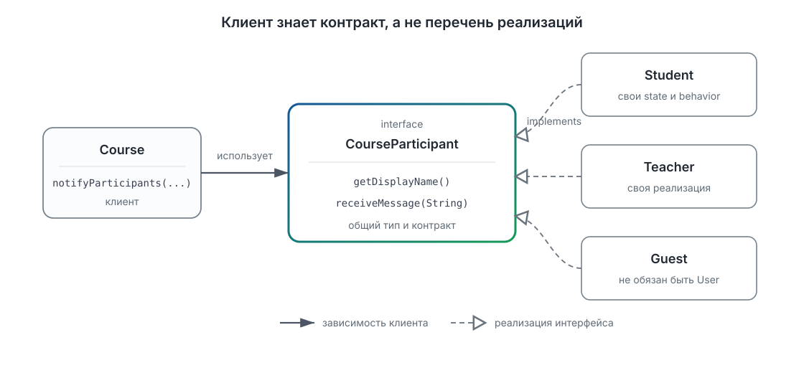
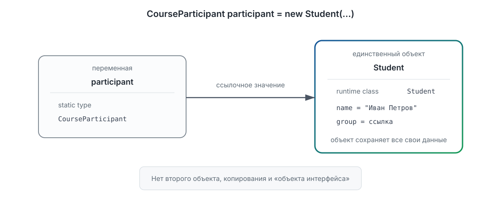
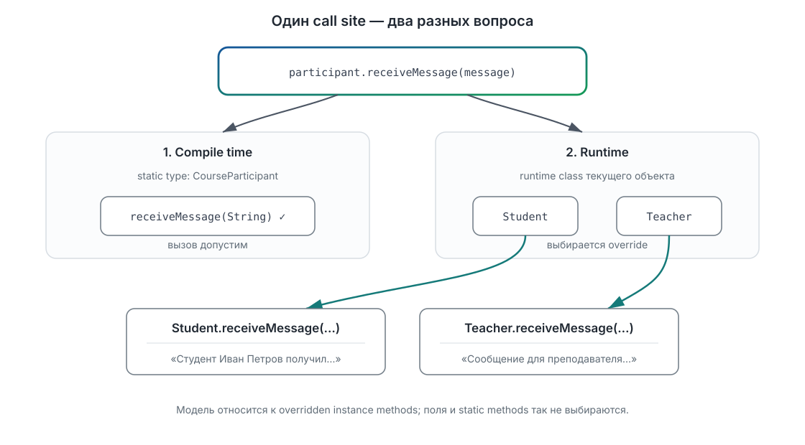
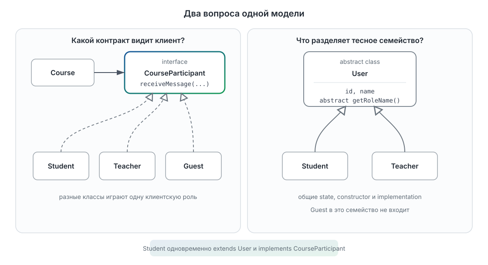
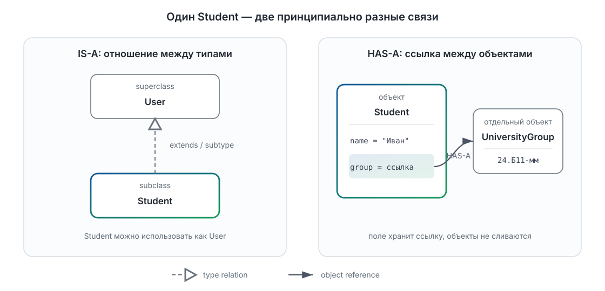

# Лекция 3. Абстракции, интерфейсы, наследование и полиморфизм

[Главная](/)

Как писать код, которому не важна конкретная реализация.

### Содержание

1. [Когда один клиент знает слишком много конкретных классов](#p1)
2. [Интерфейс выделяет общий контракт](#p2)
3. [Один клиент для разных реализаций](#p3)
4. [Тип переменной и класс объекта — не одно и то же](#p4)
5. [Dynamic dispatch: как выбирается реализация](#p5)
6. [Теперь это можно назвать полиморфизмом](#p6)
7. [Что можно подставить вместо `CourseParticipant`](#p7)
8. [Другая общность: семейство пользователей](#p8)
9. [Как конструируется подкласс](#p9)
10. [Переопределение в иерархии классов](#p10)
11. [Когда общая основа должна быть абстрактной](#p11)
12. [Interface и abstract class отвечают на разные вопросы](#p12)
13. [Один superclass и несколько независимых ролей](#p13)
14. [IS-A и HAS-A: наследование или композиция](#p14)
15. [Осторожно: приведения типов, `instanceof` и `final`](#p15)
16. [Четыре классических принципа — теперь у них есть код](#p16)
17. [Что у нас теперь есть и куда дальше](#p17)

[Дополнительное чтение](#reading) · [Краткий справочник по синтаксису](#syntax-reference)

<a id="p1"></a>

## 1. Когда один клиент знает слишком много конкретных классов

В предыдущей лекции `Student` стал самостоятельным объектом: он скрывает внутреннее представление, следит за своим инвариантом и предоставляет клиенту публичный API. Но университетская система растёт. Теперь курс должен отправлять объявления не только студентам, но и преподавателям.

Сократим классы до деталей, важных для новой задачи. Это продолжение прежней модели, а не её замена: у `Student` по-прежнему могут быть оценка, группа и остальные закрытые поля.

```java
class Student {
  private final String name;

  public Student(String name) {
    if (name == null || name.isBlank()) {
      throw new IllegalArgumentException("Имя не должно быть пустым");
    }
    this.name = name;
  }

  public String getDisplayName() {
    return name;
  }

  public void receiveMessage(String message) {
    System.out.println("Студент " + name + " получил сообщение: " + message);
  }
}

class Teacher {
  private final String name;

  public Teacher(String name) {
    if (name == null || name.isBlank()) {
      throw new IllegalArgumentException("Имя не должно быть пустым");
    }
    this.name = name;
  }

  public String getDisplayName() {
    return name;
  }

  public void receiveMessage(String message) {
    System.out.println("Сообщение для преподавателя " + name + ": " + message);
  }
}
```

Устройство объектов различается, но для `Course` они умеют одно и то же: сообщить отображаемое имя и принять сообщение. Пока клиент вынужден записать это дважды:

```java
class Course {
  public void sendMessageToStudent(Student student, String message) {
    student.receiveMessage(message);
  }

  public void sendMessageToTeacher(Teacher teacher, String message) {
    teacher.receiveMessage(message);
  }
}
```

У методов разные имена и типы параметров, но одна клиентская задача. Хуже того, `Course` явно перечисляет все известные ему классы. Если к открытому занятию присоединится `Guest`, потребуется третий метод, хотя смысл операции останется прежним.

Можно ли описать роль «участник курса» отдельно от устройства студента, преподавателя или гостя? Клиенту не нужны их поля и специальные операции. Ему достаточно небольшого обещания: объект умеет назвать себя и принять сообщение.

<a id="p2"></a>

## 2. Интерфейс выделяет общий контракт

Такое обещание в Java можно выразить интерфейсом:

```java
interface CourseParticipant {
  String getDisplayName();

  void receiveMessage(String message);
}
```

`CourseParticipant` не описывает, где хранится имя и как доставляется сообщение. Он фиксирует операции, на которые может рассчитывать клиент. Это продолжение идеи контракта из предыдущей лекции: теперь контракт объявлен отдельно от конкретного класса.

Класс явно принимает этот контракт с помощью `implements`:

```java
class Student implements CourseParticipant {
  private final String name;

  public Student(String name) {
    if (name == null || name.isBlank()) {
      throw new IllegalArgumentException("Имя не должно быть пустым");
    }
    this.name = name;
  }

  @Override
  public String getDisplayName() {
    return name;
  }

  @Override
  public void receiveMessage(String message) {
    System.out.println("Студент " + name + " получил сообщение: " + message);
  }

  public double getGrade() {
    return 5.0;
  }
}
```

`Teacher` объявляет то же обязательство, но реализует операции по-своему:

```java
class Teacher implements CourseParticipant {
  private final String name;

  public Teacher(String name) {
    if (name == null || name.isBlank()) {
      throw new IllegalArgumentException("Имя не должно быть пустым");
    }
    this.name = name;
  }

  @Override
  public String getDisplayName() {
    return name;
  }

  @Override
  public void receiveMessage(String message) {
    System.out.println("Сообщение для преподавателя " + name + ": " + message);
  }
}
```

Аннотация `@Override` просит компилятор проверить, что метод действительно реализует объявленную операцию. Если случайно написать `receiveMessages` или изменить параметры, ошибка обнаружится при компиляции.

Совпадения имён методов самого по себе недостаточно. Если другой класс случайно содержит `getDisplayName()` и `receiveMessage(String)`, но не объявляет `implements CourseParticipant`, Java не считает его реализацией этого интерфейса. Связь типов задаётся явно.

Интерфейс — полноценный ссылочный тип. Его можно использовать там же, где раньше мы использовали имя класса:

```java
CourseParticipant participant = new Student("Иван Петров");
```

Им можно объявить параметр метода:

```java
public void sendMessage(CourseParticipant participant, String message) {
  participant.receiveMessage(message);
}
```

Метод может вернуть значение интерфейсного типа, не раскрывая клиенту конкретный класс результата:

```java
static CourseParticipant chooseRecipient(
    Student student,
    Teacher teacher,
    boolean sendToTeacher) {
  if (sendToTeacher) {
    return teacher;
  }
  return student;
}
```

Наконец, можно создать массив ссылок общего типа:

```java
CourseParticipant[] participants = {
    new Student("Иван Петров"),
    new Teacher("Анна Смирнова")
};
```

В массиве находятся ссылки на два разных объекта. Сам массив не превращает их в объекты `CourseParticipant` и не копирует их. Как и раньше, переменные и элементы массива хранят ссылки.

Современный Java-интерфейс не обязательно состоит только из объявлений абстрактных методов: в нём также возможны константы и методы `default`, `static` и `private`. Эти возможности понадобятся реже и будут собраны в справочнике. Главная роль интерфейса здесь — отдельно назвать контракт, от которого зависит клиент.



На схеме `Course` знает один общий тип. Пунктирные связи `implements` не означают общего внутреннего устройства: реализации объединены обещанным клиенту контрактом.

<a id="p3"></a>

## 3. Один клиент для разных реализаций

Теперь `Course` не обязан перечислять конкретные классы. Один метод принимает любого участника, соблюдающего общий контракт:

```java
class Course {
  public void sendMessage(CourseParticipant participant, String message) {
    participant.receiveMessage(message);
  }

  public void notifyParticipants(
      CourseParticipant[] participants,
      String message) {
    for (CourseParticipant participant : participants) {
      sendMessage(participant, message);
    }
  }
}
```

Вызов выглядит так:

```java
CourseParticipant[] participants = {
    new Student("Иван Петров"),
    new Teacher("Анна Смирнова")
};

Course course = new Course();
course.notifyParticipants(participants, "Занятие перенесено");
```

Результат:

```text
Студент Иван Петров получил сообщение: Занятие перенесено
Сообщение для преподавателя Анна Смирнова: Занятие перенесено
```

В теле цикла записан один и тот же вызов:

```java
participant.receiveMessage(message);
```

Там нет `if`, проверки класса или ручного выбора метода. Но первая итерация выполняет реализацию `Student`, а вторая — реализацию `Teacher`. Чтобы понять, почему так происходит, нужно разделить тип переменной и класс объекта.

<a id="p4"></a>

## 4. Тип переменной и класс объекта — не одно и то же

Разберём знакомую по ссылочной семантике строку:

```java
CourseParticipant participant = new Student("Иван Петров");
```

В ней есть две разные характеристики:

- **статический тип** (*static type*, или *compile-time type*) переменной `participant` — `CourseParticipant`; он известен компилятору из объявления;
- **класс объекта во время выполнения** (*runtime class*) — `Student`, потому что выражение `new Student(...)` создало объект этого класса.

Иногда вторую характеристику в учебных материалах называют **динамическим типом**. В этой лекции мы будем говорить «runtime class», чтобы не возникало впечатления, будто тип самой переменной меняется во время работы программы.

Объект здесь один. Присваивание не создаёт отдельного «интерфейсного объекта» и не вырезает из `Student` часть данных. Переменная типа `CourseParticipant` хранит ссылку на тот же объект `Student`, со всеми его закрытыми полями и поведением.



Схема не утверждает размещение в stack или heap. Она показывает только переменную, ссылочное значение и объект: «интерфейсного объекта» рядом со `Student` не возникает.

Статический тип отвечает на вопрос: **какие операции компилятор разрешит вызвать через это выражение?** Через `participant` доступны операции контракта `CourseParticipant`:

```java
participant.getDisplayName();
participant.receiveMessage("Занятие перенесено");
```

Но метод, объявленный только в `Student`, через ту же переменную вызвать нельзя. Следующий отдельный контрпример намеренно не компилируется:

```java
participant.getGrade();
```

Компилятор рассуждает по статическому типу выражения `participant`. Контракт `CourseParticipant` не обещает наличие `getGrade()`: преподаватель или гость вообще могут не иметь оценки. То, что в данном запуске ссылка ведёт к `Student`, не делает специфическую операцию частью общего контракта.

Проверьте себя:

```java
Student student = new Student("Иван Петров");
CourseParticipant first = student;
CourseParticipant second = new Teacher("Анна Смирнова");

first.receiveMessage("Первое сообщение");
second.receiveMessage("Второе сообщение");
```

Обе строки компилируются, потому что `receiveMessage` объявлен в статическом типе `CourseParticipant`. Какой именно код выполнится в каждом вызове, статический тип один не объясняет. Для ответа понадобится runtime class объекта.

<a id="p5"></a>

## 5. Dynamic dispatch: как выбирается реализация

При вызове обычного метода экземпляра происходят два разных шага.

Сначала, **при компиляции**, Java рассматривает статический тип выражения слева от точки. Компилятор проверяет, существует ли доступный метод с подходящими именем и параметрами. Поэтому вызов `participant.receiveMessage(...)` разрешён, а `participant.getGrade()` — нет.

Затем, **во время выполнения**, для переопределённого метода экземпляра Java учитывает реальный класс объекта. Поиск реализации начинается с runtime class и выбирает наиболее специфичную подходящую реализацию. Поэтому ссылка на `Student` приводит к `Student.receiveMessage`, а ссылка на `Teacher` — к `Teacher.receiveMessage`. Этот механизм называется **динамической диспетчеризацией** (*dynamic dispatch*).

```text
Один и тот же участок клиентского кода:
    participant.receiveMessage(message)

Ссылка ведёт к Student  → Student.receiveMessage(...)
Ссылка ведёт к Teacher  → Teacher.receiveMessage(...)
```



Это модель семантики вызова на уровне языка: внутренние инструкции JVM и таблицы методов намеренно не показаны.

Здесь важны ограничения формулировки. Динамический выбор относится к переопределяемым методам экземпляра. Поле с одинаковым именем или `static`-метод не выбирается по runtime class тем же способом. Поэтому для объяснения dynamic dispatch мы наблюдаем именно вызовы `receiveMessage`, а не чтение поля или вызов статического метода.

Внутренние таблицы и инструкции JVM для этой модели не нужны. На уровне языка достаточно удерживать правило:

> Допустимость вызова проверяется по статическому типу выражения, а реализация переопределённого метода экземпляра выбирается по классу объекта во время выполнения.

<a id="p6"></a>

## 6. Теперь это можно назвать полиморфизмом

Мы уже увидели механизм до введения термина: один клиент работает через общий тип, а один и тот же вызов приводит к поведению конкретного объекта. Такая возможность называется **полиморфизмом**: один клиентский код принимает объекты разных конкретных классов, а они отвечают на общий вызов по-разному.

Добавим третью реализацию роли:

```java
class Guest implements CourseParticipant {
  private final String name;

  public Guest(String name) {
    if (name == null || name.isBlank()) {
      throw new IllegalArgumentException("Имя не должно быть пустым");
    }
    this.name = name;
  }

  @Override
  public String getDisplayName() {
    return name;
  }

  @Override
  public void receiveMessage(String message) {
    System.out.println("Гость " + name + " получил сообщение: " + message);
  }
}
```

Клиентский метод `notifyParticipants` менять не требуется:

```java
CourseParticipant[] participants = {
    new Student("Иван Петров"),
    new Teacher("Анна Смирнова"),
    new Guest("Сергей Волков")
};

course.notifyParticipants(participants, "Открытая лекция начнётся в 12:00");
```

Изменился набор объектов, но не алгоритм клиента: он по-прежнему знает только контракт `CourseParticipant`. Это конкретное следствие выбранной границы между контрактом и реализациями; более общие архитектурные принципы мы сейчас из него выводить не будем.

### Переопределение — не перегрузка

С dynamic dispatch связано **переопределение** (*overriding*): реализация предоставляет свою версию унаследованного метода экземпляра с подходящей сигнатурой. Именно такие реализации `receiveMessage` выбираются по runtime class.

**Перегрузка** (*overloading*) — другой механизм: в одном типе объявлено несколько методов с одним именем, но разными списками параметров. Какую перегрузку вызвать, компилятор определяет по статическим типам аргументов.

Рассмотрим намеренно неудачный способ отправки сообщений:

```java
static void announce(Student participant) {
  System.out.println("Специальное объявление для студента");
}

static void announce(CourseParticipant participant) {
  System.out.println("Общее объявление для участника");
}
```

Что будет напечатано?

```java
CourseParticipant participant = new Student("Иван Петров");
announce(participant);
```

Будет выбрана версия `announce(CourseParticipant)`, потому что статический тип аргумента — `CourseParticipant`. Runtime class `Student` не переключает перегрузку на `announce(Student)`.

Итак, два механизма нельзя смешивать:

- overriding методов экземпляра участвует в dynamic dispatch;
- overloading выбирается при компиляции по статическим типам.

<a id="p7"></a>

## 7. Что можно подставить вместо `CourseParticipant`

Вернёмся к двум строкам, которые Java принимает без явного преобразования типа:

```java
Student student = new Student("Иван Петров");
CourseParticipant participant = student;

Course course = new Course();
course.sendMessage(student, "Занятие перенесено");
```

В обоих случаях значение, ссылающееся на `Student`, используется там, где ожидается `CourseParticipant`: при присваивании переменной и при передаче аргумента. Это допустимо благодаря явно объявленной связи `implements`.

Теперь можно назвать отношение официальным термином Java:

- `Student`, `Teacher` и `Guest` — **подтипы** (*subtypes*) `CourseParticipant`;
- `CourseParticipant` — их **надтип** (*supertype*).

Поэтому точнее наблюдавшийся выше механизм называется **полиморфизмом подтипов** (*subtype polymorphism*): клиент принимает значения общего типа, а фактическое поведение обеспечивают его разные подтипы.

Отношение подтипов шире наследования между классами. Если класс `Student` позже объявит `extends User`, он будет подклассом `User` и одновременно подтипом `User`. Но `Student implements CourseParticipant` уже делает его подтипом `CourseParticipant`, хотя интерфейс не является родительским классом `Student`. Поэтому слова «подкласс» и «подтип» не взаимозаменяемы.

В данном присваивании выполняется расширяющее преобразование ссылки (*widening reference conversion*). Явное приведение не нужно, объект не меняется и новый объект не создаётся. Более общий статический тип лишь ограничивает набор операций, доступных через выражение. Эти правила определены в [JLS §4.10](https://docs.oracle.com/javase/specs/jls/se26/html/jls-4.html#jls-4.10) и [JLS §5.1.5](https://docs.oracle.com/javase/specs/jls/se26/html/jls-5.html#jls-5.1.5).

### Совместимого типа недостаточно для хорошей реализации

Компилятор умеет проверить, что класс объявил `implements CourseParticipant` и предоставил необходимые методы. Но контракт содержит не только форму вызова, но и смысл.

Зафиксируем обещание нашей учебной модели:

- `getDisplayName()` возвращает непустое имя для отображения;
- `receiveMessage(message)` принимает любое непустое учебное сообщение и делает получение наблюдаемым;
- клиенту не требуется узнавать конкретный класс, чтобы доставить такое сообщение.

Следующая реализация имеет нужные методы и компилируется, но нарушает второе обещание:

```java
class BrokenParticipant implements CourseParticipant {
  @Override
  public String getDisplayName() {
    return "Сломанная реализация";
  }

  @Override
  public void receiveMessage(String message) {
    throw new UnsupportedOperationException("Сообщения не поддерживаются");
  }
}
```

Если `Course` передаст ей допустимое непустое сообщение, вместо обещанного получения произойдёт отказ. С точки зрения объявлений типов это `CourseParticipant`; с точки зрения поведения он не может без нарушения ожиданий заменить корректного участника.

Требование, чтобы объект более конкретного типа можно было безопасно использовать там, где клиент ожидает общий тип и полагается на его контракт, называется **подставимостью** (*substitutability*). Java проверяет номинальную связь типов, но в общем случае не доказывает соблюдение смыслового контракта. Эту обязанность разделяют автор интерфейса, автор реализации и тесты.

Позже идея подставимости станет основой отдельного принципа проектирования — Liskov Substitution Principle. В этой лекции достаточно различать два утверждения:

1. `Student` объявлен подтипом `CourseParticipant`, поэтому Java разрешает присваивание и передачу аргумента.
2. Корректный `Student` соблюдает обещания `CourseParticipant`, поэтому клиент может действительно использовать его вместо любого корректного участника.

Мы решили задачу клиента: `Course` умеет работать с разными реализациями одной роли. Но теперь внутри `Student` и `Teacher` обнаруживается другая проблема — общие данные и поведение тесно связанного семейства пользователей. Для неё одного клиентского контракта недостаточно; дальше понадобится разобраться с наследованием классов.
<a id="p8"></a>

## 8. Другая общность: семейство пользователей

Интерфейс `CourseParticipant` уже решил проблему клиента: `Course` отправляет сообщение участнику и не знает, объект какого класса получил. Но если посмотреть внутрь `Student` и `Teacher`, обнаружится другая проблема. Оба класса хранят идентификатор и имя, одинаково проверяют имя и одинаково формируют отображаемое имя.

Можно было бы скопировать эти поля и методы. Тогда, однако, у двух тесно связанных сущностей появились бы две версии одной основы. Изменение правила проверки имени пришлось бы синхронно вносить в обе.

Здесь важно задать более сильный вопрос, чем при создании интерфейса:

> `Student` и `Teacher` лишь умеют участвовать в курсе или каждый из них является частным видом пользователя LMS?

В нашей модели верно второе:

```text
Student IS-A User
Teacher IS-A User
```

Такое отношение специализации можно выразить наследованием классов:

```java
class User {
  private final int id;
  private final String name;

  public User(int id, String name) {
    if (id <= 0) {
      throw new IllegalArgumentException("Идентификатор должен быть положительным");
    }
    if (name == null || name.isBlank()) {
      throw new IllegalArgumentException("Имя не должно быть пустым");
    }
    this.id = id;
    this.name = name;
  }

  public int getId() {
    return id;
  }

  public String getDisplayName() {
    return name;
  }
}

class Student extends User implements CourseParticipant {
  public Student(int id, String name) {
    super(id, name);
  }

  @Override
  public void receiveMessage(String message) {
    System.out.println(
        "Студент " + getDisplayName() + " получил сообщение: " + message
    );
  }
}
```

Эта сокращённая версия `Student` заменяет версию из предыдущего раздела: имя теперь хранится в `User`, а конструктор передаёт общей основе необходимые данные. Ниже мы добавим обратно специфичную для студента группу.

`extends User` объявляет `Student` подклассом (*subclass*) `User`. Одновременно `Student` становится подтипом `User`: объект `Student` можно использовать там, где ожидается `User`. Слово «подкласс» здесь точнее, чем в случае `implements`: `Student` — подтип `CourseParticipant`, но не подкласс интерфейса.

Переиспользование полей и методов — полезное следствие наследования, но не достаточная причина для него. Если два класса случайно содержат несколько одинаковых строк, из этого ещё не следует отношение IS-A. Наследование связывает их контракты: клиент, ожидающий `User`, должен иметь возможность получить `Student` и продолжить корректно работать.

<a id="p9"></a>

## 9. Как конструируется подкласс

У `Student` остались собственные данные — например, группа из предыдущей лекции. Конструктор должен инициализировать и общую часть `User`, и специфичную часть `Student`:

```java
class Student extends User implements CourseParticipant {
  private final UniversityGroup group;

  public Student(int id, String name, UniversityGroup group) {
    super(id, name);
    if (group == null) {
      throw new IllegalArgumentException("Группа должна быть указана");
    }
    this.group = group;
  }

  public UniversityGroup getGroup() {
    return group;
  }

  @Override
  public void receiveMessage(String message) {
    System.out.println(
        "Студент " + getDisplayName() + " получил сообщение: " + message
    );
  }
}
```

Вызов `super(id, name)` обращается к конструктору непосредственного superclass. Он не создаёт рядом отдельный объект `User`. Выражение `new Student(...)` по-прежнему создаёт **один объект `Student`**; вызванные конструкторы последовательно инициализируют его части.

Конструкторы не наследуются: наличие `User(int, String)` не создаёт такой же конструктор у `Student`. Подкласс объявляет собственный конструктор и при необходимости явно передаёт данные конструктору superclass. Нормативные правила конструкторов и явного вызова конструктора superclass описаны в [JLS 26, §8.8 и §8.8.7.1](https://docs.oracle.com/javase/specs/jls/se26/html/jls-8.html#jls-8.8).

### Наследование не отменяет инкапсуляцию

Поля `id` и `name` объявлены `private`, поэтому код `Student` не обращается к ним напрямую. Но состояние общей части объекта никуда не исчезает: с ним работают унаследованные публичные методы `getId()` и `getDisplayName()`.

Небезопасно запоминать упрощённую формулу «подкласс получает всё, кроме `private`». Для полей, методов, вложенных типов и конструкторов действуют разные правила наследования, скрытия, переопределения и доступа. В частности, конструкторы вообще не являются членами класса и не наследуются, а `private`-члены superclass не наследуются подклассом. При этом объект подкласса всё равно содержит состояние, объявленное его superclass. Точные правила перечислены в [JLS 26, §8.2](https://docs.oracle.com/javase/specs/jls/se26/html/jls-8.html#jls-8.2).

Иногда superclass хочет разрешить подклассам использовать внутреннюю операцию, не открывая её всем клиентам. Для этого подходит контролируемый `protected`-метод:

```java
class User {
  private final String name;

  // Конструктор и остальные методы опущены.

  protected final String formatNameWithRole(String role) {
    return role + " " + name;
  }
}

class Student extends User {
  // Конструктор опущен.

  public String getCaption() {
    return formatNameWithRole("Студент");
  }
}
```

Здесь `name` остаётся `private`, а superclass сам контролирует работу со своим представлением. Делать поля `protected` только ради удобства обычно хуже: подклассы начинают зависеть от деталей хранения и могут обходить проверки superclass.

У `protected` в Java две стороны. Член доступен всему коду того же package. Из другого package он также доступен в теле subclass, но для instance-члена действуют дополнительные ограничения на объект, через который выполняется доступ. Поэтому `protected` нельзя понимать как простое «видно подклассам»; полное правило дано в [JLS 26, §6.6.2](https://docs.oracle.com/javase/specs/jls/se26/html/jls-6.html#jls-6.6.2).

### `super.method()` — обращение к реализации superclass

`super(...)` вызывает конструктор superclass. Похожая запись `super.method()` решает другую задачу: явно вызывает реализацию метода из superclass.

```java
class User {
  public String getDescription() {
    return "Пользователь " + getDisplayName();
  }

  // Остальная часть User опущена.
}

class Student extends User {
  @Override
  public String getDescription() {
    return super.getDescription() + ", группа " + getGroup().getName();
  }

  // Остальная часть Student опущена.
}
```

Метод `Student#getDescription()` не копирует общую реализацию, а дополняет её. Это полезно, когда поведение subclass действительно является расширением поведения superclass. Но безусловно вызывать `super.method()` во всяком override не требуется.

<a id="p10"></a>

## 10. Переопределение в иерархии классов

Пользователю LMS нужна конкретная подпись роли. Добавим метод в `User` и переопределим его в подклассах:

```java
class User {
  // Поля, конструктор и getDisplayName() опущены.

  public String getRoleName() {
    return "пользователь";
  }
}

class Student extends User {
  // Конструктор и остальные методы опущены.

  @Override
  public String getRoleName() {
    return "студент";
  }
}

class Teacher extends User {
  // Конструктор и остальные методы опущены.

  @Override
  public String getRoleName() {
    return "преподаватель";
  }
}
```

`@Override` — аннотация, а не ключевое слово, которое включает полиморфизм. Механизм переопределения работает и без неё. Аннотация просит компилятор проверить намерение: действительно ли метод переопределяет доступный метод superclass либо реализует или переопределяет метод superinterface с подходящей сигнатурой. Если ошибиться в имени или параметрах, ошибка обнаружится при компиляции, а не превратится в незаметно новый overload.

К уже знакомой модели static type/runtime class теперь можно применить ссылку на superclass:

```java
Student student = new Student(1, "Иван Петров", group);
User user = student;

System.out.println(user.getRoleName()); // студент
```

После присваивания не появилось второго объекта. Есть один объект runtime class `Student` и две переменные, хранящие ссылки на него. Static type выражения `user` — `User`, поэтому компилятор разрешает вызов объявленного в `User` метода `getRoleName()`. Во время выполнения dynamic dispatch выбирает override из `Student`.

Тот же механизм мы уже видели у ссылки интерфейсного типа. Dynamic dispatch работает для переопределённых instance methods независимо от того, объявлен ли static type переменной интерфейсом или superclass.

<a id="p11"></a>

## 11. Когда общая основа должна быть абстрактной

Текущая версия разрешает такую строку:

```java
User user = new User(3, "Неизвестный пользователь");
```

Но существует ли в нашей предметной области пользователь без конкретной роли? Если LMS создаёт только студентов и преподавателей, такой объект не имеет ясного смысла. Более того, реализация `getRoleName()` в `User` вынуждена выдумывать слишком общее значение.

Обозначим это ограничение в самой модели:

```java
abstract class User {
  private final int id;
  private final String name;

  protected User(int id, String name) {
    if (id <= 0) {
      throw new IllegalArgumentException("Идентификатор должен быть положительным");
    }
    if (name == null || name.isBlank()) {
      throw new IllegalArgumentException("Имя не должно быть пустым");
    }
    this.id = id;
    this.name = name;
  }

  public int getId() {
    return id;
  }

  public String getDisplayName() {
    return name;
  }

  public abstract String getRoleName();
}
```

`abstract class` нельзя непосредственно создать с помощью `new User(...)`. При этом у него могут быть поля экземпляра, конструкторы и полностью реализованные методы. Его конструктор вызывается при создании concrete subclass — как часть инициализации того же объекта.

Метод `getRoleName()` тоже объявлен `abstract`: базовый класс фиксирует обязательную операцию, но не даёт её реализацию. Поэтому первый concrete subclass обязан предоставить подходящий override:

```java
class Student extends User implements CourseParticipant {
  private final UniversityGroup group;

  public Student(int id, String name, UniversityGroup group) {
    super(id, name);
    if (group == null) {
      throw new IllegalArgumentException("Группа должна быть указана");
    }
    this.group = group;
  }

  @Override
  public String getRoleName() {
    return "студент";
  }

  @Override
  public void receiveMessage(String message) {
    System.out.println(
        "Студент " + getDisplayName() + " получил сообщение: " + message
    );
  }

  public UniversityGroup getGroup() {
    return group;
  }
}
```

Если `Student` не реализует `getRoleName()`, он тоже должен быть объявлен `abstract`; иначе программа не скомпилируется. Правила abstract classes и methods определены в [JLS 26, §8.1.1.1 и §8.4.3.1](https://docs.oracle.com/javase/specs/jls/se26/html/jls-8.html#jls-8.1.1.1).

Абстрактность здесь выражает не «незаконченный плохой класс», а намеренную границу: `User` содержит законченную общую часть, а конкретную роль определяет специализация.

<a id="p12"></a>

## 12. Interface и abstract class отвечают на разные вопросы

Теперь обе конструкции появились из разных проблем, поэтому их легче не смешивать.

`CourseParticipant` отвечает на вопрос клиента:

> Какие операции гарантированы у любого объекта, которому `Course` может отправить сообщение?

Эту роль могут играть `Student`, `Teacher` и `Guest`, хотя `Guest` не обязан принадлежать семейству зарегистрированных пользователей LMS.

`User` отвечает на вопрос устройства тесно связанного семейства:

> Какие состояние, проверки и реализацию совместно используют студент и преподаватель?

`Student` оказывается в обеих моделях одновременно:

```java
class Student extends User implements CourseParticipant {
  // ...
}
```



Один `Student` участвует в обеих структурах: для `Course` он является реализацией роли, а для семейства пользователей — конкретной специализацией общей основы.

| Вопрос | `interface` | `abstract class` |
| --- | --- | --- |
| Может ли задавать общий ссылочный тип? | Да | Да |
| Может ли хранить изменяемое состояние каждого экземпляра в обычных instance fields? | Нет | Да |
| Может ли иметь конструктор для инициализации общей части объекта? | Нет | Да |
| Может ли содержать реализацию методов? | Да: например, `default`, `static` и `private` methods | Да: обычные instance/static methods |
| Сколько таких основ непосредственно у класса? | Класс может реализовать несколько interfaces | У класса только один direct superclass |
| Что обычно выражает в нашей модели? | Контракт клиента, независимую роль | Общую основу тесного семейства |

Последняя строка — полезный ориентир, а не закон природы. Иногда interface описывает центральную сущность предметной области, а abstract class служит технической основой. Решение принимают по контрактам, состоянию и требуемым связям типов, а не по одному существительному или окончанию имени.

Интерфейс современной Java не равен «классу без реализации»: он может предоставлять некоторые реализации методов. Но instance fields для состояния каждого реализующего объекта и конструкторов у него нет. Абстрактный класс, напротив, способен владеть общей частью состояния и инициализировать её, однако занимает единственное место superclass в иерархии класса. Подробные возможности interfaces определены в [JLS 26, глава 9](https://docs.oracle.com/javase/specs/jls/se26/html/jls-9.html).

<a id="p13"></a>

## 13. Один superclass и несколько независимых ролей

Предположим, разные подсистемы LMS должны получать стабильный идентификатор объекта. Это ещё одна независимая роль:

```java
interface Identifiable {
  int getId();
}

class Student extends User
    implements CourseParticipant, Identifiable {
  // getId() уже имеет подходящую public-реализацию в User.
  // Остальная часть Student опущена.
}
```

У класса один direct superclass, но direct superinterfaces может быть несколько. Поэтому `Student` одновременно является `User`, `CourseParticipant` и `Identifiable`. Сам interface также может расширять несколько interfaces. Эти правила заданы отдельно для [superclass и superinterfaces класса в JLS 26, §8.1.4–8.1.5](https://docs.oracle.com/javase/specs/jls/se26/html/jls-8.html#jls-8.1.4) и для [superinterfaces интерфейса в §9.1.3](https://docs.oracle.com/javase/specs/jls/se26/html/jls-9.html#jls-9.1.3).

Почему Java не разрешает симметричную запись с двумя superclass?

```java
// Намеренно не компилируется: у класса не бывает двух direct superclass.
class Student extends User, AuditableEntity {
}
```

Множественное наследование реализации классов ставит несколько связанных вопросов:

- какая часть состояния и какой конструктор отвечают за инициализацию объекта;
- какую реализацию выбрать, если обе основы объявляют метод с одной сигнатурой;
- как одновременно сохранить инварианты двух независимо спроектированных superclass;
- что считать общей частью при «ромбе», когда две ветви происходят от одного предка.

Java выбирает single inheritance классов: у каждого класса ровно один direct superclass (кроме `Object`, у которого его нет). При этом несколько interfaces позволяют одному классу иметь несколько независимых типов и играть несколько ролей, не наследуя instance state сразу от нескольких классов. Это важное преимущество interfaces, но не их исходное определение: прежде всего interface задаёт контракт.

### Реализация в interfaces не устраняет все конфликты

У interface может быть `default`-метод. Поэтому две роли всё же способны предложить конкурирующие реализации:

```java
interface NamedForScreen {
  default String getLabel() {
    return "пользователь";
  }
}

interface NamedForReport {
  default String getLabel() {
    return "участник";
  }
}

class Student extends User
    implements NamedForScreen, NamedForReport {
  public Student(int id, String name) {
    super(id, name);
  }

  @Override
  public String getRoleName() {
    return "студент";
  }

  @Override
  public String getLabel() {
    return NamedForScreen.super.getLabel();
  }
}
```

Без собственного `getLabel()` класс не скомпилируется: Java не выбирает один из двух несвязанных defaults произвольно. `Student` обязан явно разрешить конфликт — написать свою реализацию или вызвать выбранный default через `InterfaceName.super.method()`. Точные правила наследования и конфликтов interface methods находятся в [JLS 26, §9.4.1 и §9.4.1.3](https://docs.oracle.com/javase/specs/jls/se26/html/jls-9.html#jls-9.4.1.3).

Мы получили несколько ролей без множественного наследования состояния, но не получили автоматического решения любого конфликта поведения. Это ещё одна причина выбирать interfaces по смыслу контрактов, а не использовать их как механическую замену запрещённой записи `extends A, B`.
<a id="p14"></a>

## 14. IS-A и HAS-A: наследование или композиция

Теперь в одном `Student` встретились две разные связи:

```java
class Student extends User implements CourseParticipant {
  private final UniversityGroup group;

  // Конструктор и методы опущены.
}
```

Студент **является пользователем** нашей LMS: `Student IS-A User`. Это отношение между типами. Объект `Student` можно использовать там, где ожидается `User`, а `Student` уточняет общий контракт и поведение пользователя.

У студента **есть университетская группа**: `Student HAS-A UniversityGroup`. Поле `group` хранит ссылку на отдельный объект. Студент не является разновидностью группы и группа не является частью его class hierarchy. Объекты лишь сотрудничают.



Связь IS-A относится к типам. Связь HAS-A здесь относится к двум отдельным объектам и не утверждает владение временем жизни группы.

Мы уже использовали второй подход в предыдущей лекции. Он называется **композицией**: более крупное поведение собирается из отдельных объектов. Наследование и композиция поэтому отвечают на разные вопросы:

| Вопрос | Наследование | Композиция |
| --- | --- | --- |
| Что выражает связь? | Один тип специализирует другой: IS-A | Один объект хранит ссылку на другой как часть своего состояния: HAS-A |
| Что получает класс? | Контракт надтипа и доступную унаследованную реализацию | Возможность делегировать работу отдельному объекту |
| Насколько тесна связь? | Подкласс связан с контрактом и устройством superclass | Сотрудника обычно можно заменить независимо от class hierarchy |
| Пример | `Student extends User` | у `Student` есть поле `UniversityGroup group` |

Повтор кода сам по себе не доказывает отношение IS-A. Представим, что `Course` и `Teacher` оба умеют рассылать сообщения. Из этого не следует:

```java
// Плохая модель: курс не является преподавателем.
class Course extends Teacher {
}
```

Грамматическая проверка «студент является пользователем» помогает заметить явно странные иерархии, но и она не является доказательством. Нужно проверить более сильное условие: сможет ли `Student` везде выполнять обещания контракта `User`, не вынуждая клиента делать исключения именно для студентов? Наследование связывает контракты и инварианты двух классов, поэтому цена ошибочной связи выше, чем несколько повторённых строк.

Если объекту лишь нужна услуга другого объекта, обычно естественнее сохранить ссылку и вызвать его публичный метод. Например, `Course` **использует** участников через `CourseParticipant`, но не наследуется от них. Выбирать `extends` стоит тогда, когда предметная модель действительно требует специализации типа, а не только доступа к готовому коду.

Итак, у одного класса обе связи могут быть одновременно и не конкурировать друг с другом:

```text
Student IS-A User
Student HAS-A UniversityGroup
```

<a id="p15"></a>

## 15. Осторожно: приведения типов, `instanceof` и `final`

### Расширяющее преобразование не меняет объект

Следующее присваивание уже встречалось в лекции:

```java
Student student = new Student(/* аргументы */);
User user = student;
CourseParticipant participant = student;
```

Здесь один `Student` и три переменные со ссылками на него. Преобразование ссылки к надтипу — **upcast**, или расширяющее ссылочное преобразование. Оно безопасно и обычно выполняется неявно: каждый `Student` по объявлению является и `User`, и `CourseParticipant`.

Статический тип выражения `user` — `User`, поэтому через него доступны операции, объявленные для `User`. Объект от этого не перестал быть `Student`, а вызов переопределённого instance method по-прежнему выбирается по его runtime class.

### Обратное преобразование может завершиться ошибкой

Иногда программа знает только общий тип, но пытается снова получить более конкретный:

```java
User user = new Student(/* аргументы */);
Student student = (Student) user;
```

Это **downcast**, или сужающее ссылочное преобразование. Явная запись `(Student)` просит проверить во время выполнения, действительно ли объект совместим с `Student`. В данном фрагменте проверка успешна. Cast не создаёт объект и не превращает `User` в `Student`: он даёт другую статическую перспективу на прежнюю ссылку.

Но компилятор не всегда может гарантировать успех:

```java
User user = new Teacher(/* аргументы */);
Student student = (Student) user; // ClassCastException во время выполнения
```

Объект `Teacher` не становится студентом от желания клиента. Такой cast скомпилируется, если типы допускают потенциальную совместимость, но проверка при выполнении завершится `ClassCastException`.

Если конкретный тип действительно нужен, сначала его можно проверить. В современной Java удобно совместить проверку и объявление переменной:

```java
if (participant instanceof Student student) {
  System.out.println(student.getGroup().getName());
}
```

Внутри тела `if` переменная `student` имеет тип `Student` и ссылается на тот же объект, что `participant`. Такой pattern matching для `instanceof` является обычной возможностью Java 26 и не требует preview.

`instanceof` не является ошибкой сам по себе: иногда клиенту действительно нужно поведение конкретного типа. Но длинная цепочка проверок часто задаёт полезный вопрос:

```java
if (participant instanceof Student student) {
  // отправить сообщение студенту
} else if (participant instanceof Teacher teacher) {
  // отправить сообщение преподавателю
} else if (participant instanceof Guest guest) {
  // отправить сообщение гостю
}
```

Если каждая ветвь выполняет одну и ту же по смыслу операцию, возможно, эта операция должна быть частью `CourseParticipant`. Тогда dynamic dispatch выберет реализацию без перечисления конкретных классов. Именно так `receiveMessage` избавил `Course` от подобных проверок.

### Когда наследование и переопределение запрещают

Иногда автор типа намеренно закрывает точки расширения:

```java
final class Guest implements CourseParticipant {
  @Override
  public String getDisplayName() {
    return "Гость";
  }

  @Override
  public void receiveMessage(String message) {
    System.out.println("Сообщение для гостя: " + message);
  }
}
```

`final class` запрещает наследование от класса. Это может быть частью контракта типа: автор не обещает безопасную специализацию через subclasses.

Можно оставить класс расширяемым, но запретить переопределять отдельный метод:

```java
abstract class User {
  private final int id;

  protected User(int id) {
    this.id = id;
  }

  public final int getId() {
    return id;
  }

  // Остальная реализация опущена.
}
```

`final method` наследуется, но subclass не может предоставить для него override. Это полезно, когда единое поведение необходимо для сохранения контракта или инварианта superclass.

Не следует смешивать эти формы с `final` у переменной, знакомым по предыдущей лекции:

- `final User user` запрещает переназначить переменную;
- `final method` запрещает override метода;
- `final class` запрещает subclasses;
- ни одна из этих записей сама по себе не делает объект неизменяемым.

<a id="p16"></a>

## 16. Четыре классических принципа — теперь у них есть код

В учебной литературе объектно-ориентированное программирование часто описывают через четыре принципа. Это полезная классификация, но не формальный раздел спецификации Java и не единственный способ определить ООП. Теперь термины можно связать не с лозунгами, а с кодом двух лекций.

### Инкапсуляция

`Student` хранит представление в `private`-полях, разрешает изменения через осмысленные методы и поддерживает инвариант. Клиент знает публичный контракт, но не может произвольно записывать внутреннее состояние.

Главный вопрос инкапсуляции:

> Кто контролирует состояние объекта и допустимые переходы между его состояниями?

### Абстракция

`Course` видит в `Student`, `Teacher` и `Guest` только существенную для своей задачи роль `CourseParticipant`. Оценка студента, должность преподавателя и срок доступа гостя этому клиенту не нужны.

Главный вопрос абстракции:

> Какой существенный контракт нужен клиенту, а какие подробности можно не учитывать?

Абстракция и инкапсуляция связаны, но не совпадают. Интерфейс `CourseParticipant` выбирает существенные операции для клиента — это абстракция. `private`-представление и контролируемые методы `Student` защищают состояние — это инкапсуляция.

### Наследование

`Student extends User` выражает специализацию: студент является более конкретным видом пользователя LMS. Subclass получает доступную часть контракта и реализации superclass и может дополнять или переопределять поведение в разрешённых точках.

Главный вопрос наследования:

> Действительно ли один тип является специализацией другого и сохраняет его обещания?

### Полиморфизм

`Course` вызывает `receiveMessage` через `CourseParticipant`, а во время выполнения Java выбирает реализацию реального объекта. Один клиент и один call site работают с несколькими runtime classes.

Главный вопрос полиморфизма:

> Как один код общего типа получает подходящее поведение разных реализаций?

Эти понятия усиливают друг друга, но не образуют обязательную последовательность ключевых слов. Можно использовать инкапсуляцию без собственной иерархии subclasses, а полиморфизм получить через interface. Композиция не входит в традиционную четвёрку, но остаётся одним из главных способов строить объектные системы: `Student HAS-A UniversityGroup`, а `Course` сотрудничает с `CourseParticipant`.

На этом мы не переходим к SOLID. Его принципы обсуждают дальнейшие решения проектирования и требуют отдельного контекста. Здесь достаточно уметь читать и объяснять уже построенную модель.

<a id="p17"></a>

## 17. Что у нас теперь есть и куда дальше

В двух лекциях модель росла по мере появления новых задач:

```text
объект
→ состояние и поведение
→ инкапсуляция и инвариант
→ композиция
→ публичный контракт
→ interface как общий тип
→ подтип и подстановка
→ static type и runtime class
→ dynamic dispatch
→ полиморфизм
→ наследование и специализация
→ abstract class
```

Сначала объект получил ответственность за собственное состояние. Затем клиент перестал зависеть от конкретного класса и начал работать с контрактом роли. Наконец, мы отделили эту клиентскую абстракцию от общей основы тесного семейства классов.

В итоговой LMS одновременно работают все связи:

- `Student` инкапсулирует своё состояние и сохраняет инвариант;
- `Student`, `Teacher` и `Guest` предоставляют контракт `CourseParticipant`;
- `Course` зависит от этого контракта и использует dynamic dispatch;
- `Student` и `Teacher` специализируют `User`;
- `Student` сотрудничает с отдельным объектом `UniversityGroup` через композицию.

### Контракт в запускаемом примере

Соберём центральные решения в один файл `CourseParticipantsDemo.java`. В нём один публичный класс с `main`, остальные типы доступны внутри того же package. Пример намеренно не использует collections, generics и возможности будущих лекций.

```java
public class CourseParticipantsDemo {
  public static void main(String[] args) {
    UniversityGroup group = new UniversityGroup("24.Б11-мм");
    Student student = new Student(1, "Иван Петров", group);
    Teacher teacher = new Teacher(2, "Анна Смирнова");
    Guest guest = new Guest("Сергей Волков");

    CourseParticipant[] participants = {student, teacher, guest};
    Course course = new Course();
    course.notifyParticipants(participants, "Занятие перенесено");

    CourseParticipant participant = student;
    participant.receiveMessage("Проверьте расписание");

    User user = student;
    System.out.println("Роль: " + user.getRoleName());
  }
}

interface CourseParticipant {
  String getDisplayName();

  void receiveMessage(String message);
}

class Course {
  public void notifyParticipants(
      CourseParticipant[] participants,
      String message) {
    if (message == null || message.isBlank()) {
      throw new IllegalArgumentException("Сообщение не должно быть пустым");
    }
    for (CourseParticipant participant : participants) {
      participant.receiveMessage(message);
    }
  }
}

abstract class User {
  private final int id;
  private final String name;

  protected User(int id, String name) {
    if (id <= 0) {
      throw new IllegalArgumentException(
          "Идентификатор должен быть положительным"
      );
    }
    if (name == null || name.isBlank()) {
      throw new IllegalArgumentException("Имя не должно быть пустым");
    }
    this.id = id;
    this.name = name;
  }

  public final int getId() {
    return id;
  }

  public String getDisplayName() {
    return name;
  }

  public abstract String getRoleName();
}

class Student extends User implements CourseParticipant {
  private final UniversityGroup group;

  public Student(int id, String name, UniversityGroup group) {
    super(id, name);
    if (group == null) {
      throw new IllegalArgumentException("Группа должна быть указана");
    }
    this.group = group;
  }

  public UniversityGroup getGroup() {
    return group;
  }

  @Override
  public String getRoleName() {
    return "студент";
  }

  @Override
  public void receiveMessage(String message) {
    System.out.println(
        "Студент " + getDisplayName() + " получил сообщение: " + message
    );
  }
}

class Teacher extends User implements CourseParticipant {
  public Teacher(int id, String name) {
    super(id, name);
  }

  @Override
  public String getRoleName() {
    return "преподаватель";
  }

  @Override
  public void receiveMessage(String message) {
    System.out.println(
        "Сообщение для преподавателя " + getDisplayName() + ": " + message
    );
  }
}

final class Guest implements CourseParticipant {
  private final String name;

  public Guest(String name) {
    if (name == null || name.isBlank()) {
      throw new IllegalArgumentException("Имя не должно быть пустым");
    }
    this.name = name;
  }

  @Override
  public String getDisplayName() {
    return name;
  }

  @Override
  public void receiveMessage(String message) {
    System.out.println("Гость " + name + " получил сообщение: " + message);
  }
}

class UniversityGroup {
  private final String name;

  public UniversityGroup(String name) {
    if (name == null || name.isBlank()) {
      throw new IllegalArgumentException(
          "Название группы не должно быть пустым"
      );
    }
    this.name = name;
  }

  public String getName() {
    return name;
  }
}
```

Скомпилируйте и запустите файл:

```sh
javac CourseParticipantsDemo.java
java CourseParticipantsDemo
```

Ожидаемый вывод:

```text
Студент Иван Петров получил сообщение: Занятие перенесено
Сообщение для преподавателя Анна Смирнова: Занятие перенесено
Гость Сергей Волков получил сообщение: Занятие перенесено
Студент Иван Петров получил сообщение: Проверьте расписание
Роль: студент
```

Первые три строки показывают один полиморфный цикл. Четвёртая появляется при вызове через переменную static type `CourseParticipant`, а пятая — через переменную static type `User`. В обоих случаях нужную реализацию выбирает runtime class `Student`.

Следующая ступень — общая основа всех Java-объектов, класс `Object`. После неё появятся generics и collections. Там interfaces станут не учебным примером, а повседневным инструментом: `List`, `Set`, `Map`, `Iterable`, `Comparator`. Сейчас важно не запоминать эти названия, а сохранить модель: клиент выбирает достаточно общий контракт, а конкретный объект предоставляет реализацию.

### Вопросы для самопроверки

1. Почему два класса с методами одинаковых сигнатур ещё не образуют общий тип в номинальной системе Java? Что добавляет `implements CourseParticipant`?
2. Какие операции разрешит компилятор для переменной `CourseParticipant participant`, если runtime object является `Student`? Можно ли через неё вызвать `getGroup()`?
3. Что создаётся в строке `CourseParticipant participant = new Student(/* аргументы */)`: сколько объектов и сколько ссылочных переменных появляется?
4. Какую роль при вызове overridden instance method играют static type выражения и runtime class объекта?
5. Чем overriding отличается от overloading и на каком этапе выбирается метод в каждом случае?
6. Почему успешная компиляция `Student` как подтипа `CourseParticipant` ещё не доказывает, что реализация соблюдает поведенческий контракт интерфейса?
7. В чём различие связей `Student IS-A User` и `Student HAS-A UniversityGroup`? Какая из них связывает типы, а какая — отдельные объекты?
8. Почему устранение повторяющихся строк — недостаточная причина для `extends`? Какое более сильное обещание принимает subclass?
9. Чем `abstract class User` отличается от `interface CourseParticipant` в этой модели? Почему `Guest` может реализовать интерфейс, не являясь `User`?
10. Почему upcast `Student → User` безопасен, а downcast `User → Student` требует проверки во время выполнения? Что изменяет cast и чего он не изменяет?
11. Что запрещают `final class`, `final method` и `final` у ссылочной переменной? Делает ли любая из этих конструкций объект неизменяемым?
12. Найдите в LMS-примере инкапсуляцию, абстракцию, наследование и полиморфизм. Почему композиция важна, хотя не входит в эту традиционную четвёрку?

<a id="reading"></a>

## Дополнительное чтение

- [JLS §8: Classes](https://docs.oracle.com/javase/specs/jls/se26/html/jls-8.html) и [JLS §9: Interfaces](https://docs.oracle.com/javase/specs/jls/se26/html/jls-9.html) — нормативные правила об объявлениях классов, inheritance, overriding, abstract/final methods и interfaces в Java 26.
- [JLS §4.10: Subtyping](https://docs.oracle.com/javase/specs/jls/se26/html/jls-4.html#jls-4.10), [JLS §5.1.5: Widening Reference Conversion](https://docs.oracle.com/javase/specs/jls/se26/html/jls-5.html#jls-5.1.5) и [JLS §5.5: Casting Contexts](https://docs.oracle.com/javase/specs/jls/se26/html/jls-5.html#jls-5.5) — точные отношения типов и правила преобразований ссылок.
- [JLS §6.6.2: Details on `protected` Access](https://docs.oracle.com/javase/specs/jls/se26/html/jls-6.html#jls-6.6.2), [JLS §15.12: Method Invocation Expressions](https://docs.oracle.com/javase/specs/jls/se26/html/jls-15.html#jls-15.12) и [JLS §15.20.2: The Type Comparison Operator `instanceof`](https://docs.oracle.com/javase/specs/jls/se26/html/jls-15.html#jls-15.20.2) — детали доступа, выбора метода и проверки типа.
- [MIT 6.031: Defining ADTs with Interfaces](https://web.mit.edu/6.031/www/sp20/classes/12-interfaces-generics-enums/) и [Inheritance & Composition](https://web.mit.edu/6.005/www/fa14/classes/14-inheritance/) — контракты, подтипы, наследование и композиция с инженерной точки зрения.
- [Cornell CS 2110: Interfaces and Polymorphism](https://www.cs.cornell.edu/courses/cs2110/2026fa/lectures/lec09/) и [Inheritance](https://www.cs.cornell.edu/courses/cs2110/2026sp/lectures/lec10/) — близкая последовательность тем с вопросами на static/runtime types, dispatch и casts.
- [UC Berkeley CS 61B: Inheritance 1](https://sp21.datastructur.es/materials/lectures/lec8/lec8), [Inheritance 2](https://sp21.datastructur.es/materials/lectures/lec9/lec9) и [Inheritance 3](https://sp21.datastructur.es/materials/lectures/lec10/lec10) — компактные примеры общего клиентского кода, dynamic method selection и различия overriding/overloading.
- [University of Cambridge: Object-Oriented Programming](https://www.cl.cam.ac.uk/teaching/1920/OOProg/) — inheritance, polymorphism, multiple inheritance и interfaces в полном университетском курсе.

<a id="syntax-reference"></a>

## Краткий справочник по синтаксису

Этот раздел можно использовать отдельно от основной истории. Он напоминает форму конструкций, но не заменяет решение о том, какой контракт и какие отношения действительно нужны модели.

### Объявление интерфейса

```java
interface CourseParticipant {
  String getDisplayName();
  void receiveMessage(String message);
}
```

Интерфейс объявляет ссылочный тип и контракт роли. Методы без тела в таком объявлении неявно `public abstract`; при реализации их нельзя объявить с более узким доступом. Interface не хранит instance state. Любые объявленные в нём поля неявно имеют модификаторы `public static final`; термин *constant variable* применим только при дополнительных требованиях JLS к типу и initializer.

Современный interface также может содержать методы с реализацией: `default`, `static`, а для внутренних общих шагов — `private`. Это не меняет центральной идеи: клиент может использовать сам interface type, не зная concrete class объекта.

### `implements`

```java
class Guest implements CourseParticipant {
  @Override
  public String getDisplayName() {
    return "Гость";
  }

  @Override
  public void receiveMessage(String message) {
    System.out.println("Гость получил сообщение: " + message);
  }
}
```

`implements` объявляет, что класс является подтипом interface и обязан предоставить реализации его abstract methods, если сам класс не `abstract`.

Совпадения сигнатур без `implements` недостаточно: Java использует номинальные отношения типов.

### Несколько интерфейсов

```java
class Student extends User
    implements CourseParticipant, Identifiable {
  // Реализация опущена.
}
```

У класса может быть только один direct superclass, но несколько direct superinterfaces. Они перечисляются через запятую после одного `implements`.

Если два superinterfaces дают конфликтующие `default` methods с одной сигнатурой и ни один не является более специфичным, класс должен явно переопределить метод. Interfaces позволяют наследовать несколько контрактов, но не отменяют необходимость разрешать конфликт унаследованной реализации.

### Interface type у переменной, параметра и результата

```java
CourseParticipant participant = new Student(/* аргументы */);

void sendMessage(CourseParticipant participant, String message) {
  participant.receiveMessage(message);
}

CourseParticipant chooseParticipant(boolean studentRequired) {
  if (studentRequired) {
    return new Student(/* аргументы */);
  }
  return new Guest(/* аргументы */);
}
```

В каждой позиции `CourseParticipant` — настоящий тип. Конкретный объект может принадлежать любому классу-подтипу, который соблюдает контракт. В возвращающем методе обе ветви обязаны давать значение, совместимое с объявленным типом результата.

Массив общего типа может хранить ссылки на разные реализации:

```java
CourseParticipant[] participants = {
    new Student(/* аргументы */),
    new Teacher(/* аргументы */),
    new Guest(/* аргументы */)
};
```

### Static type и runtime class

```java
CourseParticipant participant = new Student(/* аргументы */);
participant.receiveMessage("Занятие перенесено");
```

- static type выражения `participant` — `CourseParticipant`; по нему компилятор проверяет, разрешён ли вызов;
- runtime class объекта — `Student`; по нему dynamic dispatch выбирает реализацию overridden instance method.

Термин *dynamic type* часто используется в учебных материалах, но точнее помнить: переменная имеет объявленный/static type, а объект при выполнении имеет runtime class.

### `extends`

```java
class Student extends User {
  // Дополнительное состояние и поведение.
}
```

`extends` у класса объявляет direct superclass. `Student` становится subclass и подтипом `User`. Если `extends` не указан, direct superclass обычного класса — `Object`; подробности `Object` относятся к следующей теме.

Наследование не следует выбирать только ради копирования кода: subclass должен быть корректной специализацией superclass.

### `@Override`

```java
@Override
public String getRoleName() {
  return "Студент";
}
```

`@Override` — annotation, а не keyword. Она сообщает о намерении переопределить унаследованный метод или реализовать interface method и позволяет компилятору обнаружить ошибку в сигнатуре.

### `super(...)`

```java
Student(int id, String name, UniversityGroup group) {
  super(id, name);
  this.group = group;
}
```

Вызов `super(...)` выбирает constructor direct superclass. В наших примерах он стоит в начале конструктора — это простая и привычная форма. Java 26 допускает перед явным вызовом ограниченный prologue, который не обращается к создаваемому объекту; эти правила здесь не нужны. Constructors не наследуются. Вызов superclass constructor инициализирует общую часть того же объекта subclass.

### `super.method()`

```java
@Override
public String getDisplayName() {
  return super.getDisplayName() + " (студент)";
}
```

`super.method()` обращается к доступной реализации instance method из superclass, минуя обычный выбор override для текущего вызова. Это не ссылка на отдельный «родительский объект»: создаётся один объект `Student`, у которого есть superclass-часть состояния и поведения.

### Abstract class и abstract method

```java
abstract class User {
  private final int id;
  private final String name;

  protected User(int id, String name) {
    this.id = id;
    this.name = name;
  }

  public String getDisplayName() {
    return name;
  }

  public abstract String getRoleName();
}
```

`abstract class` нельзя непосредственно инстанцировать через `new User(...)`. Он может иметь instance fields, constructors, concrete methods и abstract methods.

У abstract method нет тела. Первый concrete subclass обязан предоставить реализацию, если подходящая реализация не унаследована. Abstract method нельзя объявить `private`, `static` или `final`: эти модификаторы несовместимы с требованием override.

### `protected`

```java
abstract class User {
  protected final void requireActiveAccount() {
    // Проверка общего инварианта.
  }
}
```

Для члена класса `protected` даёт:

1. обычный доступ из любого кода того же package;
2. специальный доступ из subclass, находящегося в другом package.

Во втором случае есть важное ограничение: instance member доступен из кода subclass через текущий объект или выражение, тип которого является этим subclass либо его subclass, а не через произвольную ссылку типа superclass. Поэтому `protected` — не просто «доступно всем наследникам». Точные правила зависят от package и формы выражения; их задаёт [JLS §6.6.2](https://docs.oracle.com/javase/specs/jls/se26/html/jls-6.html#jls-6.6.2).

Обычно безопаснее сохранять поля `private` и при необходимости давать subclass узкий `protected` helper method: это оставляет superclass контроль над представлением и инвариантом.

### `final class`

```java
final class Guest implements CourseParticipant {
  @Override
  public String getDisplayName() {
    return "Гость";
  }

  @Override
  public void receiveMessage(String message) {
    System.out.println("Сообщение для гостя: " + message);
  }
}
```

От `final class` нельзя объявить subclass.

### `final method`

```java
abstract class User {
  private final int id;

  protected User(int id) {
    this.id = id;
  }

  public final int getId() {
    return id;
  }
}
```

`final method` нельзя переопределить в subclass. Он по-прежнему наследуется и может вызываться у объектов subclasses.

### Upcast

```java
Student student = new Student(/* аргументы */);
User user = student;
CourseParticipant participant = student;
```

Upcast к надтипу обычно не требует явной записи cast. Он копирует ссылочное значение, не создаёт объект и не меняет runtime class.

### Downcast и `ClassCastException`

```java
User user = new Student(/* аргументы */);
Student student = (Student) user;
```

Downcast требует явной записи и проверки совместимости во время выполнения. Если объект не является экземпляром целевого типа, возникает `ClassCastException`.

### Pattern matching для `instanceof`

```java
if (participant instanceof Student student) {
  System.out.println(student.getGroup().getName());
}
```

Условие одновременно проверяет runtime object и при успешной проверке вводит переменную `student` типа `Student`. Область её видимости определяется тем, где условие гарантирует успешность pattern. Этот синтаксис доступен в Java 26 без preview.

### Итоговая таблица

| Конструкция | Что выражает |
| --- | --- |
| `interface CourseParticipant` | Контракт роли и самостоятельный ссылочный тип |
| `implements CourseParticipant` | Номинальное отношение подтипа к interface |
| `implements A, B` | Несколько независимых interface-ролей одного класса |
| `CourseParticipant value` | Переменную, параметр или результат общего типа |
| static type / runtime class | Проверку допустимости операции / выбор override при выполнении |
| `extends User` | Специализацию класса, один direct superclass и наследование доступной реализации |
| `@Override` | Проверяемое компилятором намерение переопределить или реализовать метод |
| `super(...)` | Вызов конструктора direct superclass для того же объекта |
| `super.method()` | Обращение к доступной реализации метода superclass |
| `abstract class` | Базовый класс, который нельзя создать напрямую; он может хранить состояние и общую реализацию |
| `abstract` method | Обязательство для concrete subclass предоставить реализацию |
| `protected` | Package access плюс специальный, ограниченный доступ из subclass вне package |
| `final class` | Запрет subclasses |
| `final` method | Запрет overriding |
| Upcast | Безопасную смену статической перспективы на надтип |
| `(Student) value` | Проверяемый во время выполнения downcast к более узкому типу |
| `value instanceof Student student` | Проверку runtime type и связанную pattern variable |
