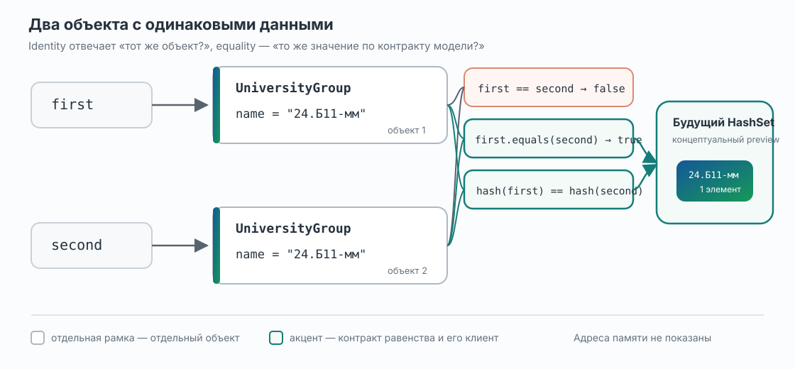

# Лекция 4. Класс Object, идентичность, равенство и hashCode

[Главная](/)

От общего корня всех Java-классов — к осмысленному равенству объектов и контракту, на который будут опираться будущие collections.

### Содержание

1. [Две одинаковые группы — три неожиданных результата](#p1)
2. [Object уже был в нашей иерархии](#p2)
3. [toString: представление для человека и диагностики](#p3)
4. [Один объект или одинаковые данные?](#p4)
5. [Контракт равенства начинается со смысла модели](#p5)
6. [Пять свойств equals](#p6)
7. [Ошибки реализации и границы простого шаблона](#p7)
8. [Почему одного equals недостаточно: hashCode](#p8)
9. [Мост к hash-based collections](#p9)
10. [Контракт в запускаемом примере](#p10)
11. [Что у нас теперь есть и куда дальше](#p11)

[Дополнительное чтение](#reading) · [Краткий справочник по синтаксису и контрактам](#syntax-reference)

<a id="p1"></a>

## 1. Две одинаковые группы — три неожиданных результата

В предыдущих лекциях `UniversityGroup` была небольшой частью LMS-модели. Объект группы проверял название при создании и затем позволял его прочитать:

```java
class UniversityGroup {
  private final String name;

  public UniversityGroup(String name) {
    if (name == null || name.isBlank()) {
      throw new IllegalArgumentException(
          "Название группы не должно быть пустым"
      );
    }
    this.name = name;
  }

  public String getName() {
    return name;
  }
}
```

Теперь в LMS пришли сведения из двух источников. Оба источника называют одну и ту же группу:

```java
UniversityGroup first = new UniversityGroup("24.Б11-мм");
UniversityGroup second = new UniversityGroup("24.Б11-мм");

System.out.println(first);
System.out.println(first == second);
System.out.println(first.equals(second));
```

Что напечатает программа?

Первая строка будет похожа на эту:

```text
UniversityGroup@2f92e0f4
```

Конкретная часть после `@` может оказаться другой. Мы не писали метод, который собирает такую строку, и по результату трудно понять даже название группы.

Следующие две строки будут одинаковыми:

```text
false
false
```

Данные внутри объектов совпадают, но ни `==`, ни текущий `equals` не считают объекты равными. Это не противоречит тому, что мы уже знаем о `new`: два вычисления `new UniversityGroup(...)` создали два разных объекта. Но для LMS они представляют одно и то же обозначение группы. Значит, перед нами сразу три вопроса:

1. откуда взялись `toString()` и `equals()`, если `UniversityGroup` их не объявляет;
2. что именно сравнивает `==` у ссылок;
3. может ли класс сам определить, когда два разных объекта следует считать логически равными?

Ответ на первый вопрос продолжает тему наследования из прошлой лекции.

<a id="p2"></a>

## 2. `Object` уже был в нашей иерархии

В прошлой лекции отношение между `Student` и `User` было записано явно:

```java
class Student extends User {
  // Реализация опущена.
}
```

У `UniversityGroup` слово `extends` отсутствует. Для обычного класса это не означает, что у него нет superclass. Если в объявлении класса не указан другой superclass, его **direct superclass** неявно становится `Object`:

```java
class UniversityGroup extends Object {
  // Эта запись по отношению наследования эквивалентна
  // class UniversityGroup { ... }
}
```

Сам `Object` стоит в корне и не имеет superclass. Поэтому любой другой Java-класс наследует `Object` прямо либо через цепочку других классов. В нашей модели связи выглядят так:

```text
Object
├── UniversityGroup
├── User
│   ├── Student
│   └── Teacher
└── Guest
```

`Student` наследует методы `Object` косвенно, через `User`; `UniversityGroup` и `Guest` — напрямую. Здесь действует уже знакомый механизм: доступный унаследованный instance method можно вызвать у объекта subclass, а subclass может переопределить разрешённый для overriding метод.

Точное правило спецификации сформулировано для классов: `Object` является superclass всех остальных классов, а класс без явного `extends` получает `Object` как direct superclass. Есть три границы, которые полезно сразу видеть:

- значения примитивных типов, например `int` и `boolean`, объектами не являются;
- массивы являются объектами и наследуют методы `Object`, хотя array type не объявляется нами как обычный класс;
- interface не является subclass класса `Object`. Это не мешает объекту класса, реализующего interface, оставаться объектом и иметь методы `Object`.

Подробные правила приведены в [JLS §4.3.2](https://docs.oracle.com/javase/specs/jls/se26/html/jls-4.html#jls-4.3.2) и [JLS §8.1.4](https://docs.oracle.com/javase/specs/jls/se26/html/jls-8.html#jls-8.1.4). Для нашей задачи достаточно главного следствия: у объектов LMS уже было общее поведение, даже когда мы его не замечали.

### Какие методы объявляет `Object`

У `Object` небольшое, но неоднородное API:

| Метод | Для чего нужен | Что делаем в этой лекции |
| --- | --- | --- |
| `toString()` | Возвращает строковое представление объекта | Разбираем и переопределяем подробно |
| `equals(Object)` | Определяет отношение логического равенства | Разбираем и переопределяем подробно |
| `hashCode()` | Возвращает hash code, согласованный с `equals` | Разбираем подробно после `equals` |
| `getClass()` | Возвращает runtime class объекта | Используем для проверки точного класса |
| `clone()` | Поддерживает особый механизм копирования объектов | Только называем; копирование требует отдельного разговора |
| `wait()`, `notify()`, `notifyAll()` | Участвуют в низкоуровневом взаимодействии потоков через monitor объекта | Откладываем до темы concurrency |
| `finalize()` | Исторический callback после обнаружения недостижимости объекта; вызов не гарантирован | Не используем: в Java 26 он deprecated for removal |

Эта таблица — карта, а не список того, что нужно немедленно применять. Например, `clone()` имеет `protected` access и связан с `Cloneable` и отдельным контрактом копирования. Методы `wait`/`notify` нельзя осмысленно объяснить без синхронизации и monitor. На `finalize()` нельзя полагаться для своевременного или обязательного освобождения ресурсов: вызов не гарантирован, Java API 26 рекомендует другие механизмы, а сама finalization [deprecated for removal начиная с JDK 18](https://openjdk.org/jeps/421).

В центре этой лекции находятся три унаследованных метода, поведение которых часто приходится осознанно задавать пользовательскому типу: `toString`, `equals` и `hashCode`. Начнём с того, результат которого мы уже увидели при печати.

<a id="p3"></a>

## 3. `toString`: представление для человека и диагностики

Вызов можно записать явно:

```java
String text = first.toString();
System.out.println(text);
```

Но `System.out.println(first)` тоже получает строковое представление переданного объекта. Поэтому первая программа напечатала результат унаследованного `Object.toString()`.

Реализация в `Object` возвращает строку, равную результату такого выражения:

```java
getClass().getName() + '@' + Integer.toHexString(hashCode())
```

Первая часть — полное имя runtime class. После `@` записывается hash code в шестнадцатеричной форме. Эту часть часто по привычке называют «адресом объекта», но контракт Java этого не обещает. Более того, в формуле вызывается обычный виртуальный метод `hashCode()`: subclass может его переопределить. Поэтому по строке вида `UniversityGroup@2f92e0f4` нельзя делать вывод о размещении объекта в памяти.

API требует, чтобы `toString()` возвращал не `null`. Общая рекомендация — давать короткое и информативное представление, удобное человеку. Для группы естественно показать тип сущности и название:

```java
class UniversityGroup {
  private final String name;

  public UniversityGroup(String name) {
    if (name == null || name.isBlank()) {
      throw new IllegalArgumentException(
          "Название группы не должно быть пустым"
      );
    }
    this.name = name;
  }

  public String getName() {
    return name;
  }

  @Override
  public String toString() {
    return "UniversityGroup{name='" + name + "'}";
  }
}
```

Теперь результат предсказуем и объясняет содержимое объекта:

```java
UniversityGroup group = new UniversityGroup("24.Б11-мм");
System.out.println(group);
```

```text
UniversityGroup{name='24.Б11-мм'}
```

Аннотация `@Override` здесь выполняет уже знакомую роль: просит компилятор проверить наше намерение переопределить унаследованный метод. Если ошибиться в имени или параметрах, ошибка обнаружится при компиляции.

У такого представления есть важные границы.

Во-первых, `toString()` предназначен прежде всего для чтения человеком и диагностики. Если класс отдельно не обещает стабильный формат, клиент не должен разбирать эту строку как файл или сетевой протокол: автор класса сможет изменить подписи и оформление.

Во-вторых, информативность не означает «печатать все поля». В реальном классе некоторые данные могут быть секретными, слишком объёмными или просто неважными для диагностики. Состав строки — часть инженерного решения.

В-третьих, одинаковая строка ещё не определяет равенство объектов. Представим, что позднее мы решили сократить вывод:

```java
@Override
public String toString() {
  return name;
}
```

Из этого не следует, что любые два объекта любых классов с одинаковым текстом должны стать равными. `toString` отвечает на вопрос «как показать объект», а `equals` — на другой вопрос: «когда модель считает два объекта взаимозаменяемыми». Поэтому реализация вида `toString().equals(other.toString())` смешивает два независимых контракта и ломается при безобидном изменении формата печати.

Точное описание унаследованной реализации и рекомендации к результату даёт [Java 26 API `Object.toString`](https://docs.oracle.com/en/java/javase/26/docs/api/java.base/java/lang/Object.html#toString()). Исправив печать, проверим вторую неожиданность начального примера — `first == second`.

<a id="p4"></a>

## 4. Один объект или одинаковые данные?

Оператор `==` уже встречался при проверке `null`. Для ссылочных значений он отвечает на вопрос об **идентичности** (*identity*): ведут ли обе ссылки к одному и тому же объекту? Состояние полей этот оператор не сравнивает.

Добавим псевдоним первой ссылки:

```java
UniversityGroup first = new UniversityGroup("24.Б11-мм");
UniversityGroup alias = first;
UniversityGroup second = new UniversityGroup("24.Б11-мм");

System.out.println(first == alias);
System.out.println(first == second);
```

Результат:

```text
true
false
```

Строка `alias = first` скопировала ссылочное значение, но не создала объект. Поэтому `first` и `alias` — две переменные, указывающие на один объект. Второй `new` создал другой объект, и совпадение `name` этого факта не меняет.

| Выражение | Что произошло | Результат `==` |
| --- | --- | --- |
| `alias = first` | Скопирована ссылка на существующий объект | `first == alias` — `true` |
| `second = new UniversityGroup(...)` | Создан ещё один объект | `first == second` — `false` |
| `missing = null` | Ссылки на объект нет | `missing == null` — `true` |

Формально `==` для двух ссылочных операндов возвращает `true`, если оба значения равны `null` либо обе ссылки указывают на один объект или массив. Поэтому выражение `value == null` безопасно: оно не вызывает метод через `null`. Полные правила задаёт [JLS §15.21.3](https://docs.oracle.com/javase/specs/jls/se26/html/jls-15.html#jls-15.21.3).

Идентичность важна. Например, через `first` и `alias` мы наблюдали бы один общий объект, а переназначение `alias` не изменило бы `first`. Но вопрос предметной области может быть другим:

> Представляют ли два объекта одну и ту же университетскую группу по правилам нашей LMS?

Для такого отношения у объектов есть метод `equals(Object)`. Пока `UniversityGroup` его не переопределяет, выполняется реализация из `Object`. Её правило намеренно самое строгое: для ненулевых ссылок `x.equals(y)` возвращает `true` тогда и только тогда, когда `x == y`.

Проверим все три ссылки:

```java
System.out.println(first.equals(alias));
System.out.println(first.equals(second));
System.out.println(first.equals(null));
```

С унаследованным `Object.equals` получим:

```text
true
false
false
```

Это корректное поведение по общему контракту `Object`: пока класс не объявил другого смысла, каждый объект логически равен только самому себе. Java не может угадать, что для нашей модели важнее: название группы, внутренний идентификатор, учебный год или сама уникальная запись в системе.

Теперь различие можно сформулировать точно:

- `==` у ссылок всегда проверяет identity и не переопределяется;
- `equals` — обычный виртуальный метод, унаследованная реализация которого тоже использует identity;
- класс может переопределить `equals` и определить логическое равенство, но сначала автор класса должен решить, что «равные группы» означает в предметной модели.

Именно это решение, а не готовый шаблон метода, будет следующим шагом.

<a id="p5"></a>

## 5. Контракт равенства начинается со смысла модели

Мы уже различили два вопроса:

- `first == second` — хранят ли выражения одинаковое ссылочное значение;
- `first.equals(second)` — считаются ли объекты логически равными по контракту их класса.

Унаследованный от `Object` метод `equals` отвечает на второй вопрос так же, как `==`: равным объекту считается только он сам. Это корректное поведение по умолчанию, но оно не обязано выражать смысл конкретной предметной модели.

До написания кода нужно решить, **что означает равенство университетских групп в нашей LMS**. Зафиксируем контракт:

> Две `UniversityGroup` логически равны тогда и только тогда, когда равны их названия `name`.

Название проверяется конструктором, не бывает `null` или пустой строкой и после создания группы не меняется. Класс объявлен `final`: в этой учебной модели у него не появится subclass с дополнительными данными, влияющими на равенство.

Следующая версия намеренно **промежуточная**: она нужна, чтобы разобрать `equals`, но ещё не является законченным контрактом типа. После переопределения `equals` мы обязаны добавить согласованный `hashCode`; это будет сделано в разделе 8.

```java
final class UniversityGroup {
  private final String name;

  public UniversityGroup(String name) {
    if (name == null || name.isBlank()) {
      throw new IllegalArgumentException(
          "Название группы не должно быть пустым"
      );
    }
    this.name = name;
  }

  public String getName() {
    return name;
  }

  @Override
  public boolean equals(Object other) {
    if (this == other) {
      return true;
    }
    if (other == null || getClass() != other.getClass()) {
      return false;
    }
    UniversityGroup group = (UniversityGroup) other;
    return name.equals(group.name);
  }

  @Override
  public String toString() {
    return "UniversityGroup{name='" + name + "'}";
  }
}
```

Разберём реализацию по шагам.

```java
if (this == other) {
  return true;
}
```

Если две ссылки ведут к одному объекту, дополнительное сравнение не требуется. Это быстрая проверка, но не полное определение равенства: два разных объекта тоже могут обозначать одну и ту же группу.

```java
if (other == null || getClass() != other.getClass()) {
  return false;
}
```

`null` не обозначает группу, а объект другого класса не участвует в выбранном отношении равенства. После этой проверки приведение безопасно:

```java
UniversityGroup group = (UniversityGroup) other;
```

Наконец сравнивается информация, которую контракт модели объявил значимой:

```java
return name.equals(group.name);
```

Здесь нужен именно `String.equals`, а не `==`: поля `name` сами являются ссылками, и два разных объекта `String` могут содержать одинаковый текст.

```java
String firstName = new String("24.Б11-мм");
String secondName = new String("24.Б11-мм");

System.out.println(firstName == secondName);      // false
System.out.println(firstName.equals(secondName)); // true
```

Теперь два отдельно созданных объекта группы равны логически, хотя их identity различается:

```java
UniversityGroup first = new UniversityGroup("24.Б11-мм");
UniversityGroup second = new UniversityGroup("24.Б11-мм");

System.out.println(first == second);      // false
System.out.println(first.equals(second)); // true
```

Это не универсальное правило «объекты равны, когда совпадают все поля». Мы приняли конкретное решение для конкретной модели. Например, для изменяемого `Student` вопрос сложнее: равен ли студент своей старой записи после смены имени или группы, существует ли устойчивый идентификатор, могут ли две записи обозначать одного человека? Автоматически переносить контракт `UniversityGroup` на `Student` нельзя.

<a id="p6"></a>

## 6. Пять свойств `equals`

Класс вправе выбрать смысл логического равенства, но не вправе придать слову «равно» произвольное поведение. Спецификация [`Object.equals`](https://docs.oracle.com/en/java/javase/26/docs/api/java.base/java/lang/Object.html#equals(java.lang.Object)) задаёт общий контракт для ненулевых ссылок `x`, `y` и `z`.

### 1. Рефлексивность

Объект равен самому себе:

```java
x.equals(x) == true
```

Для группы это естественно: её название совпадает с собственным названием. Начальная проверка `this == other` сразу даёт такой результат.

### 2. Симметричность

Порядок сравнения не меняет ответ:

```java
x.equals(y) == y.equals(x)
```

Если первая группа равна второй по названию, то и вторая равна первой. Клиент не должен угадывать, какой объект поставить слева от точки.

### 3. Транзитивность

Если `x` равен `y`, а `y` равен `z`, то `x` равен `z`:

```java
if (x.equals(y) && y.equals(z)) {
  // x.equals(z) также должен быть true
}
```

Например, три отдельных объекта с названием `"24.Б11-мм"` должны принадлежать одному классу эквивалентности. Поэтому сравнение чисел «с небольшим допуском» обычно не подходит для `equals`: первое число может быть близко ко второму, второе — к третьему, а первое и третье уже окажутся слишком далеко друг от друга.

### 4. Согласованность

Повторные вызовы возвращают один и тот же результат, пока не изменилась информация, используемая в сравнении:

```java
first.equals(second); // true
first.equals(second); // снова true
```

Это не обещание, что результат никогда не меняется у любого объекта. Контракт допускает изменение ответа после изменения значимого состояния. В нашей модели `name` имеет `final` и сам `String` не изменяется, поэтому равенство двух групп стабильно на протяжении их жизни. Это инженерное преимущество выбранной модели, а не дополнительное шестое правило `equals`.

### 5. Сравнение с `null`

Для любой ненулевой ссылки `x` результат обязан быть `false`:

```java
x.equals(null) == false
```

Сам вызов через `null` по-прежнему невозможен:

```java
UniversityGroup group = null;
group.equals(first); // NullPointerException
```

Контракт требует поведения `first.equals(null)`, но не превращает `null` в объект с методами. В реализации `UniversityGroup` этот случай обрабатывается до приведения типа.

Рефлексивность, симметричность и транзитивность вместе означают, что `equals` задаёт **отношение эквивалентности**. Согласованность и правило для `null` делают это отношение пригодным для Java-кода, который многократно сравнивает переданные ему объекты. Эти пять свойств — нормативный контракт `Object`, а равенство групп по `name` — отдельное решение нашей модели.

<a id="p7"></a>

## 7. Ошибки реализации и границы простого шаблона

Правильная сигнатура и выбранные данные не менее важны, чем само слово `equals`. Рассмотрим ошибки, которые легко скрываются в правдоподобном коде.

### Перегрузка вместо переопределения

Кажется естественным принять параметр более точного типа:

```java
public boolean equals(UniversityGroup other) {
  return other != null && name.equals(other.name);
}
```

Но `Object` объявляет метод `equals(Object)`. Версия с параметром `UniversityGroup` имеет другую сигнатуру и **перегружает** (*overloads*) имя `equals`, а не переопределяет inherited method.

Ошибка становится наблюдаемой после смены статической перспективы:

```java
UniversityGroup first = new UniversityGroup("24.Б11-мм");
UniversityGroup second = new UniversityGroup("24.Б11-мм");
Object secondAsObject = second;

first.equals(second);         // вызывает equals(UniversityGroup)
first.equals(secondAsObject); // вызывает equals(Object) из Object
```

`second` и `secondAsObject` ссылаются на один объект, но overload однозначно выбирается при компиляции по статическому типу аргумента. Метод `equals(UniversityGroup)` не участвует в runtime overriding сигнатуры `equals(Object)`. Получить разные ответы означало бы сломать смысл equality для клиента.

Поэтому при намерении переопределить метод нужно писать точную сигнатуру и `@Override`:

```java
@Override
public boolean equals(Object other) {
  // Реализация.
}
```

Следующий отдельный контрпример **намеренно не компилируется**:

```java
@Override
public boolean equals(UniversityGroup other) {
  return other != null && name.equals(other.name);
}
```

Аннотация обнаруживает ошибку в сигнатуре. Она не включает overriding, а просит компилятор проверить наше намерение.

### Неверное сравнение значимого поля

Даже при правильной сигнатуре можно случайно вернуться к identity на следующем уровне:

```java
// Неверно для выбранного контракта.
return name == group.name;
```

Эта версия иногда кажется рабочей из-за повторного использования строковых литералов, но контракт группы говорит о равном тексте, а не об одном объекте `String`. Нужен `name.equals(group.name)`. Проверка `null` для поля здесь не требуется только благодаря уже установленному инварианту `name != null`.

### «Сравнить все поля» — не определение равенства

Набор полей выводится из смысла типа. Если позже в `UniversityGroup` появится вычисляемый счётчик активных студентов или текст для интерфейса, он не обязан автоматически участвовать в `equals`. И наоборот, пропуск части абстрактного значения может ошибочно склеить разные объекты.

Полезный порядок проектирования такой:

1. словами определить, когда два значения модели считаются равными;
2. определить, какая закрытая информация представляет это значение;
3. сравнить именно эту информацию корректными операциями.

Нельзя определять равенство через `toString()`:

```java
// Неверный общий подход.
return other != null && toString().equals(other.toString());
```

Строковый формат предназначен прежде всего для человека и диагностики. Он может измениться независимо от контракта равенства, скрыть значимые данные или случайно совпасть у объектов разных классов. Более того, чужой класс не обязан считать нашу группу равной себе, и тогда легко нарушить симметричность.

### `instanceof` или `getClass()`

В основной реализации написано:

```java
if (other == null || getClass() != other.getClass()) {
  return false;
}
```

Значит, равными могут быть только объекты одного runtime class. Для нашего `final UniversityGroup` это решение прозрачно: subclasses у класса всё равно быть не может. Здесь была бы безопасна и проверка с `instanceof`:

```java
if (!(other instanceof UniversityGroup group)) {
  return false;
}
return name.equals(group.name);
```

Однако отсюда нельзя выводить правило «всегда используйте `getClass`» или «всегда используйте `instanceof`». Для открытой иерархии выбор становится частью контракта всех классов сразу.

Представим расширяемый `BaseGroup`, который через `instanceof` сравнивает только название, и `LabGroup`, который добавляет значимый номер лаборатории. Если `LabGroup` начнёт учитывать новый номер, может получиться:

```text
base.equals(lab) == true
lab.equals(base) == false
```

Нарушена симметричность. Попытка «починить» только это направление иногда создаёт тройку `labA`, `base`, `labB`, где первые два и последние два равны, а `labA` и `labB` — нет: тогда нарушается транзитивность. Проверка через `getClass()` запрещает равенство объектов разных runtime classes, но это тоже содержательное решение: subclass перестаёт быть равен значению superclass даже по общей части.

Универсального локального шаблона для любой открытой иерархии нет. Нужно заранее решить, допускает ли базовый тип value equality, могут ли subclasses добавлять значимое состояние и сохраняется ли контракт подстановки. Нередко безопаснее закрыть value-like класс с помощью `final` или предпочесть композицию наследованию. Это инженерные решения, а не требования синтаксиса `equals`.

### Изменяемое состояние требует отдельного решения

Контракт согласованности разрешает ответу измениться, если изменилась информация, участвующая в equality. Но такое поведение усложняет жизнь клиентам: два объекта могут быть равны сейчас и перестать быть равными после вызова mutator.

В `UniversityGroup` значимое поле неизменно, поэтому этой проблемы нет. У `Student`, напротив, есть изменяемые оценка, статус и связь с учебным процессом. Включать их все в `equals` только потому, что это поля объекта, было бы необоснованно. Возможно, равенство должно опираться на устойчивый идентификатор; возможно, модели нужна identity semantics из `Object`; возможно, следует разделить изменяемую сущность и неизменяемое значение. Выбор зависит от жизненного цикла и обещаний конкретного типа.

Итак, корректный `equals` начинается не с генератора кода и не с перебора полей. Сначала задаётся смысл равенства в модели, затем он проверяется пятью свойствами общего контракта и только после этого воплощается в точной сигнатуре. Но показанный класс ещё не готов: унаследованный `hashCode` может нарушить обязательный связанный контракт. В следующем разделе добавим согласованное с `equals` число и только тогда завершим реализацию `UniversityGroup`.

<a id="p8"></a>

## 8. Почему одного `equals` недостаточно: `hashCode`

После переопределения `equals` две разные группы с одним названием стали логически равны. Кажется, что задача решена. Но у `Object` есть ещё один связанный с равенством метод:

```java
public int hashCode()
```

**Hash code** — целое число типа `int`, которое объект предоставляет клиентскому коду. Оно не является ни адресом объекта, ни его уникальным идентификатором, ни доказательством равенства.

Контракт [`Object.hashCode`](https://docs.oracle.com/en/java/javase/26/docs/api/java.base/java/lang/Object.html#hashCode()) требует следующего:

1. Пока информация, используемая в `equals`, не изменилась, повторные вызовы `hashCode()` у одного объекта в пределах одного запуска должны возвращать одно и то же число. Между разными запусками сохранять число не требуется.
2. Если `a.equals(b)` возвращает `true`, то `a.hashCode()` и `b.hashCode()` обязаны вернуть одно число.
3. Если `a.equals(b)` возвращает `false`, одинаковые hash codes всё равно допустимы. Разные hash codes для неравных объектов желательны для эффективности, но не обязательны по контракту.

Для нашей модели равенство `UniversityGroup` зависит только от неизменяемого `name`. Поэтому и hash code можно получить из той же информации:

```java
@Override
public int hashCode() {
  return name.hashCode();
}
```

Это не универсальное правило «возвращать hash code одного поля». Сначала класс определяет, какая информация задаёт его логическое равенство, затем `equals` и `hashCode` должны использовать её согласованно. Если бы равенство группы зависело от нескольких полей, реализация должна была бы согласованно учитывать весь выбранный контракт.

### Одинаковый hash code ещё не означает равенство

Возможных объектов намного больше, чем значений `int`, поэтому разным объектам иногда неизбежно достаётся одно число. Это называется **коллизией** (*hash collision*).

У строк `"FB"` и `"Ea"` одинаковый результат стандартного `String.hashCode()`. Алгоритм этого метода задан в [Java SE 26 API `String.hashCode()`](https://docs.oracle.com/en/java/javase/26/docs/api/java.base/java/lang/String.html#hashCode()), поэтому коллизия воспроизводима, а не случайна для одного запуска или JDK. Значит, в нашей реализации совпадут и hash codes двух групп с такими названиями:

```java
UniversityGroup fb = new UniversityGroup("FB");
UniversityGroup ea = new UniversityGroup("Ea");

System.out.println(fb.equals(ea));
System.out.println(fb.hashCode() == ea.hashCode());
```

Результат:

```text
false
true
```

Коллизия допустима: после совпадения hash codes клиент всё ещё должен проверить `equals`. Полезно запомнить направления следствий:

```text
equals == true  → hash codes обязательно одинаковы
hash codes разные → equals обязательно false
hash codes одинаковы ↛ equals == true
```

Последняя строка особенно важна: `hashCode()` помогает организовать поиск, но не заменяет `equals()`.



На схеме показан именно контракт нашего неизменяемого `UniversityGroup`: отдельные рамки означают разные объекты, а схождение в один элемент — концептуальный preview клиента `equals` и `hashCode`. Адреса памяти и внутреннее устройство hash table здесь намеренно не изображены.

<a id="p9"></a>

## 9. Мост к hash-based collections

Позже мы изучим generics и collections — готовые структуры данных из стандартной библиотеки. Сейчас достаточно увидеть, зачем их будущим клиентам сразу два метода.

Hash-based collection мысленно можно представить так:

1. по `hashCode()` она выбирает небольшую область поиска — *bucket*;
2. среди найденных кандидатов проверяет логическое равенство через `equals()`.

Настоящая реализация сложнее этой модели, но для понимания контракта её достаточно. Важна не внутренняя формула, а двухступенчатая идея: hash code сужает поиск, `equals` подтверждает равенство.

Ниже — небольшой **предварительный показ** `HashSet`, а не систематическое изучение collections:

```java
HashSet<UniversityGroup> groups = new HashSet<>();
groups.add(first);

System.out.println(groups.contains(second)); // true
System.out.println(groups.add(second));      // false
System.out.println(groups.size());           // 1
```

Запись `HashSet<UniversityGroup>` пока можно читать как «множество, в котором хранятся группы». `add` пытается добавить элемент, `contains` ищет логически равный элемент, `size` сообщает число элементов. `first` и `second` созданы разными выражениями `new`, но равны по контракту `UniversityGroup`, поэтому множество не добавляет второй логический дубликат.

Если переопределить `equals`, но оставить несогласованный с ним `hashCode`, равные объекты могут попасть в разные области поиска. Тогда hash-based collection может не найти логически равный объект или принять его за новый элемент. Ошибка находится в контракте элемента, хотя наблюдается в поведении коллекции.

Есть и вторая инженерная опасность: изменение информации, от которой зависят `equals` и `hashCode`, пока объект уже хранится в такой структуре. Объект может получить новый hash code и оказаться «не там», где его ищут. Именно поэтому в нашем примере `name` — `final`, setter отсутствует, а класс `UniversityGroup` неизменяем в значимой для равенства части. Это удачное решение **данной модели**, но не утверждение, что любой Java-объект обязан быть неизменяемым.

<a id="p10"></a>

## 10. Контракт в запускаемом примере

Соберём identity, equality, hash code, допустимую коллизию и предварительный показ `HashSet` в одном месте. Ниже — **полная запускаемая программа `ObjectContractsDemo.java`**. В одном исходном файле только `ObjectContractsDemo` объявлен `public`.

```java
import java.util.HashSet;

public class ObjectContractsDemo {
  public static void main(String[] args) {
    UniversityGroup first = new UniversityGroup("24.Б11-мм");
    UniversityGroup alias = first;
    UniversityGroup second = new UniversityGroup("24.Б11-мм");

    System.out.println(first);
    System.out.println("alias == first: " + (alias == first));
    System.out.println("first == second: " + (first == second));
    System.out.println("first.equals(second): " + first.equals(second));
    System.out.println(
        "equal hash codes: " + (first.hashCode() == second.hashCode())
    );

    UniversityGroup collisionFirst = new UniversityGroup("FB");
    UniversityGroup collisionSecond = new UniversityGroup("Ea");
    System.out.println(
        "collision means equality: "
            + collisionFirst.equals(collisionSecond)
    );
    System.out.println(
        "collision hash codes equal: "
            + (collisionFirst.hashCode() == collisionSecond.hashCode())
    );

    HashSet<UniversityGroup> groups = new HashSet<>();
    groups.add(first);
    System.out.println("set contains equal group: " + groups.contains(second));
    System.out.println("duplicate added: " + groups.add(second));
    System.out.println("set size: " + groups.size());

    check(alias == first, "Alias должен указывать на first");
    check(first != second, "Два new должны создать разные объекты");
    check(first.equals(second), "Группы с одним name должны быть равны");
    check(
        first.hashCode() == second.hashCode(),
        "Равные группы должны иметь одинаковый hash code"
    );
    check(
        !collisionFirst.equals(collisionSecond),
        "Коллизия не должна означать равенство"
    );
    check(
        collisionFirst.hashCode() == collisionSecond.hashCode(),
        "В демонстрации ожидается известная коллизия строк FB и Ea"
    );
    check(groups.contains(second), "Множество должно найти равную группу");
    check(groups.size() == 1, "Логический дубликат не должен добавиться");
  }

  private static void check(boolean condition, String message) {
    if (!condition) {
      throw new AssertionError(message);
    }
  }
}

final class UniversityGroup {
  private final String name;

  public UniversityGroup(String name) {
    if (name == null || name.isBlank()) {
      throw new IllegalArgumentException("Название группы не должно быть пустым");
    }
    this.name = name;
  }

  public String getName() {
    return name;
  }

  @Override
  public String toString() {
    return "UniversityGroup{name='" + name + "'}";
  }

  @Override
  public boolean equals(Object other) {
    if (this == other) {
      return true;
    }
    if (other == null || getClass() != other.getClass()) {
      return false;
    }
    UniversityGroup group = (UniversityGroup) other;
    return name.equals(group.name);
  }

  @Override
  public int hashCode() {
    return name.hashCode();
  }
}
```

Скомпилируйте и запустите файл:

```sh
javac ObjectContractsDemo.java
java ObjectContractsDemo
```

Ожидаемый вывод:

```text
UniversityGroup{name='24.Б11-мм'}
alias == first: true
first == second: false
first.equals(second): true
equal hash codes: true
collision means equality: false
collision hash codes equal: true
set contains equal group: true
duplicate added: false
set size: 1
```

Переменные `alias` и `first` хранят одно ссылочное значение, поэтому `==` возвращает `true`. `first` и `second` указывают на два разных объекта, поэтому `==` возвращает `false`, но выбранный контракт `equals` считает группы равными по `name`. Из этого равенства обязательно следует совпадение hash codes.

У `collisionFirst` и `collisionSecond`, напротив, разные названия и `equals` возвращает `false`, хотя hash codes совпали. Наконец, `HashSet` использует согласованные методы: находит `second` после добавления `first`, отклоняет логический дубликат и сохраняет размер `1`.

<a id="p11"></a>

## 11. Что у нас теперь есть и куда дальше

В предыдущей лекции мы явно строили отношения наследования и наблюдали dynamic dispatch. Теперь выяснилось, что общий superclass уже есть у каждого обычного класса: `Object` задаёт базовые методы, а класс может переопределить часть их поведения под контракт своей модели.

Цепочка решений получилась такой:

```text
неявное наследование от Object
→ читаемый toString
→ identity через ==
→ логическое равенство через equals
→ согласованный hashCode
→ корректный будущий клиент в hash-based collection
```

`toString`, `equals` и `hashCode` решают разные задачи. Строка помогает человеку читать состояние объекта; `==` отвечает на вопрос об identity; `equals` выражает выбранное моделью логическое равенство; `hashCode` поддерживает клиентов, которые организуют быстрый поиск. Ни один из этих механизмов не задаёт ordering.

Для `UniversityGroup` мы приняли узкий контракт: неизменяемое название определяет логическое равенство. Автоматически переносить его на `Student`, `Teacher` или `Course` нельзя: сначала нужно решить, что в жизненном цикле каждой сущности означает «тот же логический объект». Нормативный контракт Java задаёт свойства `equals` и связь с `hashCode`, но предметный смысл равенства выбирает автор модели.

На следующем шаге generics позволят задавать тип элементов, а collections — работать с готовыми списками, множествами и отображениями. Теперь у нас есть необходимая основа: мы знаем, почему библиотечный код вправе полагаться на согласованность `equals` и `hashCode`.

### Вопросы для самопроверки

1. Почему `first == second` может быть `false`, а `first.equals(second)` — `true`?
2. Какое обязательство связывает `equals` и `hashCode`? Действует ли оно в обратную сторону?
3. Что такое коллизия и почему сама по себе она не является ошибкой реализации?
4. Что можно заключить, если hash codes двух объектов различны? А если одинаковы?
5. Почему `return name.hashCode();` подходит именно выбранному контракту `UniversityGroup`? Что пришлось бы пересмотреть при другом определении равенства?
6. Как hash-based collection концептуально использует `hashCode` и `equals` на двух этапах поиска?
7. Что может наблюдать клиент `HashSet`, если равные объекты возвращают разные hash codes?
8. Почему изменение equality-relevant state после добавления объекта опасно для hash-based collection?
9. Почему отсутствие setter у `name` полезно в этом примере, но не доказывает универсальное правило «все объекты должны быть immutable»?
10. Какие три метода `Object` переопределяет `UniversityGroup` и какую отдельную задачу решает каждый?
11. Почему контракт равенства `UniversityGroup` нельзя без обсуждения скопировать в `Student`?
12. Как `@Override` помогает при реализации `equals`, `hashCode` и `toString`?

<a id="reading"></a>

## Дополнительное чтение

- [`Object` в Java SE 26](https://docs.oracle.com/en/java/javase/26/docs/api/java.base/java/lang/Object.html) — первичные спецификации `equals`, `hashCode`, `toString`, `getClass` и остальных унаследованных методов.
- [JLS §4.3.2: The Class `Object`](https://docs.oracle.com/javase/specs/jls/se26/html/jls-4.html#jls-4.3.2), [JLS §8.1.4: Superclasses and Subclasses](https://docs.oracle.com/javase/specs/jls/se26/html/jls-8.html#jls-8.1.4) и [JLS §15.21.3: Reference Equality Operators](https://docs.oracle.com/javase/specs/jls/se26/html/jls-15.html#jls-15.21.3) — общий корень классов, неявный superclass и точное поведение `==` для ссылок.
- [`HashSet` в Java SE 26](https://docs.oracle.com/en/java/javase/26/docs/api/java.base/java/util/HashSet.html) и [`HashMap` в Java SE 26](https://docs.oracle.com/en/java/javase/26/docs/api/java.base/java/util/HashMap.html) — API структур, которые мотивируют согласованный контракт `equals`/`hashCode`; подробное изучение относится к будущей теме collections.
- [MIT 6.031: Equality](https://web.mit.edu/6.031/www/fa20/classes/15-equality/) — равенство как отношение эквивалентности, абстрактное значение типа и типичные ошибки реализации.
- [Princeton COS 126: Designing Data Types](https://introcs.cs.princeton.edu/java/33design/) — `toString`, `equals` и `hashCode` как часть проектирования пользовательского типа.
- [University of Washington CSE 331: Identity, equals, and hashCode, part 1](https://courses.cs.washington.edu/courses/cse331/20sp/lectures/lec11-equals-pt1.pdf) и [part 2](https://courses.cs.washington.edu/courses/cse331/20sp/lectures/lec11-equals-pt2.pdf) — углубление в наследование, изменяемость и последствия для hash-based collections.
- [University of Cambridge: Object-Oriented Programming with Java, Lecture 10](https://www.cl.cam.ac.uk/teaching/1415/OOProg/Files/OOP1415.pdf) — reference equality, value equality, `@Override` и связь с `hashCode` на страницах 43–45 PDF.

<a id="syntax-reference"></a>

## Краткий справочник по синтаксису и контрактам

Этот раздел можно использовать отдельно от основной истории. Он напоминает форму методов и направленные следствия контрактов, но не выбирает предметный смысл равенства за автора класса.

### `toString`

```java
@Override
public String toString() {
  return "UniversityGroup{name='" + name + "'}";
}
```

Возвращает ненулевое строковое представление объекта для человека и диагностики. `println(object)` использует это представление. Формат `toString` сам по себе не определяет equality и обычно не служит стабильным форматом хранения данных.

### `==` для ссылок

```java
first == second
first != null
```

`==` возвращает `true`, если оба ссылочных значения указывают на один объект или оба равны `null`. Поля объектов оператор не сравнивает.

### `equals`

```java
@Override
public boolean equals(Object other) {
  if (this == other) {
    return true;
  }
  if (other == null || getClass() != other.getClass()) {
    return false;
  }
  UniversityGroup group = (UniversityGroup) other;
  return name.equals(group.name);
}
```

Точная сигнатура override принимает `Object`. Для ненулевых ссылок контракт требует рефлексивность, симметричность, транзитивность и согласованность при неизменной значимой информации; `x.equals(null)` должен возвращать `false`. Набор сравниваемых данных задаёт модель. Выбор `getClass()` здесь сделан для `final UniversityGroup`; это не универсальный рецепт для всех иерархий.

### `hashCode`

```java
@Override
public int hashCode() {
  return name.hashCode();
}
```

Метод возвращает `int`. Равные по `equals` объекты обязаны иметь одинаковый hash code. Неравные объекты могут иметь как разные, так и одинаковые hash codes.

### Матрица трёх сравнений

| Наблюдение | Что можно заключить |
| --- | --- |
| `a == b` | Ссылки указывают на один объект либо обе равны `null`. |
| `a != b` | Ссылки не указывают на один объект; логическое равенство ещё неизвестно. |
| `a.equals(b)` | Объекты равны по контракту runtime class объекта `a`; при корректном симметричном контракте направление не меняет ответ. |
| `a.hashCode() != b.hashCode()` | При соблюдении контракта `a.equals(b)` обязан быть `false`. |
| `a.hashCode() == b.hashCode()` | Равенство неизвестно: требуется `equals`. Возможна коллизия. |

### Согласованная тройка override

```java
final class UniversityGroup {
  private final String name;

  // Конструктор и getter опущены.

  @Override
  public String toString() {
    return "UniversityGroup{name='" + name + "'}";
  }

  @Override
  public boolean equals(Object other) {
    if (this == other) {
      return true;
    }
    if (other == null || getClass() != other.getClass()) {
      return false;
    }
    UniversityGroup group = (UniversityGroup) other;
    return name.equals(group.name);
  }

  @Override
  public int hashCode() {
    return name.hashCode();
  }
}
```

Комментарий «конструктор и getter опущены» означает, что это сокращённый фрагмент, а не самостоятельная запускаемая программа. `@Override` просит компилятор проверить, что сигнатуры действительно переопределяют методы `Object`.

### Итоговая таблица

| Конструкция или правило | Что означает |
| --- | --- |
| `public String toString()` | Читаемое ненулевое представление объекта; не equality и не сериализация. |
| `a == b` | Ссылочная идентичность или два `null`; состояние объектов не сравнивается. |
| `public boolean equals(Object other)` | Логическое равенство по контракту класса. |
| `equals`-контракт | Рефлексивность, симметричность, транзитивность, согласованность и `x.equals(null) == false`. |
| `public int hashCode()` | Hash code, согласованный с `equals`; не уникальный идентификатор. |
| `a.equals(b) → a.hashCode() == b.hashCode()` | Обязательное направленное следствие. |
| Одинаковые hash codes | Равенство не доказано: возможна коллизия. |
| `@Override` | Проверка компилятором намерения переопределить унаследованный метод. |
| Изменение equality-information | Может нарушить поиск объекта, уже помещённого в hash-based collection. |
| `HashSet<UniversityGroup>` | Предварительный пример будущей generic collection, использующей равенство элементов. |

